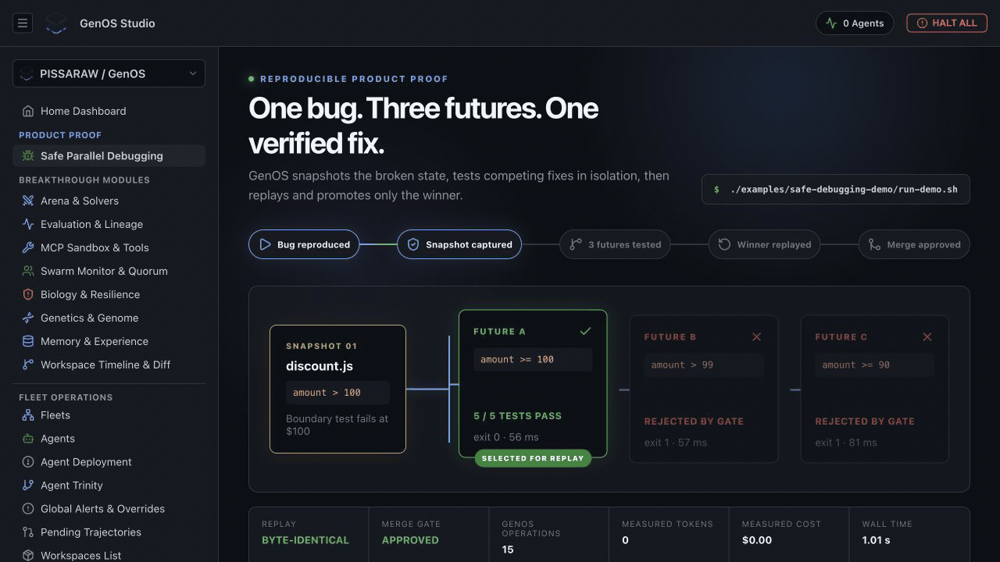

<p align="center">
  
</p>

<h1 align="center">GenOS V3</h1>

<p align="center">
  <strong>Git-like branching and deterministic replay for AI-agent state.</strong>
</p>

<p align="center">
  Snapshot agent state, fork competing hypotheses, run them in isolation,
  compare outcomes, replay the evidence, and merge only what passes.
</p>

<p align="center">
  <a href="https://github.com/PISSARAW/GenOS/actions/workflows/ci.yml"></a>
  <a href="LICENSE"></a>
  
  <a href="https://github.com/PISSARAW/GenOS/releases/tag/v3.0.0-alpha.1"></a>
</p>

<p align="center">
  <a href="#quick-start">Quick start</a> ·
  <a href="https://github.com/PISSARAW/GenOS/releases/tag/v3.0.0-alpha.1">Download V3 alpha</a> ·
  <a href="#genos-studio">Studio</a> ·
  <a href="examples/">Examples</a> ·
  <a href="docs/README.md">Documentation</a> ·
  <a href="docs/0-context-and-vision/product-roadmap.md">Roadmap</a> ·
  <a href="CONTRIBUTING.md">Contributing</a>
</p>

> [!IMPORTANT]
> GenOS V3 brings major architectural changes including KuzuDB and LadybugDB.

## See GenOS choose a safer future

<p align="center">
  <a href="examples/safe-debugging-demo/"></a>
</p>

One boundary bug becomes three isolated futures. Two fail the test gate; the
winner is restored from the original snapshot, replayed, compared byte for
byte, and promoted only after verification.

```bash
./examples/safe-debugging-demo/run-demo.sh
```

## Why GenOS V3?

Most agent workflows advance along one mutable timeline. When a tool call,
belief update, or code change goes wrong, the surrounding state is difficult to
reconstruct and alternative strategies are expensive to compare.

GenOS V3 treats an agent workflow as versioned computation with advanced memory systems:

- **Persistent Workspaces & History:** Full conversation history and workspace state are now persistent across sessions.
- **Fork state, not just prompts.** Snapshots carry agent identity, genome, working state, world references, event cursors, and runtime metadata.
- **Keep branches isolated.** Sibling agents receive distinct identities and event streams.
- **Compare evidence before promotion.** Structural diffs, evaluation scores, multi-objective selection, and explicit winner promotion.
- **Preserve provenance.** Append-only events, lineage inspection, and replay make it possible to study where two trajectories diverged.

## V3 Architecture Highlights

GenOS V3 introduces advanced biomimetic capabilities and new database integrations:

- **Hippocampus Migration**: The internal memory structure (Hippocampus) is now powered by **KuzuDB**, an embedded Cypher graph database.
- **Hybrid RAG**: Integrated **LadybugDB** for Hybrid RAG (Vector FLOAT[768] + Graph) with complete textual context hydration in vector search.
- **Cellular Immunity**: Deploy virophages, trigger computational fever, or force apoptosis (Caspase cascade) to isolate and destroy corrupted agent states.
- **Evolution & Ecology**: Agents reproduce via mitosis, budding, or schizogony, exchanging token budgets through trophic networks.
- **Virtualization**: Encapsulate environments in "Agent-World Capsules" with zero-byte copy (HardlinkWorld) and strict sandbox isolation.

For a complete index of all biological and computational features, see the [GenOS Ultimate Architecture Map](docs/genos_ultimate_architecture_map.md).

## What works today

| Capability | Proof in this repository | Maturity |
| --- | --- | --- |
| Safe parallel debugging | [One-command debugging demo](examples/safe-debugging-demo/) | Runnable product proof |
| Snapshot, fork, diff, and replay | [Counterfactual demo](examples/counterfactual-demo/) | Runnable CLI demo |
| Independent sibling state | [Divergent writes](examples/divergent-writes-demo/) | Runnable CLI demo |
| Isolated filesystem worlds | [Divergent worlds](examples/divergent-worlds-demo/) | Runnable CLI demo |
| Hybrid RAG with LadybugDB | Internal APIs | V3 Alpha |
| Embedded Graph Memory (KuzuDB)| Internal APIs | V3 Alpha |
| Local visual control plane | [GenOS Studio](#genos-studio) | Pre-alpha |

## Quick start

### Requirements

- Rust 1.88 or newer
- Git
- Bash on Linux/macOS, or PowerShell on Windows

Clone the repository and run the smallest end-to-end proof:

```bash
git clone https://github.com/PISSARAW/GenOS.git
cd GenOS
git checkout v3
./run-demo.sh
```

## GenOS Studio

GenOS Studio is the local browser control plane included in this repository.
It combines a React and TypeScript frontend with an Express and SQLite backend
to expose live agent, workspace, experiment, evaluation, lineage, tool, and
telemetry views.

<p align="center">
  
</p>

### Run Studio locally

Studio requires Node.js 20.19+ on the 20.x line, or 22.12+, and npm. Start
the backend from the repository root:

```bash
cd backend
npm ci
npm start
```

In a second terminal:

```bash
cd studio
npm ci
npm run dev
```

## Documentation

- **Understand the problem:** [Counterfactual OS paradigm](docs/0-context-and-vision/counterfactual-os.md)
- **Study the system:** [ultimate architecture map](docs/genos_ultimate_architecture_map.md)
- **Use the interfaces:** [CLI reference](docs/4-interfaces/cli-reference.md)

## Repository map

```text
crates/        Rust models, runtime, stores, worlds, evaluation, API, and CLI
backend/       Express + SQLite API for GenOS Studio
studio/        React + TypeScript + Vite frontend
examples/      Runnable proofs, scenarios, and reusable agent manifests
docs/          Concepts, onboarding, architecture, interfaces, and operations
```

## License

GenOS is licensed under the [Apache License 2.0](LICENSE).
