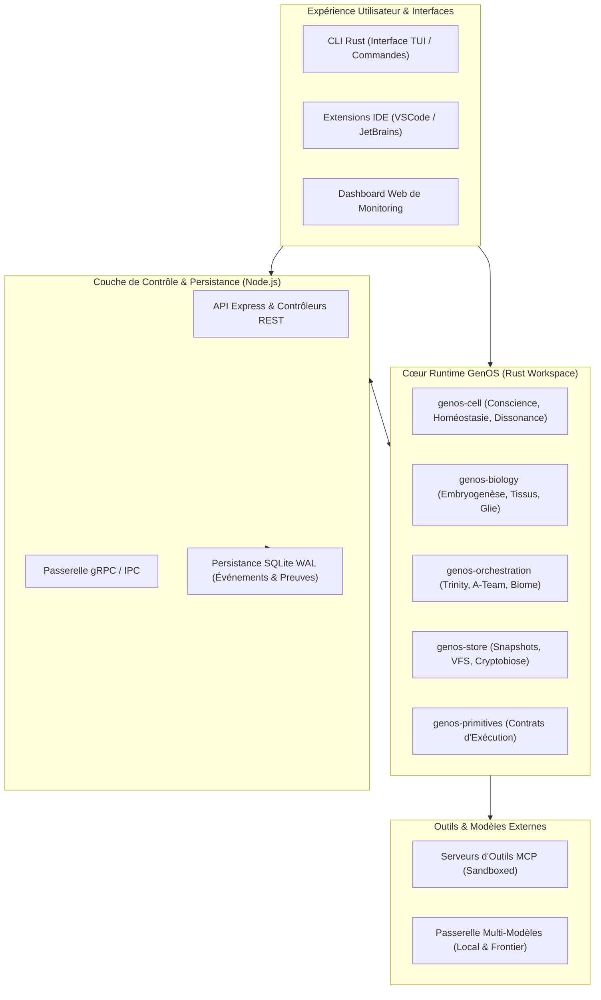
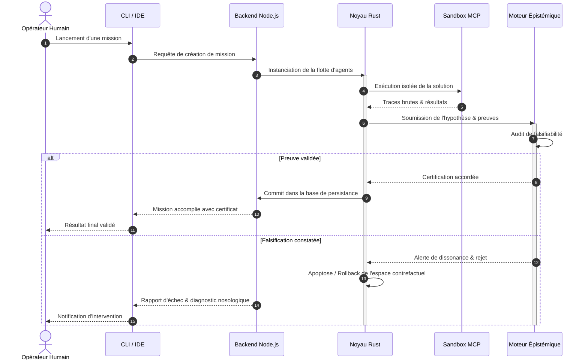

# GenOS V3

GenOS est un système d’exploitation contre-factuel et biomimétique pour agents multi-agents, conçu pour gérer l’exécution, la mémoire, la validation, la reprise et la promotion de décisions d’IA dans un cadre explicite, traçable et contrôlé.

Il ne prétend pas à une IA générale ni à une simulation biologique scientifique. Il met en œuvre une architecture de runtime dans laquelle les agents sont pensés comme des cellules d’exécution avec:

- identité et génome définis ;
- budget cognitif et contraintes de ressources ;
- mémoire, synapses, liaisons de provenance ;
- branches d’état isolées ;
- mécanismes de preuve avant promotion ;
- mécanismes de reprise et de sélection de survivants.

---

## Ce que fait GenOS

### 1. Une runtime d’agentic computation
GenOS transforme des workflows d’agent en un système de contrôle avec branches, snapshots, preuve, validation et isolation. L’objectif est de rendre l’exécution agentique plus reproductible et moins vulnérable aux hallucinations de chaîne ou à la propagation d’un état corrompu.

### 2. Un modèle biologique orienté runtime
Les notions de cellule, génome, épigénétique, synapse, phéromone, apoptose, chaperone, cryptobiose, etc., servent à modéliser les invariants fonctionnels du système. Elles permettent de structurer :

- la spécialisation des agents ;
- la gestion de budgets ;
- la sélection, la conservation ou la suppression de branches ;
- la protection contre la dérive de décision ou la propagation de mauvaises preuves.

### 3. Un système de preuve avant décision
Le cœur de la plateforme est l’arbitre de réalité et les gates de promotion. Une action n’est pas supposée correcte simplement parce que l’outil a répondu sans erreur. Elle doit être compatible avec la provenance, les tests, la sécurité, le contexte et le modèle d’évaluation.

### 4. Une architecture de travail et de contre-factuel
GenOS manipule des états de workspace, des snapshots, des forks, des bisections et des restorations. Cela permet d’exécuter plusieurs hypothèses sans polluer le flux principal et d’évaluer les effets d’une mutation ou d’une réécriture avant de la promouvoir.

---

## Ce que GenOS n’est pas

GenOS n’est pas :

- un système de pensée générale autonome ;
- une promesse d’équivalence biologique parfaite ;
- une garantie de sécurité absolue par l’usage de mots biologiques ;
- un runtime où “success: true” suffit à prouver la vérité métier ;
- un moteur de calcul déterministe sur des dépendances externes non capturées.

Sa vraie valeur est surtout technique et opératoire : offrir un cadre solide pour exécuter, comparer, sauvegarder, valider et reprendre un travail d’agents complexes.

---

## Piliers du système

### 1. Génome et épigénétique
Les agents et les workflows portent des états internes structurés, des contraintes et des capacités spécialisées, avec différenciation et partage de responsabilités. Voir :

- [docs/01-concepts/genome-et-epigenetique.md](docs/01-concepts/genome-et-epigenetique.md)
- [docs/01-concepts/biologie-computationnelle.md](docs/01-concepts/biologie-computationnelle.md)
- [docs/01-concepts/biomimetisme/web-foraging.md](docs/01-concepts/biomimetisme/web-foraging.md) — Foraging de Charnov, fovéation rétinienne et navigation active (résolution des 77% d'épreuves web GAIA).

### 2. Mémoire, synapses et apprentissage
Le système dispose d’un moteur de mémoire hybride, de connectome synaptique, de plasticité, de consolidation et de gestion de l’oubli. Voir :

- [docs/01-concepts/memoire-et-apprentissage.md](docs/01-concepts/memoire-et-apprentissage.md)
- [docs/01-concepts/neurobiologie-et-plasticite.md](docs/01-concepts/neurobiologie-et-plasticite.md)
- [docs/01-concepts/intelligence-de-nuee.md](docs/01-concepts/intelligence-de-nuee.md)

### 3. Orchestration et primitives exécutables
Les agents ne sont pas exécutés “à l’aveugle” ; ils passent par des plans, des budgets, des fires, des sélections de survivants et des barrières de preuve. Voir :

- [docs/02-orchestration/orchestration.md](docs/02-orchestration/orchestration.md)
- [docs/02-orchestration/primitives-executables.md](docs/02-orchestration/primitives-executables.md)
- [docs/02-orchestration/workflows-et-jobs.md](docs/02-orchestration/workflows-et-jobs.md)

### 4. Workspaces, snapshots et contre-factuel
Le dépôt met en place une logique de workspace isolation, de fork, de diff, de bisection et de restore. Voir :

- [docs/02-orchestration/workspaces-contrefactuel.md](docs/02-orchestration/workspaces-contrefactuel.md)
- [docs/02-orchestration/git-agents.md](docs/02-orchestration/git-agents.md) — transposition de Git aux états d’agents et séparation avec les worktrees de fichiers.
- [docs/02-orchestration/reproduction-et-replication.md](docs/02-orchestration/reproduction-et-replication.md)

### 5. Sécurité, identité, confiance et preuves
La plateforme construit ses garde-fous sur l’authentification, les permissions, le Zero Trust, la sandbox, les circuits breakers, les journaux et la vérification d’évidence. Voir :

- [docs/05-securite-gouvernance/securite.md](docs/05-securite-gouvernance/securite.md)
- [docs/05-securite-gouvernance/identite-et-autorite.md](docs/05-securite-gouvernance/identite-et-autorite.md)
- [docs/01-concepts/epistemologie-et-evidence.md](docs/01-concepts/epistemologie-et-evidence.md)

### 6. Contrats, intégration et exploitation
GenOS expose plusieurs surfaces : REST, gRPC, MCP, CLI et intégrations IDE. Voir :

- [docs/03-reference/api-et-contrats.md](docs/03-reference/api-et-contrats.md)
- [docs/03-reference/outils-mcp.md](docs/03-reference/outils-mcp.md)
- [docs/03-reference/integrations-ide.md](docs/03-reference/integrations-ide.md)
- [docs/04-exploitation/deploiement.md](docs/04-exploitation/deploiement.md)
- [docs/04-exploitation/cli-et-experience-operateur.md](docs/04-exploitation/cli-et-experience-operateur.md)
- [docs/07-positionnement/panorama-concurrentiel.md](docs/07-positionnement/panorama-concurrentiel.md) — comparaison transversale avec les principales alternatives du marché
---

## Vue d’architecture

```text
+-----------------------------------------------------------------------------------+
|                                UTILISATEURS / CLIENTS                              |
|  IDE / UI / CLI / scripts / agents / intégrateurs / opérateurs                   |
+---------------------------------------------+-------------------------------------+
                                              |
                                              v
+---------------------------------------------+-------------------------------------+
|                         GENOS CONTROL PLANE                                     |
|  REST / gRPC / MCP / CLI / orchestration / policies / evidence gates            |
+---------------------------------------------+-------------------------------------+
                                              |
                    +-------------------------+-------------------------+
                    |                                               |
                    v                                               v
+-------------------------------+                 +--------------------------------+
| Runtime agentique             |                 | Persistance & workspace state   |
| - workers / plans / budgets   |                 | - SQLite / snapshots / history  |
| - retry / selection           |                 | - branches / restore / diff     |
| - provenance / gates          |                 | - capsules / worktrees          |
+-------------------------------+                 +--------------------------------+
                    |                                               |
                    v                                               v
+-------------------------------+                 +--------------------------------+
| Mémoire & intelligence        |                 | Sécurité & gouvernance         |
| - embeddings / vector search  |                 | - auth / RBAC / zero trust     |
| - synapses / pheromones       |                 | - circuit breaker / sandbox   |
| - swarm / STDP / rewards      |                 | - audit / approvals / sealing  |
+-------------------------------+                 +--------------------------------+
                    |
                    v
+---------------------------------------------+
| Rust core / crates biologiques / moteurs    |
| - genos-cell / genos-biology / genos-store  |
| - genos-reproduction / genos-immune / etc. |
+---------------------------------------------+
```

---

## Documentation officielle du dépôt

Le dépôt contient une documentation structurée selon un même niveau de formalisation : définition, mathématiques, biologie, cas d’usage, exemple, schéma, architecture, processus, et comparaison avec le marché.

Voir la carte documentaire complète dans [docs/README.md](docs/README.md).

### Catégories principales

#### Fondations conceptuelles
- [docs/01-concepts/biologie-computationnelle.md](docs/01-concepts/biologie-computationnelle.md)
- [docs/01-concepts/genome-et-epigenetique.md](docs/01-concepts/genome-et-epigenetique.md)
- [docs/01-concepts/runtime-agentique.md](docs/01-concepts/runtime-agentique.md)
- [docs/01-concepts/epistemologie-et-evidence.md](docs/01-concepts/epistemologie-et-evidence.md)

#### Mémoire, apprentissage et swarm
- [docs/01-concepts/memoire-et-apprentissage.md](docs/01-concepts/memoire-et-apprentissage.md)
- [docs/01-concepts/neurobiologie-et-plasticite.md](docs/01-concepts/neurobiologie-et-plasticite.md)
- [docs/01-concepts/intelligence-de-nuee.md](docs/01-concepts/intelligence-de-nuee.md)
- [docs/01-concepts/fossilisation.md](docs/01-concepts/fossilisation.md) — archive stratigraphique terminale et irréversible des lignées éteintes (taphonomie, hash minéral, strates, mélanosomes, excavation en lecture seule).

#### Orchestration, jobs et workspaces
- [docs/02-orchestration/orchestration.md](docs/02-orchestration/orchestration.md)
- [docs/02-orchestration/git-agents.md](docs/02-orchestration/git-agents.md)
- [docs/02-orchestration/primitives-executables.md](docs/02-orchestration/primitives-executables.md)
- [docs/02-orchestration/workflows-et-jobs.md](docs/02-orchestration/workflows-et-jobs.md)
- [docs/02-orchestration/workspaces-contrefactuel.md](docs/02-orchestration/workspaces-contrefactuel.md)

#### Sécurité et gouvernance
- [docs/05-securite-gouvernance/securite.md](docs/05-securite-gouvernance/securite.md)
- [docs/05-securite-gouvernance/identite-et-autorite.md](docs/05-securite-gouvernance/identite-et-autorite.md)
- [docs/05-securite-gouvernance/conformite-et-gouvernance.md](docs/05-securite-gouvernance/conformite-et-gouvernance.md)
- [docs/04-exploitation/observabilite.md](docs/04-exploitation/observabilite.md)
- [docs/04-exploitation/resilience-et-reprise.md](docs/04-exploitation/resilience-et-reprise.md)

#### API, intégration et exploitation
- [docs/03-reference/api-et-contrats.md](docs/03-reference/api-et-contrats.md)
- [docs/03-reference/outils-mcp.md](docs/03-reference/outils-mcp.md)
- [docs/03-reference/modeles-et-providers.md](docs/03-reference/modeles-et-providers.md)
- [docs/03-reference/integrations-ide.md](docs/03-reference/integrations-ide.md)
- [docs/04-exploitation/deploiement.md](docs/04-exploitation/deploiement.md)
- [docs/04-exploitation/cli-et-experience-operateur.md](docs/04-exploitation/cli-et-experience-operateur.md)

---

## Structure du dépôt

```text
GenOS/
├── README.md                       # Vue d’ensemble du projet
├── docs/                           # Documentation technique et fonctionnelle
│   ├── README.md                   # Hub : index par familles et parcours de lecture
│   ├── CONVENTIONS.md              # Conventions de rédaction, nommage et liens
│   ├── 01-concepts/                # Fondations, biomimétisme, nosologie (1..9)
│   ├── 02-orchestration/           # Orchestration et topologies (8 modes)
│   ├── 03-reference/               # API, MCP, persistance, providers, IDE
│   ├── 04-exploitation/            # Déploiement, CLI, observabilité, reprise
│   ├── 05-securite-gouvernance/    # Sécurité, identité, conformité, sandbox
│   ├── 06-qualite-preuves/         # Qualité, tests, benchmarks
│   ├── 07-positionnement/          # Panorama concurrentiel, économie
│   ├── adr/                        # Décisions d'architecture (0001..0005) + index
│   └── archive/                    # Rapports datés non normatifs
├── backend/                       # Contrôle applicatif Node.js et services
├── crates/                        # Core Rust du runtime biomimétique
├── examples/                      # Démonstrations et scénarios
├── integrations/                  # Contrats IDE et intégration
├── mcp/                           # Serveur MCP et ponts d’intégration
├── scripts/                       # Outils d’orchestration, fix, validation
├── assets/                        # Brand, visuels et supports
├── Cargo.toml                     # Workspace Rust
├── package.json                   # Dépendances racine et scripts
├── runtime_arbiter.js             # Arbitre de réalité / validation de preuve
├── strategies.md                  # Catalogues de stratégies
├── arch_snapshot.json              # Snapshot d’architecture
├── arch_agent.json                 # Description agentique du système
├── LICENSE                        # Licence Apache 2.0
└── .genos.md                      # Règles de gouvernance de génération de code
```

---

## Démarrage rapide

### Prérequis
- Rust 1.88+ (toolchain stable)
- Node.js 20.19+ ou 22.12+
- Python 3 (gate de qualité du code)
- Git

### 1. Cloner et installer

```bash
git clone https://github.com/PISSARAW/GenOS.git
cd GenOS
npm ci
npm ci --prefix backend
npm ci --prefix mcp
cargo build --workspace
```

### 2. Configurer l’environnement

```bash
cp .env.example .env
```

Renseignez les valeurs locales utiles (port, provider LLM, secrets). Ne commitez jamais `.env`.

### 3. Lancer le backend

```bash
npm --prefix backend start
```

- API HTTP : `http://localhost:4000`
- Probes : `GET /healthz`, `/readyz`, `/livez`
- Au premier démarrage, un token administrateur à usage unique est affiché dans la console (ou définissez `GENOS_ADMIN_TOKEN`).

### 4. Utiliser la CLI

```bash
cargo run -p genos-cli -- --help
```

Le dépôt contient aussi une CLI simplifiée `g` pour les usages opérateurs (`.\g.ps1` sur PowerShell, `g.cmd` sur cmd). La distinction est explicitement documentée dans [docs/04-exploitation/cli-et-experience-operateur.md](docs/04-exploitation/cli-et-experience-operateur.md).

### 5. Lancer le serveur MCP (stdio)

```bash
node mcp/index.js
```

Le serveur MCP doit être lancé depuis la racine du dépôt : il lit `shared/toolDefinitions.json` et les services du backend. L’exposition des outils est contrôlée par `GENOS_MCP_LEASE` et `GENOS_MCP_DISABLED_TOOLS` (voir [docs/03-reference/outils-mcp.md](docs/03-reference/outils-mcp.md)). Une configuration prête à l’emploi est fournie dans [.mcp.json](.mcp.json).

Types d’outils disponibles :
- **Strategy Tools:** `genos_strategy_*` (MCTS pruning, 3-way merge, causal rebase, PRM evaluation).
- **Biomimicry Tools:** `genos_biomimicry_*` (stigmergy pheromones, cryptobiosis stasis, chromatin tool locking).
- **CLI Wrappers:** `genos_*` (native rust execution transport).

### 6. Lancer une mission d’orchestration autonome

```bash
node backend/bin/genos-orchestrate.cjs '{"mission": "Refactor authorization layer with zero-downtime canary fork", "background": true}'
```

### 7. Démo de débogage parallèle sûr (zéro token)

```bash
# Linux / macOS
./examples/safe-debugging-demo/run-demo.sh

# Windows / multiplateforme
cargo build -p genos-cli
node examples/safe-debugging-demo/run-demo.mjs target/debug/genos
```

### 8. Vérifier

```bash
npm run check:code-quality
npm test
cargo test --workspace
```

---

## Principes de gouvernance et de preuve

GenOS applique une logique de preuve et de responsabilité que l’on retrouve partout :

- un résultat ne vaut pas comme preuve de vérité ;
- le transport réussi n’est pas équivalent à une décision valide ;
- l’absence de preuve est un échec fonctionnel ;
- les risques, budgets et permissions doivent être explicités ;
- les actions sensibles demandent approbation, contrôle et journalisation.

Cela est central dans [docs/01-concepts/epistemologie-et-evidence.md](docs/01-concepts/epistemologie-et-evidence.md) et dans [docs/05-securite-gouvernance/securite.md](docs/05-securite-gouvernance/securite.md).

---

## Comparaison rapide avec l’écosystème du marché

| Domaine | GenOS | Systèmes du marché | Positionnement |
| --- | --- | --- | --- |
| Orchestration d’agents | Branches, budgets, preuves, contrôles de promotion | Orchestration linéaire ou pilotée par prompts | GenOS ajoute la validation de l’état et la reprise explicite |
| Counterfactual state | Snapshots, diff, fork, rollback, bisection | Outils de sandbox ou de GitOps souvent plus simples | GenOS suit l’historique causal et la blast radius |
| Mémoire agentique | Hybride vectoriel + lexical + synaptique + decay | Memory stores souvent centrés sur embedding simple | GenOS combine mémoire, contexte, résultat et preuve |
| Sécurité | Auth, RBAC, contrôles de tool, sandbox, circuit breaker | Labels ou tooling partiel | GenOS tente un contrôle en couches, vérifiable |
| Intégration IDE / MCP | Contrats explicites, leased tools, scopes, validation | Outils plus ad hoc ou trop permissives | GenOS impose un cadre de surface explicite |

Le détail complet est dans les sections “Comparaison avec le marché” des documents de chaque domaine.

---

## Licence

Le projet est distribué sous la licence [LICENSE](LICENSE) Apache 2.0.

---

## Points d’entrée recommandés

- Comprendre le produit : [docs/01-concepts/biologie-computationnelle.md](docs/01-concepts/biologie-computationnelle.md)
- Comprendre l’orchestration : [docs/02-orchestration/orchestration.md](docs/02-orchestration/orchestration.md)
- Comprendre les workspaces : [docs/02-orchestration/workspaces-contrefactuel.md](docs/02-orchestration/workspaces-contrefactuel.md)
- Comprendre les API : [docs/03-reference/api-et-contrats.md](docs/03-reference/api-et-contrats.md)
- Comprendre la sécurité : [docs/05-securite-gouvernance/securite.md](docs/05-securite-gouvernance/securite.md)
- Déployer et exploiter : [docs/04-exploitation/deploiement.md](docs/04-exploitation/deploiement.md)

Si vous souhaitez un point d’entrée plus opérationnel, commencez par [docs/README.md](docs/README.md).

---

## Code Governance: The Evidence Arbiter & Promotion Gates

To ensure that autonomous agents do not produce unmaintainable code or collude in hallucinations, GenOS enforces rules checked by [`runtime_arbiter.js`](runtime_arbiter.js) and the backend security services:

1. **Low Cyclomatic Complexity:** Code must remain readable, direct, and testable.
2. **Strict Parameter Limits:** Maximum 3 parameters per function.
3. **SOLID Principles:** Rigid separation of concerns across cellular modules.
4. **Line Bounds:** Source files must not exceed 400 lines without an explicit exemption.
5. **No Architectural Deviations:** Any fundamental pattern change requires an Architecture Decision Record (ADR).
6. **Costly Signaling (Handicap de Zahavi):** Gated by actual runtime compute and token expenditure (minimum 500 tokens for critical evaluations in [`ecology.rs`](crates/genos-biology/src/ecology.rs)), strictly rejecting zero-cost collusion.
7. **Budget Coherence:** Validates mission envelopes and enforces a 60% worker / 40% orchestrator reserve split via [`budgetCoherenceService.js`](backend/src/services/budgetCoherenceService.js).
8. **Human Approval Promotion Gate:** Autonomous Codex deployments and high-impact mutations require explicit, authenticated human approval before branch promotion.

Any generated patch failing these conditions is rejected by the Evidence Arbiter and discarded by the runtime recovery path.

---

## License

GenOS is licensed under the [Apache License 2.0](LICENSE).


---

## Schémas d'Architecture Globale et de Fonctionnement GenOS V3

### 1. Vue d'Ensemble de l'Écosystème GenOS V3



### 2. Séquence Globale de Traitement de Mission avec Validation de Preuve


