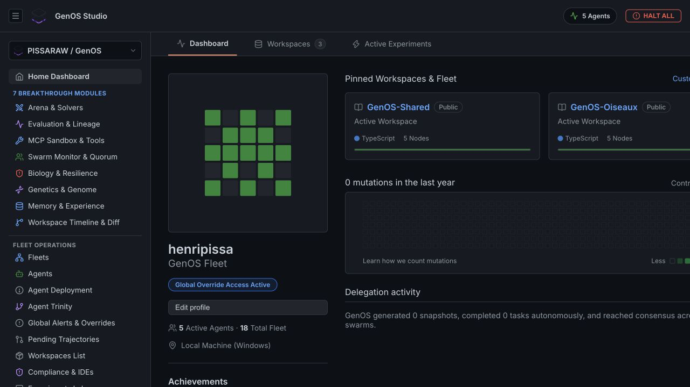
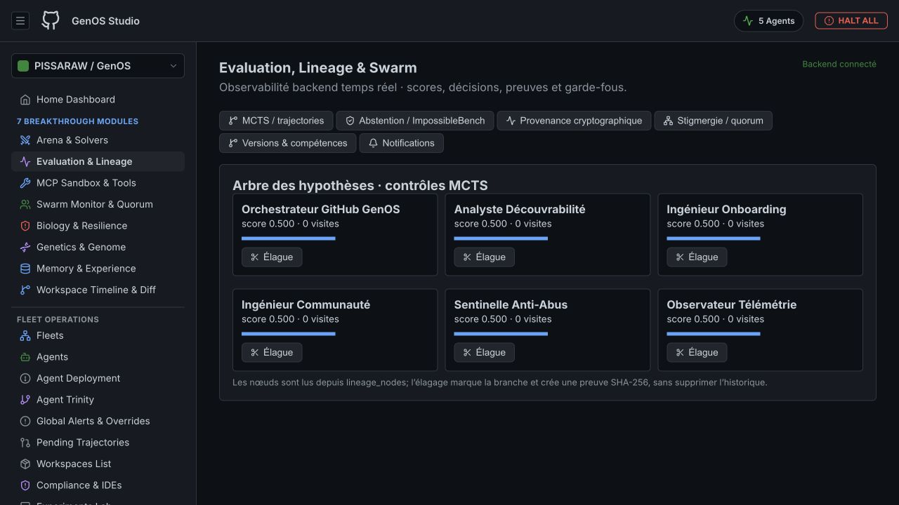
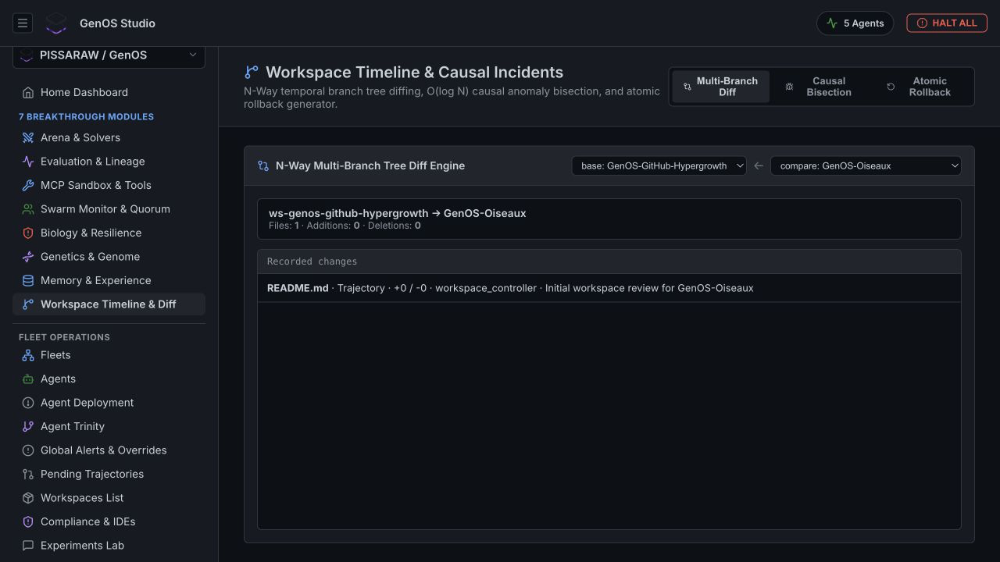

<p align="center">
  
</p>

<h1 align="center">GenOS</h1>

<p align="center">
  <strong>Git-like branching and deterministic replay for AI-agent state.</strong>
</p>

<p align="center">
  Snapshot agent state, fork competing hypotheses, run them in isolation,
  compare outcomes, replay the evidence, and merge only what passes.
</p>

<p align="center">
  <a href="https://github.com/PISSARAW/GenOS/actions/workflows/ci.yml"></a>
  <a href="LICENSE"></a>
  
  
</p>

<p align="center">
  <a href="#quick-start">Quick start</a> ·
  <a href="#genos-studio">Studio</a> ·
  <a href="examples/">Examples</a> ·
  <a href="docs/README.md">Documentation</a> ·
  <a href="docs/0-context-and-vision/product-roadmap.md">Roadmap</a> ·
  <a href="CONTRIBUTING.md">Contributing</a>
</p>

> [!IMPORTANT]
> GenOS is active research software at version `0.0.1`. Interfaces can change
> before `0.1.0`, and the project is not yet a production security boundary.

## Why GenOS?

Most agent workflows advance along one mutable timeline. When a tool call,
belief update, or code change goes wrong, the surrounding state is difficult to
reconstruct and alternative strategies are expensive to compare.

GenOS treats an agent workflow as versioned computation:

```text
                              ┌─ fork A ─ evaluate ─ reject
agent + world ─ snapshot S0 ──┼─ fork B ─ evaluate ─ keep ─ snapshot S1
                              └─ fork C ─ evaluate ─ inspect
                                      │
                                      └─ lineage + causal replay
```

- **Fork state, not just prompts.** Snapshots carry agent identity, genome,
  working state, world references, event cursors, and runtime metadata.
- **Keep branches isolated.** Sibling agents receive distinct identities and
  event streams, with runnable demonstrations for logical and filesystem state.
- **Compare evidence before promotion.** Structural diffs, evaluation scores,
  multi-objective selection, and explicit winner promotion are first-class
  workflows.
- **Preserve provenance.** Append-only events, lineage inspection, and replay
  make it possible to study where two trajectories diverged.
- **Observe everything locally.** GenOS Studio provides a browser control plane
  for fleets, experiments, lineage, workspaces, tools, and runtime telemetry.

## What works today

| Capability | Proof in this repository | Maturity |
| --- | --- | --- |
| Snapshot, fork, diff, and replay | [Counterfactual demo](examples/counterfactual-demo/) | Runnable CLI demo |
| Independent sibling state | [Divergent writes](examples/divergent-writes-demo/) | Runnable CLI demo |
| Isolated filesystem worlds | [Divergent worlds](examples/divergent-worlds-demo/) | Runnable CLI demo |
| Evaluation and Pareto selection | [Evaluation examples](examples/README.md#counterfactual-execution-and-evaluation) | Experimental |
| Belief, memory, and lineage workflows | [Provenance examples](examples/README.md#beliefs-memory-provenance-and-lineage) | Experimental |
| Local visual control plane | [GenOS Studio](#genos-studio) | Pre-alpha |

The [ADR implementation status](docs/2-architecture/adrs/IMPLEMENTATION_STATUS.md)
tracks which architectural decisions are implemented and which extensions are
still planned.

## Quick start

### Requirements

- Rust `1.85` or newer
- Git
- Bash on Linux/macOS, or PowerShell on Windows

Clone the repository and run the smallest end-to-end proof:

```bash
git clone https://github.com/PISSARAW/GenOS.git
cd GenOS
./run-demo.sh
```

On Windows:

```powershell
.\run-demo.ps1
```

The demo builds the CLI, creates an agent and a snapshot, forks two sibling
agents without an LLM call, verifies state and event-stream isolation, mutates
one branch, and prints a one-field diff. A successful run ends with:

```text
Demo OK: Agent A -> snapshot S0 -> forks A1/A2
```

No model-provider credentials are required. Generated data stays under
`.genos/demo/clone-without-llm/`.

To inspect the full CLI:

```bash
cargo build -p genos-cli
cargo run -p genos-cli -- --help
```

Continue with the
[end-to-end CLI tutorial](docs/1-onboarding-and-setup/quickstart-tutorial.md)
for capsules, isolated worlds, merges, lineage, and replay.

## GenOS Studio

GenOS Studio is the local browser control plane included in this repository.
It combines a React and TypeScript frontend with an Express and SQLite backend
to expose live agent, workspace, experiment, evaluation, lineage, tool, and
telemetry views.

<p align="center">
  
  <br>
  <sub>Fleet dashboard and active workspaces</sub>
</p>

<table>
  <tr>
    <td width="50%"></td>
    <td width="50%"></td>
  </tr>
  <tr>
    <td align="center"><sub>Evaluation, lineage, and swarm observability</sub></td>
    <td align="center"><sub>Workspace timeline and causal diff</sub></td>
  </tr>
</table>

### Run Studio locally

Studio requires Node.js `20.19+` on the 20.x line, or `22.12+`, and npm. Start
the backend from the repository root:

```bash
cd backend
npm ci
npm start
```

In a second terminal:

```bash
cd studio
npm ci
npm run dev
```

The backend listens on `http://localhost:4000`; Vite prints the frontend URL.
See the [Studio guide](studio/README.md) for the runtime adapter, API connection,
and production build command.

## Examples

The repository includes focused product proofs. Exploratory solvers, datasets,
and historical outputs live separately under [`research/`](research/):

| Start here | Demonstrates |
| --- | --- |
| [Counterfactual fork](examples/counterfactual-demo/) | Same logical state, distinct identity, isolated event streams |
| [Divergent writes](examples/divergent-writes-demo/) | Independent branch memory after a common snapshot |
| [Divergent worlds](examples/divergent-worlds-demo/) | Filesystem isolation between sibling worlds |
| [Counterfactual evaluation](examples/counterfactual-evaluation-demo/) | Candidate scoring and comparison |
| [Pareto selection](examples/pareto-selection-demo/) | Non-dominated multi-objective outcomes |
| [Personal causal replay](examples/personal-causal-replay/) | Checkpoint intervention and trajectory comparison |

Browse the [complete example catalog](examples/README.md) for genome mutation,
belief provenance, snapshot storage, tool permissions, incident investigation,
scientific research, and security co-evolution scenarios.

## Documentation

Choose the shortest path for what you need:

- **Understand the problem:** [Counterfactual OS paradigm](docs/0-context-and-vision/counterfactual-os.md)
  and [business motivation](docs/0-context-and-vision/business-goals.md)
- **Get running:** [local environment](docs/1-onboarding-and-setup/local-environment.md)
  and [quickstart tutorial](docs/1-onboarding-and-setup/quickstart-tutorial.md)
- **Study the system:** [architecture overview](docs/2-architecture/overview.md),
  [traceability matrix](docs/2-architecture/traceability-matrix.md), and
  [architecture decisions](docs/2-architecture/adrs/README.md)
- **Use the interfaces:** [CLI reference](docs/4-interfaces/cli-reference.md),
  [protocol specification](docs/4-interfaces/genos-protocol.md), and
  [MCP tools](docs/4-interfaces/mcp-tools-reference.md)
- **Review direction and trade-offs:** [product roadmap](docs/0-context-and-vision/product-roadmap.md)
  and [proof and benchmark status](docs/7-benchmarks-and-comparisons/proof-and-benchmark-status.md)

The [documentation portal](docs/README.md) contains the complete index and
guided reading paths for application developers, system architects,
researchers, and operators.

## Repository map

```text
crates/        Rust models, runtime, stores, worlds, evaluation, API, and CLI
backend/       Express + SQLite API for GenOS Studio
studio/        React + TypeScript + Vite frontend
examples/      Runnable proofs, scenarios, and reusable agent manifests
research/      Preserved exploratory solvers, datasets, and historical results
docs/          Concepts, onboarding, architecture, interfaces, and operations
spec/          JSON schemas for agents, snapshots, lineage, and experiments
integrations/  MCP and IDE integrations
python/        Python SDK, providers, and experiments
```

## Development

The Rust workspace uses the following quality gates:

```bash
cargo test --workspace
cargo fmt --all -- --check
cargo clippy --workspace --all-targets -- -D warnings
```

Reproducible replay and world-boundary checks are documented in
[the reproducible benchmark protocol](docs/7-benchmarks-and-comparisons/reproducible-benchmark-protocol.md).

Build the Studio frontend with:

```bash
cd studio
npm ci
npm run build
```

Before contributing, read [CONTRIBUTING.md](CONTRIBUTING.md). Architectural
changes should include or update an ADR and the relevant executable proof.
Small, bounded contributions are proposed in the
[good first issue backlog](docs/5-development-workflows/good-first-issues.md).

## Community and project policy

- [Support](SUPPORT.md)
- [Contributing](CONTRIBUTING.md)
- [Code of Conduct](CODE_OF_CONDUCT.md)
- [Governance](GOVERNANCE.md)
- [Security policy](SECURITY.md)
- [Changelog](CHANGELOG.md)
- [Project roadmap](docs/0-context-and-vision/product-roadmap.md)

## License

GenOS is licensed under the [Apache License 2.0](LICENSE).
