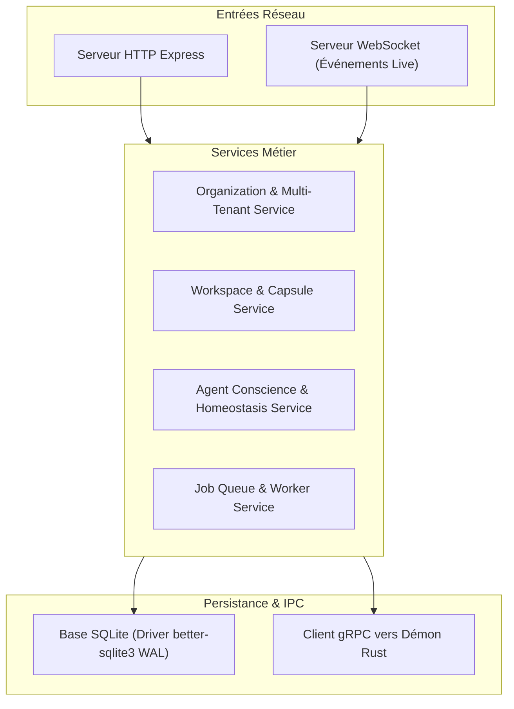
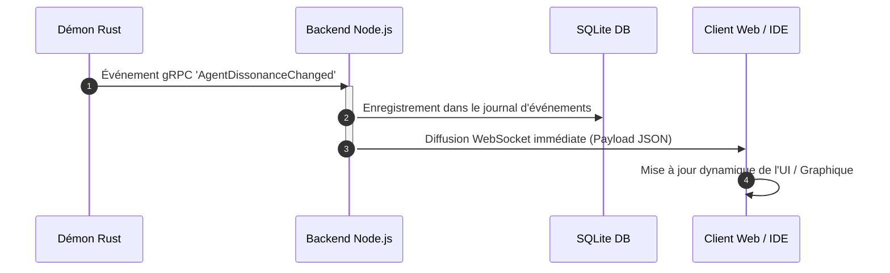

# GenOS Backend & Orchestration Control Plane

The GenOS backend is the core control plane and runtime engine for GenOS V3. It serves dual roles:
1. **REST & gRPC Runtime:** Exposes the comprehensive REST API (Express) and gRPC microservices consumed by the GenOS Studio, CLI, and external agent runtimes.
2. **Cognitive Memory & Biological Strategy Engine:** Houses the STDP synaptic connectome, hybrid vector/lexical search, autonomous orchestration pipelines, budget coherence validators, and strategy execution primitives.

For the agent-state Git API, its correspondence with Git, and the boundary between agent snapshots and real repository worktrees, see [../docs/02-orchestration/git-agents.md](../docs/02-orchestration/git-agents.md).

---

## Architecture & Subsystems

```
                                    +-----------------------------------------+
                                    |        GenOS Studio / CLI / MCP         |
                                    +-----------------------------------------+
                                                         |
                                        +----------------+---------------+
                                        | REST (Express) | gRPC (Lineage)|
                                        +----------------+---------------+
                                                         |
+-------------------------------------------------------------------------------------------------------------------+
|                                                 BACKEND RUNTIME                                                   |
|                                                                                                                   |
|  +--------------------------------+  +--------------------------------+  +-------------------------------------+  |
|  |     Autonomous Orchestrator    |  |     Unified Embeddings (768D)  |  |       STDP Synaptic Connectome      |  |
|  |  - Autonomous Plan Service     |  |  - Local Xenova Transformers   |  |  - 3-Factor STDP (Dopamine/LTP/LTD) |  |
|  |  - Strategy Dispatcher (counts: see inventory) |  |  - Ollama (nomic-embed-text)   |  |  - Ebbinghaus Forgetting Curve      |  |
|  |  - Budget Coherence (60/40 split) | - OpenAI text-embedding-3-small|  |  - Hippocampal Sleep Consolidation  |  |
|  |  - Human Approval Promotion Gate  | - Null Vector Rejection        |  |  - C3/CD47 Microglial Pruning       |  |
|  +--------------------------------+  +--------------------------------+  +-------------------------------------+  |
|                                                        |                                                          |
|  +-------------------------------------------------------------------------------------------------------------+  |
|  |                                      MCP Tool Registry (seed declarations)                                    |  |
|  |                      Routes tool calls dynamically: Strategy / Biomimicry / CLI                              |  |
|  +-------------------------------------------------------------------------------------------------------------+  |
|                                                        |                                                          |
|  +-------------------------------------------------------------------------------------------------------------+  |
|  |                                         SQLite High-Performance WAL Engine                                  |  |
|  |       - 67+ Normalized Tables  - sqlite-vec 768-D Indexing  - FTS5 BM25 Hybrid Search Triggers - bounded mmap (256 MiB default, 1 GiB max)  |  |
|  +-------------------------------------------------------------------------------------------------------------+  |
+-------------------------------------------------------------------------------------------------------------------+
```

### 1. Persistence & Hybrid Retrieval Engine
- **SQLite in WAL Mode:** Configured with `PRAGMA journal_mode = WAL`, a configurable durability mode (`FULL` by default), and a bounded mmap size (`268435456` bytes by default, capped at 1 GiB) with in-memory temporary tables. Override these values with `GENOS_SQLITE_SYNCHRONOUS` and `GENOS_SQLITE_MMAP_SIZE`.
- **Serialized Write Queue & Lock Retries:** Protects against `SQLITE_BUSY` when 100 concurrent workers write simultaneously. Features in-memory tail chaining, `AsyncLocalStorage` transaction nesting, and exponential jittered retries on locks (`withWriteRetry`).
- **sqlite-vec Integration:** Native fast cosine and L2 vector search over 768-dimensional embeddings.
- **FTS5 Virtual Tables:** Automated full-text indexing triggers on `trajectories_fts` and `genome_decisions_fts` with French/accent-preserving query tokenization.
- **Reciprocal Rank Fusion (RRF):** Decoupled vector and BM25 ranking fused at SQL level for resilient hybrid memory search.

### Schema and migration boundary
The JSON files under `spec/` are exchange contracts for manifests, snapshots, events, lineage, and schema-service responses. They are validated by the runtime schema validator and selected CLI/API boundaries. They are not a serialization of the SQLite schema.

SQLite tables and columns under `src/db/` are internal persistence contracts. They evolve through startup migrations and may contain operational fields that are intentionally absent from the public JSON schemas. A valid JSON manifest therefore does not imply that every field is directly persisted, and a successful database migration does not replace JSON contract validation.

### 2. Unified Embedding Provider (`src/services/embeddingProvider.js`)
Normalizes all vector inputs to **768 dimensions** with automatic detection and graceful fallback:
- **Local Xenova Transformers:** In-process CPU embeddings via `@xenova/transformers` (`Xenova/all-MiniLM-L6-v2` projected to 768-D).
- **Ollama:** Local API endpoint with model autodetection (`nomic-embed-text`, etc.).
- **OpenAI:** Cloud embedding endpoint (`text-embedding-3-small`).
- **Safety Gate:** Filters and rejects degenerate zero-vectors to prevent index corruption.

### 3. Neurobiology & Synaptic Memory
- **3-Factor STDP:** Hebbian synaptic weight adjustment modulated by dopaminergic outcome signals, long-term potentiation (LTP), and long-term depression (LTD).
- **Time Cells:** Chronological event ordering with contextual isolation across workspaces.
- **Sleep Cycle & Consolidation (`src/services/sleepCycle.js`):** Scheduled background consolidation of recent hippocampal experiences into long-term trajectories with microglial C3/CD47 synaptic pruning.
- **Epistemic Shield & Amygdala Filter:** Calibrated credibility scoring and cognitive drift sentinels (Shannon Entropy $H(A)$) preventing adversarial prompt gaslighting.

### 4. Strategy Dispatcher & Autonomous Orchestration
The strategy and primitive counts use the same family definitions composed by `strategyRegistry.js`; see the dated [technical inventory](../docs/03-reference/inventaire-technique.md) and `npm run docs:inventory`. Runtime health distinguishes ready, partial, experimental, and prototype entries; registration does not imply production availability.
- **Budget Coherence (`src/services/budgetCoherenceService.js`):** Enforces a strict 60% worker pool / 40% orchestrator reserve split, preventing token exhaustion and budget overruns.
- **Human Approval Promotion Gate:** High-impact mutations and autonomous promotions require cryptographically signed human approval before merging.
- **Minimal routing & request memory (ADR 0046):** Every `orchestrate` request first goes through `requestProfilerService` (`RequestProfile` + `request_class`), `executionRouterService` (minimal ladder `primitive -> procedure -> single_worker -> adaptive_worker -> specialists -> collective -> large_search`, escalate only on evidence) and `bestKnownResultService` (durable problem→champion memory). `backend/bin/requestMemoryBridge.cjs` short-circuits `genos-orchestrate.cjs`: valid champions are reused with no agents, deterministic arithmetic runs as a `primitive` with a receipt, mission summaries are archived as `PROVISIONAL`. Tables: `request_problems`, `request_results` (migration `071-request-memory`, contract `spec/request-memory.schema.json`).

### GVX standard AGOW cycle

`gvxStandardLifecycleAdapters` supplies the default adapters when no custom lifecycle module is configured. A pinned operator profile binds the agent and scope, parent/candidate policies, evaluator sources, paired controls, budgets and monitoring contexts. The separate Ed25519 verifier executes fixed trusted evaluators, persists signed measurements and checks the applied policy against the runtime database in read-only mode.

The controller orders assessment, authorization, atomic application, independently verified monitoring, then signed receipt and idempotent plasticity credit. SQLite leases and the stage journal support recovery; regression restores the exact parent and prevents positive credit. Three monitoring windows yield at most one development receipt, while consolidation separately requires three distinct successful receipts.

From the repository root, run `node backend/bin/genos-gvx-profile.cjs <profiles.json>` to validate configuration and `node backend/bin/genos-gvx-verifier.cjs` to start the configured service. The functional suite is `node backend/bin/test-gvx.cjs`. See the [operator profile](../docs/02-orchestration/profil-execution-gvx.md), [verifier service](../docs/05-securite-gouvernance/service-verificateur-gvx.md) and [validation report](../docs/06-qualite-preuves/validation-cycle-standard-gvx.md). These fixtures do not establish model efficacy or a qualified holdout campaign.

### AEIS : promotion et mémoire immunitaire

Le chemin `approveRun()` exécute l'AEIS avant la promotion : prédicat de commande
exact, quorum de deux vérificateurs indépendants avec reçus signés et
ré-arbitration homéostatique. La politique multi-provider exige l'accord
complet des providers distincts ; leurs workers utilisent des processus
séparés et SQLite en mémoire.

Les tables `epistemic_immune_memory_scoped` et `epistemic_immune_outcomes`
conservent les observations confirmées par portée. La migration
`114-aeis-authority` ajoute `aeis_agent_dissonance` et `aeis_dissonance_events`
pour des restrictions d'autorité persistantes, applicables aux descendants.

Depuis la racine : `npm --prefix backend run test:aeis`. Les tests utilisent
SQLite, des commandes réelles et des réponses HTTP provider contrôlées.
Voir [la fiche AEIS](../docs/01-concepts/adaptive-epistemic-immune-system.md)
et [les gates de preuve](../docs/06-qualite-preuves/immunite-epistemique.md).

#### Natural Search Control Plane (`src/services/search/`)

`agentProcessEventPipeline` calls `checkNaturalSearchControl`: measured progress
and the hypothesis ledger feed a controller that selects and executes a search
process. Phases 6–12 share the search genome, negative memory and culture with
the runtime. Plasticity changes the search genome; speciation persists niches.
Causal replay analyzes the bounded journal and does not restore a workspace.

`search_runtime_checkpoint` is the authoritative version-1 SQLite checkpoint:
ledger, evidence, pressure, hysteresis, sensor, counters and all seven module
states are committed atomically. A revision check rejects stale writers;
historical tables and `search_module_state` are projections and a legacy import
path. Invalid state and failed writes produce errors. A failed flush retains
live state and the previous committed checkpoint.

Evidence provenance comes from the runtime source. `EVIDENCE_REPORT` is
self-reported; tool results are observed. Cultural compilation requires explicit
caller validation, reproducibility, a finite success rate in [0.7, 1] and two
distinct observed or verified evidence references bound to supported hypotheses
of the relevant family. Durable delivery is scoped to the same organization and
project; received traits are candidates, with no decision promotion.

Run the dedicated suite with `npm --prefix backend run test:natural-search`
(21 scripts at the 2026-10-06 validation). See the [runtime contract](../docs/01-concepts/natural-search-control-plane.md),
[ADR 0323](../docs/adr/0323-reprise-atomique-natural-search.md) and
[recovery runbook](../docs/04-exploitation/runbook-recovery.md#8-natural-search-checkpoint-recovery).

### 5. Unified MCP Tool Registry (`src/services/mcpToolRegistry.js`)
Maintains a declaration-driven backend registry for typed execution routing. Its current unique declaration count and registered biomimicry handler count are recorded in the dated [technical inventory](../docs/03-reference/inventaire-technique.md). MCP stdio servers expose a leased public subset:
- `strategy`: Handled by `mcpStrategyTools.js`.
- `bio`: Handled by native biomimicry adapters `mcpBioTools.js`.
- `cli`: Dispatched through the local transport layer to `genos` binaries.

### 6. Resident Daemon Ecology (`src/services/daemon/`, ADR 0034)
Persistent, territory-bound agentic processes maintaining an evidence-grounded model of their environment across missions. The daemon observes and knows; the orchestrator decides; the worker intervenes. No automatic repair: findings escalate to `REPAIRABLE`, mutation requires a lease.
- **Territory** (`daemonTerritoryService.js`): commit-aware scoping (`repo/ref/path/commit`); freshness uses successful index time and indexed HEAD, while a changed HEAD marks knowledge stale.
- **Event physiology** (`daemonEventBridgeService.js`, `daemonReceptorRegistry.js`, `daemonWakePolicyService.js`): deterministic receptors and bounded wake policy; accepted high-priority wakes run a bounded deterministic investigation that may create observed findings, with no LLM call.
- **Cartographer** (`cartography/`): derived knowledge graph (directories, files, symbols, `CONTAINS`/`IMPORTS`); incremental updates provably equal clean rebuilds.
- **Findings** (`findings/`): canonical epistemic objects with typed evidence (supporting/contradicting × 6 natures), closed lifecycle (`REFUTED`/`EXPIRED` terminal), provenance by reference.
- **Investigator** (`investigation/`): deterministic detectors (test-regression, flaky-signal, broken-import, missing-sibling-test) producing observations, translated into hypotheses through `daemonNaturalSearchAdapter.js`, with an injected ledger and pressure model. The adapter owns no checkpoint; durable integration is the caller’s responsibility.
- **Verifier** (`verification/`): epistemic immune system — head freshness, scope existence, per-detector rules; reproduction counts only strictly post-creation events.
- **Stigmergy** (`daemonStigmergyService.js`): territorial pheromones steer attention, never truth; evaporation decay; fail-soft forwarding to `stigmergyInterProcessBridge`.
- **Repair** (`repair/`): isolated `RepairEpisode` on `REPAIRABLE` findings — scoped lease (allowed commands, budget, expiry, `genos-repair/` branch), claimed and executed by a worker in an isolated capsule, never by the daemon; expired episodes reconciled.
- **Legacy autofix (deprecated, D15)**: mtime file picking removed, `runAutofixCycle` is a permanent no-op pointing to `RepairEpisode`; branch sync + MR maintenance kept.
- **Specialization** (`specialization/`, D16): pressure-gated ecological phenotypes (security, contract, dependency, documentation) — budding on measured pressure, dormancy when it falls, never deleted.
- **Evaluation** (`evaluation/`, D17–D18): deterministic warm-start proxy benchmark (cold vs warm recall) and 6-arm biomimetic ablations; runs persisted for promotion evidence.
- **Scheduling** (`scheduling/`, D19): metabolic compute scheduler — testable U(a) utility, gated LLM reasoning, wake budgets.
- **Maturity** (`maturity/`, D20): evidence-gated experimental → stable promotion with persisted receipts; status EXPERIMENTAL until live LLM A/B/C protocol runs.
- **Tables** (migrations 037–045, 050, 054–055): `daemon_territories`, `daemon_runtime_state`, `daemon_events`, `territory_graph_nodes/edges`, `daemon_findings`, `daemon_finding_evidence`, `daemon_stigmergy_markers`, `daemon_handoffs`, `daemon_handoff_feedback`, `daemon_repair_episodes`, `daemon_phenotypes`, `daemon_eval_runs`, `daemon_promotions`.
- **Tests**: `backend/tests/test_daemon_*.js` (24 suites). Contracts: `spec/daemon-territory.schema.json`, `spec/daemon-finding.schema.json`, `spec/resident-daemon.schema.json`.

### 7. Écosystème agentique 11-15 (`src/services/*`, ADR 0037)
Cinq systèmes qui font passer GenOS d'agents sophistiqués à un écosystème gouverné ; la fitness reste toujours relative à une niche. Contrats : `spec/ecosystem-11-15.schema.json`.
- **Environnement et niches** (`environmentModelService.js`, `nicheResolverService.js`) : `EnvironmentState` persistant, dérive `ENVIRONMENT_DRIFT`, construction de niche explicite et soumise à autorité.
- **Substrat cognitif** (`hostRuntimeIdentityService.js`, `cognitiveSubstrateResolverService.js`) : agent ≠ LLM ; hôte natif par défaut (native-first), `requestedModel` ≠ `servedModel` tracés ; modèle puissant ≠ autorité supérieure.
- **Physiologie collective** (`collectivePhysiologyService.js`, `informationFlowResolverService.js`) : topologie ≠ physiologie ; monoculture cognitive, homéostasie, quorum pondéré (jamais vérité) ; routage ciblé plutôt que broadcast.
- **Gouvernance** (`governancePlaneService.js`) : plan orthogonal, `APPROVE / DENY / BOUNDED_APPROVE / HUMAN_REVIEW`, gate morphogenèse, approbation humaine = autorisation (pas preuve). `dynamicOrganizationService.assertMember()` refuse désormais les agents inconnus (`UNKNOWN_AGENT`, incarnation explicite requise).
- **Interoception collective** (`collectiveInteroceptionService.js`) : vital signs multidimensionnels (pas de score unique) ; télémétrie manquante = incertitude (`unknown / partially observed`).
- **Tests**: `backend/tests/test_ecosystem_11_15.js`.

---

### 8. Nosologie et autorisations cliniques

Le catalogue canonique [shared/nosology.json](../shared/nosology.json) définit 28 conditions et 48 opérateurs de marqueurs dans neuf familles. [nosologyCatalogService.js](src/services/medical/nosologyCatalogService.js) valide les variantes sans paramètres et les six formes paramétrées avant signature.

`POST /api/rust/clinical-authorizations` vérifie le scope de la mission et la cellule de la population Rust courante. La route exige `security:manage`; le signataire exige également une approbation explicite et la permission `all`. L’autorisation liée au génome, à l’état et au reçu source expire initialement après 60 secondes et utilise `GENOS_THERAPY_AUTH_SECRET`.

La réponse contient une autorisation, pas une application. La CLI restaure le journal et l’exécuteur Rust persiste le reçu et la population avant mise à jour mémoire. Les résultats `no_target` et `refused` gardent `treatment_administered = false`. Les tables et thérapies médicales Node conservent leur contrat propre.

Références : [API et CLI](../docs/03-reference/api-et-contrats.md#autorisation-et-application-cliniques), [doctrine clinique](../docs/01-concepts/nosologie/pathologie-et-medecine.md), [bilan des preuves](../docs/06-qualite-preuves/validation-nosologie.md).

## Metapopulation regional runtime

`metapopulationCoordinationService.js` exposes persistent sessions, patches,
demes and directed corridors. `runAutonomousRegionalRuntime(input, { db, ... })`
runs bounded OBSERVE/DIAGNOSE/PLAN/EXECUTE/VERIFY/RECORD cycles and resumes after
the last verified cycle. An empty plan returns `NO_ACTION`.

Receiver adapters control migration validation, adaptation, assimilation and
rescue rollback. Rust evolution, solver search and colonization evaluation
require explicit adapters. Resident capsules, leases, founder reserves and
local memory are persisted; they do not start a background process by themselves.

From the repository root, run `npm --prefix backend run test:metapopulation`
for the ten dedicated suites. See the [runtime reference](../docs/03-reference/runtime-metapopulation.md)
and [ADR 0330](../docs/adr/0330-effets-durables-metapopulation.md)
for contracts, recovery semantics and validation limits.

## Natural Creative Ecology — expériences exécutables

Le backend fournit un cycle natif pour trois familles de transformations numériques :
recherche de procédures, vérification POET sur snapshots, transfert culturel,
persistance du phénotype et réutilisation après réouverture SQLite. Le vocabulaire
de procédures est fermé ; les six bras d'ablation couvrent quatre mécanismes.
Les dimensions O/H du vecteur créatif restent inconnues sans observations dédiées.

Depuis la racine du dépôt, avec une configuration JSON et un fichier de rapport neuf :

```bash
node backend/bin/genos-nce-experiment.cjs cycle config.json .genos-agent-worlds/report.json
node backend/bin/genos-nce-experiment.cjs ablation config.json .genos-agent-worlds/ablation.json
```

La configuration doit expliciter `root` et `databasePath`. Le bootstrap d'une
nouvelle base exige `GENOS_ADMIN_PASSWORD`. Le statut `promoted` du reçu dépend
des vérifications et du gain mesuré ; le code de sortie de la CLI ne suffit pas.

Voir le [guide des expériences NCE](../docs/03-reference/experiences-nce.md) pour
la configuration complète, les commandes de vérification, la reprise, les preuves
et les limites. Décision : [ADR 0323](../docs/adr/0323-nce-procedures-et-preuves-executables.md).

## Directory Layout

```text
backend/
├── bin/                          # Agent runtime and orchestration binaries
│   ├── genos-agent-runtime.cjs   # Autonomous worker sandbox runtime
│   ├── genos-orchestrate.cjs     # Mission orchestration entrypoint
│   └── genos-apoptosis.cjs       # Apoptosis autopsy generator
├── proto/                        # Protocol Buffers definitions
│   └── lineage.proto             # Lineage tracking & state synchronization
├── src/
│   ├── app.js                    # Express application mounting and security middleware
│   ├── controllers/              # REST controllers (memory, tools, arena, genome, workspaces)
│   ├── db/                       # Database engine, migrations, and seed tools
│   │   ├── index.js              # SQLite connection pool & PRAGMA configurations
│   │   ├── schema.js             # Table setup & FTS5 triggers
│   │   ├── schema-tables-core.js # Core table definitions
│   │   └── seedTools.js          # Preloaded MCP tool declarations
│   ├── grpc_services/            # gRPC service implementations (lineageService.js)
│   ├── middleware/               # RBAC, tenant isolation, and anti-CSRF filters
│   ├── routes/                   # Resource routers
│   ├── services/                 # Domain logic and execution pipelines
│   │   ├── autonomousOrchestrationService.js # Autonomous team coordination
│   │   ├── budgetCoherenceService.js         # Token & compute budget validator
│   │   ├── embeddingProvider.js              # Unified 768-D multi-backend embeddings
│   │   ├── mcpToolRegistry.js                # Dynamic MCP tool dispatcher
│   │   ├── sleepCycle.js                     # Hippocampal replay & microglial pruning
│   │   ├── strategyExecutionAdapter.js       # strategy dispatcher
│   │   ├── daemon/                           # Resident daemon ecology (ADR 0034)
│   │   │   ├── cartography/                  # Territorial knowledge graph
│   │   │   ├── findings/                     # Canonical epistemic findings
│   │   │   ├── investigation/                # Deterministic anomaly detectors
│   │   │   ├── verification/                 # Epistemic immune system
│   │   │   ├── handoff/                      # TerritoryBrief + feedback plasticity
│   │   │   ├── reconciliation/               # Continuous autophagy sweeps
│   │   │   ├── repair/                       # Isolated repair episodes (D14)
│   │   │   ├── specialization/               # Ecological phenotypes (D16)
│   │   │   ├── evaluation/                   # Warm-start + ablations (D17-D18)
│   │   │   ├── scheduling/                   # Metabolic compute scheduler (D19)
│   │   │   └── maturity/                     # Promotion gate (D20)
│   │   └── primitiveHandlers/                # Concrete primitive implementations
│   └── strategies/               # Strategy catalog and classification families
├── tests/                        # Verification and regression test suite
└── server.js                     # HTTP & gRPC bootstrap entrypoint
```

---

## Getting Started

### Prerequisites
- **Node.js:** 20.19+ or 22.12+ LTS
- **C/C++ Build Tools** (for compiling native `sqlite3` and `sqlite-vec` bindings)

### Installation
```bash
cd backend
npm install
```

### Running the Server
```bash
# Start in production mode
npm start

# Or with live-reload
npm run dev
```

### Docker deployment
Build from the repository root so the Dockerfile can copy both `backend/` and the IDE contract:
```bash
docker build --file backend/Dockerfile --tag genos-backend .
docker run --rm --publish 4000:4000 --volume genos-data:/data --env-file .env genos-backend
```
The image exposes HTTP (`4000`) and gRPC (`50051`). Plaintext gRPC binds to loopback only; publish `50051` only with `GENOS_GRPC_TLS_KEY` and `GENOS_GRPC_TLS_CERT` configured.

The server listens by default on:
- **HTTP REST API:** `http://localhost:4000` (override via `PORT`)
- **Health Probes:** `GET http://localhost:4000/healthz`, `/readyz`, `/livez`
- **gRPC Service:** `127.0.0.1:50051` by default, or `GRPC_BIND_ADDRESS:GRPC_PORT` when configured

### Bootstrap Credentials
On first boot, the backend initializes `genos.db` (67+ tables), applies migrations, and creates a bootstrap administrator token. The one-time token is output to the console:
```text
[GenOS Bootstrap] Generated one-time administrator token:
genos_sk_admin_...
```
- Set `GENOS_ADMIN_TOKEN` to define a static token.
- Set `GENOS_ADMIN_PASSWORD` to configure the default `admin` user password.

---

## Environment Variables

| Variable | Default | Purpose |
| :--- | :--- | :--- |
| `PORT` | `4000` | HTTP REST API listening port |
| `GRPC_PORT` | `50051` | gRPC Lineage service listening port |
| `GRPC_BIND_ADDRESS` | `127.0.0.1` without TLS | gRPC listening interface |
| `GENOS_DB_PATH` | `$GENOS_DB_PATH`, else `backend/genos.db` if present, else `.genos/data/operational/genos.db` | SQLite database file; resolution order in `src/db/index.js` + `src/storage/storagePaths.js` |
| `GENOS_SQLITE_MMAP_SIZE` | `268435456` | SQLite mmap size in bytes; bounded to 1 GiB |
| `GENOS_SQLITE_SYNCHRONOUS` | `FULL` | SQLite durability mode: `NORMAL`, `FULL`, or `EXTRA` |
| `GENOS_PROCESS_GRACE_MS` | `5000` | Child-process graceful termination period, bounded to 30 seconds |
| `GENOS_AGENT_EXECUTOR` | `codex` (code default when unset) | Cognitive harness: `codex`, `local`, `caller_mcp` or `solar-direct`. Resolved via the harness catalog (`src/services/harnessCatalog.js` + `src/services/harnessDrivers/`); `.env.example` pins `local` for containers/offline Ollama use |
| `GENOS_GRPC_TLS_KEY` / `GENOS_GRPC_TLS_CERT` | *None* | Pair of regular files required to expose gRPC beyond loopback |
| `GENOS_ADMIN_TOKEN` | *Generated* | Administrator API token |
| `GENOS_ADMIN_PASSWORD` | `genos-admin` | Default password for local `admin` account |
| `GENOS_EMBEDDING_PROVIDER` | `auto` | Preferred provider: `auto`, `xenova`, `ollama`, `openai` |
| `GENOS_OLLAMA_ENDPOINT` | `http://127.0.0.1:11434/v1/chat/completions` | Endpoint URL for local Ollama instances |
| `OPENAI_API_KEY` | *None* | API key for OpenAI model & embedding fallbacks |

---

## Missions contractuelles Holobionte

Le service `src/services/holobionteService.js` expose `runHolobiontMission` : ouverture de l’hôte, essai d’admission, exécution par capacité, vérification indépendante, décision immunitaire, contribution et mémoire atomiques, puis clôture ou quiescence. Le compositeur historique retourne `COMPOSED` ; ce statut ne prouve aucune exécution. Les adaptateurs fournissent l’isolation physique et les mesures de ressources.

Depuis la racine du dépôt :

```bash
node examples/holobionte/run-mission.cjs
node backend/bin/genos-holobionte-mission.cjs examples/holobionte/arithmetic-mission.cjs --preflight
npm --prefix backend run test:holobionte
```

Voir le [contrat d’exécution](../docs/03-reference/runtime-holobionte.md) pour les adaptateurs obligatoires, les erreurs, les quotas et les limites de validation.

## Runtime Rhizome

Le service persistant `src/services/rhizomeCoordinationService.js` fournit le graphe, les budgets atomiques, les résultats signés et les métriques. `src/services/rhizome/runtime/rhizomeRuntime.js` relie les providers réels et les vérificateurs indépendants à une boucle de mission bornée. Les six types de providers (`agent`, `daemon`, `tool`, `service`, `human`, `runtime`) demandent `start`, `probe`, `execute` et `stop` ; la composition seule ne produit aucune exécution vérifiée.

Le [contrat runtime](../docs/03-reference/runtime-rhizome.md) décrit les callbacks, les preuves, les limites et les commandes CLI de télémétrie. Les listes `GENOS_RHIZOME_TRUSTED_PROVIDER_IDS` et `GENOS_RHIZOME_TRUSTED_VERIFIER_DIGESTS` sont configurées côté serveur pour les opérations MCP ; les arguments de l’appelant ne créent pas de confiance.

Depuis la racine du dépôt :

```bash
npm --prefix backend run test:rhizome
```

La suite conserve les commandes, durées et codes de sortie dans un artefact ignoré. Le contrôle CLI live distinct vérifie export, HTTP, WebSocket et refus d’une source fermée ; son lancement est décrit dans le contrat.

---

## Vérification du noyau G-CIR Ω

Depuis la racine du dépôt :

```bash
npm --prefix backend run test:omega
npm --prefix backend run test:interop
cargo test -p genos-mcp
```

`test:omega` regroupe les treize scripts couvrant le routeur, la MMU, la visibilité
persistante, les preuves, les procédures et les projections. `test:interop`
nécessite Cargo : les fixtures comparent les six opérations Node/Rust sur huit
domaines et quatre refus, sans certifier les backends métier de production.
Le job CI `omega-interop` exécute les deux suites Node, avec Rust installé.

Voir [G-CIR](../docs/02-orchestration/g-cir.md) et
l'[ADR 0323](../docs/adr/0323-frontieres-preuve-execution-omega.md) pour les
invariants et les capacités encore manquantes. Ces tests ciblés ne remplacent
pas les gates globaux du dépôt.

## Runtime Syncytium

Le [contrat runtime Syncytium](../docs/03-reference/runtime-syncytium.md) décrit
l'admission causale, les identités d'opérations, les transactions persistées,
les réplicas hors ligne et la promotion spéculative. Le dispatch biologique active
les services des 13 variants par défaut, sous leurs préconditions de configuration.
Un appel direct au registre doit activer explicitement `useVariantRuntime`.

La clôture combine l'oracle des workers avec un reçu `stateValidation` calculé
sur la session autoritative : opérations CRDT non vides, invariants satisfaits,
snapshot à la version courante et aucune opération hors ligne en attente.
Une réponse worker ou un succès transport seul laisse la mission partielle.

## Verification Test Suite

### Garage Fabric : ordonnanceur durable des workers

Le [Garage Fabric](../docs/02-orchestration/topologies/garage-fabric.md) raccorde
douze politiques à l'admission et au bootstrap commun des missions worker.
Les tables `garage_queue`, `garage_events` et `garage_capsules` persistent les
demandes, transitions et états de suspension. Claim et réservation locale/projet
partagent une transaction SQLite ; le bail UUID clôture les callbacks anciens.
Un ACK ne prouve pas la fin : le run courant doit fournir son événement terminal
et un artefact conforme au contrat typé.

Les routes sous `/api/agents/:id/workers/garage` exposent capacité, `queue`
et `events?after=N`. `POST /api/agents/:id/workers/:workerId/dispatch` admet la
mission durable ; `POST /api/agents/:id/workers/garage/queue/:requestId/:action`
contrôle `freeze`, `resume`, `cancel`, `renew`. Le tenant sélectionné borne
les lectures ; les mutations exigent `workspace:write` et une autorité parent
revérifiée. Une réponse 202 signifie admission, pas résultat validé.

La préemption est consentie et attend un arrêt confirmé avant snapshot vérifié.
Le GC retient la source pendant `freezing`/`freeze_failed` ; le payload est stocké
hors de la capsule jetable. Le thaw restaure les fichiers dans une nouvelle
capsule avec le budget restant mesuré. La file survit au restart, pas la RAM,
les sockets ni le contexte du fournisseur LLM. Les états incertains restent
réservés plutôt que libérés sans preuve.

### Commandes de validation

The test suite validates database integrity, vector search, biological primitives, and orchestration safety:

```bash
# Run the backend verification suite from backend/
npm test

# Run all discovered Syncytium suites from backend/
npm run test:syncytium

# Run the seven Garage Fabric suites from backend/
node tests/run_validation_suite.js garage

# Run specialized safety & coherence tests
node tests/test_runtime_budget_and_influence.js
node tests/test_human_approval_promotion_gate.js
node tests/test_intermediate_state_persistence.js
node tests/test_worker_failure_recovery.js

# NCE: contrats, parcours natifs et ablations (depuis backend/)
npm run test:nce

# CLI NCE avec migrations et contraintes SQLite de production
npm run test:nce:cli
```

Depuis la racine du dépôt, `npm run test:garage` lance le profil Garage et
`npm test` inclut ce profil après les tests backend. Le `npm test` du seul
backend ne remplace pas la validation Garage dédiée, ni le quality gate
Python ou `cargo test --workspace`.


---

## Schémas d'Architecture et de Flux du Backend

### 1. Architecture Interne du Backend Node.js



### 2. Séquence de Gestion d'un Événement en Temps Réel



## A-Team execution and evidence boundary

Explicit dispatch and autonomous orchestration share `src/services/aTeam/execution/teamExecutionService.js`. Canonical workers are assigned before graph persistence. A runner lease and a persisted deadline protect resumption. Worker completion alone cannot complete the TeamRun: evidence, global criteria and exact versioned consumer receipts are required. The detached runner also monitors teams without deferred stages.

The eleven variant evaluators remain separate from generic dispatch; multiteam planning does not launch verified sub-runs. Coverage measures mission contributions, not general expertise. See [the A-Team runtime contract](../docs/03-reference/runtime-a-team.md).

## SHEV : responsabilité et surveillance persistantes

Le tick Ontogenèse raccorde les capteurs signés, initiatives, effets post-intégration
et surveillances. Les risques/opportunités, récupérations et expériences GVX
requièrent une approbation signée avec budget. Les effets externes ambigus restent
bloqués jusqu’à leur réconciliation ; le progrès de l’agent a un reçu distinct.

- Opérateur : `npm --prefix backend run shev -- --help`.
- Validation : `npm --prefix backend run test:shev` et `test:web-audits`.
- [Modèle et garanties](../docs/02-orchestration/shev.md).
- [Exploitation, signature et fournisseurs](../docs/03-reference/exploitation-shev.md).

La CLI est une frontière d’administration locale. Aucun endpoint HTTP ni outil
MCP SHEV supplémentaire n’est ajouté. Le fournisseur métier/GVX doit être installé
par l’opérateur ; les fixtures de test ne certifient pas une campagne réelle.
