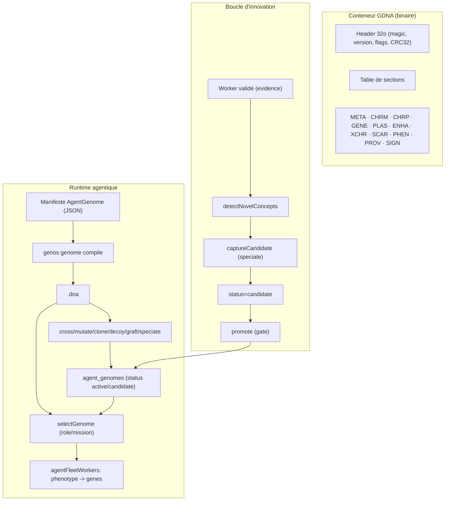

# AgentDNA — Génome héréditaire binaire et runtime agentique

## 1. Définition du domaine

**AgentDNA** est le format **héréditaire binaire** d'un agent GenOS. Il encode de façon compacte et déterministe :

- l'identité de génome (`genome_id`, `lineage_id`, `generation`, `ploidy`) ;
- le matériel génétique (chromosomes, gènes localisés, exons, régulation, méthylation, chromatine) ;
- les éléments mobiles (plasmides, rétrovirus endogènes, enhancers, chromosomes extra) ;
- le **phénotype exprimé** (rôle, stratégie, outils, capacités, prompt) ;
- la **provenance** (parents, croisement, mutations, sélection, leurre, signataire).

Il se distingue du **manifeste portable `AgentGenome`** ([GENOME_SPEC.md](../../spec/GENOME_SPEC.md)) : le manifeste est une carte d'identité/politique lisible ; `AgentDNA` est la couche **héréditaire, mutable et croisable**. La spécification normative est [spec/AGENT_DNA_SPEC.md](../../spec/AGENT_DNA_SPEC.md) et la décision [ADR 0001](../adr/0001-agent-dna-binary-format.md).

## 2. Modèle mathématique ou logique

- **Alphabet** : `A=00, C=01, G=10, T=11`, 4 bases par octet (base 0 dans les bits 7–6).
- **Génome** : tuples `(chr_m, chr_p, {locus → Gene}, plasmids, enhancers, extra_chr, bud_scars, hayflick_limit)`, où un `Gene = (dna, is_methylated, expression_volume, chromatin_state, required_activator, bound_repressor, exons)`.
- **Expression** : `transcription → épissage (exons) → traduction (codons) → repliement`, conditionnée par l'état chromatinien, la méthylation, les activateurs/répresseurs et les microARN. Le phénotype est dérivé des **loci** (`ROLE`, `STRATEGY`, `TOOL_*`, `CAP_*`, `MODEL_TEMP`, `MODEL_TOPP`) et de leur instruction.
- **Fingerprint canonique** : `content_hash = SHA-256(⨁ tag || len_u32 || payload)` sur les sections triées par octets ASCII, **hors `SIGN`**.
- **Signature** : `SIGN = Ed25519_sign(flux_canonique)` ; la clé publique vit dans `PROV.signer`.
- **Croisement** : recombinaison de gamètes haploïdes (`single_point`, `uniform`) avec reprogrammation épigénétique méiotique ; barrière de spéciation par horloge moléculaire.
- **Division** : mitose (clone attesté), fission binaire, bourgeonnement (`bud_scars`, `hayflick_limit`), schizogonie, méiose.
- **Mutation** : ponctuelle/stochastique à taux `r ∈ [0,1]`, hypermutation sous stress, CRISPR (`knockout`, `pseudogenize`, `duplicate_gene`).

## 3. Analogies biologiques et limites réelles

| Concept GenOS | Analogie biologique | Réalité en GenOS |
| --- | --- | --- |
| `genes` | gènes | loci + brins 2 bits + régulation |
| `chromatin_state` | Chromatine ouverte/fermée | gating d'expression logique |
| `plasmids` | transfert horizontal | trait acquis sans locus fixe |
| `speciate` | spéciation / radiation | dérive d'un nouveau `genome_id` |
| `graft` | néo-fonctionnalisation | ajout d'un gène/plasmide |
| `hayflick_limit` | limite de Hayflick | plafond de divisions |
| `decoy` | mimétisme | leurre marqué, phénotype crédible |

**Limites** : la sémantique métier est portée par les **loci et leurs instructions**, pas par le repliement des peptides ; l'analogie biologique sert à structurer des invariants, pas à prouver une vérité métier.

## 4. Cas d'usage et objectifs métier

1. **Portabilité héréditaire** : compiler des manifestes en `.dna` compacts et reproductibles.
2. **Recrutement piloté par le génome** : un orchestrateur sélectionne un génome (par rôle/domaine) et son phénotype est injecté au spawn du worker.
3. **Évolution dirigée** : croiser, muter, cloner, leurrer, greffer, spécier des agents.
4. **Confiance** : signature Ed25519 et politique par tenant (`require_signed`).
5. **Innovation** : distiller un concept découvert et validé en **génome candidat**, puis le promouvoir pour réutilisation.

## 5. Exemples concrets

```bash
# Compiler un manifeste en ADN binaire
genos genome compile --in agents/fondations/preuve_evidence.agent.json --out preuve.dna
# Croiser deux génomes
genos genome cross --parent-a a.dna --parent-b b.dna --out child.dna --seed s1
# Ajouter un concept acquis (gène ou plasmide)
genos genome graft --in base.dna --out g.dna --locus CAP_foraging --instruction "optimal foraging"
# Spéciation : nouveau génome dérivé
genos genome speciate --in g.dna --out sp.dna --name SpatialReasoner --concept foraging --graft "CAP_x=..."
# Signer / vérifier
genos genome keygen --out key.txt
genos genome sign --in sp.dna --out sp.signed.dna --key key.txt
genos genome validate --file sp.signed.dna --pubkey <hex>
```

```
GET  /api/genomes
GET  /api/genomes/:id
POST /api/genomes/import
POST /api/genomes/:id/operations/cross|mutate|clone|decoy|graft|speciate
GET  /api/genomes/innovations
POST /api/genomes/innovations/:id/promote
GET|PUT /api/genomes/policy
```

Outils MCP : `genos_genome_compile|validate|inspect|cross|mutate|clone|decoy`.

## 6. Schéma ou diagramme



## 7. Architecture technique

**Cœur Rust — crate `genos-dna`**
- `header.rs` : conteneur `GDNA`, flags, CRC32.
- `section.rs`, `packing.rs` : table de sections, brins 2 bits.
- `wire.rs` : encodage MessagePack positionnel des structures.
- `codec.rs` : `encode`, `decode`, `content_hash`, `encode_signed`, `verify_signature`, flux canonique.
- `model.rs` : `AgentDna`, `Meta`, `Phenotype`, `Provenance`.
- `compile.rs` : manifeste → ADN ; `express.rs` : ADN → phénotype ; `validate.rs`.
- `operations.rs` : `cross`, `mutate`, `clone_dna`, `decoy`, `graft`, `speciate`.
- `sign.rs` : Ed25519 (keygen, sign, verify).
- Dépend de `genos-genome` et `genos-reproduction`.

**CLI** : `crates/genos-cli/src/commands/genome.rs`, `genome_ops.rs`, `args/genome.rs`.

**Backend Node**
- Décodeur : `backend/src/services/agentDna/` (`container.js`, `packing.js`, `decode.js`, `express.js`) — vérifie CRC32, décode 2 bits + MessagePack, vérifie `SIGN`.
- Store : `agentDnaStore.js` (`saveGenome`, `loadGenome`, `importDirectory`, `selectGenome`, `workerGenesForAssignment`).
- Opérations : `agentDnaOperations.js` (pont CLI `genos genome ...`).
- Innovation : `agentDnaInnovation.js` (détection, capture, promotion).
- Politique : `agentDnaPolicy.js` (signature par tenant).
- Hook spawn : `agentFleetWorkers.js` (`applyAgentDna`).
- Hook preuve : `workerEvidenceBarrierLocal.js` (`publishLocalSuccess` → `captureFromSuccess`).
- MCP : `mcpGenomeTools.js` + catalogue `seedTools.js` + validation `mcpArgumentValidation.js`.

**Persistance** : `agent_genomes` (blob ADN + phénotype + `status`/`concept`), `genome_policies`, `agent_genome_innovations`.

## 8. Processus d'exécution ou de validation

**Compilation / validation**
1. `compile` : manifeste → gènes (`ROLE`, `STRATEGY`, `CAP_*`, `TOOL_*`, `MODEL_*`) → `AgentDna` → phénotype.
2. `validate` : conteneur + `Genome::validate` + vérification de signature.
3. `sign` : pose `PROV.signer`, signe le flux canonique, ajoute `SIGN`, flag `SIGNED`.

**Recrutement**
1. Spawn worker → `selectGenome` (explicite `genomeRef`/`preferredName`, sinon matching rôle/domaine si `GENOS_AGENT_DNA=1`, auto-import de `agents/dna`).
2. Politique tenant (`genome_policies`) / env `GENOS_AGENT_DNA_REQUIRE_SIGNED` → exige `signatureValid === true`.
3. `applyAgentDna` remplace `role/strategy/tools/temp/topP` par le phénotype exprimé.

**Boucle d'innovation**
1. Un worker **validé** (`hasDecisionEvidence`) réussit avec un outil absent de son génome de base.
2. `detectNovelConcepts` compare le `toolLease` (événement `WORKER_CAPABILITY_LEASED`) aux gènes du génome de base.
3. `captureCandidate` appelle `speciate` → génome enfant stocké `status='candidate'` + ligne `agent_genome_innovations`.
4. `promote` (gate : preuve + approbation) → `status='active'` → le génome devient sélectionnable.

## 9. Comparaison avec le marché

| Aspect | GenOS AgentDNA | Configuration d'agent classique | Bibliothèques d'algorithmes génétiques |
| --- | --- | --- | --- |
| Format | binaire (2 bits + MessagePack), pas de JSON | JSON/YAML ad hoc | structures en mémoire |
| Hérédité | chromosomes, loci, chromatine, plasmides | non | génomes opaques |
| Provenance | parents, croisements, mutations, leurres, signature | rarement | non |
| Preuve | gate d'évidence avant promotion | absente | fitness seulement |
| Intégration runtime | sélection au spawn, boucle d'innovation | chargement statique | hors runtime |

## 10. Limites, garde-fous, non-objectifs

- **Ce n'est pas de la biologie** : les termes (chromatine, plasmide, spéciation) organisent des invariants ; ils ne prouvent pas la vérité métier.
- **Expression textuelle, non sémantique** : le phénotype dérive des loci/instructions, pas d'une compréhension.
- **Candidats gated** : un génome `candidate` n'est jamais recruté automatiquement avant promotion.
- **Signature** : un génome non signé peut être refusé selon la politique tenant ; les leurres portent un marqueur dans `PROV` signée.
- **Canonicalisation** : le flux de hash/signature trie les sections par **octets ASCII** ; tout producer doit respecter cet ordre (Rust et Node alignés).
- **Non-objectif** : remplacer le manifeste `AgentGenome` (identité/politique) ; `AgentDNA` est la couche héréditaire, pas la carte d'identité.

## Voir aussi

- [spec/AGENT_DNA_SPEC.md](../../spec/AGENT_DNA_SPEC.md) — spécification normative du format.
- [adr/0001-agent-dna-binary-format.md](../adr/0001-agent-dna-binary-format.md) — décision de format.
- [adr/0002-agentdna-innovation-loop.md](../adr/0002-agentdna-innovation-loop.md) — boucle d'innovation.
- [GENOME_EPIGENETIQUE.md](genome-et-epigenetique.md), [REPRODUCTION_REPLICATION.md](../02-orchestration/reproduction-et-replication.md), [EPISTEMOLOGIE_EVIDENCE.md](epistemologie-et-evidence.md).
