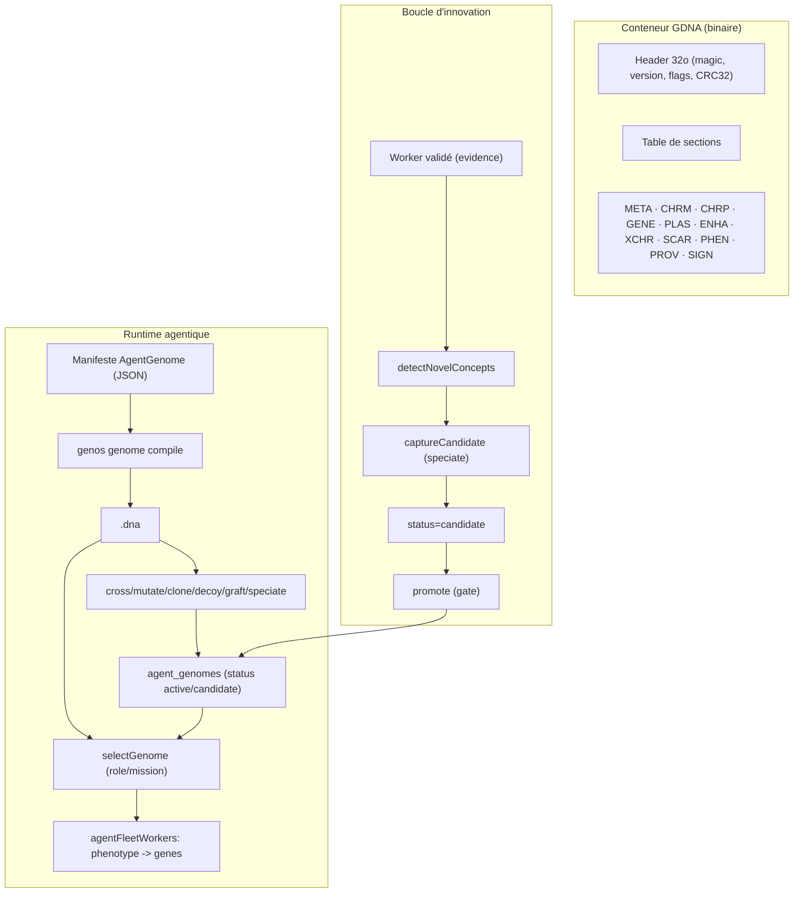

# AgentDNA — Génome héréditaire binaire et runtime agentique

## 1. Définition du domaine

**AgentDNA** est le format **héréditaire binaire** d'un agent GenOS. Il encode de façon compacte et déterministe :

- l'identité de génome (`genome_id`, `lineage_id`, `generation`, `ploidy`) ;
- le matériel génétique (chromosomes, gènes localisés, exons, régulation, méthylation, chromatine) ;
- les éléments mobiles (plasmides, rétrovirus endogènes, enhancers, chromosomes extra) ;
- le **phénotype exprimé** (rôle, stratégie, outils, capacités, prompt) ;
- la **provenance** (parents, croisement, mutations, sélection, leurre, signataire).

Il se distingue du **manifeste portable `AgentGenome`** ([GENOME_SPEC.md](../../spec/GENOME_SPEC.md)) : le manifeste est une carte d'identité/politique lisible ; `AgentDNA` est la couche **héréditaire, mutable et croisable**. La spécification normative est [spec/AGENT_DNA_SPEC.md](../../spec/AGENT_DNA_SPEC.md) et la décision [ADR 0001](../adr/0001-agent-dna-binary-format.md).

## 2. Modèle mathématique ou logique

- **Alphabet** : `A=00, C=01, G=10, T=11`, 4 bases par octet (base 0 dans les bits 7–6).
- **Génome** : tuples `(chr_m, chr_p, {locus → Gene}, plasmids, enhancers, extra_chr, bud_scars, hayflick_limit)`, où un `Gene = (dna, is_methylated, expression_volume, chromatin_state, required_activator, bound_repressor, exons)`.
- **Expression** : `transcription → épissage (exons) → traduction (codons) → repliement`, conditionnée par l'état chromatinien, la méthylation, les activateurs/répresseurs et les microARN. Le phénotype est dérivé des **loci** (`ROLE`, `STRATEGY`, `TOOL_*`, `CAP_*`, `MODEL_TEMP`, `MODEL_TOPP`) et de leur instruction.
- **Fingerprint canonique** : `content_hash = SHA-256(⨁ tag || len_u32 || payload)` sur les sections triées par octets ASCII, **hors `SIGN`**.
- **Signature** : `SIGN = Ed25519_sign(flux_canonique)` ; la clé publique vit dans `PROV.signer`.
- **Croisement** : recombinaison de gamètes haploïdes (`single_point`, `uniform`) avec reprogrammation épigénétique méiotique ; barrière de spéciation par horloge moléculaire.
- **Division** : mitose (clone attesté), fission binaire, bourgeonnement (`bud_scars`, `hayflick_limit`), schizogonie, méiose.
- **Mutation** : ponctuelle/stochastique à taux `r ∈ [0,1]`, hypermutation sous stress, CRISPR (`knockout`, `pseudogenize`, `duplicate_gene`).

## 3. Analogies biologiques et limites réelles

| Concept GenOS | Analogie biologique | Réalité en GenOS |
| --- | --- | --- |
| `genes` | gènes | loci + brins 2 bits + régulation |
| `chromatin_state` | Chromatine ouverte/fermée | gating d'expression logique |
| `plasmids` | transfert horizontal | trait acquis sans locus fixe |
| `speciate` | spéciation / radiation | dérive d'un nouveau `genome_id` |
| `graft` | néo-fonctionnalisation | ajout d'un gène/plasmide |
| `hayflick_limit` | limite de Hayflick | plafond de divisions |
| `decoy` | mimétisme | leurre marqué, phénotype crédible |

**Limites** : la sémantique métier est portée par les **loci et leurs instructions**, pas par le repliement des peptides ; l'analogie biologique sert à structurer des invariants, pas à prouver une vérité métier.

### Position sur les métaphores biologiques

Les termes biologiques (génome, expression, phénotype, plasmide, apoptose, lignée, bud-scar, hayflick_limit, ATP, dissonance, quorum, plasticité synaptique, cryptophasia, jumeaux siamois, superfétation, freemartin, diapause embryonnaire, leurres, etc.) désignent des politiques logicielles, pas une équivalence avec une cellule vivante. C'est légitime et cohérent, mais l'autopoïèse « cellulaire » est un modèle d'organisation, pas une capacité physique. On n'a pas de membrane lipidique, pas de métabolisme chimique, pas de reproduction cellulaire réelle ; l'autopoïèse revendiquée est organisationnelle (auto-entretenue, auto-réparatrice, auto-modélisée).

## 4. Cas d'usage et objectifs métier

1. **Portabilité héréditaire** : compiler des manifestes en `.dna` compacts et reproductibles.
2. **Recrutement piloté par le génome** : un orchestrateur sélectionne un génome (par rôle/domaine) et son phénotype est injecté au spawn du worker.
3. **Évolution dirigée** : croiser, muter, cloner, leurrer, greffer, spécier des agents.
4. **Confiance conditionnelle** : signature Ed25519 vérifiée en lecture (`verifySignature` dans `container.js`), politique par tenant (`require_signed`), mais sans clé Ed25519 configurée pour signer, la chaîne d'intégrité n'est pas fermée par défaut — les génomes non signés restent utilisables selon la politique en vigueur.
5. **Innovation** : distiller un concept découvert et validé en **génome candidat**, puis le promouvoir pour réutilisation.

## 5. Exemples concrets

```bash
# Compiler un manifeste en ADN binaire
genos genome compile --in agents/fondations/preuve_evidence.agent.json --out preuve.dna
# Croiser deux génomes
genos genome cross --parent-a a.dna --parent-b b.dna --out child.dna --seed s1
# Ajouter un concept acquis (gène ou plasmide)
genos genome graft --in base.dna --out g.dna --locus CAP_foraging --instruction "optimal foraging"
# Spéciation : nouveau génome dérivé
genos genome speciate --in g.dna --out sp.dna --name SpatialReasoner --concept foraging --graft "CAP_x=..."
# Signer / vérifier
genos genome keygen --out key.txt
genos genome sign --in sp.dna --out sp.signed.dna --key key.txt
genos genome validate --file sp.signed.dna --pubkey <hex>
```

```
GET  /api/genomes
GET  /api/genomes/:id
POST /api/genomes/import
POST /api/genomes/:id/operations/cross|mutate|clone|decoy|graft|speciate
GET  /api/genomes/innovations
POST /api/genomes/innovations/:id/promote
GET|PUT /api/genomes/policy
```

Outils MCP : `genos_genome_compile|validate|inspect|cross|mutate|clone|decoy`.

## 6. Schéma ou diagramme



## 7. Architecture technique

- **Cœur Rust — crate `genos-dna`** — socle des opérations génomiques
  - `operations.rs` : `cross`, `mutate`, `clone_dna`, `decoy`, `graft`, `speciate`.
  - `compile.rs` : manifeste → ADN ; `express.rs` : ADN → phénotype ; `validate.rs`.
  - `sign.rs` : Ed25519 (keygen, sign, verify).
  - Dépend de `genos-genome` (identité, chromatine, `derive_child`/`derive_reproductive_child`, `validate`, `content_hash`) et `genos-reproduction` (`crossover`, `division`, `phylogeny`).
  - Il existe un socle Rust d'opérations génomiques (`cross`, `mutate`, `clone_dna`, `graft`, `speciate`, `decoy`, `express`, `validate`) et de reproduction (`Genome::derive_child`, `Genome::derive_reproductive_child`, `CellDivision`, `MeioticCrossover`). Ces opérations sont conçues pour être invoquées de façon **autonome** par un agent/cellule : un agent peut se reproduire (birth), recevoir un plasmide (inject), se faire croiser, muter, cloner, greffer, spécier, sans intervention humaine. Cela dit, le cas d'usage principal documenté reste l'usage piloté par l'orchestrateur ou l'opérateur ; l'autonomie génomique est un pouvoir donné au runtime, pas le scénario par défaut documenté.

**CLI** : `crates/genos-cli/src/commands/genome.rs`, `genome_ops.rs`, `args/genome.rs`.

**Backend Node**
- Décodeur : `backend/src/services/agentDna/` (`container.js`, `packing.js`, `decode.js`, `express.js`) — vérifie CRC32, décode 2 bits + MessagePack, vérifie `SIGN`.
- Store : `agentDnaStore.js` (`saveGenome`, `loadGenome`, `importDirectory`, `selectGenome`, `workerGenesForAssignment`).
- Opérations : `agentDnaOperations.js` (pont CLI `genos genome ...`).
- Innovation : `agentDnaInnovation.js` (détection, capture, promotion).
- Politique : `agentDnaPolicy.js` (signature par tenant).
- Hook spawn : `agentFleetWorkers.js` (`applyAgentDna`).
- Hook preuve : `workerEvidenceBarrierLocal.js` (`publishLocalSuccess` → `captureFromSuccess`).
- MCP : `mcpGenomeTools.js` + catalogue `seedTools.js` + validation `mcpArgumentValidation.js`.

**Persistance** : `agent_genomes` (blob ADN + phénotype + `status`/`concept`), `genome_policies`, `agent_genome_innovations`.

## 8. Processus d'exécution ou de validation

**Opérations normatives**
1. `compile` : manifeste → gènes (`ROLE`, `STRATEGY`, `CAP_*`, `TOOL_*`, `MODEL_*`) → `AgentDna` → phénotype.
2. `validate` : conteneur + `Genome::validate` + vérification de signature.
3. `sign` : pose `PROV.signer`, signe le flux canonique, ajoute `SIGN`, flag `SIGNED`.
4. `express` : produit le phénotype (et `PHEN` si demandé) sans modifier l'identité/hérédité.
5. `cross`, `mutate`, `clone_dna`, `graft`, `speciate`, `decoy` : opérations génomiques avec provenance (§7 et spec/AGENT_DNA_SPEC.md §Opérations normatives).

**Opérations normatives — usage autonome vs usage piloté**
Les opérations génomiques (`inject`, `birth`, `cross`, `mutate`, `clone`, `graft`, `speciate`, `decoy`, `express`, `validate`) sont implémentées du côté Rust et exposées par le CLI (`genos genome ...`) et les outils MCP (`genos_genome_*`). La nomacographie est cohérente :

| Opération | Entrée | Rust existant | Effet | Usage principal documenté |
| --- | --- | --- | --- | --- |
| `inject` | ADN + agent cible | expression §9 | remplace/complète le phénotype et la configuration d'un agent vivant | orchestration / opérateur |
| `birth` | ADN | `Genome::derive_child` / `derive_reproductive_child` | engendre un nouvel agent (nouveau `genome_id`, `generation+1`, `parents=[parent]`) | orchestration / opérateur |
| `cross` | ADN A + ADN B | `MeioticCrossover::{single_point_crossover, uniform_crossover_with_seed}` | recombinaison méiotique, barrière de spéciation | orchestration / opérateur |
| `mutate` | ADN + taux/type | `Genome::{mutate_stochastic, hypermutate}`, `crispr_cas9_knockout`, `pseudogenize`, `duplicate_gene` | mutation ponctuelle/stochastique/CRISPR | orchestration / opérateur |
| `clone` | ADN | `CellDivision::{mitosis_attested, binary_fission, budding_with_limit_and_mutation}` | clone isogénique ou bourgeonnement (respecte `hayflick_limit`/`bud_scars`) | orchestration / opérateur |
| `graft` | ADN + gène/plasmide | `Genome::insert_gene`, `Plasmid::new` | acquiert un concept (gène localisé ou plasmide HGT), tracé dans `PROV.mutations` | orchestration / opérateur |
| `speciate` | ADN parent + concepts | `Genome::derive_child` + greffe | dérive un nouveau génome (`genome_id` neuf, `PROV.selection` porte le concept) | orchestration / opérateur (capture candidate) |
| `decoy` | ADN + sélecteur | nouveau | génère un leurre marqué (`PROV.decoy`, flag `DECOY`) | orchestration / opérateur |
| `express` | ADN + contexte | `Gene::express` | produit `PHEN` sans écrire le génome | orchestration / opérateur |
| `validate` | ADN | `Genome::validate` + contrôle de conteneur | accepte/rejette | orchestration / opérateur / runtime |

La différence clé n'est pas l'implémentation mais le **cas d'usage** : le socle Rust autorise un usage **autonome** (un agent/cellule peut se reproduire, se faire injecter un plasmide, se spécier sans humain), mais le document principal décrit l'usage **piloté** (orchestrateur/opérateur). La promotion d'un génome issu d'une opération autonome vers le pool sélectionnable reste gated par la boucle d'innovation (`status='candidate'` → `promote` avec preuve et approbation).
`birth` pointe vers `Genome::derive_child` / `derive_reproductive_child` existant en Rust. `derive_reproductive_child` reprogramme l'hétérochromatine facultative en euchromatine au passage, ce qui correspond au saut méiotique/épigénétique documenté. `inject` n'est pas encore une opération Rust normative distincte dans `genos-dna::operations` ; il est documenté comme opération d'usage reposant sur l'expression et la remplacement de configuration au runtime.

## 9. Comparaison avec le marché

| Aspect | GenOS AgentDNA | Configuration d'agent classique | Bibliothèques d'algorithmes génétiques |
| --- | --- | --- | --- |
| Format | binaire (2 bits + MessagePack), pas de JSON | JSON/YAML ad hoc | structures en mémoire |
| Hérédité | chromosomes, loci, chromatine, plasmides | non | génomes opaques |
| Provenance | parents, croisements, mutations, leurres, signature | rarement | non |
| Preuve | gate d'évidence avant promotion | absente | fitness seulement |
| Intégration runtime | sélection au spawn, boucle d'innovation | chargement statique | hors runtime |

## 10. Limites, garde-fous, non-objectifs

- **Ce n'est pas de la biologie** : les termes (chromatine, plasmide, spéciation) organisent des invariants ; ils ne prouvent pas la vérité métier.
- **Expression textuelle, non sémantique** : le phénotype dérive des loci/instructions, pas d'une compréhension.
- **Candidats gated** : un génome `candidate` n'est jamais recruté automatiquement avant promotion.
- **Signature** : le vérificateur est strict Ed25519 (pas de HMAC fallback) ; un genome sans section `SIGN` ou avec une signature invalide rapporte `signatureValid === false`. Sans clé Ed25519 configurée pour signer, la chaîne d'intégrité n'est pas fermée par défaut — les genomes non signés restent utilisables selon la politique en vigueur, et les leurres portent un marqueur dans `PROV` signée.
- **Canonicalisation** : le flux de hash/signature trie les sections par **octets ASCII** ; tout producer doit respecter cet ordre (Rust et Node alignés).
- **Non-objectif** : remplacer le manifeste `AgentGenome` (identité/politique) ; `AgentDNA` est la couche héréditaire, pas la carte d'identité.

## Voir aussi

- [spec/AGENT_DNA_SPEC.md](../../spec/AGENT_DNA_SPEC.md) — spécification normative du format.
- [adr/0001-agent-dna-binary-format.md](../adr/0001-agent-dna-binary-format.md) — décision de format.
- [adr/0002-agentdna-innovation-loop.md](../adr/0002-agentdna-innovation-loop.md) — boucle d'innovation.
- [GENOME_EPIGENETIQUE.md](genome-et-epigenetique.md), [REPRODUCTION_REPLICATION.md](../02-orchestration/reproduction-et-replication.md), [EPISTEMOLOGIE_EVIDENCE.md](epistemologie-et-evidence.md).
