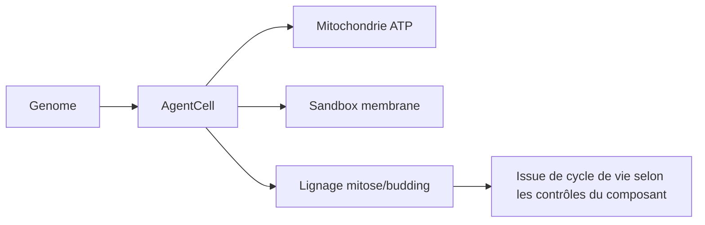

# Biologie computationnelle dans GenOS

- **Statut** : Implémenté (partiel) — cellule, embryogenèse HOX, budgets métaboliques et lignage sont câblés ; la fiche précédente (JSON brut de 22 lignes) a été remplacée le 2026-09-24 car non conforme au canevas.
- **Portée** : `crates/genos-cell/src/lib.rs` (`AgentCell`, `Organelle`), `crates/genos-biology/src/embryology.rs` (`seed_hox_genome`), `crates/genos-genome/*`, `crates/genos-reproduction/*`, `backend/src/services/missionOrganismService.js`.
- **Dernière revue** : 2026-09-25.

## 1. Définition du domaine

La biologie computationnelle GenOS modélise un agent comme une cellule : génome (instructions), organites (budgets ATP, lysosome, mitochondrie), membrane/sandbox (confinement) et lignée (filiation mitose/bourgeonnement/méiose). Le vocabulaire biologique sert à organiser des invariants de runtime, pas à simuler du vivant.

## 2. Modèle logique

Les symboles ci-dessous sont un **résumé conceptuel**, pas une équation de
viabilité utilisée uniformément par le runtime. Les seuils, champs disponibles
et décisions effectives dépendent du service concerné; une propriété ne doit
être dite garantie que si son invariant est imposé dans le code et couvert par
un test correspondant.

À titre de modèle abstrait, on peut représenter une condition de poursuite par
`budget disponible ∧ confinement valide ∧ gates satisfaites`. Ce prédicat ne
constitue pas une définition biologique de la viabilité et n'implique pas que
tous les composants GenOS vérifient ces trois conditions.

## 3. Analogies biologiques et limites réelles

- cellule / organite = agent + budgets ; dystrophine = ancrage sandbox ; mitose = fork versionné.
- Limite : pas de biophysique réelle. Les références à Hayflick, Nernst ou Kuramoto désignent au mieux des inspirations ou heuristiques; elles ne sont pas des mesures physiologiques ni des simulations validées.

## 4. Cas d'usage

Usages visés : différenciation logicielle de rôles (HOX), routage inspiré du
foraging (Biome), isolation d'une branche défaillante et gestion bornée de
lignées. Chaque comportement doit être confirmé dans le composant qui le porte;
les noms apoptose et Hayflick restent analogiques.

## 5. Exemple concret

`embryology::seed_hox_genome` attribue des gènes/rôles de départ selon ses règles de différenciation; ce n'est pas une simulation d'un gradient embryonnaire mesuré. `CellDivision::mitosis_attested` (`crates/genos-reproduction/src/division.rs`) applique les contrôles logiciels de division configurés; toute analogie avec une limite de Hayflick est métaphorique. `missionOrganismService.js` suit la continuité mission-organisme.

## 6. Schéma

## 7. Architecture technique

- Rust : `genos-cell` (`AgentCell`, `clinical.rs`), `genos-genome` (`gene.rs`, `genome.rs`, `translation.rs`), `genos-biology` (`embryology.rs`, `neurobiology/`, `therapy.rs`), `genos-reproduction` (`division.rs`, `crossover.rs`).
- Node : `missionOrganismService.js`, `regenerationService.js`, `agentConscienceService.js`, `homeostasisService.js`.

## 8. Processus d'exécution

Naissance (spawn + génome) → différenciation (HOX) → exécution sous budget → consolidation/pruning (`sleepCycle`) → apoptose ou fossilisation (`fossil.rs`).

## 9. Comparaison avec le marché

Cette fiche ne prétend pas établir une comparaison avec d'autres orchestrateurs ni l'absence de concurrents. Les termes de lignage, budget et gate décrivent des concepts dont le degré d'implémentation varie selon les composants; le statut ci-dessus et les tests associés délimitent les affirmations vérifiables.

## 10. Limites, garde-fous, non-objectifs

- Partiel : persistance inter-process incomplète, dormance non persistée (voir `continuite-mission.md`).
- Non-objectif : simulation biologique prédictive, conscience phénoménale.
- Règle : un transport réussi n'est pas une décision valide ; toute promotion exige preuves + gates.
