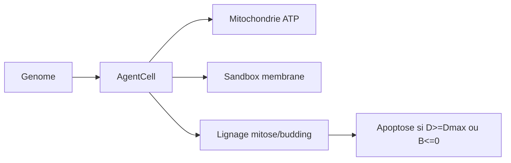

# Biologie computationnelle dans GenOS

- **Statut** : Implémenté (partiel) — cellule, embryogenèse HOX, budgets métaboliques et lignage sont câblés ; la fiche précédente (JSON brut de 22 lignes) a été remplacée le 2026-09-24 car non conforme au canevas.
- **Portée** : `crates/genos-cell/src/lib.rs` (`AgentCell`, `Organelle`), `crates/genos-biology/src/embryology.rs` (`seed_hox_genome`), `crates/genos-genome/*`, `crates/genos-reproduction/*`, `backend/src/services/missionOrganismService.js`.
- **Dernière revue** : 2026-09-24.

## 1. Définition du domaine

La biologie computationnelle GenOS modélise un agent comme une cellule : génome (instructions), organites (budgets ATP, lysosome, mitochondrie), membrane/sandbox (confinement) et lignée (filiation mitose/bourgeonnement/méiose). Le vocabulaire biologique sert à organiser des invariants de runtime, pas à simuler du vivant.

## 2. Modèle logique

$$
Viable(cell) \iff Budget_{ATP} > 0 \land Membrane_{sandbox} \, intacte \land Dissonance < D_{max}
$$

$$
T_{residuel} = \max(0, Hayflick - bud\_scars)
$$

## 3. Analogies biologiques et limites réelles

- cellule / organite = agent + budgets ; dystrophine = ancrage sandbox ; mitose = fork versionné.
- Limite : pas de biophysique réelle ; les équations (Nernst, Kuramoto) sont des heuristiques de coordination, pas des mesures.

## 4. Cas d'usage

Différenciation de rôles (HOX), foraging/routage (Biome), quarantaine et apoptose de branches incohérentes, régénération bornée (Hayflick).

## 5. Exemple concret

`embryology::seed_hox_genome` différencie UI / Backend / Base à partir d'un gradient axial ; `CellDivision::mitosis_attested` (`crates/genos-reproduction/src/division.rs`) fork une lignée avec limite de Hayflick ; `missionOrganismService.js` suit la continuité mission-organisme.

## 6. Schéma

## 7. Architecture technique

- Rust : `genos-cell` (`AgentCell`, `clinical.rs`), `genos-genome` (`gene.rs`, `genome.rs`, `translation.rs`), `genos-biology` (`embryology.rs`, `neurobiology/`, `therapy.rs`), `genos-reproduction` (`division.rs`, `crossover.rs`).
- Node : `missionOrganismService.js`, `regenerationService.js`, `agentConscienceService.js`, `homeostasisService.js`.

## 8. Processus d'exécution

Naissance (spawn + génome) → différenciation (HOX) → exécution sous budget → consolidation/pruning (`sleepCycle`) → apoptose ou fossilisation (`fossil.rs`).

## 9. Comparaison avec le marché

LangGraph/CrewAI orchestrent des tâches ; GenOS ajoute lignée versionnée, budgets métaboliques et gates de preuve avant promotion. Pas de concurrent direct sur la nosologie computationnelle (voir `01-concepts/nosologie/`).

## 10. Limites, garde-fous, non-objectifs

- Partiel : persistance inter-process incomplète, dormance non persistée (voir `continuite-mission.md`).
- Non-objectif : simulation biologique prédictive, conscience phénoménale.
- Règle : un transport réussi n'est pas une décision valide ; toute promotion exige preuves + gates.
