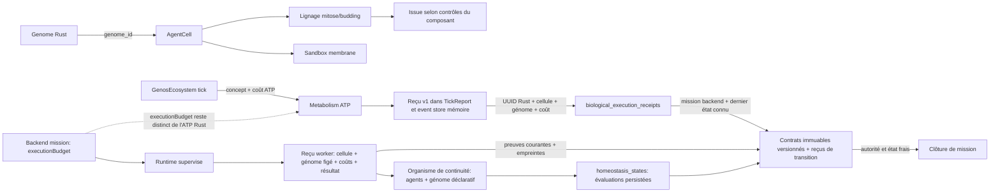

# Biologie computationnelle dans GenOS

- **Statut** : Chaîne logicielle intégrée : reçus versionnés mission → cellule → génome → coûts → résultat, autorité d'homéostasie durable et clôture conditionnée à des preuves fraîches. Les identités du contrôle Rust et des workers Node restent explicites. Les commandes et limites de validation figurent dans le [bilan de validation](../06-qualite-preuves/validation-biologie-computationnelle.md).
- **Portée** : `crates/genos-cell/src/lib.rs` (`AgentCell`, `Organelle`), `crates/genos-biology/src/embryology.rs` (`seed_hox_genome`), `crates/genos-genome/*`, `crates/genos-reproduction/*`, `backend/src/services/missionOrganismService.js`.
- **Dernière revue** : 2026-10-06.

## 1. Définition du domaine

La biologie computationnelle GenOS modélise un agent comme une cellule : génome (instructions), organites (budgets ATP, lysosome, mitochondrie), membrane/sandbox (confinement) et lignée (filiation mitose/bourgeonnement/méiose). Le vocabulaire biologique sert à organiser des invariants de runtime, pas à simuler du vivant.

## 2. Modèle logique

Les symboles ci-dessous sont un **résumé conceptuel**, pas une équation de
viabilité utilisée uniformément par le runtime. Les seuils, champs disponibles
et décisions effectives dépendent du service concerné; une propriété ne doit
être dite garantie que si son invariant est imposé dans le code et couvert par
un test correspondant.

À titre de modèle abstrait, on peut représenter une condition de poursuite par
`budget disponible ∧ confinement valide ∧ gates satisfaites`. Ce prédicat ne
constitue pas une définition biologique de la viabilité et n'implique pas que
tous les composants GenOS vérifient ces trois conditions.

## 3. Analogies biologiques et limites réelles

- cellule / organite = agent + budgets ; dystrophine = ancrage sandbox ; mitose = fork versionné.
- Limite : pas de biophysique réelle. Les références à Hayflick, Nernst ou Kuramoto désignent au mieux des inspirations ou heuristiques; elles ne sont pas des mesures physiologiques ni des simulations validées.

## 4. Cas d'usage

Usages visés : différenciation logicielle de rôles (HOX), routage inspiré du
foraging (Biome), isolation d'une branche défaillante et gestion bornée de
lignées. Chaque comportement doit être confirmé dans le composant qui le porte;
les noms apoptose et Hayflick restent analogiques.

## 5. Chemins de mission et preuves disponibles

Le backend démarre une mission par `agentRuntimeAdapter/missionExecution.js` : le bootstrap normalise `executionBudget`, vérifie sa cohérence et transmet le budget au superviseur/runtime. Les traces ordinaires ne constituent pas à elles seules un reçu biologique. Le chemin `topologyHandlers.handleBiological` appelle toutefois `biologicalExecutionReceiptService.runMissionTick` avant le dispatch : une table persistante mappe la mission backend à une UUID Rust stable, puis l'ingestion lie chaque reçu d'exécution à la mission backend et à l'ATP rapporté.

`missionContinuityService.js` reconstruit un organisme à partir des agents persistés : les agents deviennent des cellules/tissus, l'objectif et le contrat deviennent le génome déclaratif de l'organisme, puis `homeostasisService.js` évalue ses invariants. `mission_organism_state` conserve cet état agrégé; ce génome déclaratif n'est pas le `Genome` Rust et les deux registres ne sont pas synchronisés.

Le chemin réel `strategyExecutionService` fige, avant démarrage, une liaison `genos.worker-biological-binding/v1` entre mission, worker, parent, cellule stable et génome d'instructions. Le contrat de stratégie est vérifié avant cette liaison. Chaque exécution terminée produit un reçu immuable `genos.worker-biological-execution-receipt/v1` : identité, empreinte des instructions, observations, coûts, rapprochement comptable, budget et résultat contrôlé par les gates existantes. Les échecs conservent leurs coûts; une mesure absente reste inconnue. Les événements sont conservés avant application puis appliqués transactionnellement : le rejeu ne débite pas deux fois et un événement inédit rattaché à un run déjà scellé empêche la clôture.

Dans `GenosEcosystem::tick` (`crates/genos-orchestrator/src/tick.rs`), chaque concept planifié est débité de `Metabolism` avant son application; l'ATP insuffisant bloque l'étape et trace `STARVATION`. Le tick place un reçu `genos.biological-execution-receipt/v1` dans `TickReport.biological_receipts` et dans l'event store local. La continuité CLI restaure l'orchestrateur racine et son génome; le reçu porte donc l'UUID de mission Rust, `cell_id`, `genome_id`, empreinte, tick, opération, coût en `atp_token`, registre et issue. `tick_and_persist` écrit le reçu et l'état de population dans `BiologicalReceiptStore`, journal append-only vérifié à la relecture. Le coût représente la dépense du concept Rust; il ne représente pas les dépenses du worker backend.

Deux modes de raccordement existent. Le bridge backend appelle le CLI et persiste le résultat localement après vérification de la mission active et de la portée tenant; `npm run test:biological-receipts` (depuis `backend/`) lance le binaire Rust compilé deux fois contre une base SQLite et vérifie identité stable, ticks croissants, cellule/génome et coût positif. L'uploader Rust optionnel, feature Cargo `api`, expédie également le journal vers `POST /api/rust/biological-receipts`; il exige `GENOS_BACKEND_URL`, `GENOS_RUST_RECEIPT_TOKEN`, `GENOS_RUST_RECEIPT_ORG_ID`, `GENOS_RUST_RECEIPT_PROJECT_ID` et `GENOS_RUST_RECEIPT_SECRET`. Cette route vérifie HMAC-SHA256, fraîcheur, nonce à usage unique et appartenance tenant; l'ingestion est idempotente par `receipt_id`. L'uploader peut retransmettre le journal entier et s'appuie donc sur cette idempotence. L'E2E du bridge couvre le tick backend direct, pas le transport HTTP signé en environnement déployé.

`BiomimeticOrchestrator::cleave_and_differentiate` appelle `differentiate_swarm`, qui utilise maintenant `Embryogenesis::compute_program` (`crates/genos-genome/src/development.rs`) pour résoudre la lignée de chaque cellule à partir du gène HOX source, de son expression et de la méthylation épigénétique. L'énergie passée au programme est la fraction `current_budget / baseline_budget`, bornée à `[0,1]`; le temps est exprimé en pas et son facteur atteint son plafond à dix pas. Le placement initial des rôles reste déterministe à partir de la position dans l'essaim et du paramètre `topology_gradient`. Ce chemin n'effectue ni diffusion de morphogènes ni interaction spatiale entre cellules; un locus source absent ou silencé laisse la cellule `UNCOMMITTED`. Ce développement est réellement appelé par ce chemin de l'orchestrateur Rust, mais n'est pas un passage automatique de chaque mission du backend.

`CellDivision::mitosis_attested` (`crates/genos-reproduction/src/division.rs`) applique les contrôles logiciels de division configurés; l'analogie avec une limite de Hayflick reste métaphorique.

## 6. Schéma

```mermaid
flowchart LR
    G[Genome Rust] -->|genome_id| C[AgentCell]
    T[GenosEcosystem tick] -->|concept + coût ATP| M[Metabolism ATP]
    C --> S[Sandbox membrane]
    C --> L[Lignage mitose/budding]
    M --> R[Reçu v1 dans TickReport et event store mémoire]
    L --> LT[Issue selon contrôles du composant]
    B[Backend mission: executionBudget] --> X[Runtime supervise]
    X --> WR[Reçu worker: cellule + génome figé + coûts + résultat]
    WR --> O[Organisme de continuité: agents + génome déclaratif]
    O --> H[homeostasis_states: évaluations persistées]
    H --> HC[Contrats immuables versionnés + reçus de transition]
    R -->|UUID Rust + cellule + génome + coût| DB[biological_execution_receipts]
    DB -->|mission backend + dernier état connu| HC
    WR -->|preuves courantes + empreintes| HC
    HC -->|autorité et état frais| DONE[Clôture de mission]
    B -. executionBudget reste distinct de l'ATP Rust .-> M
```

## 7. Architecture technique

- Rust : `genos-cell` (`AgentCell`, `clinical.rs`), `genos-genome` (`gene.rs`, `genome.rs`, `translation.rs`), `genos-biology` (`embryology.rs`, `neurobiology/`, `therapy.rs`), `genos-reproduction` (`division.rs`, `crossover.rs`).
- Node : `biologicalWorkerStore.js`, `biologicalWorkerReceiptService.js`, `biologicalWorkerEvidence.js`, `homeostasisAuthorityStore.js`, `homeostasisExecutionEvidence.js`, `homeostasisClosureService.js`, `missionOrganismService.js`.

## 8. Registres, budgets et homéostasie

Les budgets de mission backend, le registre métabolique Node (`metabolicStateService.js`), les réservations (`resourceReservationService.js`), le résumé métabolique de `missionOrganismService.js` et l'ATP de `GenosEcosystem` sont des états distincts. Le budget du runtime est normalisé et appliqué par ses gardes; le débit ATP Rust s'applique au tick. Il n'existe pas de registre commun garantissant qu'une allocation ou dépense dans un de ces plans est reflétée dans les autres.

L'homéostasie conserve ses évaluations dans `homeostasis_states`, ses révisions immuables dans `homeostasis_contract_revisions` et son autorité active dans `homeostasis_contract_heads`. Après redémarrage, le contrat persisté fait autorité. Une modification explicite exige `expectedHomeostasisRevision`; les vérificateurs persistables sont déclaratifs. La politique centralisée `genos.homeostasis-policy/v2` borne les couvertures fonctionnelle, structurelle, épistémique et de sécurité; la sécurité exige une couverture complète. Les contrats historiques v1 restent relus selon leurs règles.

Chaque appel à `transitionMissionToComplete` persiste un reçu `genos.homeostasis-transition-receipt/v2`, favorable ou refusé. Il lie états de départ et d'arrivée, identifiant d'évaluation, révision, empreinte du contrat, seuils et empreintes des reçus d'exécution courants. La preuve de worker est dérivée du stockage; une simple assertion de l'appelant ne peut pas la remplacer. `missionIdentityService.setStatus` et une garde SQLite exigent ce reçu avant clôture. Un nouveau run ou une preuve non appliquée invalide la clôture précédente. Les workers remplacés sont exclus uniquement après vérification durable de leur remplacement.

`GET /api/rust/biological-receipts/:missionId` expose un historique borné des reçus, liaisons et révisions avec vérification des empreintes et contrôle du tenant. La lecture ne rejoue pas les workers. L'ingestion du contrôle Rust et de sa population est atomique; le remapping conserve l'identité Rust d'origine.

Les coûts Node distinguent tokens, USD et millisecondes. Les USD sont des mesures rapportées par le fournisseur, pas une facture certifiée. Aucun taux de conversion ATP/tokens/USD n'est inventé. Une mesure requise absente ou un rapprochement incohérent refuse l'attestation budgétaire. Les choix d'architecture sont consignés dans l'[ADR 0324](../adr/0324-biologie-execution-et-autorite-durable.md).

Le chemin embryogenèse HOX → `AgentCell` → `Metabolism` → consolidation/apoptose ou fossilisation décrit des composants de l'orchestrateur Rust. Il ne doit pas être présenté comme une séquence universellement exécutée par chaque mission backend.

## 9. Comparaison avec le marché

Cette fiche ne prétend pas établir une comparaison avec d'autres orchestrateurs ni l'absence de concurrents. Les termes de lignage, budget et gate décrivent des concepts dont le degré d'implémentation varie selon les composants; le statut ci-dessus et les tests associés délimitent les affirmations vérifiables.

## 10. Limites, garde-fous, non-objectifs

- La reprise des reçus et de l'autorité est couverte par des tests SQLite sur plusieurs processus; cela ne démontre pas un déploiement distribué ni la disponibilité d'un fournisseur externe.
- La continuité de mission possède ses propres contrôles et limites (voir `continuite-mission.md`).
- Non-objectif : simulation biologique prédictive, conscience phénoménale.
- Règle : un transport réussi n'est pas une décision valide ; toute promotion exige preuves + gates.
