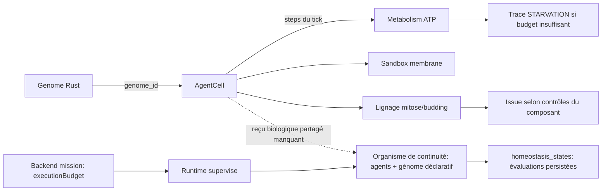

# Biologie computationnelle dans GenOS

- **Statut** : Partiel — les primitives cellulaires, génomiques et métaboliques existent; leur raccord complet aux exécutions réelles de mission avec reçus communs n'est pas établi.
- **Portée** : `crates/genos-cell/src/lib.rs` (`AgentCell`, `Organelle`), `crates/genos-biology/src/embryology.rs` (`seed_hox_genome`), `crates/genos-genome/*`, `crates/genos-reproduction/*`, `backend/src/services/missionOrganismService.js`.
- **Dernière revue** : 2026-09-30.

## 1. Définition du domaine

La biologie computationnelle GenOS modélise un agent comme une cellule : génome (instructions), organites (budgets ATP, lysosome, mitochondrie), membrane/sandbox (confinement) et lignée (filiation mitose/bourgeonnement/méiose). Le vocabulaire biologique sert à organiser des invariants de runtime, pas à simuler du vivant.

## 2. Modèle logique

Les symboles ci-dessous sont un **résumé conceptuel**, pas une équation de
viabilité utilisée uniformément par le runtime. Les seuils, champs disponibles
et décisions effectives dépendent du service concerné; une propriété ne doit
être dite garantie que si son invariant est imposé dans le code et couvert par
un test correspondant.

À titre de modèle abstrait, on peut représenter une condition de poursuite par
`budget disponible ∧ confinement valide ∧ gates satisfaites`. Ce prédicat ne
constitue pas une définition biologique de la viabilité et n'implique pas que
tous les composants GenOS vérifient ces trois conditions.

## 3. Analogies biologiques et limites réelles

- cellule / organite = agent + budgets ; dystrophine = ancrage sandbox ; mitose = fork versionné.
- Limite : pas de biophysique réelle. Les références à Hayflick, Nernst ou Kuramoto désignent au mieux des inspirations ou heuristiques; elles ne sont pas des mesures physiologiques ni des simulations validées.

## 4. Cas d'usage

Usages visés : différenciation logicielle de rôles (HOX), routage inspiré du
foraging (Biome), isolation d'une branche défaillante et gestion bornée de
lignées. Chaque comportement doit être confirmé dans le composant qui le porte;
les noms apoptose et Hayflick restent analogiques.

## 5. Chemins de mission et preuves disponibles

Le backend démarre une mission par `agentRuntimeAdapter/missionExecution.js` : le bootstrap normalise `executionBudget`, vérifie sa cohérence et transmet le budget au superviseur/runtime. Les événements du runtime et de l'orchestration sont des traces d'exécution; ils ne constituent pas à eux seuls un reçu biologique liant une cellule, un génome et une dépense.

`missionContinuityService.js` reconstruit un organisme à partir des agents persistés : les agents deviennent des cellules/tissus, l'objectif et le contrat deviennent le génome déclaratif de l'organisme, puis `homeostasisService.js` évalue ses invariants. `mission_organism_state` conserve cet état agrégé; ce génome déclaratif n'est pas le `Genome` Rust et les deux registres ne sont pas synchronisés.

Dans `GenosEcosystem::tick` (`crates/genos-orchestrator/src/tick.rs`), chaque concept planifié est débité de `Metabolism` avant son application; l'ATP insuffisant bloque l'étape et trace `STARVATION`. Les cellules portent un `genome_id` et l'orchestrateur garde les génomes associés. Ce chemin Rust démontre un débit de budget au point d'exécution, mais n'émet pas encore de reçu versionné réunissant identifiant de mission, cellule, empreinte du génome, coût débité et preuve de résultat.

`embryology::seed_hox_genome` assigne gènes et rôles selon ses règles de différenciation; ce n'est pas une simulation d'un gradient embryonnaire mesuré. `CellDivision::mitosis_attested` (`crates/genos-reproduction/src/division.rs`) applique les contrôles logiciels de division configurés; l'analogie avec une limite de Hayflick reste métaphorique.

## 6. Schéma

```mermaid
flowchart LR
    G[Genome Rust] -->|genome_id| C[AgentCell]
    C -->|steps du tick| M[Metabolism ATP]
    C --> S[Sandbox membrane]
    C --> L[Lignage mitose/budding]
    M --> R[Trace STARVATION si budget insuffisant]
    L --> A[Issue selon contrôles du composant]
    B[Backend mission: executionBudget] --> X[Runtime supervise]
    X --> O[Organisme de continuité: agents + génome déclaratif]
    O --> H[homeostasis_states: évaluations persistées]
    C -. reçu biologique partagé manquant .-> O
```

## 7. Architecture technique

- Rust : `genos-cell` (`AgentCell`, `clinical.rs`), `genos-genome` (`gene.rs`, `genome.rs`, `translation.rs`), `genos-biology` (`embryology.rs`, `neurobiology/`, `therapy.rs`), `genos-reproduction` (`division.rs`, `crossover.rs`).
- Node : `missionOrganismService.js`, `regenerationService.js`, `agentConscienceService.js`, `homeostasisService.js`.

## 8. Registres, budgets et homéostasie

Les budgets de mission backend, le registre métabolique Node (`metabolicStateService.js`), les réservations (`resourceReservationService.js`), le résumé métabolique de `missionOrganismService.js` et l'ATP de `GenosEcosystem` sont des états distincts. Le budget du runtime est normalisé et appliqué par ses gardes; le débit ATP Rust s'applique au tick. Il n'existe pas de registre commun garantissant qu'une allocation ou dépense dans un de ces plans est reflétée dans les autres.

L'homéostasie de mission construit un contrat depuis `completionContract`, accepte `minimumFunctionalCoverage` configurable et écrit chaque évaluation dans `homeostasis_states`; les événements de télémétrie signalent les changements de statut. La migration est idempotente et conserve cet historique. Le contrat versionné lui-même n'est pas durable comme autorité partagée, les autres seuils ne forment pas encore une politique centrale, et aucun reçu de transition ne relie actuellement la décision aux dépenses cellule/génome/métabolisme.

Le chemin embryogenèse HOX → `AgentCell` → `Metabolism` → consolidation/apoptose ou fossilisation décrit des composants de l'orchestrateur Rust. Il ne doit pas être présenté comme une séquence universellement exécutée par chaque mission backend.

## 9. Comparaison avec le marché

Cette fiche ne prétend pas établir une comparaison avec d'autres orchestrateurs ni l'absence de concurrents. Les termes de lignage, budget et gate décrivent des concepts dont le degré d'implémentation varie selon les composants; le statut ci-dessus et les tests associés délimitent les affirmations vérifiables.

## 10. Limites, garde-fous, non-objectifs

- Partiel : persistance inter-process incomplète, dormance non persistée (voir `continuite-mission.md`).
- Non-objectif : simulation biologique prédictive, conscience phénoménale.
- Règle : un transport réussi n'est pas une décision valide ; toute promotion exige preuves + gates.
