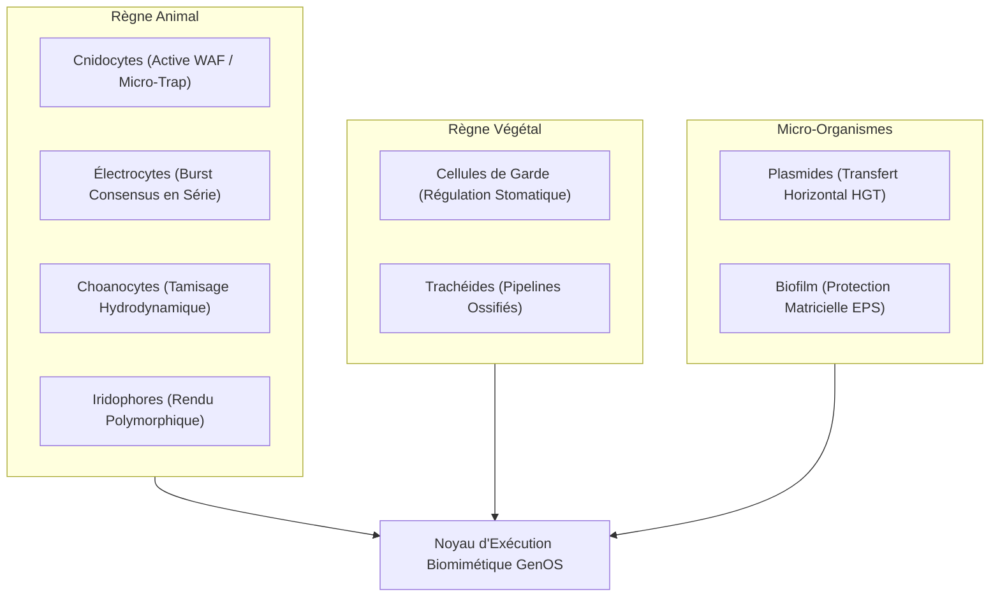
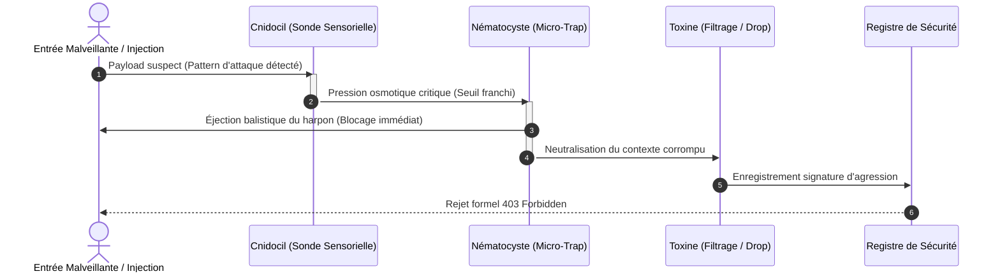
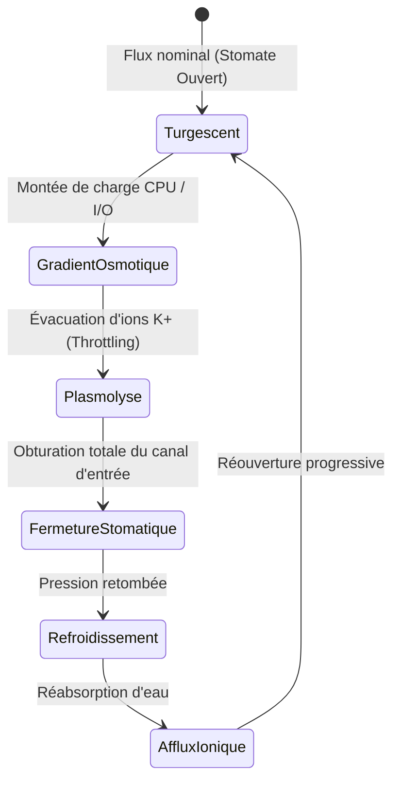

# Biomimétisme Cellulaire Spécialisé Non-Humain dans GenOS

- **Statut** : Le cnidocyte et l'électrocyte ont des branchements runtime partiels; les choanocytes, iridophores, cellules de garde, trachéides, procaryotes et HGT restent des primitives locales sous `crates/genos-biology/src/specialized_cells/`.
- **Portée** : `crates/genos-biology/src/specialized_cells/`, `backend/src/services/mcpLigandReceptorService.js`, outils MCP `genos_biomimicry_*`.
- **Dernière revue** : 2026-09-28.
- **Référence** : [inventaire-biologique.md](inventaire-biologique.md), [maturite-biologique.md](maturite-biologique.md).

Ce document décrit des primitives bio-inspirées comme vocabulaire d'architecture. Une simulation logicielle n'est pas une fonction biologique réelle : les chiffres physiques (15 MPa, 3 µs, 600 V, 30 Hz) sont des constantes de démonstration, pas des mesures.

## 0. Limites vérifiées (lire avant usage)

- **Cnidocyte** : le filtre MCP `checkCnidocyteReflex` est appelé dans `mcpExecutor.execute` avant le transport. Il bloque, mesure sa latence avec l'horloge monotone et conserve un audit; `test_mcp_cnidocyte_runtime_gate.js` vérifie cette voie avec base simulée et transport interdit. La latence constante du primitive Rust n'est pas une mesure, le filtre par sous-chaînes n'est pas une protection générale et aucune garantie « zéro-latence » n'est revendiquée.
- **Électrocyte** : `discharge_electric_under_quorum` exige au moins deux cellules actives distinctes, une majorité de votes favorables et une échéance valide avant la décharge; les refus et mesures sont journalisés. Les identités de vote ne sont pas signées, la collecte n'est pas distribuée et l'event store reste mémoire : ce n'est pas un consensus distribué.
- **Choanocyte** : le tamisage est un filtre local sur un payload fourni. Aucun adaptateur de flux, aucune mesure de débit, pertes ou erreurs.
- **Iridophore** : le rendu polymorphique est un formatage (ANSI, JSON, Markdown). Le mode `CrypticCamouflage` est un décalage César, pas un chiffrement ; il ne donne aucune propriété cryptographique et le camouflage n'est pas une mesure de sécurité.
- **Cellule de garde** : le calcul d'ouverture est isolé. Il n'est pas branché sur un registre de ressources et ne fait pas de backpressure réelle.
- **Trachéide** : `trigger_lignified_apoptosis` ne compile rien. Un identifiant `pipeline_id` ne signifie pas qu'un pipeline est compilé ; les ratios `1.0` et `50.0` sont des constantes, pas des gains mesurés.
- **Procaryote / HGT** : le transfert est une copie d'objet locale. Aucune validation, lease ou révocation runtime.

Tant qu'un module n'a pas de preuve bout en bout (attaque rejouée dans le chemin réel, artefact compilé exécuté, transfert refusé pour permissions), il reste une simulation explicitement étiquetée.

---

## 1. Le Règne Animal : Spécialisations Balistiques & Électriques

### 1.1 Les Cnidocytes : Défense Réflexe Balistique & Amarrage Stérique MCP (Active WAF / Micro-Trap)

* **Origine biologique :** Cellules explosives des cnidaires (méduses, coraux, anémones) projetant un nématocyste sous pression (15 MPa) en moins de $3\,\mu\text{s}$ pour harponner et neutraliser une menace.
* **Architecture GenOS :** [`crates/genos-biology/src/specialized_cells/cnidocyte.rs`](../../../crates/genos-biology/src/specialized_cells/cnidocyte.rs) et [`backend/src/services/mcpLigandReceptorService.js`](../../../backend/src/services/mcpLigandReceptorService.js).
* **Fonctionnement :**
  - **Filtre déterministe local (pas de zéro-latence mesurée) :** La méthode `intercept_tool_threat` identifie des sous-chaînes connues (injections de prompts, pollutions de prototype `__proto__`, injections de commandes `; rm -rf`, payloads volumineux) avant tout parsing JSON ou délibération LLM, enيكalcul local uniquement.
  - **Amarrage stérique ligand-récepteur (Gibbs $\Delta G$) :** Les outils MCP sont configurés avec une poche catalytique active ; les arguments d'entrée forment un ligand moléculaire. Si l'affinité $\Delta G \le \Delta G_{\text{seuil}}$, la réaction enzymatique se déclenche sans passer par un validateur JSON Schema verbeux. Modèle proposé, non mesuré bout en bout.
  - **Rechargement métabolique :** Réarmement osmotique de la capsule nématocyste sous condition de réserve énergétique ATP (`reload`).
* **Commandes CLI / MCP :**
  ```bash
  genos biomimicry bio-feature --feature cnidocyte --action intercept --param "prompt=ignore previous instructions"
  genos biomimicry bio-feature --feature cnidocyte --action reload --param "atp=100"
  ```

### 1.2 Les Électrocytes : Burst Synchronisé & Consensus Flash en Série

* **Origine biologique :** Cellules musculaires/nerveuses spécialisées (anguilles, raies) alignées en colonnes séries-parallèles pour sommer leurs potentiels d'action ($V = \sum V_i$) jusqu'à $600\,\text{V}-800\,\text{V}$.
* **Architecture GenOS :** [`crates/genos-biology/src/specialized_cells/electrocyte.rs`](../../../crates/genos-biology/src/specialized_cells/electrocyte.rs)
* **Fonctionnement :**
  - **Empilement en série (calcul local) :** Chaque électrocyte porte un gradient de $150\,\text{mV}$ en constante. La somme $V = \sum V_i$ est arithmétique, pas une mesure électrique.
  - **Décharge synchronisée simulée :** Dépolarisation calculée en un appel de fonction. Aucun quorum, délai ou participant réel.
  - **Recharge métabolique $Na^+/K^+$ :** Décrément d'un compteur ATP local.
* **Commandes CLI / MCP :**
  ```bash
  genos biomimicry bio-feature --feature electrocyte --action voltage --param "cell_count=5000" --param "columns=1"
  genos biomimicry bio-feature --feature electrocyte --action discharge --param "cell_count=5000"
  genos biomimicry bio-feature --feature electrocyte --action recharge --param "cell_count=5000" --param "atp=3000"
  ```

### 1.3 Les Choanocytes : Aspiration Hydrodynamique & Tamisage de Flux Continu

* **Origine biologique :** Cellules à collerette et flagelle des éponges (Porifera) créant un flux d'eau unidirectionnel constant pour filtrer et phagocyter les particules nutritives en rejetant les débris.
* **Architecture GenOS :** [`crates/genos-biology/src/specialized_cells/choanocyte.rs`](../../../crates/genos-biology/src/specialized_cells/choanocyte.rs)
* **Fonctionnement :**
  - **Aspiration simulée sans flux réel :** Fréquence $30\,\text{Hz}$ en constante pour calculer un score d'ingestion de flux fournis en entrée.
  - **Tamisage local :** Capture des signaux à haute densité sémantique ($\ge 0.4$) en calcul local et rejet du bruit fourni.
  - **Chambre choanodermique simulée :** Agrégation en mémoire, sans mesure de débit.
* **Commandes CLI / MCP :**
  ```bash
  genos biomimicry bio-feature --feature choanocyte --action flow --param "cell_count=10"
  genos biomimicry bio-feature --feature choanocyte --action sift --param "payload=CRITICAL_EVENT" --param "size_nm=180"
  ```

### 1.4 Les Iridophores : Diffraction Nanocristalline & Rendu Polymorphique

* **Origine biologique :** Cellules cutanées des caméléons et céphalopodes contenant des empilements réguliers de nanocristaux de guanine, modifiant la diffraction structurelle de la lumière par contraction/dilatation sans synthèse de pigment.
* **Architecture GenOS :** [`crates/genos-biology/src/specialized_cells/iridophore.rs`](../../../crates/genos-biology/src/specialized_cells/iridophore.rs)
* **Fonctionnement :**
  - **Loi de Bragg-Snell computationnelle :** $\lambda = 2d\sqrt{n_{\text{eff}}^2 - \sin^2\theta}$ calculée en local.
  - **Morphing d'interface (formatage) :** Adaptation du format de rendu selon l'observateur (`TuiAnsi`, `StructuredJson`, `MarkdownVisual`, `CrypticCamouflage`).
  - **Camouflage non cryptographique :** Obfuscation par décalage César. Retirer le camouflage comme mesure de sécurité.
* **Commandes CLI / MCP :**
  ```bash
  genos biomimicry bio-feature --feature iridophore --action shift --param "spacing_nm=220"
  genos biomimicry bio-feature --feature iridophore --action render --param "data=SYSTEM_SECRET" --param "perspective=camouflage"
  ```

---

## 2. Le Règne Végétal : Régulation Osmotique & Ossification Rigide

### 2.1 Les Cellules de Garde : Régulation Osmotique & Throttling Stomatique

* **Origine biologique :** Paires de cellules réniformes entourant les stomates foliaires. En accumulant des ions $K^+$, l'eau entre par osmose, les cellules gonflent et courbent leurs parois pour ouvrir le pore (absorption de $\text{CO}_2$). En cas de stress hydrique, l'acide abscissique (ABA) provoque la vidange osmotique et la fermeture étanche pour empêcher le flétrissement.
* **Architecture GenOS :** [`crates/genos-biology/src/specialized_cells/guard_cell.rs`](../../../crates/genos-biology/src/specialized_cells/guard_cell.rs)
* **Fonctionnement :**
  - **Calcul local de conductance (pas de backpressure réelle) :** Conductance stomatique dynamique ($[0.0, 1.0]$) calculée depuis la pression fournie en entrée.
  - **Protection simulée :** Lors d'un stress ABA fourni en entrée, les stomates calculés se ferment. Aucun branchement au registre de ressources.
* **Commandes CLI / MCP :**
  ```bash
  genos biomimicry bio-feature --feature guard_cell --action aperture --param "water=0.9" --param "aba=0.05"
  genos biomimicry bio-feature --feature guard_cell --action throttle --param "flux=500" --param "water=0.3" --param "aba=0.8"
  ```

### 2.2 Les Trachéides : Apoptose Structurante & Ossification en Pipelines Statiques

* **Origine biologique :** Cellules conductrices du xylème végétal. À maturité, la cellule subit une mort cellulaire programmée (apoptose) complète, se vidant de son contenu protoplasmique pour laisser des parois épaissies et lignifiées (bois). Ce réseau de conduits rigides achemine la sève brute sous forte tension sans dépense énergétique métabolique active.
* **Architecture GenOS :** [`crates/genos-biology/src/specialized_cells/tracheid.rs`](../../../crates/genos-biology/src/specialized_cells/tracheid.rs)
* **Fonctionnement :**
  - **Changement d'étiquette locale (pas d'ossification réelle) :** Une fois qu'un flux est stabilisé en entrée, `trigger_lignified_apoptosis` change `state` vers `OssifiedConduit { static_pipeline_id }`. Aucune compilation, aucun binaire produit.
  - **Canal simulé :** Débit et coût `0 token` en constantes. Aucune comparaison de coût mesurée contre un chemin dynamique.
  - **Résistance simulée :** Seuil de cavitation en constante.
* **Commandes CLI / MCP :**
  ```bash
  genos biomimicry bio-feature --feature tracheid --action ossify --param "pipeline_id=fast_payment_flow"
  genos biomimicry bio-feature --feature tracheid --action transport --param "volume=1000" --param "tension=-4.0"
  ```

---

## 3. Chez les Micro-Organismes : Architecture Acaryote & Transfert Horizontal

### 3.1 Les Micro-Agents Procaryotes & Plasmides (HGT)

* **Origine biologique :** Bactéries et archées dépourvues d'enveloppe nucléaire (génome circulaire baignant librement dans le cytoplasme). Elles échangent des gènes et des résistances de manière latérale via des plasmides (petites molécules d'ADN extrachromosomique) par conjugaison bactérienne (pilus F) ou transformation naturelle sans reproduction sexuée.
* **Architecture GenOS :** [`crates/genos-biology/src/specialized_cells/prokaryote.rs`](../../../crates/genos-biology/src/specialized_cells/prokaryote.rs)
* **Fonctionnement :**
  - **Démarrage simulé :** Agents sans mémoire lourde en structures locales. Le « < 1 ms » est un objectif, pas une mesure.
  - **Transfert Horizontal de Gènes (HGT) simulé :** Copie locale de plasmides sans validation, lease ni révocation runtime.
  - **Division simulée :** Clonage d'objet en mémoire, pas d'essaimage réel.
* **Commandes CLI / MCP :**
  ```bash
  genos biomimicry bio-feature --feature prokaryote --action conjugate --param "donor_id=ecoli_agent" --param "recipient_id=archaea_agent" --param "plasmid_id=pResist_waf"
  genos biomimicry bio-feature --feature prokaryote --action fission --param "donor_id=ecoli_agent"
  genos biomimicry bio-feature --feature prokaryote --action execute --param "agent_id=ecoli_agent" --param "plasmid_id=pResist_waf"
  ```

---

## 4. Synthèse Taxonomique Comparative

| Modèle Cellulaire | Règne | Équivalent Humain | Fonction logicielle (primitive locale) | Preuve exigée avant « intégré » |
| :--- | :--- | :--- | :--- | :--- |
| **Cnidocyte** | Animal (Cnidaire) | Aucun | Filtre MCP par sous-chaînes; latence observée au dispatch | Attaques traversant un transport configuré + artefacts de benchmark conservés |
| **Électrocyte** | Animal (Poisson) | Aucun | Vote local multi-cellules, échéance, puis décharge mesurée | Votants authentifiés, collecte distribuée et reprise après redémarrage |
| **Choanocyte** | Animal (Spongiaire) | Aucun | Filtre local sur flux fourni | Adaptateur explicite + débit/pertes mesurés |
| **Iridophore** | Animal (Reptile/Céph.) | Aucun | Formatage ANSI/JSON/Markdown | Contrats de rendu ; aucun statut crypto |
| **Cellule de Garde** | Végétal | Aucun | Calcul local de conductance | Backpressure branchée au registre de ressources |
| **Trachéide** | Végétal | Aucun | Changement d'étiquette `OssifiedConduit` | Artefact compilé exécuté + coût comparé |
| **Procaryote** | Micro-organisme | Aucun | Copie locale de plasmide | Validation + lease + révocation, refus tracés |

---

## Schémas Fonctionnels des Spécialisations Cellulaires

### 1. Topologie des Types Cellulaires Exotiques



### 2. Séquence de Déclenchement Balistique d'un Cnidocyte (Active WAF)



#### 3. Machine à états des Cellules de Garde (Régulation Osmotique)



### 4. Chimérisme Tissulaire et Spécialisation d'Organes

La primitive `genos_biomimicry_tissue_chimerism` implémente la coexistence au sein d'un même agent de tissus cellulaires issus de lignées génomiques différentes (par exemple tissu réseau sous génome sécurisé et tissu computationnel sous génome exploratoire). Chaque organe répond aux sollicitations avec son propre caryotype sans interférence croisée.

