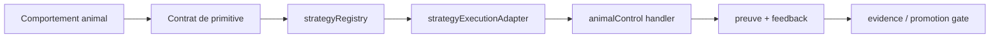

# Primitives de controle animal

- **Statut** : Implémenté pour le registre strategie + handlers backend
- **Portée** : conversion de comportements animaux en primitives de controle mesurables
- **Dernière revue** : 2026-09-16

Ce document fixe la regle de conception : une capacite animale n'entre dans GenOS que si elle devient une boucle operable, testable et bornee. Le nom biologique ne suffit pas. La primitive doit exposer un declencheur, un etat interne, une decision, une action, un feedback et une preuve.

```text
stimulus -> etat_interne -> decision -> action -> feedback -> preuve
```

## 1. Definition du domaine

Une primitive de controle animal transpose un comportement biologique en automate de decision. Elle sert a router l'attention, choisir une action reversible, distribuer un budget, proteger une promotion ou construire une carte partielle du probleme.

L'implementation actuelle est declarative et executable dans le backend :

- registre strategie : `backend/src/strategies/families/animalControlStrategies.js` ;
- handlers de primitives : `backend/src/services/primitiveHandlers/animalControl.js` ;
- dispatch runtime : `backend/src/services/primitiveHandlers/handlersRegistry.js` ;
- leases par capacite : `backend/src/services/toolLeasePolicy.js`.

## 2. Modele logique

Chaque handler retourne le meme contrat minimal :

```json
{
  "success": true,
  "primitive": "probe_system",
  "capability": "FOVEAL_PERCEPTION",
  "controlLoop": ["stimulus", "internal_state", "decision", "action", "feedback", "evidence"],
  "preconditions": ["target_accessible", "probe_is_non_destructive"],
  "action": "probe_system",
  "output": { "map": null, "confidence": 0.62, "nextProbe": null },
  "cost": "low_to_medium",
  "risk": "low",
  "evidence": ["response_trace:test"]
}
```

La sortie est volontairement structurée : elle peut etre journalisee par `strategyExecutionAdapter`, transmise par `genos_execute_primitive`, puis relue par les gates de preuve.

## 3. Analogies biologiques et limites reelles

Les comportements animaux fournissent des schemas de controle, pas des garanties magiques. L'echolocation devient un probe actif mesurable ; l'olfaction devient une recherche de gradient causal ; la stigmergie devient une trace partagee qui peut se renforcer ou s'evaporer.

Limite explicite : GenOS ne pretend pas simuler l'animal. Il implemente le contrat computationnel utile, avec cout, risque et preuve.

## 4. Cas d'usage

| Pression runtime | Primitive conseillee | Effet attendu |
| --- | --- | --- |
| Incertitude haute | `echolocation_probe`, `scent_trace` | reduire l'espace de recherche par probes ou gradients |
| Espace immense | `landmark_navigation`, `stigmergic_mark` | naviguer par reperes et traces confirmees |
| Danger eleve | `immune_challenge`, `feign_inert_state` | challenger, isoler ou borner avant promotion |
| Budget faible | `energy_foraging` | choisir l'action au meilleur rendement/cout |
| Coordination necessaire | `distributed_limb_probe`, `waggle_recruitment` | distribuer exploration et budget par signaux |

## 5. Catalogue implemente

| Strategie | Inspiration | Primitives |
| --- | --- | --- |
| `echolocation_probe` | echolocation | `probe_system`, `observe_response`, `infer_hidden_structure`, `adapt_next_action` |
| `scent_trace` | piste olfactive | `follow_trace_gradient`, `reinforce_causal_trail`, `falsify_false_trail` |
| `foveal_scan` | vision foveale | `peripheral_watch`, `focus_region`, `verify_focus` |
| `vibration_sense` | perception vibratoire | `detect_weak_signal`, `amplify_anomaly`, `confirm_signal` |
| `landmark_navigation` | navigation par reperes | `build_landmark_map`, `navigate_by_landmark`, `return_to_safe_point` |
| `homing_return` | retour au point sur | `safe_checkpoint`, `return_to_safe_point`, `validate_return` |
| `stigmergic_mark` | stigmergie | `deposit_trace`, `reinforce_trace`, `evaporate_trace` |
| `distributed_limb_probe` | controle distribue | `assign_local_probe`, `collect_limb_signal`, `arbitrate_limb_feedback` |
| `waggle_recruitment` | danse de recrutement | `publish_waggle_signal`, `validate_recruitment`, `allocate_quorum_budget` |
| `immune_challenge` | systeme immunitaire | `adversarial_challenge`, `permission_challenge`, `promotion_quarantine` |
| `feign_inert_state` | thanatose bornee | `reduce_attack_surface`, `observe_threat_persistence`, `restore_visibility` |
| `energy_foraging` | foraging energetique | `estimate_patch_yield`, `compare_metabolic_cost`, `select_next_patch` |

## 6. Schema



## 7. Architecture technique

Le chemin runtime suit le flux standard GenOS :

```text
animal behavior -> control primitive -> strategy primitive -> capability -> tool lease -> evidence contract -> test -> docs
```

Les strategies appartiennent a la famille `animal_control` et au role `control`. Le selecteur leur applique les traits existants (`information_gain`, `low_cost`, `safety`, `parallel`) et trois traits specialises : `probe_control`, `spatial_memory`, `metabolic_budget`.

Les leases ne donnent pas une permission nouvelle globale. Les capacites `STIGMERGY`, `QUORUM`, `IMMUNE_SYSTEM`, `FOVEAL_PERCEPTION` et `TOKEN_ECONOMY` peuvent ajouter `genos_execute_primitive` au lease orchestre, puis le dispatch reste soumis a la validation d'outil et au circuit breaker.

## 8. Processus de validation

Tests associes :

```bash
node backend/tests/test_animal_control_primitives.js
node backend/tests/test_animal_control_lease_policy.js
node backend/tests/test_strategy_contracts.js
```

Le premier test verifie que les 12 strategies sont `ready` et que les handlers exposent la boucle de controle. Le second verifie le lease par capacite. Le troisieme verrouille le contrat global du registre apres extension.

## 9. Comparaison avec une metaphore documentaire

Une metaphore documentaire nomme une capacite. Une primitive GenOS la rend executable : elle a des preconditions, un cout, un risque, une preuve et un mode d'echec detectable. Si elle n'ameliore pas au moins une mesure runtime, elle ne doit pas etre promue au-dela du concept.

## 10. Limites, garde-fous et non-objectifs

- `feign_inert_state` est limite a la securite interne et au sandbox ; il ne doit pas servir a tromper l'utilisateur.
- Les traces stigmergiques doivent pouvoir s'evaporer pour limiter les effets de foule et les faux positifs.
- Les probes doivent rester minimaux et reversibles.
- Une strategie animale ne remplace jamais une preuve : elle produit un candidat d'action qui doit encore franchir les gates GenOS.