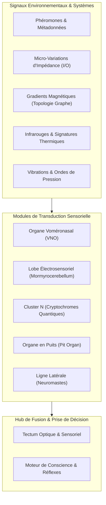
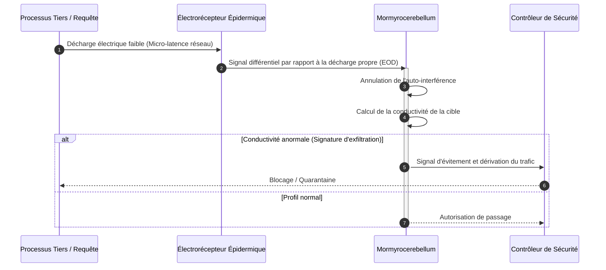

# Architecture des 5 Super-Sens Animaux dans GenOS

- **Statut** : Primitives locales testées — VNO, mormyrocerebellum, Cluster N, tectum thermique et écholocation sont des calculs locaux sous `crates/genos-biology/src/sensory/`, pas des sens intégrés au runtime.
- **Portée** : `crates/genos-biology/src/sensory/`, CLI `genos biomimicry`, outils MCP `genos_biomimicry_*`.
- **Dernière revue** : 2026-09-28.
- **Référence** : [inventaire-biologique.md](inventaire-biologique.md), [maturite-biologique.md](maturite-biologique.md).

Ce document décrit des primitives de transduction simulée comme vocabulaire d'architecture. Sans adaptateur concret, les entrées sont des signaux synthétiques fournis par l'appelant, pas des observations du système.

## 0. Limites vérifiées et non-objectifs

- Les 5 modules calculent à partir de vecteurs fournis (`concentration`, `samples`, `goal-vector`, `thermal-readings`, `echoes`). Ils ne captent ni processus, ni verrous, ni fichiers, ni CPU réels.
- Aucune boucle perception-action : `peripheralScan`, `saccadeToFeature`, `discharge_and_analyze` ne pilotent ni navigateur, ni capture d'écran, ni HTML réel.
- Le calcul de dérive angulaire $\theta$ n'est pas une prévention du drift sémantique ; c'est une distance cosinus locale.
- La détection « sub-millikelvin » compare des flottants fournis ; elle n'isole aucun module chaud sans parser du code.
- Tant qu'un adaptateur concret n'existe pas, typer les entrées comme **signaux synthétiques** et conserver leur provenance.

---

## 1. Bulbe Olfactif Accessoire & Organe Voméronasal (VNO)

Le **Bulbe Olfactif Accessoire (AOB)** et l'**Organe Voméronasal (VNO)** fournissent un canal de **signalisation phéromonale subliminale hors-contexte**.

### Rôle et Mécanisme Bio-inspiré (simulation locale)

- **Canal simulé hors-contexte :** Les agents fournissent `pheromone-type` et `concentration` en entrée. Le module compare à un seuil et renvoie une transition calculée, sans capter de signal réel.
- **Réponse simulée :** Lorsque la concentration fournie dépasse le seuil fourni, une transition calculée (`autonomic_action`) est renvoyée. Elle ne déclenche aucune action runtime sans chemin PAF autorisé.

### Primitives & Commandes

- **Module Rust :** [`crates/genos-biology/src/sensory/vomeronasal.rs`](../../../crates/genos-biology/src/sensory/vomeronasal.rs)
- **CLI :**
  ```bash
  genos biomimicry vomeronasal --agent-id agent-01 --locus workspace/src --pheromone-type alarm --concentration 0.95 --sensitivity 0.15
  ```
- **Outil MCP :** `genos_biomimicry_vomeronasal` ou `genos_biomimicry` avec `feature: "vomeronasal"`.

---

## 2. Mormyrocerebellum & Lobe Électrosensoriel (Électroréception)

Inspiré du poisson-éléphant (*Gnathonemus petersii*) et des requins, ce module implémente une **détection de champ et de distorsion d'impédance**.

### Rôle et Mécanisme Bio-inspiré (simulation locale)

- **Calcul local sur échantillons fournis :** Analyse les flottants transmis en entrée et calcule un score de distorsion. Ne localise aucun processus silencieux, verrou ou goulot réel.
- **Émission simulée (EOD) :** Aucune sonde réelle ; le $\Delta Z$ est dérivé des échantillons fournis.

### Primitives & Commandes

- **Module Rust :** [`crates/genos-biology/src/sensory/mormyrocerebellum.rs`](../../../crates/genos-biology/src/sensory/mormyrocerebellum.rs)
- **CLI :**
  ```bash
  genos biomimicry electrosensory --agent-id mormyro-01 --action discharge_and_analyze --frequency-hz 800 --sensitivity 0.05 --samples "100.0,102.0,98.0,280.0,101.0"
  ```
- **Outil MCP :** `genos_biomimicry_electrosensory` ou `genos_biomimicry` avec `feature: "electrosensory"`.

---

## 3. Cluster N (Magnétoréception Quantique)

Inspiré des oiseaux migrateurs nocturnes (rouge-gorge familier), le module **Cluster N** implémente une **boussole d'alignement d'intention globale invariante**.

### Rôle et Mécanisme Bio-inspiré (simulation locale)

- **Boussole calculée :** Traite l'orientation entre deux vecteurs fournis via paires de radicaux simulées.
- **Dérive calculée, pas prévention prouvée :** Calcule la dérive angulaire ($\theta = \arccos(\frac{\mathbf{u} \cdot \mathbf{v}}{\|\mathbf{u}\| \|\mathbf{v}\|})$) en local. Aucune preuve de prévention du drift sémantique des sous-agents.

### Primitives & Commandes

- **Module Rust :** [`crates/genos-biology/src/sensory/cluster_n.rs`](../../../crates/genos-biology/src/sensory/cluster_n.rs)
- **CLI :**
  ```bash
  genos biomimicry cluster-n --agent-id robin-01 --action align --sensitivity 0.02 --tolerance-deg 15.0 --goal-vector "1.0,0.0,0.0" --current-vector "0.96,0.15,0.0"
  ```
- **Outil MCP :** `genos_biomimicry_cluster_n` ou `genos_biomimicry` avec `feature: "cluster_n"`.

---

## 4. Tectum Optique Modifié & Organe à Fossette (Vision Thermique Infrarouge)

Inspiré des serpents solénoglyphes et crotalidés (crotales, vipères, pythons), le **Tectum Optique Modifié** fusionne la vision photonique classique et l'imagerie thermique millikelvin.

### Rôle et Mécanisme Bio-inspiré (simulation locale)

- **Fusion calculée de vecteurs fournis :** Superpose des listes `visual-nodes` et `thermal-readings` fournies par l'appelant. Aucune télémétrie CPU, mémoire ou AST réelle.
- **Hotspots calculés :** Compare des flottants fournis à un seuil. N'isole aucun module chaud sans parser du code.

### Primitives & Commandes

- **Module Rust :** [`crates/genos-biology/src/sensory/tectum_thermal.rs`](../../../crates/genos-biology/src/sensory/tectum_thermal.rs)
- **CLI :**
  ```bash
  genos biomimicry tectum-thermal --agent-id viper-01 --action fuse_modalities --sensitivity-mk 3.0 --fusion-weight 0.65 --threshold 0.70 --visual-nodes "src/auth.rs:0.8,src/db.rs:0.4" --thermal-readings "src/auth.rs:0.95,src/db.rs:0.2"
  ```
- **Outil MCP :** `genos_biomimicry_tectum_thermal` ou `genos_biomimicry` avec `feature: "tectum_thermal"`.

---

## 5. Cortex d'Écholocation Hypertrophié (Sondage Doppler 3D)

Inspiré des microchiroptères (chauves-souris) et des odontocètes (dauphins), le **Cortex d'Écholocation** implémente un **sondage actif haute fréquence par échos acoustiques et décalage Doppler**.

### Rôle et Mécanisme Bio-inspiré (simulation locale)

- **Cartographie calculée :** Applique $d = \frac{c \cdot \Delta t}{2}$ aux échos fournis (`branch/auth:10.0:...`). Aucune impulsion réelle, aucun temps de vol mesuré.
- **Doppler calculé :** Applique $v = \frac{\Delta f \cdot c}{2 f_0}$ aux valeurs fournies. N'identifie aucun deadlock, collision ou blocage I/O réel.

### Primitives & Commandes

- **Module Rust :** [`crates/genos-biology/src/sensory/echolocation.rs`](../../../crates/genos-biology/src/sensory/echolocation.rs)
- **CLI :**
  ```bash
  genos biomimicry echolocation --agent-id bat-01 --action probe_echoes --base-frequency-khz 60.0 --obstacle-threshold-m 2.5 --echoes "branch/auth:10.0:500.0:20.0,db/deadlock:40.0:-100.0:45.0"
  ```
- **Outil MCP :** `genos_biomimicry_echolocation` ou `genos_biomimicry` avec `feature: "echolocation"`.

---

## Schémas d'Architecture et d'Intégration des Super-Sens

### 1. Architecture du Pipeline Sensoriel Multi-Modal



### 2. Séquence de Transduction et Détection Électrosensorielle (Mormyrocerebellum)


