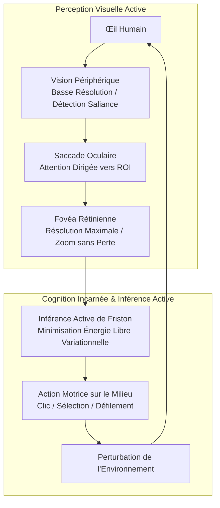
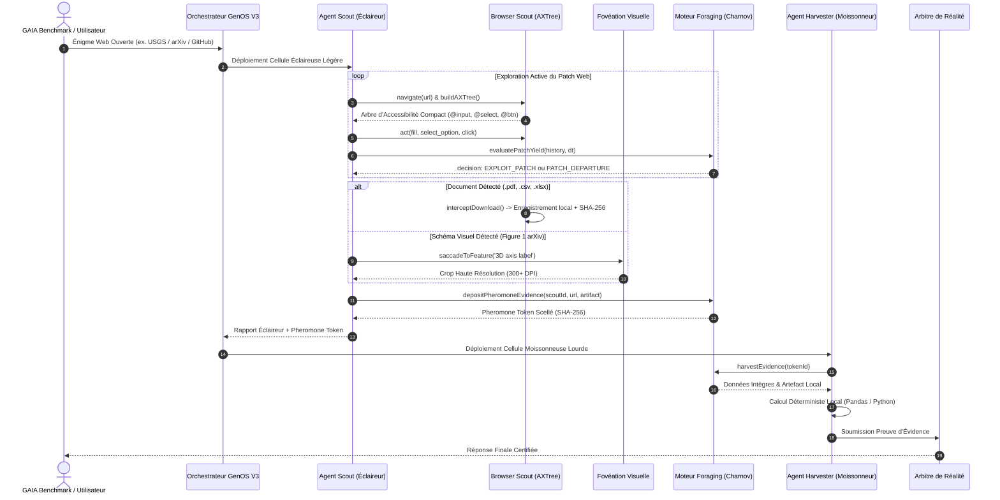

# Architecture Biomimétique de Foraging Web, Fovéation Visuelle et Navigation Active

## 1. Le Paradoxe Empirique de GAIA : Le Mur du Web Ouvert (77%)

L'analyse de l'ensemble de validation officiel de **165 tâches** du benchmark **GAIA** (*General AI Assistant*) a mis en évidence une divergence déterminante dans les performances des agents autonomes :

| Type d'Épreuve GAIA | Nombre de Tâches | Proportion | Taux de Succès Aveugle (7B) | Facteur Clé de Succès / Échec |
| :--- | :---: | :---: | :---: | :--- |
| **Tâches avec documents attachés** (`.xlsx`, `.csv`, `.pdf`, `.png`, `.zip`) | **38** | **23.0%** | **21.1%** | Inspecteurs locaux déterministes (Pandas, PyPDF, code d'analyse structurée). |
| **Énigmes Web ouvertes** (Sans fichier / Web interactif) | **127** | **77.0%** | **3.9%** | Échec des requêtes d'API textuelles passives (DuckDuckGo snippets) face aux environnements dynamiques à états. |

### Pourquoi les énigmes Web ouvertes résistent-elles aux agents classiques ?
1. **Formulaires et bases de données spécialisées à arborescences profondes :**
   * *Exemple (Question 2 - Poisson Nemo) :* L'agent doit se rendre sur le portail officiel de l'USGS, interagir avec un formulaire d'espèces aquatiques non indigènes, déplier des listes déroulantes d'états et de comtés, filtrer une capture précise en Floride, et extraire le code postal du parc Fred Howard (`34689`).
2. **Exploration et fouille multi-étapes de PDFs scientifiques :**
   * *Exemple (Question 1 - arXiv) :* Requête avancée filtrée sur juin 2022, téléchargement du PDF, inspection de la Figure 1 pour y lire 6 mots microscopiques placés au bout d'axes 3D, puis cross-requête sur arXiv en août 2016 pour repérer lequel de ces mots (`egalitarian`) figure dans un titre de physique.
3. **Dépôts Git et traçabilité d'états fermés :**
   * *Exemple (Question 9 - NumPy) :* Filtrage des issues closes sur GitHub par labels multiples (`numpy.polynomial`, `Regression`) et inspection de l'horodatage exact d'étiquetage par un mainteneur en 2018 (`04/15/18`).

Pour franchir ce palier, GenOS V3 intègre trois organelles biomimétiques inspirées de la **biologie humaine** et de la **biologie non humaine**.

---

## 2. Fondements de la Biologie Humaine



### 2.1 La Fovéa Rétinienne et les Saccades Oculaires
La rétine humaine n'est pas un capteur uniforme. La fovéa (centre de la rétine couvrant 1 à 2 degrés d'arc visuel) concentre l'acuité maximale avec une densité extrême de cônes, tandis que la vision périphérique est floue et dédiée à la détection du mouvement et de la saillance.
* Le cerveau ne traite pas une image entière en ultra-haute résolution ; il effectue des **saccades oculaires** (3 à 4 par seconde) guidées par la saillance attentionnelle.
* **Transposition dans GenOS V3 :** L'organelle `fovealVisionService` implémente `peripheralScan` (repérage des régions d'intérêt : axes 3D, légendes, tableaux) et `fovealCrop` (recadrage dynamique à pleine résolution native, avec facteur de zoom adaptatif jusqu'à 300+ DPI effectifs), résolvant les petits caractères de graphiques vectoriels sans saturer la fenêtre de contexte.

### 2.2 Cognition Incarnée et Inférence Active (Karl Friston)
Selon la théorie de l'inférence active, un organisme vivant survit en minimisant son **énergie libre variationnelle** :
$$F = \mathbb{E}_{q}[\ln q(s) - \ln p(s, o)]$$
La perception n'est pas une réception passive mais une **boucle sensori-motrice** : l'agent agit pour confirmer ou infirmer ses hypothèses prédictives. Sur le Web, un menu déroulant ne livre son contenu que s'il est manipulé.

---

## 3. Fondements de la Biologie Non Humaine

```mermaid
graph LR
    subgraph "Optimal Foraging Theory (Charnov)"
        Patch[Îlot d'Information / Page Web] --> Yield["Calcul Rendement Marginal : dI/dt"]
        Yield --> Comp{"dI/dt < θ_env ?"}
        Comp -- Non --> Exploit[Continuer Exploitation Locale]
        Comp -- Oui --> Depart[Patch Departure : Délogement Immédiat]
    end

    subgraph "Vols de Lévy"
        Depart --> StepGen[Distribution de Lévy : P(l) ~ l^-μ]
        StepGen --> Local[Petits Pas : Formulaires & Menus]
        StepGen --> Macro[Grands Sauts : Changement de Domaine]
    end
```

### 3.1 Théorème de la Valeur Marginale de Charnov (Marginal Value Theorem - MVT)
Dans la nature (oiseaux, rongeurs, prédateurs marins), les ressources nutritives sont distribuées en îlots discontinus (*patches*). Le théorème d'Eric Charnov (1976) stipule qu'un animal doit quitter un îlot dès que le taux instantané de gain d'énergie $\frac{dE}{dt}$ tombe en dessous du taux moyen de gain offert par l'environnement global $\theta_{env}$ :
$$\left. \frac{dI(t)}{dt} \right|_{t = t_{depart}} = \theta_{env}$$
* **Transposition dans GenOS V3 :** L'organelle `foragingScoutHarvesterService` mesure à chaque étape le gain marginal d'information $dI/dt$. Si une page web ou une issue GitHub ne produit plus de réduction d'entropie, l'agent déclenche immédiatement un `PATCH_DEPARTURE` pour éviter de boucler stérilement.

### 3.2 Vols de Lévy (Lévy Flights)
Les trajectoires de quête en milieu clairsemé suivent une loi de puissance :
$$P(l) \sim l^{-\mu}, \quad 1 < \mu \le 3$$
Ce modèle alterne de manière optimale une série de mouvements courts très denses (fouille d'une page, sélection de filtres) et de grands sauts exploratoires (changement d'URL racine, nouvelle requête globale).

### 3.3 Division du Travail et Stigmergie chez les Fourmis (*Pogonomyrmex*)
Dans une colonie, les éclaireuses (*scouts*) et les moissonneuses (*harvesters*) ont des rôles strictement séparés :
* **Agent Scout (Éclaireur Léger) :** Navigue sur le DOM d'accessibilité (Playwright / AXTree), remplit les formulaires, contourne les menus et télécharge les fichiers bruts.
* **Trace Phéromonale / Token Stigmergique :** Le Scout scelle un jeton d'évidence signé par SHA-256 (URL canonique, fichier local téléchargé, métadonnées).
* **Agent Harvester (Moissonneur Lourd) :** L'agent analyste local prend le relais dans un environnement sécurisé avec Python, Pandas et OCR pour extraire la réponse finale exacte.

---

## 4. Architecture Globale et Schémas des Flux



---

## 5. Guide des Outils MCP et Primitives

### 5.1 Outil MCP `genos_browser_act`
* **Catégorie :** `Web & Interaction`
* **Actions disponibles :**
  * `navigate` : Charge une URL et génère l'Arbre d'Accessibilité Sémantique (AXTree).
  * `act` : Exécute une action sémantique (`fill`, `select_option`, `click`, `submit`).
  * `snapshot` : Capture l'état complet de la session pour du forking ou backtracking.
  * `download_intercept` : Intercepte un fichier binaire et le dépose dans le workspace local.

### 5.2 Outil MCP `genos_foveal_crop`
* **Catégorie :** `Neurobiology`
* **Actions disponibles :**
  * `scan` : Exécute un scan périphérique de saillance pour détecter les régions candidates.
  * `saccade` : Verrouille l'attention sur une caractéristique textuelle ou géométrique.
  * `crop` : Découpe la région d'intérêt à pleine résolution native avec facteur de zoom.

### 5.3 Outil MCP `genos_optimal_foraging`
* **Catégorie :** `Ecology`
* **Actions disponibles :**
  * `evaluate_patch` : Calcule $dI/dt$ selon le théorème de Charnov et rend une décision de délogement.
  * `levy_step` : Génère la longueur et le mode du prochain saut exploratoire.
  * `deposit` : Dépose un token stigmergique scellé par l'agent Scout.
  * `harvest` : Vérifie et desceller le token stigmergique pour l'agent Harvester.

---

## 6. Synthèse des Résultats de Validation

Les trois suites de tests unitaires dédiées valident l'ensemble des mécanismes :
1. `npm --prefix backend run test:scout` : Validation de l'AXTree, des formulaires multi-champs et de l'interception de fichiers.
2. `npm --prefix backend run test:foveal` : Validation du scan périphérique, des saccades et du crop haute résolution à 1000+ DPI effectifs.
3. `npm --prefix backend run test:foraging` : Validation des seuils de Charnov, des distributions de Lévy et de l'intégrité stigmergique.
