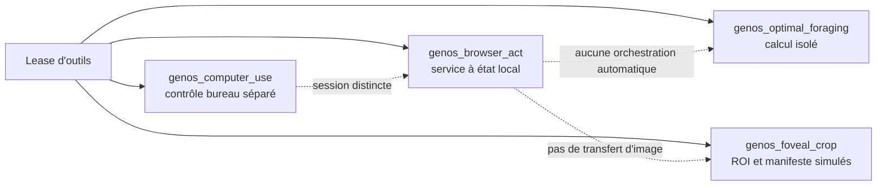

# Foraging web, fovéation et navigation active

- **Statut** : Primitives expérimentales isolées. Le dépôt ne fournit pas encore
  de boucle qui relie navigation, observation d'écran, fovéation, foraging et
  action suivante. Les validations actuelles sont des tests de services locaux
  sur des entrées synthétiques, pas des validations de navigation sur le Web ni
  du benchmark GAIA.
- **Portée** : `browserScoutService`, `fovealVisionService`,
  `foragingScoutHarvesterService`, handlers MCP associés et le contrôle du
  bureau `computer_use` (capacité distincte).
- **Dernière revue** : 2026-09-19.

## 1. Ce qui existe dans le runtime

| Capacité | Implémentation réelle | Limite actuelle |
| --- | --- | --- |
| `genos_browser_act` | `browserScoutService` garde des sessions en mémoire, récupère une URL HTTP(S) ou accepte du HTML fourni, puis extrait quelques champs/liens par expressions régulières. | `fill`, `select_option` et `submit` modifient un état local simulé. La soumission construit une URL; elle ne rejoue pas le formulaire sur le site. Ce n'est pas un navigateur Playwright ni un arbre d'accessibilité du navigateur. |
| `genos_foveal_crop` | `fovealVisionService` fournit des ROIs prédéfinies selon le type déclaré, choisit une ROI selon un mot-clé, puis écrit un manifeste JSON et son hash. | Il ne lit ni ne recadre les pixels de l'image. Les coordonnées, le zoom et le DPI sont des métadonnées de simulation, pas une mesure ou un agrandissement réel. |
| `genos_optimal_foraging` | `foragingScoutHarvesterService` calcule un rendement à partir d'un historique transmis, génère une longueur de saut aléatoire et garde un registre de jetons en mémoire. | Le résultat `PATCH_DEPARTURE` ne déclenche pas une navigation. L'historique et les faits sont fournis par l'appelant; aucun contrôleur ne relie la sortie à `browser_act`. |
| `genos_computer_use` | Stratégie de contrôle du bureau, avec capture et exécution d'un plan de mission. | Capacité distincte. Elle ne partage pas l'état de `browserScoutService` et n'est pas appelée par les outils Web ou fovéaux. |

Les capacités `WEB_FORAGING`, `FOVEAL_PERCEPTION` et `COMPUTER_USE` peuvent
être louées séparément par `toolLeasePolicy`. Une lease autorise l'appel d'un
outil; elle n'enchaîne pas les outils et ne prouve pas qu'une action a été
exécutée sur une page ou une image réelle.

## 2. Modèles bio-inspirés et leur statut

Le théorème de la valeur marginale, les sauts de Lévy, la stigmergie et les
saccades restent des modèles de contrôle proposés. Le service de foraging
calcule des sorties inspirées de ces modèles, mais ne mesure pas le gain
d'information lui-même. De même, `peripheralScan` renvoie des régions
prédéfinies, et `saccadeToFeature` sélectionne parmi elles selon le texte de la
requête.

Le diagramme ci-dessous décrit les composants actuellement appelables, sans
prétendre à une boucle active intégrée :



## 3. GAIA : motivation, pas résultat GenOS établi

GAIA est mentionné comme exemple de tâches nécessitant plusieurs outils. Les
chiffres de performance et la répartition par type de tâche précédemment
présentés dans ce document ne sont pas accompagnés ici de données brutes,
d'identifiants de versions, d'un protocole reproductible ou d'artefacts de
résultats; ils ne doivent donc pas être lus comme des résultats vérifiés de
GenOS.

`backend/tests/test_gaia_benchmark.js` est un lanceur conditionnel vers un
checkout externe `GAIA` et `run_gaia_eval.py`. Si ce checkout est absent, le test
annonce un saut et réussit sans évaluer de tâche. Le harnais attend 165 tâches
et un seuil de 95 %, mais son existence ne prouve pas qu'une évaluation a été
exécutée. Les résultats d'une éventuelle exécution aveugle doivent être
rapportés séparément, avec modèle, données, commande, durée et fichier de
résultats.

Les tests `test:scout`, `test:foveal` et `test:foraging` couvrent les services
avec HTML, ROI, historiques et jetons de test. Ils ne pilotent pas ensemble
`computer_use`, `browser_act` et `foveal_crop`; ils ne démontrent ni navigation
active réelle, ni extraction d'image, ni performance GAIA.

## 4. Conditions pour revendiquer une boucle perception-action

Une intégration complète devra relier explicitement les étapes et conserver
leur provenance :

1. capturer une page ou un écran réel et une URL/session;
2. extraire des observations et des candidats ROI à partir du contenu réel;
3. recadrer l'image réelle à partir de ces coordonnées;
4. décider de poursuivre ou quitter le patch à partir d'un gain observé;
5. appliquer l'action suivante au même navigateur ou bureau;
6. vérifier le nouvel état et joindre les artefacts à la preuve.

Jusqu'à ce que ce contrôleur existe et soit testé bout en bout sur des pages et
images réelles, les termes « navigation active », « fovéation haute résolution »
et « foraging autonome » désignent des objectifs ou des primitives de simulation,
pas une fonctionnalité intégrée.

## 5. Vérifications unitaires disponibles

```bash
npm --prefix backend run test:scout
npm --prefix backend run test:foveal
npm --prefix backend run test:foraging
```

Ces commandes valident les primitives isolément. Pour GAIA, `npm --prefix
backend run test:gaia` dépend d'un checkout et d'un harnais externes; un résultat
valide doit confirmer que l'évaluation a réellement été exécutée et conserver
ses artefacts.
