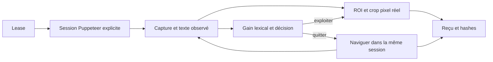

# Foraging web, fovéation et navigation active

- **Statut** : intégration expérimentale; parcours bout en bout validé sur un
  serveur local contrôlé, pas sur un jeu de tâches web réel ni GAIA.
- **Dernière revue** : 2026-09-30.
- **Décision d'architecture** : [ADR 0182](../../adr/0182-navigation-web-et-vision-foveale.md).

## État des capacités

| Capacité | Chemin actuel | Limites à conserver |
| --- | --- | --- |
| `genos_browser_act` | `open_browser_session` crée une session Puppeteer explicite. Navigation et interaction capturent l'état et une image après chaque action. | Chromium doit être installé et démarrable. Les URL non HTTP(S), les identifiants dans l'URL et les hôtes locaux/privés sont bloqués, sauf hôte de test explicitement autorisé par configuration. Le mode historique sans session navigateur reste une simulation basée sur HTML/fetch. |
| `genos_foveal_crop` | `fovealVisionService` lit une image et écrit les pixels de la ROI avec Sharp; le hash porte sur l'image produite. | Les ROIs proposées restent heuristiques. Le zoom est une consigne de sélection; le crop conserve la résolution source et n'invente ni DPI ni détail. |
| `genos_optimal_foraging` | `forage_step` évalue les gains lexicaux observés dans la session réelle, quitte le patch en naviguant vers le prochain lien observé ou l'URL fournie, et fovéate la capture pendant l'exploitation. Le reçu relie décision, action, observation et hash du crop. | Le gain lexical est un indicateur de nouveauté, pas de pertinence ou de vérité. Sans session navigateur réelle, l'ancien chemin de test accepte encore un historique fourni par l'appelant. |
| `genos_computer_use` | Contrôle du bureau distinct. | Aucune session ou capture n'est partagée automatiquement avec le navigateur Puppeteer. |

Les leases `WEB_FORAGING` et `FOVEAL_PERCEPTION` restent séparées. Une lease
autorise l'appel, mais ne valide pas la qualité de l'observation ni la décision.
Les retours réussis du navigateur, du foraging et de la fovéation sont maintenant
convertis en observations canoniques du sensorium puis en épisodes autobiographiques
si leur gain d'information dépasse le seuil de saillance. Cette mémorisation ne
certifie ni le contenu observé ni la qualité de la décision.

```mermaid
flowchart LR
    Lease[Lease] --> Session[Session Puppeteer explicite]
    Session --> Observe[Capture et texte observé]
    Observe --> Forage[Gain lexical et décision]
    Observe --> Fovea[ROI et crop pixel réel]
    Forage -->|quitter| Action[Naviguer dans la même session]
    Forage -->|exploiter| Fovea
    Action --> Observe
    Fovea --> Receipt[Reçu et hashes]
    Action --> Receipt
```

## Vérification et GAIA

Les tests `test:scout`, `test:foveal` et `test:foraging` couvrent les services
locaux et leurs données de test. `node backend/tests/test_browser_runtime.js`
exerce Puppeteer contre un serveur local autorisé explicitement, avec capture,
clic et observation suivante. `node
backend/tests/test_foraging_browser_runtime.js` enchaîne observation réelle,
crop Sharp, décision de foraging et navigation suivante sur ce serveur. Le test
inclut un contrôle de couverture de trois termes attendus sur la page suivante;
cette métrique mesure uniquement l'extraction d'une cible connue dans un serveur
local contrôlé, pas la pertinence générale des résultats. L'exécution de
`test_foraging_browser_runtime.js` le 2026-09-30 a réussi avec les options
Chromium configurées dans ce test. Ces tests ne valident pas l'accès à des sites externes. Le test GAIA dépend d'un
checkout et d'un harnais externes; l'exécution du 2026-09-30 a sauté car le
checkout GAIA est absent. Aucun score GAIA de GenOS n'est établi.

Pour GAIA, conserver le modèle et sa version, les données, la commande, la
durée, le scorer et le fichier de résultats provenant de l'exécution effective.
