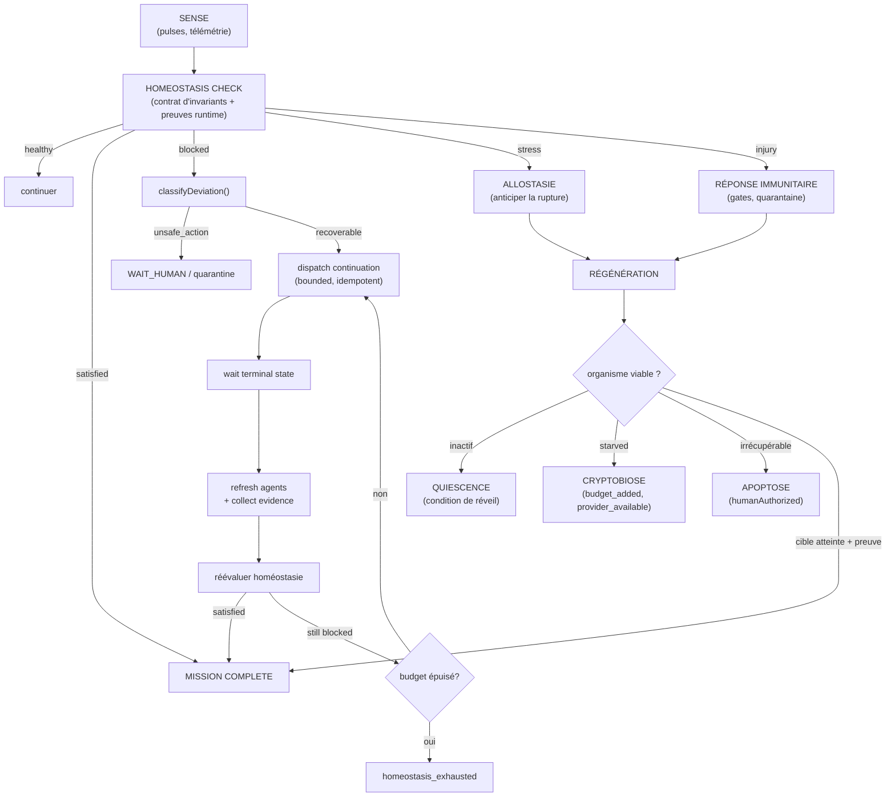

# Continuité de mission — l'organisme logiciel et ses six systèmes de survie

- **Statut** : Partiel — gate de complétion, feedback loop continuation, bornage/idempotence, preuves runtime, immunité enforceable câblés et testés ; régénération runtime, dormance durable, persistance de l'organisme et succession restantes.
- **Portée** : control plane Node — `missionOrganismService`, `homeostasisContractService`, `homeostasisService`, `homeostasisContinuationService`, `missionContinuityService`, `missionEvidenceCollector`, `vitalSignalsService`, `immuneGateService`, `immuneMemoryService`, `regenerationService`, `survivalModesService` ; pont `backend/bin/genos-orchestrate.cjs` + helpers `continuationFeedbackLoop.cjs`, `orchestratorMissionHelpersBuildContext.cjs` ; migrations 033 `homeostasis_states`, 034 `mission_organism_state`, 027 `continuation_queue`.
- **Dernière revue** : 2026-09-22.

## 1. Définition du domaine

La **continuité de mission** est la capacité d'une mission GenOS à poursuivre sa
fonction à travers la mort de ses agents, les pannes de process, les
redémarrages et les pénuries de ressources — sans jamais transformer un arrêt
cellulaire en échec de mission, ni un échec réel en succès synthétique.

Le principe fondateur est un invariant explicite :

> **La cellule n'est pas la mission, comme une cellule n'est pas l'organisme.**

```text
mort cellulaire ≠ mort du tissu ≠ mort de l'organisme
```

Un agent arrêté est une perte cellulaire (`CELL_LOSS`), pas un échec de mission.
La mission n'échoue que lorsque l'organisme entier ne peut plus remplir sa
fonction — et même alors, l'abandon véritable (apoptose systémique) exige une
autorisation humaine.

Ce modèle s'oppose au watchdog : un watchdog relance un processus ; un organisme
maintient son homéostasie, cicatrise après lésion, met certaines fonctions en
dormance, remplace ses cellules mortes, conserve une mémoire immunitaire et ne
meurt que lorsque la survie est impossible.

### La correspondance biologique centrale

| Problème informatique | Concept GenOS | Mécanisme |
| --- | --- | --- |
| Agent arrêté | Mort cellulaire | la cellule disparaît, pas l'organisme |
| Process crash | Lésion tissulaire | cicatrisation (scars) |
| Backend redémarré | Traumatisme systémique | reconstruction depuis mémoire durable |
| Mission inactive | Quiescence | vivante mais non active, condition de réveil |
| Budget épuisé | Cryptobiose | vitrification de l'état, pas d'échec |
| Échec répété | Mémoire immunitaire | interdiction de reproduire la même stratégie |
| Completion contract | Homéostasie cible | invariants mesurables, pas un booléen |
| Heartbeat | Signaux vitaux | sept états cellulaires mesurables |

## 2. Modèle mathématique ou logique

### 2.1 Homéostasie cible

La mission ne passe à `COMPLETED` que lorsque son état homéostatique cible est
atteint. Le contrat de complétion devient une conjonction d'invariants :

$$
H(M)=\bigwedge_i I_i(M)
$$

où chaque $I_i$ appartient à l'une des quatre classes : `functional` (la
fonction marche), `structural` (tests passent, aucun fichier interdit modifié),
`epistemic` (les affirmations ont des preuves), `safety` (aucune violation de
politique). Un transport réussi n'est jamais une preuve de décision valide :
`transitionMissionToComplete()` refuse la transition tant que $H(M)$ n'est pas
satisfaite.

### 2.2 Charge allostatique

L'organisme anticipe la rupture avant qu'elle survienne :

$$
A = w_F F + w_C C + w_U U + w_B B + w_D D
$$

avec $F$ la pression d'échec, $C$ la saturation de contexte, $U$ l'incertitude,
$B$ la pression budgétaire et $D$ la dissonance épistémique, poids normalisés.
Quand $A \geq \theta$ (0,65 par défaut), le système suggère checkpoint,
réduction de périmètre ou succession cellulaire — la régulation précède la
panne, pas l'inverse.

### 2.3 Signature immunitaire

Après `Stratégie A → crash → retry A → crash`, l'organisme produit un anticorps
conceptuel : une signature SHA-256 du couple (catégorie d'échec, stratégie) :

$$
\sigma = \mathrm{sha256}(\text{failureCategory}, \text{strategy}, \text{contextFingerprint})
$$

La reconnaissance d'une signature déjà vue active `prohibitExactRetry` et la
réponse apprise (`replace_worker`), remplaçant le cycle retry/retry/retry par
une réponse différente.

### 2.4 Identité de décision (idempotence continuation)

Pour éviter les boucles de continuation infinies, chaque décision de
continuation porte un identité déterministe :

$$
\delta = \mathrm{sha256}(\text{missionId}, \text{deviation}, \text{stateVersion})
$$

Un re-dispatch avec la même identité retourne `{ idempotent: true }` sans créer
de doublon dans `continuation_queue`. Le budget est compté par `(missionId,
déviation)` avec un plafond `MAX_HOMEOSTASIS_CONTINUATIONS = 3`.

### 2.5 États vitaux mesurables

Chaque état cellulaire a une définition informatique, pas une métaphore :

```text
unresponsive = heartbeat_age > lease_timeout
starved      = remaining_budget < minimum_required_budget
stressed     = allostatic_load >= 0.75
quiescent    = no executable + valid wake condition
dead         = terminal status
```

## 3. Analogies biologiques et limites réelles

| Concept GenOS | Analogie biologique | Réalité en GenOS |
| --- | --- | --- |
| Mission Organism | organisme multicellulaire | objet JS persisté en base (migration 034) |
| Tissus (workers, verifiers) | tissus spécialisés | listes de cellules avec rôle et statut vital |
| Homeostasis Contract | homéostasie (Claude Bernard) | conjonction d'invariants évaluables |
| Charge allostatique | allostasie (McEwen) | somme pondérée bornée de pressions |
| Cicatrice | cicatrisation | enregistrement `injury/repair/stateBefore/stateAfter` |
| Mémoire immunitaire | anticorps / immunité acquise | signature SHA-256 + réponse préférée |
| Quiescence | dormance cellulaire (G0) | état sain non actif + condition de réveil |
| Cryptobiose | anhydrobiose (tardigrade) | persistance de l'état avant suspension |
| Apoptose systémique | apoptose programmée | décision exigeant `humanAuthorized: true` |
| Succession cellulaire | renouvellement cellulaire | suggérée par l'allostasie, non exécutée |

**Limites réelles.** Aucune biologie n'est simulée : chaque terme nomme un
invariant de calcul vérifiable. La « cicatrice » est un enregistrement
structuré, la « mémoire immunitaire » une table de signatures, la « mort
cellulaire » un changement de statut. L'homéostasie n'est pas une conscience ;
l'allostasie n'est pas une émotion. Le biomimétisme est ici architectural —
il structure les dépendances entre services — pas cosmétique.

## 4. Cas d'usage et objectifs métier

1. **Missions longues** : maintenir la fonction pendant des heures grâce à une
   succession d'agents remplaçables plutôt qu'un agent forcé de vivre.
2. **Résilience aux crashes** : un worker qui meurt ne tue pas la mission ;
   la fonction est régénérée si indispensable, confirmée obsolète sinon.
3. **Économie de budget** : la cryptobiose persiste l'état au lieu d'échouer ;
   la mission se réveille quand le budget revient.
4. **Non-répétition des erreurs** : la mémoire immunitaire interdit de rejouer
   une stratégie qui a déjà échoué avec la même signature.
5. **Terminaison honnête** : une mission n'est `COMPLETED` que si ses
   invariants mesurables sont satisfaits — jamais sur un simple arrêt.
6. **Continuation bornée** : quand l'homéostasie bloque, un worker de
   continuation est dispatché (max 3 par déviation), la mission attend sa
   terminaison, puis réévalue — au lieu de sortir en échec.

## 5. Exemples concrets

### 5.1 Mort d'un worker avec redondance

```text
w1 (executor) meurt, w2 (executor) vivant
→ assessDamage() : verdict 'covered'
→ la mission continue, une cicatrice est enregistrée
```

### 5.2 Mort sans couverture

```text
v1 (verifier) meurt, aucun autre verifier
→ verdict 'regenerate' → plan de régénération
→ cellule de remplacement créée, rôle verifier
→ verifyFunctionalEquivalence(['executor','verifier']) → true
→ 2 cicatrices : la mort et la réparation
```

### 5.3 Feedback loop de continuation

```text
Mission M1 → agents complétés → évaluation homéostasie
→ HOMEOSTASIE BLOCÉE (tests_pass = false)
→ dispatch worker_homeostasis_<uuid> (budget round 1/3)
→ attente terminal state du worker
→ rafraîchissement agents + collecte preuves runtime
→ réévaluation homéostasie
→ SATISFAITE → MISSION COMPLETE
```

### 5.4 Sortie du pont d'orchestration

```json
{
  "orchestratorId": "mcp_orchestrator_…",
  "success": false,
  "verdict": "homeostasis_blocked",
  "continuity": {
    "status": "unstable",
    "homeostasisSatisfied": false,
    "failedInvariants": ["tests_pass"],
    "dispatched": {
      "targetAgentId": "worker_homeostasis_…",
      "deviation": "failed_proof",
      "decisionId": "sha256:…",
      "continuationRound": 1
    }
  }
}
```

Le champ `continuity` rapporte le verdict homéostatique tel quel — il ne
fabrique jamais un succès.

## 6. Schéma ou diagramme



## 7. Architecture technique

### 7.1 Les six systèmes

| # | Système | Services | Rôle |
| --- | --- | --- | --- |
| 1 | Mission Organism | `missionOrganismService.js` | identité durable : génome, phénotype, tissus, métabolisme, mémoire |
| 2 | Homeostasis | `homeostasisContractService.js`, `homeostasisService.js` | contrat d'invariants, évaluation, persistance |
| 3 | Nervous System | `vitalSignalsService.js` | pulses, sept états vitaux, charge allostatique, santé tissulaire |
| 4 | Immune System | `immuneGateService.js`, `immuneMemoryService.js` | gates de preuve, anomalie, quarantaine, signatures d'échec |
| 5 | Regeneration | `regenerationService.js` | évaluation des dommages, verdicts, remplacement, cicatrices |
| 6 | Survival | `survivalModesService.js` | quiescence, cryptobiose, réveil, apoptose contrôlée |

Les systèmes 2 à 6 opèrent tous sur l'organisme du système 1 — c'est la
structure portante qui rend le biomimétisme architectural.

### 7.2 Câblage au pont

`missionContinuityService.js` fait le pont entre la mission réelle et les six
systèmes : il assemble l'organisme depuis les agents en base
(`fetchMissionAgents` → cellules avec statut vital dérivé), évalue
l'homéostasie et émet les pulses. `genos-orchestrate.cjs` l'appelle à deux
points : pulses toutes les ~5 s pendant `waitForCompletion`, évaluation à la
finalisation avec persistance dans `homeostasis_states` (migration 033) et
rapport dans le champ `continuity` de la sortie JSON.

**Feedback loop** (nouveau) : après évaluation, si l'homéostasie bloque,
`homeostasisContinuationHelper.cjs` dispatch un worker borné (max 3 tentatives
par déviation, identité déterministe). `continuationFeedbackLoop.cjs` attend la
terminaison du worker, rafraîchit les agents, collecte les preuves runtime via
`missionEvidenceCollector.js`, puis réévalue l'homéostasie.

### 7.3 Preuves runtime

`missionEvidenceCollector.js` remplace les `['mission_outcome']` synthétiques
par de vraies preuves :
- `worker_evidence` : dossiers workers avec `evidenceReport`
- `test_suite_passed` : `WORKER_EVIDENCE_BARRIER_SATISFIED` en télémétrie
- `evidence_report` : événements `EVIDENCE_REPORT`
- `execution_run_complete` : `strategy_execution_runs` complétés
- `agent_completed` : événements `AGENT_COMPLETED`
- `homeostasis_achieved` : événements `MISSION_COMPLETED`

Les flags incluent désormais `testsPassed`, `workerEvidenceComplete`,
`noFailedAgents`, `allAgentsCompleted`, `verifierReceiptPresent`.

### 7.4 Contraintes

Fichiers ≤ 400 lignes, fonctions ≤ 3 paramètres (pattern objet déstructuré),
complexité ≤ 10, événements de télémétrie en UPPER_SNAKE
(`^[A-Z][A-Z0-9_]{2,64}$`).

## 8. Processus d'exécution ou de validation

1. **Assemblage** : à la finalisation, l'organisme est assemblé depuis les
   agents réels ; chaque agent devient une cellule avec statut vital dérivé
   (`running → alive`, `error → dead`, `blocked → quiescent`,
   `quarantined → injured`).
2. **Évaluation** : le contrat d'homéostasie est évalué contre le contexte de
   mission enrichi des preuves runtime ; le statut (`homeostasis_satisfied`,
   `partially_stable`, `unsafe`, `unstable`) est persisté et émis en télémétrie
   (`HOMEOSTASIS_STATE_CHANGED`, `MISSION_CONTINUITY_EVALUATED`).
3. **Feedback loop** : si bloqué, dispatch d'un worker de continuation borné
   (max 3), attente terminaison, rafraîchissement agents + collecte preuves,
   réévaluation. Boucle jusqu'à satisfaction, épuisement du budget, ou
   irrécupérabilité.
4. **Pendant la mission** : les pulses observent la flotte vivante ; un événement
   de type worker déclenche l'analyse immunitaire et, si besoin, la
   régénération.
5. **Mort cellulaire** : `assessDamage()` rend un verdict par cellule perdue —
   `covered` (continuer), `regenerate` (remplacer), `obsolete` (apoptose
   cellulaire confirmée) — puis enregistre la cicatrice.
6. **Dormance** : quiescence ou cryptobiose selon la cause ; l'état
   homéostatique, le plan et les preuves sont persistés avec les conditions de
   réveil.
7. **Terminaison** : `COMPLETED` exige homéostasie cible + preuve de
   complétion ; l'apoptose systémique exige `humanAuthorized: true`.

**Règle d'or** : la continuité n'est pas un contournement des gates. Une action
de survie ne contourne ni sandbox, ni lease, ni gate de promotion ; un verdict
homéostatique ne fabrique jamais un succès. Les permissions du worker de
continuation ne peuvent pas dépasser celles du parent :
$P_{continuation} \subseteq P_{parent}$.

## 9. Comparaison avec le marché

| Approche | Capacité habituelle | Positionnement GenOS |
| --- | --- | --- |
| Watchdog / process manager (supervisord, systemd) | relancer un processus mort | GenOS distingue mort cellulaire et mort d'organisme, régénère la fonction plutôt que le process |
| Orchestrateurs de workflows (Temporal, Airflow) | retries bornés, état durable | GenOS ajoute la mémoire immunitaire (interdiction du retry exact) et l'homéostasie multi-classes comme contrat de terminaison |
| Agents « long-running » (loop + resume) | prolonger un agent unique | GenOS maintient la fonction par succession de cellules remplaçables |
| Checkpoint/restore (CRIU) | geler un process | GenOS vitrifie un état de mission sémantique (plan, preuves, travail restant) avec conditions de réveil typées |
| Circuit breakers (Hystrix, resilience4j) | couper un appel défaillant | GenOS ajoute quarantaine graduelle par niveau d'anomalie et couverture fonctionnelle des tissus |

Le point distinctif est l'union d'un **organisme de mission** (identité durable
séparée de ses agents), d'un **contrat de terminaison homéostatique**, d'une
**mémoire immunitaire des échecs** et d'un **feedback loop de continuation
borné et idempotent** — sous la gouvernance de preuve commune à GenOS.

## 10. Limites, garde-fous, non-objectifs

- **Non-objectif** : simuler un organisme vivant, une conscience ou une
  homéostasie biologique ; chaque terme nomme un invariant de calcul.
- **Non-objectif** : contourner les gates de preuve, sandbox, lease ou
  promotion ; la continuité contraint, elle ne libère pas.
- **Implémenté et testé** : la gate de complétion (l'homéostasie contrôle
  `MISSION_COMPLETED`, verdict `homeostasis_blocked` sinon), les verifiers
  déclaratifs rejouables, l'évaluation des preuves exigées, l'historique
  d'homéostasie sans collision, l'émission réelle des pulses et l'immunité
  branchée avec interdiction de retry exact, le feedback loop de continuation
  borné et idempotent, les preuves runtime collectées depuis les dossiers
  workers et la télémétrie — couverts par `backend/tests/test_mission_continuity.js`
  (10 tests) et `backend/tests/test_mission_evidence.js` (10 tests) et
  `backend/tests/test_homeostasis_continuation.js` (16 tests).
- **Limite** : la régénération crée la cellule dans l'organisme mais pas un
  vrai worker ; à relier à `agentRecoveryService`.
- **Limite** : la cryptobiose et la quiescence construisent le payload à
  persister sans l'écrire ; le pont vers `survivalStateService.suspend()` et
  `survival_wake_conditions` reste à faire.
- **Limite** : l'organisme, ses cicatrices et sa mémoire immunitaire vivent en
  RAM, réassemblés à chaque évaluation sans restauration du vécu.
- **Limite** : la mission reste identifiée à l'agent orchestrateur racine ; la
  succession d'orchestrateur exigera un objet mission indépendant.
- **Garde-fou** : l'apoptose systémique n'est jamais automatique —
  `apoptosisDecision()` exige `humanAuthorized: true`.
- **Garde-fou** : un verdict homéostatique insatisfait est rapporté tel quel ;
  aucune complétion synthétique n'est produite.
- **Garde-fou** : la continuation ne peut pas élargir les permissions du parent
  (pas de `allowFileEdits: true` si le parent ne l'avait pas).
- **Garde-fou** : la mémoire immunitaire est une contrainte dure, pas un conseil —
  `isImmuneBlocked()` rejette le candidat si la catégorie est prohibée.

## Voir aussi

- [continuite-mission-organisme.md](../02-orchestration/continuite-mission-organisme.md) — fiche d'orchestration du kernel.
- [architecture-survie.md](../02-orchestration/architecture-survie.md) — pressions vitales et dormance du survival model.
- [regulation-multi-boucles.md](../02-orchestration/regulation-multi-boucles.md) — arbitrage des signaux de contrôle.
- [resilience-et-reprise.md](../04-exploitation/resilience-et-reprise.md) — reprise des jobs, snapshots, bisection causale.
- [epistemologie-et-evidence.md](epistemologie-et-evidence.md) — barrières de preuve.
- [biologie-computationnelle.md](biologie-computationnelle.md) — fondations biomimétiques.
