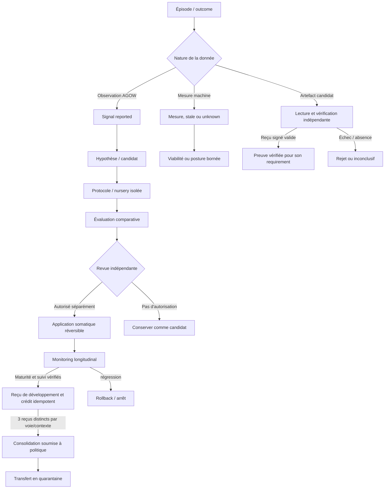

# GVX — développement vérifié des agents

- **Statut** : Partiel
- **Portée** : propositions, expériences, preuves, interoception, plasticité somatique, transmission et intégration aux outcomes AGOW.
- **Dernière revue** : 2026-10-06

> **Règle de lecture.** « Implémenté » signifie qu'un contrat existe dans le dépôt ; cela ne prouve ni son efficacité empirique ni la complétude du cycle développemental. « Partiel » désigne une capacité dont l'adaptateur, la validation indépendante ou l'intégration métier manque encore. Les analogies biologiques restent des modèles de conception.

## Parcours standard exécutable

Le [profil standard AGOW](../02-orchestration/profil-execution-gvx.md) fournit l’évaluation séparée, les mesures signées, l’application autorisée, le monitoring longitudinal puis le crédit et la reprise durable. Le service charge un évaluateur fixe de confiance et des politiques déclaratives préapprouvées. La [validation du cycle standard](../06-qualite-preuves/validation-cycle-standard-gvx.md) rapporte 21 fichiers de tests passés au commit `ac3423cb` ; elle ne constitue pas une campagne empirique.

## 1. Définition du domaine

GenOS Verified Evo-Devo (GVX) est la couche qui formule, expérimente, trace et soumet à contrôle des transformations de compétences ou de dispositions d'un agent. Elle relie les événements d'expérience aux candidats de changement, puis confronte ces candidats à des résultats vérifiables avant toute application ou transmission (**Partiel** — services présents dans `backend/src/services/gvx*.js`, avec un parcours standard complet pour les politiques AGOW ; les autres domaines et les campagnes empiriques restent explicitement bornés ; voir [plan d'implémentation GVX](../06-qualite-preuves/plan-implementation-gvx.md)).

GVX sépare cinq opérations qui ne doivent pas être confondues :

| Opération | Question | Résultat possible |
| --- | --- | --- |
| Observation | Qu'est-il arrivé dans un contexte donné ? | signal rapporté, mesure machine, outcome vérifié |
| Hypothèse | Quelle disposition pourrait expliquer ou améliorer le résultat ? | candidat versionné, jamais une décision d'autorité |
| Évaluation | Le candidat améliore-t-il les critères sans régression inacceptable ? | rejet, inconclusif, recommandation ou revue indépendante |
| Application | Peut-on appliquer le candidat dans un périmètre autorisé et réversible ? | application tracée ou refus |
| Consolidation / transfert | Le bénéfice se maintient-il et peut-il être transmis ? | éligibilité de revue, quarantaine, assimilation contrôlée |

L'AGOW fournit des observations utiles à l'apprentissage, mais celles-ci restent des **signaux rapportés**. Elles ne créditent pas à elles seules la plasticité GVX. Seul un reçu de développement signé et validé par un vérificateur indépendant de confiance peut créditer cette plasticité ; la consolidation demande trois reçus réussis distincts pour la même voie et le même contexte (**Implémenté** — `developmentalBridge/agowToGvxSignalAdapter.js`, `gvxToAgowReceiptAdapter.js`, `developmentReceiptVerifier.js`).

GVX ne détient pas l'autorité du plan de contrôle. L'autorisation, les limites de ressources, les registres de vérificateurs et les décisions de promotion restent hors du candidat évalué (**Implémenté** pour les refus de promotion de plusieurs protocoles ; **Partiel** pour le cycle complet).

## 2. Modèle logique et états épistémiques

Une transformation candidate peut être représentée par :

```text
C = (scope, entity, parentHash, candidateHash, hypothesis,
     sourceExperienceIds, skillDelta, constraints, evidenceRefs)
```

Le ledger exige un scope organisation/projet/entité, un type d'événement admis et un payload objet. Les hashes parent/candidat, quand présents, doivent être des SHA-256 hexadécimaux (**Implémenté** — `gvxDevelopmentLedger.js`). Chaque événement est rattaché au hash précédent ; la chaîne est vérifiée à la lecture et à l'ajout. Une rupture ferme le chemin par erreur `GVX_LEDGER_CHAIN_INVALID`. Un MAC HMAC-SHA-256 de contrôle n'est produit et vérifié que si `GENOS_GVX_LEDGER_HMAC_SECRET` est configuré; sans secret, seule la chaîne de hashes est vérifiée (**Implémenté** — `gvxLedgerIntegrity.js`).

Les niveaux de preuve restent distincts :

| Niveau | Sens dans GVX | Effet permis |
| --- | --- | --- |
| `reported` | observation reçue d'AGOW ou d'un producteur | formuler une question / proposition ; aucun crédit de plasticité |
| `unknown` | capteur, vérificateur ou échantillon absent | conserver l'incertitude ; aucun succès imputé |
| `measured` | mesure machine valide et fraîche | évaluer les règles qui la consomment |
| `verified` | reçu signé lié à un artefact et validé par une identité de vérificateur de confiance | créditer le reçu concerné, sous contrôle d'idempotence |
| `empirically_supported` | claim de compétence soutenu par outcome vérifié et référence cohérente | afficher une compétence soutenue, sans en déduire une promotion générale |
| `inconclusive` | couverture, échantillons ou exigences insuffisants | demander davantage d'observations/essais |

Pour un reçu `r`, la revendication vérifiée lie au minimum l'organisation, le projet, l'entité, l'agent, l'identifiant de reçu, la voie, le contexte, le succès, l'erreur de prédiction, la récompense et les hashes d'artefacts. La signature doit provenir d'un vérificateur enregistré et le reçu doit déclarer `status: verified` et `independent: true` (**Implémenté** — `developmentReceiptVerifier.js`). Un doublon de reçu ne produit pas de crédit supplémentaire. Sur le chemin standard, le service recoupe aussi l’application et la politique courante avec la base runtime en lecture seule ; il consomme durablement un claim par scope, profil et application. Modifier l’identifiant de reçu ou ajouter des preuves ne permet pas de recréditer cette application.

Le compteur de consolidation est par voie et contexte. Trois reçus ne sont distincts que si leurs identifiants sont distincts et chacun a passé la validation indépendante ; rejouer un reçu déjà revendiqué est idempotent et ne fait pas progresser le seuil (**Implémenté** — `gvxToAgowReceiptAdapter.js`).

## 3. Analogie biologique et limites

Le vocabulaire « Evo-Devo » rapproche l'apprentissage individuel, la plasticité, la maturation, la transmission et la sélection de dispositions. L'analogie est utile pour penser les échelles de changement, les contraintes de ressources, la stabilité, la transmission et les effets indésirables (**Cadre conceptuel**).

Dans le logiciel réel, il s'agit d'événements versionnés, de mesures, de protocoles, d'adaptateurs, de politiques d'autorisation et de vérifications cryptographiques. Un reçu signé atteste qu'un protocole de vérification de confiance a évalué un artefact selon un contrat ; il ne prouve pas à lui seul la causalité générale, la réplication en production ou un gain universel.

Les termes « somatique », « germinal », « compétence », « fitness » et « maturation » décrivent des catégories de changement logiciel. Ils ne constituent pas des propriétés biologiques ou psychologiques mesurées. En particulier, le statut `mature_somatic_eligible` du monitoring ouvre une revue de maturité ; il n'autorise ni promotion, ni transmission germinale automatique.

## 4. Cas d'usage et objectifs

- **Apprentissage ciblé** : agréger des erreurs de prédiction, échecs et tâches futures pour proposer des lacunes de compétence bornées (**Implémenté** — `gvxLearningGapDetector.js`). Une autorité externe doit permettre chaque but de fond ; le plan est limité à un coût et un pas par but et retourne `autonomousExecution: false`.
- **Comparaison d'une transformation** : exécuter des bras avec parent, contrôles et budget appariés, et exiger les requirements de preuve (**Implémenté** pour les profils standard AGOW : processus et répertoires distincts matérialisés depuis le manifeste de sources épinglé ; les adaptateurs personnalisés portent leurs propres garanties d’isolation).
- **Adaptation somatique** : évaluer un candidat contre une baseline, exiger une autorisation pour l'appliquer, vérifier le reçu runtime et permettre rollback (**Implémenté** au niveau du contrat d'adaptateur ; validation de robustesse métier encore partielle).
- **Monitoring longitudinal** : observer une application sur plusieurs fenêtres et contextes ; enregistrer la régression et interrompre sur rejet (**Implémenté** par le moniteur ; preuves d'indépendance statistique et réplication externe restent à établir).
- **Transmission contrôlée** : placer un artefact en quarantaine et faire avancer un cycle d'essai, revue, assimilation et monitoring uniquement avec preuves vérifiées (**Partiel** — lifecycle présent ; évaluation métier du receveur et consolidation intergénérationnelle restent à réaliser).
- **Pont AGOW–GVX** : utiliser des signaux rapportés pour orienter une hypothèse, sans leur accorder une autorité de preuve ou de plasticité (**Implémenté** pour le marquage `reported` et les reçus indépendants).

## 5. Exemples de contrats

### 5.1 Signal AGOW rapporté

L'adaptateur AGOW exige un scope explicite, une entité, un identifiant source et au moins une référence de preuve non vide. Il enregistre `epistemicStatus: reported`. Les types reconnus comprennent erreur de prédiction, regret persistant, voie réussie, voie décompilée, requête active, lacune, discrimination contrefactuelle, motif morphologique et échec de représentation (**Implémenté** — `developmentalBridge/agowToGvxSignalAdapter.js`).

Les trajectoires runtime transmettent le scope organisation/projet de la mission ; le résolveur le compare au workspace persistant de l'agent. Sans scope complet ou en cas de désaccord, la trajectoire reste enregistrée et aucune publication GVX n'est tentée (**Implémenté** — `agow/agowRuntimeIngressService.js`, `agow/proceduralization/cognitiveTrajectoryService.js`, `developmentalScopeResolver.js`).

Après chaque signal, `gvxDevelopmentController` compte les événements source distincts de même type et voie, puis persiste une action proposée (`observe`, `create_hypothesis` ou `schedule_experiment`). Les signaux gardent le statut `reported`. Pour un profil AGOW configuré, `runCycle()` enchaîne proposition et prédiction, nursery, assessment vérifié, autorisation et application, monitoring indépendant, vérification longitudinale, puis reçu signé et crédit AGOW. `gvxStandardLifecycleAdapters` fournit les adaptateurs ; sans profil ou service configuré, le cycle échoue fermé. Le journal et les leases SQLite permettent de reprendre une retransmission sans doubler l’application ni le crédit. Les autres domaines requièrent leurs adaptateurs métier.

### 5.2 Trois reçus indépendants pour consolider

```text
reçu A vérifié, succès → crédit 1, consolidation refusée
reçu B vérifié, succès → crédit 2, consolidation refusée
reçu C vérifié, succès → crédit 3, consolidation possible
rejeu du reçu A        → aucun nouveau crédit (idempotence)
```

Les trois fenêtres de monitoring d’une application produisent au plus un reçu de développement ; elles ne valent pas trois crédits de consolidation. Le regroupement exige la même `pathwayId` et le même `contextHash` (ou le contexte global explicite). Un reçu non indépendant, un digest différent, un vérificateur non fiable, une preuve sans hash valide ou un claim modifié échoue avant le crédit.

### 5.3 Interoception avec inconnues conservées

Le pont lit le service machine canonique. Il mappe la pression mémoire, l'énergie en ratio de budget (`1 - energy`), la dérive modèle et l'intégrité lorsque ces mesures existent. `sampleCanonicalInteroception` ajoute les taux d’événements de sécurité et de coordination de la télémétrie de l’agent sur trente minutes, ainsi que la moyenne des valeurs `discrepancy.epsilon` des événements `self_twin_discrepancy` récents disponibles dans le ledger (au plus 100 valeurs). Les événements `self_twin_observation` du cycle standard ne sont pas consommés par ce filtre. Ces indicateurs opérationnels ne sont pas une calibration probabiliste ni une mesure de capacité système. Sans table, événements ou écarts exploitables, la dimension reste `unknown` (**Implémenté** — `developmentalBridge/interoceptionBridge.js`).

Une mesure doit être numérique, dans `[0,1]`, accompagnée d'une source et d'une date valide. Une donnée absente devient `unknown`; une mesure invalide devient `invalid`; une mesure trop ancienne devient `stale`. Les règles de viabilité portant sur une valeur non `measured` renvoient `inconclusive`, jamais `viable` par défaut (**Implémenté** — `gvxInteroception.js`, âge par défaut cinq minutes).

## 6. Schéma du cycle



Le chemin standard AGOW orchestre hypothèse, essai, application, suivi et crédit. Les prolongements vers le transfert et les autres domaines restent des interfaces à intégrer ; le statut de maturité ne les déclenche pas automatiquement.

## 7. Architecture technique

| Sous-système | Contrat et source |
| --- | --- |
| Ledger | `gvxDevelopmentLedger.js`, `gvxLedgerIntegrity.js` — événements scoped, chaîne hashée, HMAC de contrôle, vérification à la lecture |
| Transformations | `gvxTransformation.js`, `gvxMutationProposer.js` — candidat versionné, parent, hypothèse, expériences sources, delta de compétences |
| Graphe/curriculum | `gvxCompetenceGraph.js`, `gvxCompetenceCurriculum.js` — claims étayés par résultats et références de vérificateurs, prérequis, coût, autorité et étapes bornées |
| Lacunes | `gvxLearningGapDetector.js` — signaux pondérés, confiance heuristique, propositions et autorité de tâche distincte |
| Expériences | `gvxExperimentProtocol.js`, `gvxExperimentalNursery.js` — bras, snapshot, contrôles, budget, mondes, registre de vérificateurs et lecteur d’artefacts |
| Cycle standard | `gvxStandardLifecycleAdapters.js`, `gvxCycleExecution.js`, `gvxCycleJournal.js`, `gvxRuntimeLease.js` — profils AGOW, étapes durables, leases et reprise |
| Mesures externes | `gvxExecutionProfiles.js`, `gvxExecutionEvaluator.js`, `gvxEvaluationWorld.js`, `gvxRuntimeStateVerification.js` — sources épinglées, processus distincts, mesures signées et état runtime recoupé |
| Adaptation somatique | `gvxSomaticAssessment.js`, `gvxSomaticApplication.js`, `gvxSomaticMonitor.js`, `gvxLongitudinalMonitor.js` — critères, autorisation, reçu runtime, rollback et fenêtres longitudinales |
| Transmission | `gvxTransferLifecycle.js`, `gvxVerifierRegistry.js` — gates, états de transfert, lecture/hash des artefacts et reçu par transition |
| AGOW → GVX | `developmentalBridge/agowToGvxSignalAdapter.js` — observations `reported`, déduplication par événement et scope |
| GVX → AGOW | `developmentalBridge/gvxToAgowReceiptAdapter.js`, `developmentReceiptVerifier.js` — validation indépendante, claim idempotent, crédit et consolidation à trois reçus |
| Interoception | `gvxInteroception.js`, `developmentalBridge/interoceptionBridge.js` — dimensions mesurées/unknown/stale/invalid et règles d'enveloppe de viabilité |
| Outcomes prédictifs | `runtimePredictiveBridgeService.js` — événements T0–T3 uniquement lorsque mesures prédites et observées explicites sont fournies ; feedback Self-Twin seulement si la prédiction est déjà enregistrée |
| Recherche de lignées | `gvxLineageSearch.js`, `gvxAgentGitAdapter.js` — branches candidates bornées depuis leur parent, aucun merge/promotion automatique |

Les principaux contrats sont précisés par les documents d'exécution : [adaptateurs runtime](../02-orchestration/adaptateurs-gvx-runtime.md), [nursery expérimentale](../02-orchestration/nursery-experimentale-gvx.md), [monitoring longitudinal](../02-orchestration/monitoring-longitudinal-gvx.md), [lacunes d'apprentissage](../02-orchestration/lacunes-apprentissage-gvx.md) et [benchmark GVX](../02-orchestration/plan-puissance-benchmark-gvx.md). Les décisions structurantes sont dans les [ADR GVX](../adr/README.md).

## 8. Processus d'exécution et de validation

Le cycle cible et son état courant sont les suivants :

1. **Capturer** un épisode ou un outcome avec provenance. Les signaux AGOW sont enregistrés comme `reported`; une trajectoire GVX exige un scope explicitement fourni par son appelant.
2. **Construire une hypothèse** de transformation ou de lacune. Une proposition ne reçoit aucune autorité de mutation.
3. **Planifier un essai** avec snapshot, bras distincts, stratégie, contrôles, budget positif et requirements de vérification.
4. **Exécuter les bras** dans des processus et répertoires distincts sur le chemin standard, depuis les sources déclarées et vérifiées. Le mode Linux peut imposer un UID/GID distinct ; le mode par défaut est réservé au code fixe de confiance. Les adaptateurs personnalisés doivent assurer leur confinement.
5. **Vérifier le contenu** : le service lit les octets de l'artefact, recalcule le SHA-256, sélectionne un vérificateur de confiance pour le requirement et ne conserve que son reçu vérifié.
6. **Évaluer** le résultat. L'absence de coverage donne `blocked` ou `inconclusive`; les protocoles nursery, méta-politique et assessment somatique retournent explicitement `promotionAllowed: false`.
7. **Appliquer éventuellement** après décision d'autorisation indépendante, avec hash parent, reçu runtime et token de rollback.
8. **Surveiller** sur fenêtres/contextes distincts. Sur le chemin standard, une régression déclenche le rollback ; un suivi mature et vérifié permet ensuite le reçu signé et le crédit idempotent. Le transfert et la promotion germinale gardent leurs gates séparées.

Les tests de contrats présents dans `backend/tests/` couvrent le ledger, le pont développemental, l'interoception, les transformations, le curriculum, les protocoles expérimentaux, la nursery, le monitoring, le transfert, AgentGit et la méta-politique. Leur existence ne remplace ni campagne holdout, ni réplication indépendante, ni benchmark comparatif.

## 9. Relation aux approches voisines

GVX se distingue des couches qui l'entourent par l'objet qu'elles contrôlent :

| Système | Objet principal | Relation à GVX |
| --- | --- | --- |
| AGOW | sélection attentionnelle et traitement d'observations | producteur possible de signaux rapportés ; pas autorité de preuve GVX |
| Ontogenèse | cycle de vie résident d'un projet et dispatch de missions | peut fournir tâches, ressources et environnement; ne transforme pas à elle seule ces outcomes en plasticité vérifiée |
| Morphogenèse | composition de topologies pour une mission | peut être candidate ou contexte d'essai; ses propres gates restent indépendants |
| AgentGit | branches/versionnage d'agents | fournit des branches candidates; GVX n'en déduit pas le droit de fusionner |
| Système immunitaire épistémique | contrôles de sûreté et d'admission | constitue une frontière externe que les changements GVX ne doivent pas modifier |

Contrairement à une boucle d'auto-optimisation qui ajuste un score interne, GVX distingue observation, hypothèse, artefact vérifié et décision d'autorité. Les comparaisons quantitatives avec les approches concurrentes sont un travail de benchmark à conduire, pas un résultat établi.

## 10. Limites, garde-fous et non-objectifs

- **Pas d'amélioration générale revendiquée** : les capacités sont partielles. Les campagnes holdout, baselines comparables et preuves de réplication décrites dans le plan restent nécessaires.
- **Signal ≠ preuve** : les résultats rapportés par AGOW orientent l'analyse, mais ne créditent jamais la plasticité. Trois succès distincts signifient trois reçus vérifiés distincts, pas trois reprises du même événement.
- **Inconnu ≠ sain** : un capteur absent reste inconnu ; fraîcheur et domaine `[0,1]` sont contrôlés ; une règle dépendant d'une dimension non mesurée ne passe pas.
- **Scope explicite** : sans scope fourni par l'appelant, un signal de trajectoire n'est pas publié. Un scope fourni mais différent du workspace de l'agent est rejeté.
- **Isolation bornée** : le profil standard sépare processus et répertoires et peut imposer un UID/GID distinct sous Linux. Le mode par défaut ne confine pas du code hostile ; une frontière forte exige les droits et le confinement OS de la plateforme. Le mode UID/GID échoue fermé sous Windows.
- **L'autorité reste séparée** : aucun résultat expérimental ou statut de maturité ne vaut droit d'application, de transfert, de commit, de push ou de fusion.
- **Rollback non absolu** : l'application exige une capacité runtime réversible ; une défaillance du rollback est tracée comme échec, pas présentée comme restauration réussie.
- **Méta-développement sous garde** : `gvxMetaPolicyGate.js` protège explicitement autorité racine, sandbox, vérificateurs, évaluations cachées, signature du ledger, promotion, limites dures et politiques constitutionnelles.
- **Non-objectifs actuels** : apprentissage autonome sans budget; auto-modification de ses propres vérificateurs; héritabilité biologique; promotion automatique; garantie causale déduite d'un seul protocole; revendication de supériorité sans mesures reproductibles.

## Voir aussi

- [Plan d'implémentation GVX](../06-qualite-preuves/plan-implementation-gvx.md) — lots, critères de livraison et travaux restants.
- [Validation du cycle standard](../06-qualite-preuves/validation-cycle-standard-gvx.md) — tests exécutés, périmètre et limites des preuves.
- [Adaptateurs GVX runtime](../02-orchestration/adaptateurs-gvx-runtime.md), [nursery expérimentale](../02-orchestration/nursery-experimentale-gvx.md), [monitoring longitudinal](../02-orchestration/monitoring-longitudinal-gvx.md).
- [Ontogenèse](ontogenese.md) — orchestrateur résident et missions bornées.
- [Morphogenèse](../02-orchestration/topologies/morphogenese.md) — construction des organisations d'exécution.
- [Épistémologie et preuves](epistemologie-et-evidence.md) — statut des résultats et décisions.
