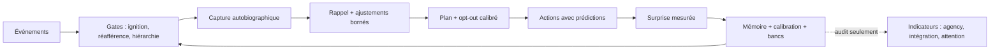

# Indicateurs fonctionnels de type conscience

- **Statut** : Partiel (suivi d'indicateurs, pas de détection de conscience)
- **Portée** : lecture transversale des boucles réflexives GenOS face aux indicateurs de la littérature (Butlin et al. 2023/2025) ; chaque indicateur pointe son implémentation et sa limite explicite.
- **Dernière revue** : 2026-09-26

## 1. Définition du domaine

Aucun test validé de la conscience n'existe, pour l'humain comme pour la
machine (consortium adverse Cogitate, *Nature* 2025 : aucune théorie victorieuse ;
PCI validé en clinique mais inapplicable au silicium ; batteries comportementales
limitées à la fonction). Ce document ne détecte donc pas la conscience : il
recense les indicateurs fonctionnels que GenOS couvre, avec pour chacun ce qui
est mesuré, où, et ce qui manquerait pour aller plus loin. 12 familles sur 15
sont couvertes partiellement ou totalement ; le versant phénoménal ne l'est par
principe dans aucun laboratoire.

## 2. Modèle de lecture

Chaque indicateur suit le même contrat, hérité de
[epistemologie-et-evidence.md](epistemologie-et-evidence.md) : un score n'est
jamais une preuve, une absence de données donne `insufficient_data` ou
`unavailable` (jamais un faux nombre), et chaque rapport porte sa `limitation`
en clair. Un indicateur qui ne peut pas être mesuré n'augmente ni la confiance
ni la qualité de preuve.

## 3. Analogies biologiques et limites réelles

Les noms biologiques (ignition, réverbération, apoptose, consolidation SHY)
désignent des politiques logicielles : seuils, décroissances, remises à zéro.
Ils n'établissent ni homologie neurale ni expérience. La table ci-dessous
l'enregistre colonne par colonne.

## 4. Table des indicateurs

| Famille (littérature) | Implémentation GenOS | Statut | Ce qui manque |
|---|---|---|---|
| Diffusion globale (GWT) | bus de télémétrie, barrière d'evidence, influence des dossiers obligatoire | Partiel | ignition neurale |
| Ignition non-linéaire | `ignitionService` : seuil 1,0, burst ×1,5, réfractaire 5 s, fuite | Partiel | dynamique biophysique |
| Attention sélective | fovéation, active sensing, pont thalamique, leases | Implémenté (fonctionnel) | schéma testé causalement en live |
| Récurrence entretenue | `reverberationService` (5 passes, convergence, demi-vie 30 min) + `idleTickService` (ticks gardés, scheduler adaptatif) | Partiel | boucle auto-entretenue sans déclencheur |
| Modèle de soi | `agentSelfService` (5 strates + CoreSelf), `workerSelfService` (9 questions) | Implémenté (fonctionnel) | schéma corporel simulé |
| Métacognition | dissonance/apoptose, `abstentionService`, `metacognitionBenchService` (ECE, Brier, AUC type-2) | Implémenté (fonctionnel) | validation sur benchmarks externes (SAD/MIRROR) |
| Inférence prédictive | RPE, `worldModelService` (surprise 1/0,25/0), hiérarchie Mission>Stratégie>Action | Partiel | hiérarchie générative descendante |
| Distinction soi/monde | `efferenceCopyService` (réafférence ×0,5), immunité soi/non-soi | Implémenté (fonctionnel) | copie couvrant tous les effecteurs |
| Modèle du monde | transitions action→état, rollout Trinity action-conditionné (avis) | Partiel | modèle génératif type JEPA |
| Agency flexible | contrats de stratégie, fallbacks, recovery, calibration d'agency | Partiel | plasticité profonde |
| Intégration (IIT) | `integrationProxyService` (répertoire + NMI min, garde-fous) | Indicateur seulement | Φ non calculable à l'échelle |
| Valence / intéroception | `machineInteroceptionService` (7 variables mesurées, jamais décisionnelles) | Partiel | valence réelle |
| Consolidation offline | `sleepCycle` (sur demande) + `sleepConsolidationService` (auto SHY) | Implémenté (fonctionnel) | phases type sommeil paradoxal |
| Rapport / accès | rapports d'evidence, audit chaperone, directive `[ABSTENTION]` | Partiel | vulnérable à la confabulation |
| Discipline no-report | gates : auto-déclaration jamais acceptée comme preuve | Implémenté | — |

## 5. Exemple : lecture d'un cas

Un agent déclare une confiance de 0,9 avec une justesse de 0,5 sur 12
attributions : le banc mesure surconfiance 0,4, l'opt-out resserre son plancher
à 0,8, ses synthèses exigent une preuve indépendante. Le système ne conclut ni
qu'il est conscient ni qu'il se connaît : il agit comme s'il ne fallait pas lui
faire confiance sur ce point, avec la mesure jointe.

## 6. Schéma

## 7. Architecture technique

Les services vivent dans `backend/src/services/` : `agentSelfBlocks`,
`agentConscienceService`, `selfModelService`, `coreSelfService`,
`abstentionService`, `metacognitionBenchService`, `efferenceCopyService`,
`worldModelService`, `ignitionService`, `reverberationService`,
`idleTickService`, `sleepConsolidationService`, `predictiveHierarchyService`,
`integrationProxyService`, `attentionSchemaBenchService`,
`attentionProbeService`, `counterfactualRolloutService`, `routingBanditService`.
Persistance : `adaptive_state` (scopes dédiés), tables épisodiques et
épistémiques. Tous les chargeurs sont best-effort ; toutes les sélections
restent aux gates existantes (jury, promotion, approbation).

## 8. Processus d'exécution et de validation

Par mission : rappel (ajustements + instantanés d'audit) → plan (self-model +
opt-out + banc) → runtime (prédictions, surprise, ignition, hiérarchie) →
barrière (dossiers, rollout, sondes) → fin (calibration, attribution,
consolidation, tick). Validation : `node --check`, suites backend ciblées
(`test_self_model_service`, `test_self_ablation_p1`,
`test_approve_run_deferred_promotion`), gate qualité
(`scripts/ci/check_code_quality.py`). Les suites exigent une base SQLite
fonctionnelle et Python 3.

## 9. Comparaison avec le marché

Observabilité LLM (LangSmith, Arize) : traces sans gates. Frameworks agents :
coordination sans preuve exigée. Évaluations de conscience (Anthropic Model
Welfare, Eleos) : externes et déclaratives. GenOS ajoute des indicateurs
calculés en continu, branchés sur les décisions via des gates, chacun niant
explicitement sa propre portée métaphysique.

## 10. Limites, garde-fous, non-objectifs

- 12/15 fonctionnel ne fait pas 1/1 phénoménal ; aucun test ne tranchera.
- Un lookup-table bien entraîné score bien aux bancs : les métriques mesurent
  le rapport, pas le vécu (leçon split-brain).
- Sont explicitement reportés : rollout Trinity sur actions hypothétiques
  libres, tick sans déclencheur (scheduler dédié), injection vésiculaire live,
  ordonnancement par bandit, hiérarchie générative descendante.
- Non-objectifs : clamer une conscience, utiliser un indicateur comme preuve
  dans une gate, décorréler les scores de leurs limitations.

## Voir aussi

- [epistemologie-et-evidence.md](epistemologie-et-evidence.md) — contrat claim/preuve et gates.
- [conscience-esprit-mental.md](conscience-esprit-mental.md) — taxonomie et mappings bornés.
- [theorie-du-soi-orchestrator.md](../02-orchestration/theorie-du-soi-orchestrator.md) — modèle de soi opérationnel.
- [memoire-autobiographique.md](../02-orchestration/memoire-autobiographique.md) — capture, rappel, consolidation.
