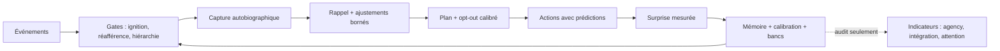

# Indicateurs fonctionnels de type conscience

- **Statut** : Partiel (suivi d'indicateurs, pas de détection de conscience)
- **Portée** : lecture transversale des boucles réflexives GenOS face aux indicateurs de la littérature (Butlin et al. 2023/2025) ; chaque indicateur pointe son implémentation et sa limite explicite.
- **Dernière revue** : 2026-10-04

## 1. Définition du domaine

Il n'existe pas de test universel consensuel permettant de conclure à la
conscience d'une IA. Ce document recense 15 familles fonctionnelles propres
à GenOS ; elles ne correspondent pas terme à terme aux 14 propriétés de
Butlin. Les statuts historiques ci-dessous décrivent des implémentations et
ne constituent pas une validation expérimentale complète. Aucun total de
familles validées n'est établi ici.

Le [plan de validation](../06-qualite-preuves/plan-validation-indicateurs.md)
sépare couverture, effet causal, généralisation et exploitation. Il consigne
les écarts vérifiés au HEAD `7c66e873859ae21dc85ec2815b6e4cc8b984f65c` et
définit les critères des futures promotions.

Le registre machine [`indicatorRegistry.json`](../../shared/indicatorRegistry.json)
déclare désormais les deux dénominateurs et quatre profils. La commande
`node backend/bin/genos-indicators.cjs node-runtime` rend un état initial
`not_run`, sans lire de reçus ni attribuer de réussite. Les résultats de
baseline et la reprise figurent dans le
[suivi d'exécution](../06-qualite-preuves/suivi-validation-indicateurs.md).

## 2. Modèle de lecture

Chaque indicateur suit le même contrat, hérité de
[epistemologie-et-evidence.md](epistemologie-et-evidence.md) : un score n'est
jamais une preuve, une absence de données donne `insufficient_data` ou
`unavailable` (jamais un faux nombre), et chaque rapport porte sa `limitation`
en clair. Un indicateur qui ne peut pas être mesuré n'augmente ni la confiance
ni la qualité de preuve.

### Lecture rapide

Cette fiche est un inventaire de spécifications et de limites, pas un tableau
de bord de résultats. Pour décider si une capacité est utilisable, lire dans
cet ordre : le statut de la famille ci-dessous, son critère et sa preuve dans
le [plan de validation](../06-qualite-preuves/plan-validation-indicateurs.md),
puis le résultat effectivement produit dans le
[suivi d'exécution](../06-qualite-preuves/suivi-validation-indicateurs.md).
Le registre machine fournit les dénominateurs et profils exécutables; son état
initial `not_run` n'est pas une preuve de succès.

## 3. Analogies biologiques et limites réelles

Les noms biologiques (ignition, réverbération, apoptose, consolidation SHY)
désignent des politiques logicielles : seuils, décroissances, remises à zéro.
Ils n'établissent ni homologie neurale ni expérience. La table ci-dessous
l'enregistre colonne par colonne.

## 4. Table des indicateurs

Inventaire historique à requalifier par les reçus du plan de validation.
« Implémenté » ne signifie pas que tous les critères de la famille sont satisfaits.

| Famille (littérature) | Implémentation GenOS | Statut | Ce qui manque |
|---|---|---|---|
| Diffusion globale (GWT) | bus + workspace sélectif à récepteurs ; `globalWorkspaceService` avec contrôle d'autorisation et consommation, appelé par `attachGlobalWorkspace` dans le chemin `planMission` | Partiel | en mode par défaut, contenu identique au prompt accessible en repli ; effet causal propre, concurrence et réplication indépendante non validés |
| Ignition non-linéaire | `ignitionService` : seuil, burst ×1,5, réfractaire, fuite, propagation réelle | Partiel | dynamique compétitive |
| Attention sélective | fovéation, active sensing, pont thalamique, leases + bancs causaux et sondes | Implémenté (fonctionnel) | steering live |
| Récurrence entretenue | `reverberationService` + `idleTickService` + scheduler appelé par le serveur | Partiel | effet du maintien et récurrence perceptive à valider |
| Modèle de soi | `agentSelfService` (5 strates + CoreSelf), `workerSelfService` (9 questions) | Implémenté (fonctionnel) | schéma corporel simulé |
| Métacognition | dissonance/apoptose, `abstentionService`, `metacognitionBenchService` bouclé sur l'opt-out | Partiel | benchmarks externes SAD/MIRROR non exécutés sur un modèle déclaré |
| Inférence prédictive | RPE, `worldModelService` (transitions + trajectoires + surprise), hiérarchie Mission>Stratégie>Action avec propagation | Partiel | codage prédictif perceptif et hiérarchie générative descendante |
| Distinction soi/monde | `efferenceCopyService` (réafférence ×0,5), corrélation par ID d'action ; succès et échec d'orchestration routés vers la capture ; registre des effecteurs Node | Partiel | plusieurs voies sont maintenant inventoriées comme non couvertes ; les perturbations action-perception et la couverture exhaustive restent à valider |
| Modèle du monde | transitions, trajectoires incertaines, rollout Trinity action-conditionné (avis) | Partiel | modèle génératif, rollout libre |
| Agency flexible | contrats, recovery, calibration d'agency, bandit LinUCB qui décide en canari 5 % | Partiel | contrôle complet, options HRL |
| Intégration (IIT) | proxy (répertoire + NMI) + moteur causal (ablations, PID-lite, recommandations morphogenèse) | Indicateur seulement | causalité prouvée, Φ |
| Valence / intéroception | drives homéostatiques ; mesures machine transmises au planificateur allostatique qui borne fanout/éditions avant exécution | Partiel | le contraste causal local teste la sélection de posture ; prédiction post-action, amélioration de viabilité et validation réservée restent à faire |
| Consolidation offline | `sleepCycle` + `sleepConsolidationService` auto + ticks | Implémenté (fonctionnel) | phases type sommeil paradoxal |
| Rapport / accès | evidence reports + reconstruction déterministe jointe (`factualReports`) + abstention | Partiel | synthèse finale encore rédigée par LLM |
| Discipline no-report | gates + banc adversarial (`test_organ_ablation_bench`) | Implémenté | — |

## 5. Exemple : lecture d'un cas

Un agent déclare une confiance de 0,9 avec une justesse de 0,5 sur 12
attributions : le banc mesure surconfiance 0,4, l'opt-out resserre son plancher
à 0,8, ses synthèses exigent une preuve indépendante. Le système ne conclut ni
qu'il est conscient ni qu'il se connaît : il agit comme s'il ne fallait pas lui
faire confiance sur ce point, avec la mesure jointe.

## 6. Schéma

```mermaid
flowchart LR
    E[Événements] --> G[Gates : ignition, réafférence, hiérarchie]
    G --> C[Capture autobiographique]
    C --> R[Rappel + ajustements bornés]
    R --> P[Plan + opt-out calibré]
    P --> A[Actions avec prédictions]
    A --> S[Surprise mesurée]
    S --> M[Mémoire + calibration + bancs]
    M --> G
    M -.->|audit seulement| I[Indicateurs : agency, intégration, attention]
```

## 7. Architecture technique

Les services vivent dans `backend/src/services/` : `agentSelfBlocks`,
`agentConscienceService`, `selfModelService`, `coreSelfService`,
`abstentionService`, `metacognitionBenchService`, `efferenceCopyService`,
`worldModelService`, `ignitionService`, `reverberationService`,
`idleTickService`, `sleepConsolidationService`, `predictiveHierarchyService`,
`integrationProxyService`, `attentionSchemaBenchService`,
`attentionProbeService`, `counterfactualRolloutService`, `routingBanditService`.
Persistance : `adaptive_state` (scopes dédiés), tables épisodiques et
épistémiques. Tous les chargeurs sont best-effort ; toutes les sélections
restent aux gates existantes (jury, promotion, approbation).

Le registre [`effectorRegistry.json`](../../shared/effectorRegistry.json)
décrit les voies d'action du profil `node-runtime`, leur corrélation et leurs
lacunes connues. L'appel MCP backend et les actions d'orchestration ont une
prédiction d'efférence ; le processus mission, le dispatch workers, les
mutations locales hors MCP et le MCP stdio direct ne sont pas couverts par ce
registre opérationnel. `covered` décrit le raccordement logiciel, pas une
validation comportementale des attributions soi/monde.

## 8. Processus d'exécution et de validation

Par mission : rappel (ajustements + instantanés d'audit) → plan (self-model +
opt-out + banc) → runtime (prédictions, surprise, ignition, hiérarchie) →
barrière (dossiers, rollout, sondes) → fin (calibration, attribution,
consolidation, tick). Tests ciblés du suivi signaux/effecteurs :
`node backend/tests/test_global_workspace.js`,
`node backend/tests/test_self_effector_model.js` et
`node backend/tests/test_organ_ablation_bench.js` (passés le 2026-09-30).
Ils vérifient des contrats logiciels et la corrélation locale, pas le câblage
de production du workspace global ni une validation expérimentale généralisée.
Validation historique : `node --check`, suites backend ciblées
(`test_self_model_service`, `test_self_ablation_p1`,
`test_approve_run_deferred_promotion`), gate qualité
(`scripts/ci/check_code_quality.py`). Les suites exigent une base SQLite
fonctionnelle et Python 3.

## 9. Comparaison avec le marché

Observabilité LLM (LangSmith, Arize) : traces sans gates. Frameworks agents :
coordination sans preuve exigée. Évaluations de conscience (Anthropic Model
Welfare, Eleos) : externes et déclaratives. GenOS ajoute des indicateurs
calculés en continu, branchés sur les décisions via des gates, chacun niant
explicitement sa propre portée métaphysique.

## 10. Limites, garde-fous, non-objectifs

- Une couverture fonctionnelle complète ne suffirait pas à établir une conscience ; cette revue ne préjuge pas des futurs progrès scientifiques.
- Un lookup-table bien entraîné score bien aux bancs : les métriques mesurent
  le rapport, pas le vécu (leçon split-brain).
- Sont à compléter ou valider : rollout avec propagation d'état,
  effets du scheduler existant, injection vésiculaire live,
  ordonnancement par bandit, hiérarchie générative descendante.
- Non-objectifs : clamer une conscience, utiliser un indicateur comme preuve
  dans une gate, décorréler les scores de leurs limitations.

### Résumé de maturité

À la revue du 2026-09-30, les éléments marqués « implémenté » attestent une
fonction logicielle ou un contrat de test limité. Les autres familles restent
partielles ou indicatives; leurs critères causaux, leur généralisation ou leur
usage de bout en bout ne sont pas établis par cette fiche. Le statut doit être
promu uniquement à partir des reçus et seuils du plan de validation. Aucun
résultat de cette grille, isolément ou agrégé, ne démontre une conscience.

## Voir aussi

- [epistemologie-et-evidence.md](epistemologie-et-evidence.md) — contrat claim/preuve et gates.
- [conscience-esprit-mental.md](conscience-esprit-mental.md) — taxonomie et mappings bornés.
- [theorie-du-soi-orchestrator.md](../02-orchestration/theorie-du-soi-orchestrator.md) — modèle de soi opérationnel.
- [memoire-autobiographique.md](../02-orchestration/memoire-autobiographique.md) — capture, rappel, consolidation.
