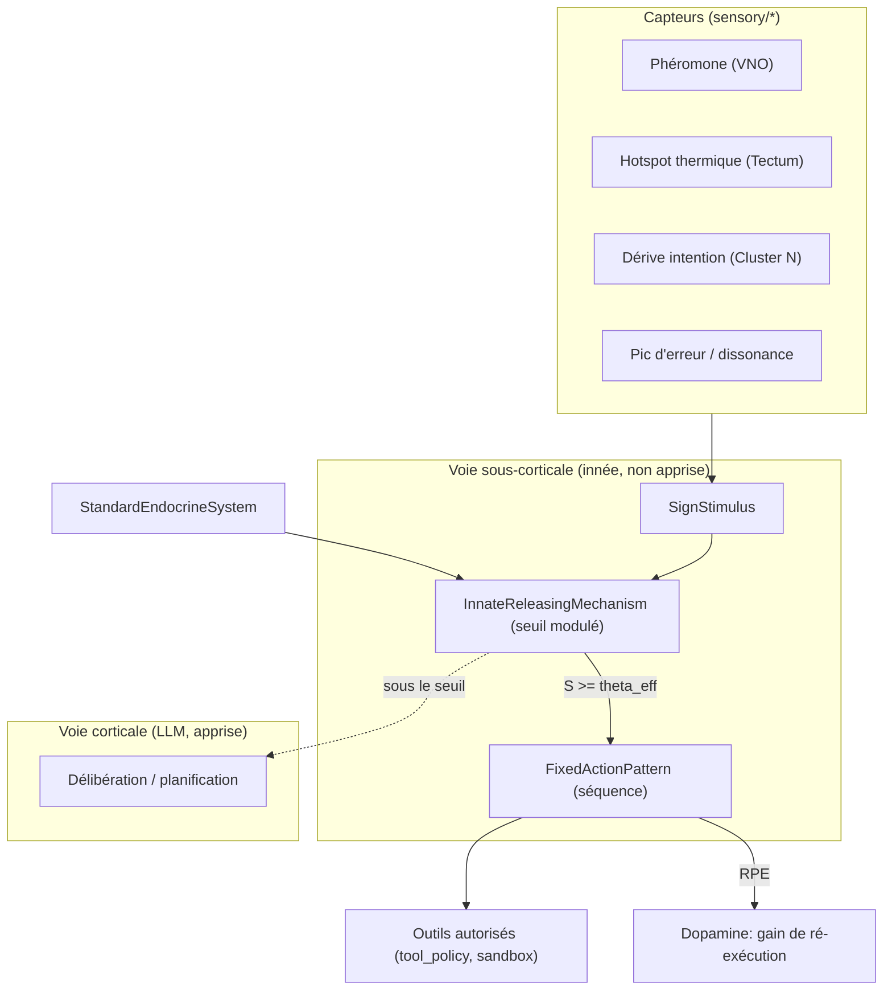
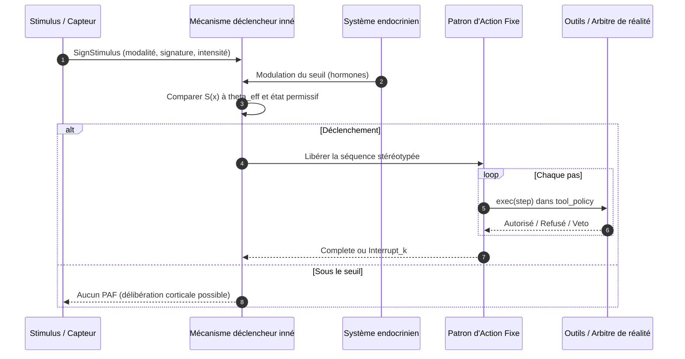

# Instinct — Comportements innés pré-câblés et Patterns d'Action Fixes

## 1. Définition du domaine

L'**instinct** est, dans GenOS, un **programme comportemental inné, complet et stéréotypé**, encodé dès l'embryogenèse dans le génome de l'agent, et déclenché **sans apprentissage préalable** par un **stimulus signe** précis. Il s'exécute par une **voie sous-corticale rapide** qui court-circuite la délibération du modèle de langage (le « cortex ») et se termine par un **Patron d'Action Fixe (PAF)** : une séquence ordonnée d'actions motrices, relativement rigide, déclenchée par un mécanisme déclencheur inné.

Comme tout terme biologique dans GenOS (voir [docs/README.md](../README.md) et [.genos.md](../../.genos.md)), « instinct » sert à **organiser un invariant de calcul** — un comportement présent avant toute donnée d'expérience, hérité, non réécrit par la plasticité — et **non** à revendiquer une équivalence biologique, une conscience ou une autonomie de décision.

### Triade à ne pas confondre

| | Artefact GenOS de référence | Nature | Circuit | Exemple |
| --- | --- | --- | --- | --- |
| **Réflexe** | [`Cnidocyte`](../../crates/genos-biology/src/specialized_cells/cnidocyte.rs), [VNO/Flehmen](../../crates/genos-biology/src/sensory/vomeronasal.rs) | action unique, isolée, involontaire | local, pré-câblé, sans séquence | décharge WAF < 3 µs sur injection de prompt |
| **Instinct** | `InstinctProgram` + `FixedActionPattern` (cette spécification) | séquence de comportements complexes, stéréotypée | sous-cortical, pré-câblé, **non appris** | nidification, parade, défense de ruche, migration |
| **Apprentissage** | synapses/STDP ([NEUROBIOLOGIE_PLASTICITE.md](neurobiologie-et-plasticite.md)), mémoire ([MEMOIRE_APPRENTISSAGE.md](memoire-et-apprentissage.md)) | modification du comportement par l'expérience | cortex (LLM), plasticité synaptique | usage d'un outil, correction d'un plan |

Le réflexe est **mono-action et sans état** ; l'instinct est **multi-étapes, ordonné, porté par le génome et modulé par l'état interne** ; l'apprentissage **crée ou renforce des liaisons** sous l'effet de l'expérience. L'instinct ne crée pas de nouvelle topologie : il est hérité, verrouillé au développement et seulement **modulé** (seuil, priorité, gain).

## 2. Les 4 mécanismes biologiques et leur ancrage GenOS

| Mécanisme biologique | Invariant computationnel | Artefact GenOS existant / cible |
| --- | --- | --- |
| **1. Encodage génétique** (circuits pré-câblés, pas de nouvelles synapses) | le programme inné est présent à la naissance, hérité à 100 %, non appris | [`Gene.developmentally_locked`](../../crates/genos-genome/src/gene.rs) + loci `LOCUS_INSTINCT_*` ; hérédité par `Genome::derive_child()` ; exemption de mutation/méthylation |
| **2. Réseaux sous-corticaux** (tronc cérébral, hypothalamus, amygdale ; bypass du cortex) | voie rapide `Stimulus → IRM → PAF` évaluée **avant** le LLM (zéro token) | nouveau module `genos-biology/instinct` ; réutilise le bypass cortical déjà revendiqué par [BIOMIMICRY_ANIMAL_SENSES.md](biomimetisme/sens-animaux.md) |
| **3. Patron d'Action Fixe (PAF)** (stimulus signe, mécanisme déclencheur inné, exécution stéréotypée) | `SignStimulus` → `InnateReleasingMechanism` → `FixedActionPattern { steps }` | nouveau module `instinct` ; consomme les `sensory/*` ; exécution via outils autorisés |
| **4. Modulation hormonale / neurochimique** (ocytocine, prolactine, testostérone, cortisol, dopamine) | l'état interne module le **seuil** et la **priorité**, pas le câblage | [`StandardEndocrineSystem`](../../crates/genos-core/src/orchestrator/methods.rs) + `handle_endocrine` / `handle_neuromodulation` ([biomimicry_features.rs](../../crates/genos-cli/src/commands/biomimicry_features.rs)) |

Le point clé : les quatre mécanismes sont déjà **partiellement présents** dans le dépôt. L'intégration de l'instinct consiste à les **relier**, pas à créer un nouveau moteur.

## 3. Modèle mathématique ou logique

### 3.1 Détection du stimulus signe

Un stimulus signe `x` est capté par une modalité `m` (phéromone, thermique, magnétique, acoustique, erreur). Le signal saillant est :

$$
S(x) = \sum_{m \in M} w_m \cdot \sigma_m(x_m), \qquad \sigma_m \in [0,1]
$$

où `w_m` pondère la fiabilité de la modalité et `σ_m` la correspondance de signature (couleur, odeur, forme, son — transposés en signatures logiques). Le PAF ne se déclenche que si `S(x) ≥ θ_eff` **et** si l'état interne est permissif (ATP, budget, pas d'apoptose).

### 3.2 Mécanisme déclencheur inné et modulation hormonale

Le seuil effectif est modulé par les hormones et neuromodulateurs, sans jamais modifier la structure du programme inné :

$$
\theta_{eff} = \theta_{base} \cdot \mathrm{clamp}\!\Big(1 - \alpha \cdot o - \alpha' \cdot p + \beta \cdot c + \beta' \cdot t,\; 0.1,\; 1.5\Big)
$$

où `o` = ocytocine et `p` = prolactine **abaissent** le seuil (comportements maternels et de soin), `c` = cortisol et `t` = testostérone le **modulent** (territorialité, agression, fuite). La dopamine agit séparément sur le **gain d'exécution** :

$$
g = 1 + \delta \cdot d \;(d \in [0,1])
$$

La dopamine **ne câble pas** l'instinct : elle renforce la probabilité de ré-exécution via l'erreur de prédiction de récompense (`RPE`), ce qui est une modulation motivationnelle, pas un apprentissage de la séquence.

### 3.3 Exécution du Patron d'Action Fixe

Un PAF est une séquence finie `π = (a_1, …, a_n)` d'actions motrices. Il s'exécute **jusqu'à complétion** (*runs to completion*, signature de Lorenz) sauf **veto** explicite (sécurité, apoptose, budget épuisé) :

$$
\mathrm{run}(\pi) = \begin{cases} \text{Complete} & \text{si } \forall i,\; \text{exec}(a_i) \land \text{no\_veto} \\ \text{Interrupt}_k & \text{si veto au pas } k \end{cases}
$$

Un PAF interrompu n'est pas « partiellement appris » : l'instinct reste intact, seule l'occurrence a été stoppée.

## 4. Analogies biologiques et limites réelles

| Concept GenOS | Analogie biologique | Réalité en GenOS |
| --- | --- | --- |
| `SignStimulus` | stimulus signe (couleur, odeur, silhouette) | signature logique extraite par `sensory/*` |
| `InnateReleasingMechanism` | mécanisme déclencheur inné | comparateur de seuil modulé, sans délibération |
| `FixedActionPattern` | séquence stéréotypée (toile, parade, nid) | liste ordonnée d'appels d'outils autorisés |
| Voie sous-corticale | tronc cérébral, hypothalamus, amygdale | évaluation avant LLM, coût token ≈ 0 |
| Ocytocine / prolactine | soin, attachement | `StandardEndocrineSystem`, abaisse `θ_eff` |
| Testostérone / cortisol | territorialité, fuite | élève `θ_eff`, oriente défense/fuite |
| Dopamine (RPE) | renforcement par récompense | gain `g`, ré-exécution, **sans** réécriture synaptique |

**Limites réelles.** GenOS ne simule pas la neurogenèse ni les circuits neuronaux biologiques. Un « circuit pré-câblé » n'est ici qu'un **programme déclaratif verrouillé** au développement, hérité et non appris. La stéréotypie est une **propriété de la spécification**, pas une émergence. Un PAF ne peut exécuter que des actions **déjà autorisées** par la politique d'outils ; il n'est ni un exécuteur de code arbitraire, ni un contournement des gates de preuve.

## 5. Cas d'usage et objectifs métier

1. **Réaction immédiate à faible coût** : déclencher une réponse connue (mise en quarantaine, gel défensif, ré-alignement d'intention) sans appeler un LLM, en zéro token.
2. **Cohérence d'espèce** : tous les agents d'une même espèce exécutent le même PAF en réponse au même stimulus, garantissant une réponse homogène.
3. **Continuité des lignées** : les instincts sont transmis à 100 % par reproduction, indépendamment des mutations acquises, ce qui stabilise les comportements critiques.
4. **Modulation contextuelle** : le même instinct s'exprime différemment selon l'état hormonal/énergétique (maternel vs territorial), sans reprogrammation.
5. **Séparation d'avec l'apprentissage** : isoler les comportements non appris des politiques apprises, pour auditer ce qui relève de l'inné et ce qui relève de l'expérience.

## 6. Exemples concrets

### 6.1 Génome d'un agent instinctif (extrait de manifeste)

```jsonc
{
  "metadata": { "name": "ForagerScout", "version": "0.1.0" },
  "cognition": {
    "organelles": ["instinct", "fixed-action-pattern", "innate-releasing"]
  },
  "genome": {
    "instincts": [
      {
        "locus": "LOCUS_INSTINCT_FORAGE_RETURN",
        "developmentally_locked": true,
        "stimulus": { "modality": "pheromone", "signature": "resource_exhausted", "base_threshold": 0.72 },
        "paf": ["deposit_harvest_marker", "reorient_goal_vector", "return_to_hive"]
      }
    ]
  }
}
```

### 6.2 Surface CLI (cible)

```bash
genos biomimicry bio --feature instinct --action trigger \
  --agent-id forager-01 --modality pheromone --signature resource_exhausted --intensity 0.91

genos biomimicry bio --feature instinct --action list --agent-id forager-01
```

### 6.3 Outil MCP (cible)

```jsonc
{ "tool": "genos_biomimicry", "feature": "instinct", "action": "trigger",
  "agent_id": "forager-01", "modality": "pheromone",
  "signature": "resource_exhausted", "intensity": 0.91 }
```

## 7. Schéma ou diagramme

### 7.1 Voie instinctive rapide vs voie corticale lente



### 7.2 Séquence d'exécution et de veto



## 8. Architecture technique

### 8.1 Nouveau module `instinct`

Cible : `crates/genos-biology/src/instinct/` (découpé en fichiers pour rester sous la limite de 400 lignes) :

| Fichier | Contenu | Rôle |
| --- | --- | --- |
| `sign_stimulus.rs` | `Modality`, `SignStimulus` | signature et intensité du déclencheur |
| `innate_releasing.rs` | `InnateReleasingMechanism` | comparateur de seuil, modulation hormonale |
| `paf.rs` | `MotorStep`, `FixedActionPattern`, `InstinctOutcome` | séquence stéréotypée et son exécution/verdict |
| `mod.rs` | `InstinctProgram`, `InstinctLibrary` | agrégation, ré-export |

Contrainte `.genos.md` : fonctions ≤ 3 paramètres (regrouper en structs de contexte), complexité cyclomatique ≤ 10.

### 8.2 Encodage génomique

Deux options, tranchées par l'[ADR 0004](../adr/0004-instinct-innate-circuits.md) :

- **Option A (recommandée, phase 1)** : réutiliser `Gene` avec `developmentally_locked = true` et des loci `LOCUS_INSTINCT_*`. Aucun changement du format binaire. Les instincts sont exemptés de `mutate_stochastic` et de la méthylation.
- **Option B (phase 2)** : ajouter une section binaire `SectionTag::Inst => b"INST"` dans [`crates/genos-dna/src/section.rs`](../../crates/genos-dna/src/section.rs), pour séparer les séquences motrices des gènes appris. Requiert un ADR dédié (changement de format).

### 8.3 Points de branchement existants

- **Endocrinien** : `StandardEndocrineSystem` ([methods.rs](../../crates/genos-core/src/orchestrator/methods.rs)) fournit déjà le cortisol ; étendre aux hormones de soin et de territorialité.
- **CLI** : ajouter `"instinct"` dans le `match` de `handle_bio_feature` ([biomimicry_features.rs](../../crates/genos-cli/src/commands/biomimicry_features.rs)).
- **MCP** : exposer la feature `instinct` du tool `genos_biomimicry` ([tools.rs](../../crates/genos-mcp/src/tools.rs), [executor.rs](../../crates/genos-mcp/src/executor.rs)).
- **Agents** : `agents/biomimetique/instinct_*.agent.json` avec `organelles: ["instinct", "fixed-action-pattern", "innate-releasing"]`, sur le modèle de `cnidocyte_guard.agent.json`.
- **Capteurs** : les sorties de `crates/genos-biology/src/sensory/` alimentent directement `SignStimulus`.

## 9. Processus d'exécution ou de validation

1. **Encodage** (embryogenèse) : le programme inné est écrit dans le génome avec verrou de développement ; il ne dépend d'aucune donnée d'entraînement.
2. **Héritage** : `Genome::derive_child()` transmet les instincts à 100 % ; ils sont exclus de l'hypermutation et de la reprogrammation Yamanaka.
3. **Capture** : une sortie d'un capteur produit un `SignStimulus` normalisé.
4. **Déclenchement** : l'IRM compare `S(x)` à `θ_eff` (modulé par l'endocrinien) et vérifie l'état permissif (budget, ATP, non-apoptose).
5. **Exécution** : le PAF déroule ses pas via les outils **déjà autorisés** par `tool_policy` et le sandbox ; chaque pas reste journalisé et soumis à l'arbitre de réalité ([`runtime_arbiter.js`](../../runtime_arbiter.js)).
6. **Verdict** : `Complete` ou `Interrupt_k` ; un PAF interrompu n'altère pas le câblage.
7. **Modulation** : le `RPE` dopaminergique ajuste le gain de ré-exécution ; aucune synapse n'est créée par l'instinct lui-même.
8. **Audit** : télémétrie `INSTINCT_TRIGGER`, `INSTINCT_COMPLETE`, `INSTINCT_INTERRUPT` avec stimulus, seuil effectif, hormones et pas exécutés.

**Règle d'or** : le bypass du cortex **n'est pas** un bypass de la preuve. Un PAF ne peut déclencher que des actions pré-autorisées, tracées et budgétées ; toute action sensible conserve approbation et journalisation.

## 10. Comparaison avec le marché

| Approche | Capacité habituelle | Positionnement GenOS |
| --- | --- | --- |
| Systèmes à règles (production rules, Drools) | règles explicites déclenchées par faits | GenOS ajoute l'héritage génomique, le verrou de développement et la modulation hormonale continue |
| Architectures de subsomption (Brooks), agents réactifs | couches réflexes sans délibération | GenOS distingue réflexe et instinct, et garantit la traçabilité des séquences |
| Routage / classifieurs d'intention | mapper une entrée à une action | GenOS modélise un PAF **multi-étapes** et son veto, pas seulement une classification |
| Hooks / webhooks / event handlers | exécuter un script sur événement | GenOS borne les actions par `tool_policy`, sandbox et arbitre de réalité |
| Policy engines (feature flags, OPA) | décisions de politique auditables | GenOS ajoute l'inné/non-appris et la modulation par l'état interne de l'agent |

Le point distinctif est l'union d'un **programme comportemental hérité et verrouillé**, d'une **voie rapide sans LLM** et d'une **modulation hormonale** — le tout sous la gouvernance de preuve commune à GenOS.

## 11. Limites, garde-fous, non-objectifs

- **Non-objectif** : simuler des circuits neuronaux biologiques ou une conscience.
- **Non-objectif** : un mécanisme par lequel un agent « décide » de manière autonome hors politique.
- **Non-objectif** : un exécuteur de code arbitraire ; le PAF n'appelle que des outils autorisés.
- **Garde-fou – sécurité** : le court-circuit cortical reste sous l'arbitre de réalité, le sandbox et les leases d'outils ; l'instinct n'élève jamais ses permissions.
- **Garde-fou – preuve** : un déclenchement instinctif n'est pas une preuve de vérité métier ; il doit être journalisé et, pour toute action sensible, soumis au gate humain.
- **Garde-fou – stabilité** : les loci `LOCUS_INSTINCT_*` sont exemptés de mutation et de méthylation ; une modification d'instinct est une décision d'architecture, pas une dérive d'exécution.
- **Risque** : un stimulus signe trop permissif peut produire des déclenchements en boucle ; le seuil, le gain dopaminergique et la fréquence doivent être bornés et observés (`INSTINCT_INTERRUPT`, budgets).

## Voir aussi

- [adr/0004-instinct-innate-circuits.md](../adr/0004-instinct-innate-circuits.md) — décision d'architecture et alternatives.
- [GENOME_EPIGENETIQUE.md](genome-et-epigenetique.md) — gènes, chromatine, verrou de développement, hérédité.
- [NEUROBIOLOGIE_PLASTICITE.md](neurobiologie-et-plasticite.md) — apprentissage, STDP et distinction avec l'inné.
- [BIOMIMICRY_ANIMAL_SENSES.md](biomimetisme/sens-animaux.md) — capteurs produisant les stimuli signes et bypass cortical.
- [BIOMIMETISME_CELLULAIRE_SPECIALISE.md](biomimetisme/cellulaire-specialise.md) — cellules spécialisées et primitives biomimétiques.
- [MEMOIRE_APPRENTISSAGE.md](memoire-et-apprentissage.md) — mémoire et consolidation, opposées à l'inné.
- [EPISTEMOLOGIE_EVIDENCE.md](epistemologie-et-evidence.md) — preuve, arbitre de réalité et garde-fous.
