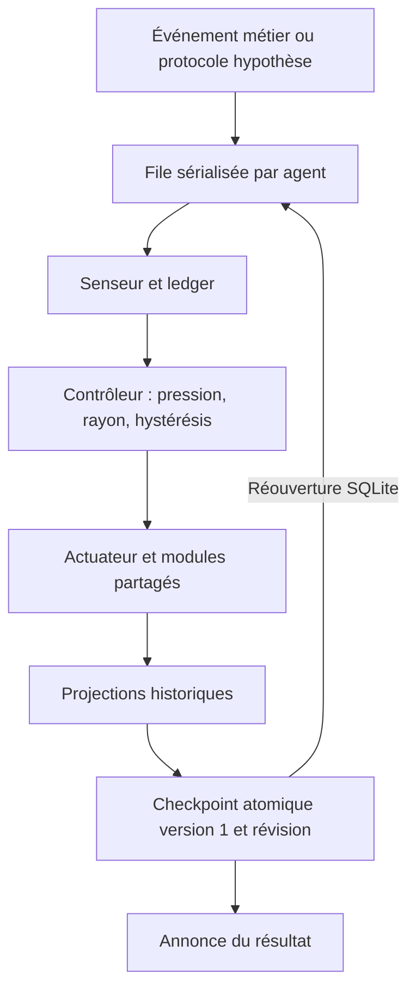

# Natural Search Control Plane

- **Statut au 2026-10-06** : phases 1–12 raccordées au runtime backend.
  La reprise durable des états des phases 6–12 est implémentée et démontrée
  après arrêt brutal et réouverture SQLite.
- **Dernière revue** : 2026-10-06.
- **Portée** : contrôle de recherche interne dans `backend/src/services/search/`.
- **Décisions** : [ADR 0032](../adr/0032-natural-search-control-plane.md) et
  [ADR 0323 — reprise atomique](../adr/0323-reprise-atomique-natural-search.md).

## Contrat runtime

`agentProcessEventPipeline` appelle `checkNaturalSearchControl(ctx, event)`.
Les événements alimentent le senseur et le ledger. Le contrôleur choisit un
processus avec pression, rayon et hystérésis ; l'actuateur exécute le service
correspondant. Les reçus distinguent succès, opération ignorée et échec.
La décision et le checkpoint sont écrits avant l'annonce du succès.

Les cinq événements `HYPOTHESIS_*` de proposition, début de test, progrès,
falsification et suspension participent au même chemin. Une proposition répétée
conserve son identité. Une hypothèse et ses preuves restent liées à leur agent.

### Mesures et preuves

La provenance vient de la source runtime : les champs de provenance du payload
sont ignorés. `EVIDENCE_REPORT` reste auto-déclaré ; un résultat d'outil est
observé et ne devient pas vérifié par son nom. Les gains non finis ou négatifs
ne gonflent pas les compteurs. Les forces et fiabilités nulles restent nulles.

Les UPSERT préservent identité, propriétaire, date de création et liens étrangers.
La recharge ne rattache pas les preuves archivées à une hypothèse explicitement
rouverte. Après plus de cinq étapes de stagnation sans hypothèse active, le
runtime peut proposer une hypothèse du génome sous réserve de la mémoire négative.

## Phases 6–12

| Phase | Module | Exécution actuelle | État repris |
| --- | --- | --- | --- |
| 6 | Search Genome | Hypermutation structurée selon le rayon sélectionné | Génome, exploration, opérateurs et mutations |
| 7 | Cognitive Affinity | Création et classement de variants admissibles ; proposition au ledger | Variants et génome retenu |
| 8 | Generalized Foraging | Gain mesuré ; maintien ou départ ; nouveau patch après départ | Patches, visites, départs et historique |
| 9 | Causal Replay | Analyse du journal disponible et de ses checkpoints ; entrée vide ignorée | Historique d'analyse et événements bornés |
| 10 | Negative Search Memory | Falsification vers trail dédupliqué ; blocage par agent et énoncé exact ; évaporation TTL | Trails, conditions, confiance et expiration |
| 11 | Search Evolution | Une génération sur la population existante ; fitness issue du ledger ; adoption du meilleur génome | Population, génération et historique |
| 12 | Cultural Transmission | Compilation sous preuve, outbox durable, réception idempotente et candidature aux variants | Plasmides, transmissions et réceptions |

`ActuatorModules` instancie les sept modules. Runtime et intégration utilisent
les mêmes génome, mémoire négative et culture. L'hystérésis conserve ses
compteurs après redémarrage ; évolution, forage et replay disposent de sorties.

La plasticité change la topologie du **génome de recherche** durable, sans
modifier les autorisations de l'agent. La spéciation persiste des niches SQLite
et annonce le nombre réellement créé.

### Culture et promotion

Un succès d'évolution ou de sélection clonale ne suffit pas à transmettre.
L'appelant runtime fournit une validation du génome concerné : reproductibilité,
taux fini d'au moins 0,7 et deux références distinctes. Ces références doivent
correspondre à des preuves observées ou vérifiées d'hypothèses soutenues de la
famille concernée.

La transmission cible un autre agent de la même organisation et du même projet.
Le récepteur lit l'outbox du checkpoint engagé du producteur, déduplique et
conserve ses réceptions après redémarrage. Un changement de périmètre du
récepteur retire les candidats reçus devenus incompatibles.

Le trait reçu devient un candidat. Il ne promeut aucune décision. Le runtime
ne fabrique ni reproductibilité ni preuve indépendante.

## Architecture technique et reprise durable

Le schéma représente le chemin d'une décision de recherche exécutée. La reprise
lit le checkpoint engagé ; une projection isolée ne définit pas cet état.

`search_runtime_checkpoint` est la source de reprise prioritaire. Le document
versionné conserve ledger, preuves, pression exacte, processus, hystérésis,
compteurs, senseur, budgets, journal causal borné à 100 événements, reçus et
les sept états de modules.

Une instruction SQLite remplace atomiquement le document. Une révision comparée
à celle chargée refuse les écrivains périmés. Les opérations d'un agent sont
sérialisées dans le processus. L'initialisation n'est publiée qu'après restauration,
réception culturelle et création du premier checkpoint.

Les tables historiques et `search_module_state` sont des projections et une
voie de migration des anciens états. Une panne peut les laisser partiellement
écrites ; la reprise retrouve le précédent checkpoint cohérent. Les formats
bruts historiques sont lus ; les nouvelles écritures utilisent la version 1.

Un JSON corrompu, une version inconnue, une forme incompatible, un conflit
d'identité ou une écriture échouée provoque une erreur explicite.
`clearSearchState` attend le flush et conserve la mémoire si celui-ci échoue.
Le pipeline reçoit un signal d'arrêt du traitement courant.

## Validation du 2026-10-06

`npm --prefix backend run test:natural-search` : **21 scripts passés**.
La suite couvre réouverture complète des modules et prochaine décision,
arrêt brutal après projections partielles, douze événements concurrents,
écrivain périmé, flush échoué, provenance falsifiée, identité étrangère,
formats corrompus, routage réel, expiration et réception culturelle durable.

| Scénario | Script dans `backend/tests/search/` |
| --- | --- |
| Sept états de module relus après fermeture SQLite | `test_natural_search_module_restore.js` |
| État complet, prochaine décision, concurrence et flush refusé | `test_natural_search_durability.js` |
| Arrêt brutal après projections partielles et écrivain périmé | `test_natural_search_crash.js` |
| Provenance, formats, propriétaires et livraison culturelle | `test_natural_search_integrity.js` |
| Rayon exécuté, sorties des processus, TTL et schéma de production | `test_natural_search_routing.js` |

La plasticité est vérifiée avec un schéma d'agents sans colonnes fictives
`topology` ou `tools`. Les fixtures de reprise utilisent WAL, les clés étrangères
et une télémétrie isolée de la base de production.

`npm test` et `cargo test --workspace --offline -j 2` : **passés**.
Ces résultats portent sur la révision `f101f24f`, dans une copie isolée du dépôt.
Après des échecs dus au manque d'espace sur le disque initial, la validation
globale a été exécutée avec caches, build et fichiers temporaires sur un autre
volume, sans modifier les tests. Les 34 fichiers source changés passent le
contrôle strict sans violation. Le contrôle global compte 338 violations,
dont 189 au-delà du baseline, dans des fichiers préexistants hors de ce lot.
Ces résultats ne constituent pas une certification du parcours MCP GenOS.

Voir [Tests et validation](../06-qualite-preuves/tests-et-validation.md#32-natural-search--reprise-et-intégrité)
et le [runbook de reprise](../04-exploitation/runbook-recovery.md#8-natural-search-checkpoint-recovery).

## Planning-gap et limites

Le harness synthétique compare douze tâches Blocksworld et TrapChain au budget
commun de 240 expansions et vérifie les plans avec des validateurs et une BFS.
Résultat actuel : ReAct 9/12, ToT 11/12, MCTS 6/12, GenOS 12/12 ; les douze
plans GenOS atteignent les optimums sur ce jeu.

Cette mesure valide le harness et le tri de frontière par coût et heuristique.
Elle ne mesure pas l'efficacité causale des phases 6–12 en production.

- Le replay analyse les checkpoints disponibles ; il ne restaure pas un
  workspace externe ni un journal complet d'agent.
- La spéciation crée des niches ; elle ne lance pas de nouveaux agents.
- Les conditions des trails sont conservées ; le blocage utilise l'agent,
  l'énoncé exact et le TTL.
- La validation culturelle est une entrée explicite de l'appelant runtime.
- La reprise garantit l'état interne engagé. Les projections seules ne sont
  pas une garantie atomique. Un conflit exige une recharge ; le vieillissement
  réel de la fenêtre de mesures peut changer la prochaine décision.
