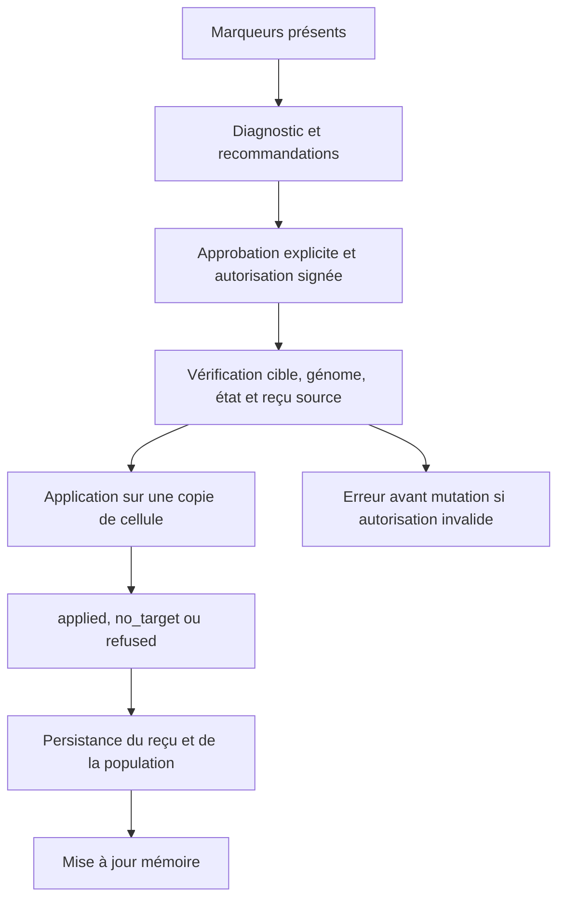

# Pathologie et médecine computationnelle GenOS

- **Statut** : Partiel — catalogue et application Rust implémentés; surveillance Node distincte et mécanismes biologiques détaillés proposés.
- **Portée** : état clinique logiciel, diagnostic et application autorisée persistante.
- **Dernière revue** : 2026-10-06.

## 1. Définition

La nosologie décrit des états simulés des agents. Un échec ordinaire de tâche ne constitue pas un diagnostic. Le runtime Rust représente 28 conditions dans neuf familles : auto-immunes, dégénératives, infectieuses, génétiques, cancers, métaboliques, cardiovasculaires, psychiatriques et environnementales. Les catégories nosocomiales et iatrogènes historiques restent présentes à côté de ces conditions.

Le [catalogue runtime](catalogue-runtime.md), généré depuis [shared/nosology.json](../../../shared/nosology.json), définit 48 opérateurs de marqueurs. L’énumération `SystemicTherapy` comporte 59 variantes : ces opérateurs, cinq variantes historiques supplémentaires sans paramètres et six variantes paramétrées.

## 2. Modèle logique et bornes

Une mesure est valide si elle est finie et comprise entre 0 et 1. Pour une condition du catalogue, une mesure valide strictement supérieure à 0,5 produit un diagnostic `Pathology::NosologicalCondition`, identifié par la condition et sa sévérité. Le tick synchronise les diagnostics; le rapport clinique propose des traitements compatibles avec les cibles et les gardes.

Un opérateur de marqueur diminue chaque cible présente et valide de 0,25, avec un plancher à zéro. La rémission exige qu’une cible de la condition ait changé et que toutes ses mesures soient présentes, valides et inférieures ou égales au seuil. Une mesure manquante ne démontre pas une rémission.

L’apoptose interdit l’application. Les gardes et risques explicites du catalogue sont vérifiés avant mutation. La thrombolyse exige `blood_brain_barrier_integrity > 0,5`. Un effet secondaire de marqueur n’est appliqué que si son risque est explicitement représenté par une mesure valide.

## 3. Analogies biologiques et limites

Les noms de maladies et de médicaments désignent des abstractions logicielles. Les équations, posologies, mutations génétiques, restaurations synaptiques et scénarios des [neuf fiches](README.md) conservent un rôle conceptuel. Leur présence dans une fiche ne crée aucun effet exécutable supplémentaire.

Une baisse de `fibrillar_load` ne purge pas un index vectoriel. `FetalCarrierReactivation` ne réécrit pas le génome; `IntensiveCareFluids` réduit `perfusion_deficit` sans recharger l’ATP. Les simulations ne valident aucune pathologie réelle ni aucun traitement humain.

## 4. États historiques et effets propres

| Intervention | Effet appliqué sur l’état logiciel |
|---|---|
| Tocilizumab | Réduit l’indice inflammatoire de 0,5 et retire le diagnostic historique d’orage cytokinique. |
| Corticosteroids(dose) | Dose finie dans [0,1]; réduction dose × 0,8. Dose nulle sans effet; dose > 0,8 induisant un coma simulé. |
| ImmunosuppressiveWash, SelfToleranceRecalibration | Retirent les diagnostics historiques d’hyperactivation/ciblage auto-immun, annulent l’indice inflammatoire et réduisent autoantibody_load présent. |
| QuarantineIsolation { capsule_id } | Enregistre l’isolement et la référence de capsule dans l’état clinique. |
| AntisepticPurge { target_signature } | Retire les diagnostics de contamination correspondant à la signature ou au site; l’isolement est levé seulement si la purge retire le dernier diagnostic actif. |
| Antiviral, Vaccine(spike) | Le premier retire les diagnostics historiques d’infection virale exogène; le second augmente vaccine_immunity:spike de 0,25, borné à 1. |
| DetoxificationWashout | Retire les quatre diagnostics iatrogènes historiques; un effet secondaire de marqueur reste présent tant que son risque persiste. |
| AntidoteAdmin { target_drug } | Cible le coma associé à Corticosteroids ou le blocage associé à Tocilizumab. |
| HomeostaticDoseCorrection | Retire le diagnostic historique de coma stéroïdien. |
| StemCellReplacement | Réinitialise les cicatrices et la sénescence; une mémoire prionique ne reçoit pas une rémission fictive. |
| TelomeraseActivation { extended_ticks } | Étend la limite de Hayflick avec saturation; retire la sénescence résolue lorsque l’extension est positive et dépasse les cicatrices présentes. |

Ces mutations ne constituent pas une stérilisation de capsule, un filtrage réseau ou une reconstruction d’agent. Les recommandations du rapport restent des propositions.

## 5. Exemple de contrat

Avec `metal_toxin_load = 0,75`, `ChelationTherapy` réduit ce marqueur à 0,50. `LeadPoisoning` peut être retiré si les conditions de rémission sont satisfaites. Si `cofactor_deficit` est explicitement présent, le contrat définit aussi son augmentation bornée de 0,05. Sans cible modifiable, le résultat est `no_target`.

| Résultat | Sens | treatment_administered |
|---|---|---|
| applied | Une mutation effective est observée. | true |
| no_target | Aucune cible modifiable n’est présente. | false |
| refused | Une garde, un paramètre ou l’état de la cellule interdit l’application. | false |
| not_executed, dans la CLI | Journal ou autorisation absent. | false |

Les anciens payloads de `TherapyOutcome` sans statut sont désérialisés avec `unspecified`; ce statut n’atteste aucune application.

## 6. Parcours d’application

Le tick ne déclenche pas automatiquement les thérapies proposées. Un rejeu identique de l’autorisation retrouve le reçu existant et n’applique aucune seconde mutation.

## 7. Architecture technique

- [genos-cell/clinical.rs](../../../crates/genos-cell/src/clinical.rs) et [genos-cell/nosology.rs](../../../crates/genos-cell/src/nosology.rs) : catégories, conditions et état clinique.
- [genos-biology/nosology.rs](../../../crates/genos-biology/src/nosology.rs), [nosology_catalog.rs](../../../crates/genos-biology/src/nosology_catalog.rs) et [pathology.rs](../../../crates/genos-biology/src/pathology.rs) : catalogue, diagnostic et propositions.
- [therapy.rs](../../../crates/genos-biology/src/therapy.rs), [therapy_dispatch.rs](../../../crates/genos-biology/src/therapy_dispatch.rs) et [therapy_legacy.rs](../../../crates/genos-biology/src/therapy_legacy.rs) : types, résultats, gardes et effets.
- [authorized_therapy.rs](../../../crates/genos-orchestrator/src/authorized_therapy.rs) : signature, contexte durable, idempotence et persistance.
- [therapyAuthorizationService.js](../../../backend/src/services/medical/therapyAuthorizationService.js) et [nosologyCatalogService.js](../../../backend/src/services/medical/nosologyCatalogService.js) : approbateur et validation des types avant signature.

La [référence API](../../03-reference/api-et-contrats.md#autorisation-et-application-cliniques) décrit le contrat client. L’[ADR 0326](../../adr/0326-catalogue-nosologique-et-preuve-application.md) fixe la décision et les limites.

## 8. Processus d’exécution et de validation

`POST /api/rust/clinical-authorizations` émet une autorisation pour une cellule de la population Rust courante, liée à une mission, un génome, une empreinte d’état et un reçu source. La CLI `genos biomimicry therapy` restaure le journal et applique exactement le type et la cible signés. Ses fichiers doivent rester sous `GENOS_WORKSPACE_ROOT`, ou le répertoire courant en l’absence de cette variable.

Le reçu `genos.clinical-application/v1` et la population sont persistés avant la mise à jour mémoire. La CLI conserve `success = false` quand `treatment_administered = false`. Une signature invalide ou un contexte périmé échoue avant toute mutation. La réussite du transport ou de la signature seule ne prouve pas une application.

Le [bilan daté](../../06-qualite-preuves/validation-nosologie.md) consigne 103 tests Rust ciblés réussis, les vérifications Node et les limites des contrôles globaux. Le parcours HTTP → Rust complet reste non validé dans cette campagne.

## 9. Comparaison des surfaces cliniques Node et Rust

| Surface | État et diagnostic | Application |
|---|---|---|
| Rust | ClinicalState des AgentCell et conditions de shared/nosology.json. | SystemicTherapy et autorisation durable signée. |
| Node | Tables clinical_states, immune_events, pathologies et treatments; surveillance des vitals et charges backend. | Services médicaux Node avec leurs propres types et autorisations. |

[clinicalStateService.js](../../../backend/src/services/medical/clinicalStateService.js) et [immuneSurveillanceService.js](../../../backend/src/services/medical/immuneSurveillanceService.js) assurent la surveillance Node. La séquence est `surveillanceScan → biopsy → diagnose → therapy proportionnée → monitor`. Les détections `cognitive_metastasis` et `quarantine_breach` à haute confiance peuvent déclencher une quarantaine.

Le score de confiance Node est déterministe : `clamp(severity) × 0,7 + 0,3`. Il n’est ni une probabilité calibrée ni une validation indépendante. Les états Node et Rust ne sont pas interchangeables; un diagnostic Node n’applique pas automatiquement une variante Rust.

## 10. Limites et références

- Aucun chaînage universel de tous les chemins de mission vers une thérapie n’est attesté.
- La présence d’une variante Rust n’ajoute aucun outil MCP; exposition et lease restent nécessaires.
- Les scénarios de réparation structurelle des fiches restent proposés au-delà du contrat de marqueurs.
- Les tests ciblés ne constituent pas une validation globale du dépôt ni une preuve médicale.

Voir la [vue d’ensemble](vue-ensemble.md), le [catalogue runtime](catalogue-runtime.md), le [protocole d’exécution](../../02-orchestration/protocole-execution-agents.md#8-utilisation-de-la-nosologie) et les [garde-fous](../../05-securite-gouvernance/securite.md).
