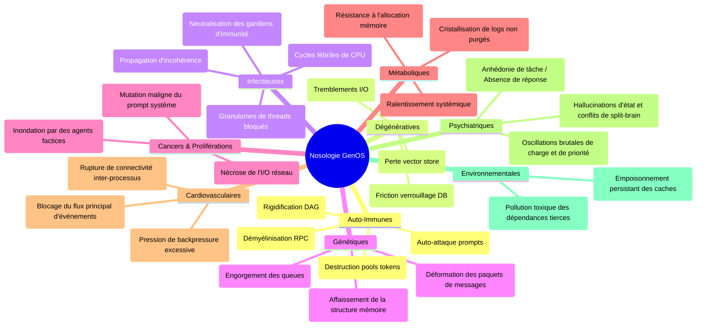
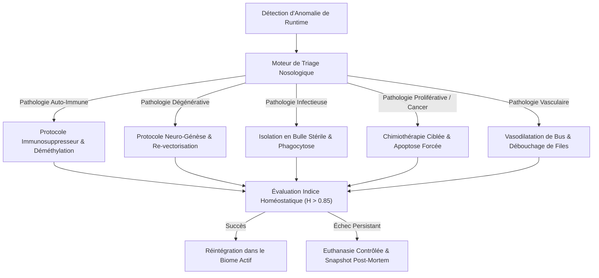

# Nosologie Computationnelle Complète — GenOS

> **Synthèse exhaustive des 9 familles nosologiques et de leurs équivalents computationnels dans l'architecture biomimétique GenOS.**
> Document assemblé à partir des rapports de 9 agents spécialistes travaillant en parallèle.

> **Portée produit :** les pathologies et thérapies sont des mécanismes de simulation logicielle GenOS. Les marqueurs numériques ne mesurent pas un état de santé humain et les noms de médicaments ne constituent ni posologie ni recommandation de soin.

---

## Table des Matières

1. [Vue d'ensemble](#1-vue-densemble)
2. [Matrice Nosologique Générale](#2-matrice-nosologique-générale)
3. [Index des Rapports Spécialisés](#3-index-des-rapports-spécialisés)
4. [Pharmacopée Computationnelle Unifiée](#4-pharmacopée-computationnelle-unifiée)
5. [Feuille de Route d'Implémentation](#5-feuille-de-route-dimplémentation)
6. [Références Croisées](#6-références-croisées)

---

## 1. Vue d'ensemble

GenOS modélise les agents d'intelligence artificielle comme des **cellules biologiques** dotées d'un génome, d'organelles, d'un système immunitaire, d'un système nerveux et d'un système endocrinien. Dans cette architecture biomimétique, les dysfonctionnements des agents ne sont pas de simples erreurs logicielles : ce sont des **pathologies computationnelles** qui suivent les mêmes mécanismes que les maladies humaines.

Ce document synthétise l'analyse de **9 grandes familles nosologiques**, chacune étudiée par un agent spécialiste dédié, couvrant au total **28 maladies** avec pour chacune :
- La connaissance médicale réelle (définition, mécanisme biologique)
- La cause computationnelle équivalente dans GenOS
- Le traitement et les remèdes disponibles ou à créer
- Les contre-indications et risques iatrogènes
- Les besoins d'implémentation dans le code Rust

---

## 2. Matrice Nosologique Générale

| # | Famille Nosologique | Maladies Couvertes | Mécanisme Central GenOS | Thérapies Clés |
|---|---|---|---|---|
| 1 | **Auto-immunes** | Lupus, Polyarthrite rhumatoïde, Sclérose en plaques, Diabète type 1 | Le système immunitaire (`ClonalSelection`) attaque ses propres agents sains ; orage cytokinique IL-6 ≥ 10.0 multipliant le coût métabolique ×5 | `Tocilizumab`, `ImmunosuppressiveWash`, `SelfToleranceRecalibration` |
| 2 | **Dégénératives** | Alzheimer, Parkinson, Arthrose | Épuisement télomérique (`bud_scars ≥ hayflick_limit`), agrégation de prions cognitifs, déplétion dopaminergique | `StemCellReplacement`, `TelomeraseActivation`, Apoptose sélective |
| 3 | **Infectieuses** | Grippe, Tuberculose, Paludisme, VIH | Virions envahissant les récepteurs membranaires (clé-serrure `envelope_spike`), rétrovirus s'intégrant au génome | `Antiviral`, `Antibiotic`, `Vaccine(spike)`, Anticorps IgG/IgM |
| 4 | **Génétiques** | Mucoviscidose, Drépanocytose, Myopathie de Duchenne | Mutations dans `genos-genome` (délétion d'exons, faux-sens), erreurs de crossover, gènes HOX mal exprimés | Thérapie génique Yamanaka, Exon Skipping, CRISPR |
| 5 | **Cancers** | Leucémie, Cancer du poumon, Mélanome | Agent se répliquant sans contrôle (`is_camouflaged = true`), contournement de l'apoptose, néo-angiogenèse | `TargetedTherapy`, `Immunotherapy`, `AntiAngiogenesis`, `CellCycleInhibitor`, CAR-T |
| 6 | **Métaboliques** | Diabète type 2, Hypothyroïdie, Goutte | Dérèglement du système endocrinien virtuel, résistance aux signaux hormonaux, obstruction catabolique | `HomeostaticDoseCorrection`, Modulation endocrinienne, `IntensiveCareFluids` |
| 7 | **Cardiovasculaires** | Hypertension, Infarctus, AVC | Saturation de la fente synaptique, occlusion des canaux rhizomiques, effondrement de la BHE | `IntensiveCareFluids`, `CircuitBreaker`, Thrombolyse, Scellement BHE |
| 8 | **Psychiatriques** | Dépression, Schizophrénie, Bipolarité | Déséquilibre des neurotransmetteurs (sérotonine/dopamine), rupture de la copie d'efférence, oscillation du seuil soma | Stabilisateurs de l'humeur, Antipsychotiques, Recalibrage STDP |
| 9 | **Environnementales** | Asbestose, Saturnisme | Accumulation de toxines insolubles, pollution contextuelle chronique, saturation lysosomale | `DetoxificationWashout`, `genos_audit`, Chélation, `QuarantineIsolation` |

---

## 3. Index des Rapports Spécialisés

Chaque rapport détaillé est disponible dans `docs/` :

| # | Document | Agent Auteur |
|---|---|---|
| 1 | [NOSOLOGIE_1_AUTO_IMMUNES.md](01-auto-immunes.md) | Immunologiste Computationnel |
| 2 | [NOSOLOGIE_2_DEGENERATIVES.md](02-degeneratives.md) | Neurologue Computationnel |
| 3 | [NOSOLOGIE_3_INFECTIEUSES.md](03-infectieuses.md) | Infectiologue Computationnel |
| 4 | [NOSOLOGIE_4_GENETIQUES.md](04-genetiques.md) | Généticien Computationnel |
| 5 | [NOSOLOGIE_5_CANCERS.md](05-cancers.md) | Oncologue Computationnel |
| 6 | [NOSOLOGIE_6_METABOLIQUES.md](06-metaboliques.md) | Endocrinologue Computationnel |
| 7 | [NOSOLOGIE_7_CARDIOVASCULAIRES.md](07-cardiovasculaires.md) | Cardiologue Computationnel |
| 8 | [NOSOLOGIE_8_PSYCHIATRIQUES.md](08-psychiatriques.md) | Psychiatre Computationnel |
| 9 | [NOSOLOGIE_9_ENVIRONNEMENTALES.md](09-environnementales.md) | Toxicologue Computationnel |

Document de référence transversal : [PATHOLOGIE_ET_MEDECINE_COMPUTATIONNELLE.md](pathologie-et-medecine.md)

---

## 4. Pharmacopée Computationnelle Unifiée

### 4.1 Thérapies Existantes (implémentées dans `therapy.rs`)

| Thérapie | Cible | Famille Nosologique |
|---|---|---|
| `Therapy::TargetedTherapy` | Bloque les récepteurs de croissance | Cancers |
| `Therapy::Immunotherapy` | Lève le camouflage (`is_camouflaged = false`) | Cancers |
| `Therapy::AntiAngiogenesis` | Coupe l'approvisionnement ATP tumoral | Cancers |
| `Therapy::CellCycleInhibitor` | Bloque la division cellulaire | Cancers |
| `SystemicTherapy::Tocilizumab` | Bloque les récepteurs IL-6 | Auto-immunes |
| `SystemicTherapy::Corticosteroids(dose)` | Baisse l'inflammation (⚠️ coma si > 0.8) | Auto-immunes, Dégénératives |
| `SystemicTherapy::IntensiveCareFluids` | Recharge +20 ATP | Cardiovasculaires, Métaboliques |
| `SystemicTherapy::Antibiotic` | Lyse des agents à paroi cellulaire | Infectieuses |
| `SystemicTherapy::Antiviral` | Purge des infections virales | Infectieuses |
| `SystemicTherapy::Vaccine(spike)` | Immunise la membrane contre un antigène | Infectieuses, Nosocomiales |
| `SystemicTherapy::ImmunosuppressiveWash` | Purge les cytokines et anticorps autoréactifs | Auto-immunes |
| `SystemicTherapy::SelfToleranceRecalibration` | Réétalonne la tolérance au soi | Auto-immunes |
| `SystemicTherapy::QuarantineIsolation` | Isole une capsule contaminée | Nosocomiales, Environnementales |
| `SystemicTherapy::AntisepticPurge` | Stérilise l'environnement partagé | Nosocomiales, Infectieuses |
| `SystemicTherapy::DetoxificationWashout` | Élimine les résidus toxiques | Iatrogènes, Environnementales |
| `SystemicTherapy::AntidoteAdmin` | Neutralise un traitement bloquant | Iatrogènes |
| `SystemicTherapy::HomeostaticDoseCorrection` | Réajuste les paramètres hormonaux | Métaboliques |
| `SystemicTherapy::TelomeraseActivation` | Rallonge la limite de Hayflick | Dégénératives |
| `SystemicTherapy::StemCellReplacement` | Remplace l'agent par une cellule souche neuve | Dégénératives, Cancers |

### 4.2 Thérapies computationnelles proposées (NON implémentées)

Les thérapies du tableau ci-dessous sont des opérateurs proposés par les
rapports de nosologie, NON implémentés dans `therapy.rs` à ce jour. Elles ne
doivent pas être présentées comme disponibles : aucun succès ne peut en être
attesté. Les implémentations réelles sont celles du §4.1 uniquement.

Les thérapies du tableau ci-dessous sont des opérateurs déterministes sur des marqueurs GenOS normalisés. Elles n'implémentent pas les médicaments humains correspondants.

| Thérapie Proposée | Famille | Rapport Source |
|---|---|---|
| `SystemicTherapy::CartCellInfusion` | Cancers | Nosologie 5 |
| `SystemicTherapy::LevodopaSupplementation` | Dégénératives | Nosologie 2 |
| `SystemicTherapy::KetamineRapidInfusion` | Psychiatriques | Nosologie 8 |
| `SystemicTherapy::MoodStabilizerLithium` | Psychiatriques | Nosologie 8 |
| `SystemicTherapy::AntipsychoticAtypical` | Psychiatriques | Nosologie 8 |
| `SystemicTherapy::InsulinSensitizerMetformin` | Métaboliques | Nosologie 6 |
| `SystemicTherapy::LevothyroxineHormoneReplacement` | Métaboliques | Nosologie 6 |
| `SystemicTherapy::ColchicineInhibition` | Métaboliques | Nosologie 6 |
| `SystemicTherapy::CoronaryReperfusionThrombolysis` | Cardiovasculaires | Nosologie 7 |
| `SystemicTherapy::VasodilatorFlowControl` | Cardiovasculaires | Nosologie 7 |
| `SystemicTherapy::AntiretroviralCombination` | Infectieuses | Nosologie 3 |
| `SystemicTherapy::AntimalarialACT` | Infectieuses | Nosologie 3 |
| `SystemicTherapy::ExonSkippingAntisense` | Génétiques | Nosologie 4 |
| `SystemicTherapy::CFTRModulatorTriad` | Génétiques | Nosologie 4 |
| `SystemicTherapy::ChelationTherapy` | Environnementales | Nosologie 9 |

Les rapports spécialisés proposent également les opérateurs `AllopurinolXanthineInhibitor`, `LysosomalUraturicPurge`, `DeepBrainStimulation`, `Viscosupplementation`, `SenolyticPurge`, `FetalCarrierReactivation`, `AntiAdhesionVasodilator`, `AntiNmdReadthrough`, `NeuroprotectiveAstrocyticFlush` et `BloodBrainBarrierSealant` (tous NON implémentés — propositions uniquement).

---

## 5. État de réalisation

### Phase 1 : Modèle clinique — réalisée
Les catégories, pathologies et marqueurs normalisés sont dans `genos-cell/src/clinical.rs`; les champs de marqueurs sont rétrocompatibles à la désérialisation.

### Phase 2 : Thérapies systémiques — réalisée
Les opérateurs listés sont routés par `apply_systemic_therapy_to_cell()` vers des transformations bornées des marqueurs.

### Phase 3 : Détecteurs — réalisée
`detect_marker_pathologies()` évalue les familles ajoutées avec des seuils de simulation déterministes.

### Phase 4 : Intégration dans l'orchestrateur — réalisée
`GenosEcosystem::tick()` enregistre les diagnostics détectés. L'administration reste une action explicite; ce modèle n'ajoute pas d'administration probabiliste automatique.

### Phase 5 : Tests — réalisée pour les mécanismes implémentés
Les tests couvrent les familles ajoutées, la rémission après thérapie, le blocage thrombolytique et le diagnostic dans un tick. Les scénarios cliniques réels ne sont ni simulés ni validés par ce moteur.

---

## 6. Références Croisées

### Documentation GenOS
- [PATHOLOGIE_ET_MEDECINE_COMPUTATIONNELLE.md](pathologie-et-medecine.md) — Module transversal de médecine computationnelle
- [BIOLOGIE_COMPUTATIONNELLE.md](../biologie-computationnelle.md) — Fondations de la biomimétique GenOS
- [NEUROBIOLOGIE_PLASTICITE.md](../neurobiologie-et-plasticite.md) — Plasticité synaptique et neurotransmetteurs
- [REPRODUCTION_REPLICATION.md](../../02-orchestration/reproduction-et-replication.md) — Hayflick, télomères, mitose et méiose
- [GENOME_EPIGENETIQUE.md](../genome-et-epigenetique.md) — Génome, épigénétique, mutations et chromatine
- [SECURITE.md](../../05-securite-gouvernance/securite.md) — Système immunitaire, chaperonnage et filtrage
- [ORCHESTRATION.md](../../02-orchestration/orchestration.md) — Gouvernance et administration des thérapies
- [RHIZOME.md](../../02-orchestration/topologies/rhizome.md) — Réseau mycélien de communication

### Modules Rust
- [crates/genos-cell/src/clinical.rs](../../../crates/genos-cell/src/clinical.rs) — `ClinicalState`, `Pathology`, `DiseaseCategory`
- [crates/genos-cell/src/lib.rs](../../../crates/genos-cell/src/lib.rs) — `AgentCell` avec champ `clinical`
- [crates/genos-biology/src/pathology.rs](../../../crates/genos-biology/src/pathology.rs) — Moteur d'évaluation clinique
- [crates/genos-biology/src/therapy.rs](../../../crates/genos-biology/src/therapy.rs) — Thérapies systémiques et ciblées
- [crates/genos-biology/src/embryology.rs](../../../crates/genos-biology/src/embryology.rs) — Viabilité cellulaire et apoptose
- [crates/genos-core/src/orchestrator/methods.rs](../../../crates/genos-core/src/orchestrator/methods.rs) — Boucle de tick et thérapies
- [crates/genos-immune/src/ais.rs](../../../crates/genos-immune/src/ais.rs) — Système immunitaire adaptatif
- [crates/genos-immune/src/virology.rs](../../../crates/genos-immune/src/virology.rs) — Virions, bactériophages, rétrovirus
- [crates/genos-biology/src/neurobiology/](../../../crates/genos-biology/src/neurobiology) — Système nerveux complet
- [crates/genos-signal/src/cascade.rs](../../../crates/genos-signal/src/cascade.rs) — Signalisation et cascades

---

## Schémas de Synthèse Nosologique et Pharmacologique

### 1. Cartographie des 9 Familles Nosologiques

### 2. Pipeline de Triage et Dispatch Pharmacologique

