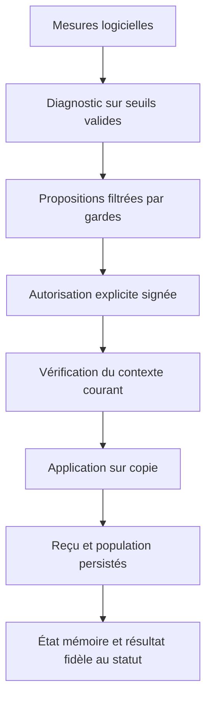

# Nosologie computationnelle — GenOS

> Les maladies et médicaments désignent des abstractions logicielles. Les scénarios ne valident ni pathologies réelles ni traitements humains.

## 1. Vue d'ensemble

Le runtime couvre **28 conditions simulées dans 9 familles** et **48 opérateurs de marqueurs**, avec diagnostic, propositions de traitement et application explicite. Le [catalogue runtime](catalogue-runtime.md), généré depuis [shared/nosology.json](../../../shared/nosology.json), définit exactement les cibles, les bornes, les gardes et les effets secondaires.

Une mesure valide strictement supérieure à 0,5 établit un diagnostic computationnel. Une mesure absente ou invalide ne prouve aucune rémission. Une condition n'est retirée que si un traitement modifie une de ses cibles et si toutes ses mesures sont valides et inférieures ou égales au seuil.

| Étape | Surface | Comportement |
|---|---|---|
| État | ClinicalState, NosologicalCondition et Pathology | Marqueurs, diagnostics distincts, journal et dernier traitement réellement appliqué. |
| Diagnostic | nosology::diagnose_markers, synchronize_diagnoses et tick Rust | Détection des 28 conditions; propositions filtrées par cible et garde. |
| Application | apply_systemic_therapy_to_cell | Statut applied, no_target ou refused; différences avant/après, rémissions et effets secondaires attestés. |
| Persistance | GenosEcosystem::apply_authorized_therapy | Autorisation signée liée à la population, au génome et à la mission; reçu et population persistés avant mutation en mémoire; rejeu idempotent. |
| CLI | genos biomimicry therapy | Restauration du journal, types vérifiés, fichiers confinés et résultat fidèle au reçu. |
| API backend | POST /api/rust/clinical-authorizations | Approbateur, tenant, état source et thérapie connus vérifiés avant signature. |
| MCP | Catalogue et lease du client | Aucun accès n'est créé par la seule présence d'une variante Rust. |

Les paramètres médicaux, équations, diagrammes et pseudo-code des fiches spécialisées restent des analogies ou propositions de mécanismes plus détaillés. Leur contrat exécutable est celui du catalogue. Les opérateurs de marqueurs n'impliquent aucune réparation physique de réseau, modification du génome, suppression de cellule ou opération sur un système humain.

## 2. Matrice nosologique générale

| Famille | Conditions computationnelles | Spécification historique |
|---|---|---|
| Auto-immunes | Lupus, RheumatoidArthritis, MultipleSclerosis, Type1Diabetes | [Fiche](01-auto-immunes.md) |
| Dégénératives | Alzheimer, Parkinson, Osteoarthritis | [Fiche](02-degeneratives.md) |
| Infectieuses | Influenza, Tuberculosis, Malaria, HivInfection | [Fiche](03-infectieuses.md) |
| Génétiques | SickleCellDisease, CysticFibrosis, DuchenneMuscularDystrophy | [Fiche](04-genetiques.md) |
| Cancers | LungCancer, Leukemia, Melanoma | [Fiche](05-cancers.md) |
| Métaboliques | Type2Diabetes, Hypothyroidism, Gout | [Fiche](06-metaboliques.md) |
| Cardiovasculaires | Hypertension, MyocardialInfarction, IschemicStroke | [Fiche](07-cardiovasculaires.md) |
| Psychiatriques | MajorDepression, Schizophrenia, BipolarDisorder | [Fiche](08-psychiatriques.md) |
| Environnementales | Asbestosis, LeadPoisoning | [Fiche](09-environnementales.md) |

## 3. Index des rapports spécialisés

Les fiches ci-dessus conservent leur contexte biologique et leurs propositions détaillées. [Pathologie et médecine computationnelle](pathologie-et-medecine.md) présente les catégories transversales, dont les états nosocomiaux et iatrogènes historiques.

## 4. Pharmacopée computationnelle unifiée

### 4.1 Opérateurs de marqueurs

Les 48 contrats sont listés dans le [catalogue runtime](catalogue-runtime.md#opérateurs-de-marqueurs). Chaque cible présente et valide est diminuée de 0,25 avec un plancher à zéro. Une cible absente, invalide ou déjà nulle ne donne pas un succès. L'apoptose interdit tout traitement. La thrombolyse exige blood_brain_barrier_integrity > 0,5. Les effets secondaires explicitement représentés sont bornés et retournés; une valeur de risque invalide bloque l'application.

Ce catalogue inclut les 19 variantes auparavant absentes : réapprovisionnement cognitif, readthrough de codon stop, inhibition MMP/TNF, restauration de barrière, reconstruction d'efférence, nettoyage fibrillaire, reset circadien et autres entrées indiquées dans la table exhaustive. IntensiveCareFluids agit sur perfusion_deficit et Antibiotic sur bacterial_load; aucune recharge ATP ou lyse d'agent n'est revendiquée par ces opérateurs.

### 4.2 Traitements historiques à état propre

| Variante SystemicTherapy | Effet logiciel réellement appliqué |
|---|---|
| Tocilizumab | Réduit l'indice inflammatoire de 0,5 et retire le diagnostic historique d'orage cytokinique. |
| Corticosteroids(dose) | Dose normalisée finie; réduction dose × 0,8. Dose nulle sans effet; dose > 0,8 induisant un coma simulé. |
| ImmunosuppressiveWash, SelfToleranceRecalibration | Retirent les diagnostics historiques d'hyperactivation/ciblage auto-immun, annulent l'indice inflammatoire et réduisent le marqueur autoantibody_load présent. |
| QuarantineIsolation | Isole la cellule avec une référence de capsule; ne stérilise pas la capsule. |
| AntisepticPurge | Retire seulement la contamination correspondant à la signature ou au site fourni; l’isolement est levé seulement si cette purge retire le dernier diagnostic actif. |
| Antiviral | Retire les diagnostics historiques d'infection virale exogène. |
| Vaccine(spike) | Augmente de 0,25 le marqueur vaccine_immunity:spike, borné à 1; ne modifie pas les récepteurs physiques. |
| DetoxificationWashout | Retire les quatre diagnostics iatrogènes historiques; ne retire pas un effet secondaire de marqueur dont le risque persiste. |
| AntidoteAdmin | Cible explicitement le coma associé à Corticosteroids ou le blocage associé à Tocilizumab. |
| HomeostaticDoseCorrection | Retire le diagnostic historique de coma stéroïdien; ne règle aucun système hormonal. |
| TelomeraseActivation | Allonge la limite de Hayflick avec saturation entière et retire une sénescence résolue lorsque l'extension est positive. |
| StemCellReplacement | Réinitialise les cicatrices et la sénescence; ne remplace pas la cellule et ne répare pas une mémoire prionique. |

Les traitements tumoraux de l'enum Therapy, distincte de SystemicTherapy, conservent leur contrat propre dans les modules tumoraux.

### 4.3 Résultats et compatibilité

Le résultat conserve ses champs historiques et ajoute status et marker_changes. Un ancien résultat sans statut est unspecified; il ne constitue pas une preuve d'application. Le dernier traitement et la ligne « Traitement administré » ne sont renseignés que lorsqu'un effet réel est constaté.

Une tentative autorisée sans cible ou refusée produit également un reçu durable; treatment_administered et le success CLI restent faux. Une autorisation réutilisée renvoie le même reçu sans réappliquer le traitement. Une signature invalide ou un contexte périmé bloque la mutation avant toute application.

## 5. État et validation

Les lots A–G ont introduit les premiers 25 opérateurs. La complétion ajoute le catalogue des 28 conditions, les 19 noms manquants, quatre contrats historiques de marqueurs, les diagnostics des neuf familles, les statuts explicites et la voie persistante autorisée.

Les tests parcourent chaque condition et chaque contrat : cibles présentes/absentes, données invalides, bornes, sérialisation, rémissions entièrement mesurées, gardes, effets secondaires, absence de résurrection, reçus persistés, restauration et idempotence. Leur exécution et les contrôles globaux du dépôt doivent être rapportés avec leur résultat réel.

## 6. Références croisées

- [Catalogue exécutable et documentation générée](catalogue-runtime.md)
- [ADR 0326 — Catalogue et preuve d'application](../../adr/0326-catalogue-nosologique-et-preuve-application.md)
- [Diagnostic Rust](../../../crates/genos-biology/src/nosology.rs)
- [Application Rust](../../../crates/genos-biology/src/therapy_dispatch.rs)
- [Application autorisée](../../../crates/genos-orchestrator/src/authorized_therapy.rs)
- [Épistémologie et preuve](../epistemologie-et-evidence.md)

## Parcours runtime

```mermaid
flowchart TD
    M[Mesures logicielles] --> D[Diagnostic sur seuils valides]
    D --> P[Propositions filtrées par gardes]
    P --> A[Autorisation explicite signée]
    A --> C[Vérification du contexte courant]
    C --> T[Application sur copie]
    T --> R[Reçu et population persistés]
    R --> S[État mémoire et résultat fidèle au statut]
```
