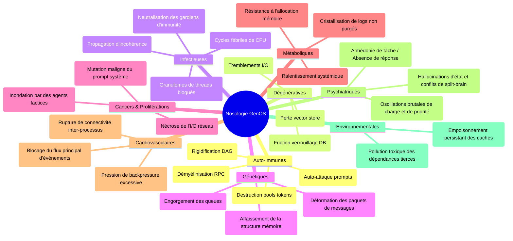
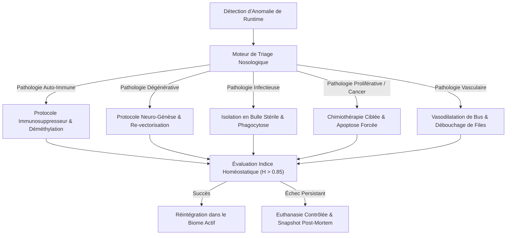

# Nosologie computationnelle — GenOS

> **Index de spécifications computationnelles pour 9 familles de marqueurs simulés dans GenOS.**
> Les fiches spécialisées contiennent des hypothèses et propositions; elles ne
> prouvent pas que les pathologies ou traitements décrits sont implémentés.

> **Portée produit :** les pathologies et thérapies sont des mécanismes de simulation logicielle GenOS. Les marqueurs numériques ne mesurent pas un état de santé humain et les noms de médicaments ne constituent ni posologie ni recommandation de soin.

---

## Table des Matières

1. [Vue d'ensemble](#1-vue-densemble)
2. [Matrice Nosologique Générale](#2-matrice-nosologique-générale)
3. [Index des Rapports Spécialisés](#3-index-des-rapports-spécialisés)
4. [Pharmacopée Computationnelle Unifiée](#4-pharmacopée-computationnelle-unifiée)
5. [Feuille de Route d'Implémentation](#5-feuille-de-route-dimplémentation)
6. [Références Croisées](#6-références-croisées)

---

## 1. Vue d'ensemble

GenOS utilise des analogies cellulaires pour représenter certains états d'agents
et de leurs marqueurs logiciels. Les termes « pathologie » et « thérapie » sont
des étiquettes de simulation; les mécanismes ne sont ni équivalents aux maladies
humaines ni validés comme modèles médicaux.

Ce document indexe **9 familles** et des exemples de maladies humaines utilisés
comme inspiration. Il ne constitue pas une couverture de 28 maladies
implémentées. Pour chaque famille, distinguer :

- La connaissance médicale réelle (définition, mécanisme biologique)
- La cause computationnelle équivalente dans GenOS
- Le traitement et les remèdes disponibles ou à créer
- Les contre-indications et risques iatrogènes
- Les besoins d'implémentation dans le code Rust

### Parcours d'implémentation attesté

| Étape | Surface vérifiée | Portée et statut |
|---|---|---|
| État cellulaire | `ClinicalState` et marqueurs de `AgentCell` | État logiciel; ne constitue pas un diagnostic médical. |
| Application Rust | `GenosEcosystem::apply_therapy` appelle explicitement `apply_systemic_therapy_to_cell` | Opérateurs déterministes sur une cellule; détails et gardes aux §§4.1, 4.3–4.7. |
| Diagnostic → thérapie Rust | Aucun chaînage automatique attesté entre `pathology` et les opérateurs ci-dessus | Sélection et appel restent explicites. |
| CLI biomimétique | La commande `therapy` échoue en mode fermé (`status: not_executed`, `treatment_administered: false`) tant que l'exécuteur et l'état clinique persistant ne sont pas branchés | Aucun succès ni traitement fictif n'est déclaré. |
| MCP | `genos_biomimicry_therapy` délègue à cette commande CLI | Le transport existe; la demande reste explicitement non exécutée jusqu'au branchement du traitement persistant. |
| API backend médicale | Services de surveillance et de thérapie distincts présents | Ne pas les confondre avec le chemin Rust; vérifier séparément leur persistance et leurs preuves avant toute affirmation de parcours intégré. |

Le pipeline dessiné en fin de document est une proposition conceptuelle. Il ne
doit pas être lu comme un parcours de production attesté. Les opérateurs
Rust documentés ne traitent pas une maladie réelle; les propositions du §4.2
restent hors de la voie vérifiée.

---

## 2. Matrice Nosologique Générale

| # | Famille Nosologique | Maladies Couvertes | Mécanisme Central GenOS | Thérapies Clés |
|---|---|---|---|---|
| 1 | **Auto-immunes** | Lupus, Polyarthrite rhumatoïde, Sclérose en plaques, Diabète type 1 | Le système immunitaire (`ClonalSelection`) attaque ses propres agents sains ; orage cytokinique IL-6 ≥ 10.0 multipliant le coût métabolique ×5 | `Tocilizumab`, `ImmunosuppressiveWash`, `SelfToleranceRecalibration` |
| 2 | **Dégénératives** | Alzheimer, Parkinson, Arthrose | Épuisement télomérique (`bud_scars ≥ hayflick_limit`), agrégation de prions cognitifs, déplétion dopaminergique | `StemCellReplacement`, `TelomeraseActivation`, Apoptose sélective |
| 3 | **Infectieuses** | Grippe, Tuberculose, Paludisme, VIH | Virions envahissant les récepteurs membranaires (clé-serrure `envelope_spike`), rétrovirus s'intégrant au génome | `Antiviral`, `Antibiotic`, `Vaccine(spike)`, Anticorps IgG/IgM |
| 4 | **Génétiques** | Mucoviscidose, Drépanocytose, Myopathie de Duchenne | Mutations dans `genos-genome` (délétion d'exons, faux-sens), erreurs de crossover, gènes HOX mal exprimés | Thérapie génique Yamanaka, Exon Skipping, CRISPR |
| 5 | **Cancers** | Leucémie, Cancer du poumon, Mélanome | Agent se répliquant sans contrôle (`is_camouflaged = true`), contournement de l'apoptose, néo-angiogenèse | `TargetedTherapy`, `Immunotherapy`, `AntiAngiogenesis`, `CellCycleInhibitor`, CAR-T |
| 6 | **Métaboliques** | Diabète type 2, Hypothyroïdie, Goutte | Dérèglement du système endocrinien virtuel, résistance aux signaux hormonaux, obstruction catabolique | `HomeostaticDoseCorrection`, Modulation endocrinienne, `IntensiveCareFluids` |
| 7 | **Cardiovasculaires** | Hypertension, Infarctus, AVC | Saturation de la fente synaptique, occlusion des canaux rhizomiques, effondrement de la BHE | `IntensiveCareFluids`, `CircuitBreaker`, Thrombolyse, Scellement BHE |
| 8 | **Psychiatriques** | Dépression, Schizophrénie, Bipolarité | Déséquilibre des neurotransmetteurs (sérotonine/dopamine), rupture de la copie d'efférence, oscillation du seuil soma | Stabilisateurs de l'humeur, Antipsychotiques, Recalibrage STDP |
| 9 | **Environnementales** | Asbestose, Saturnisme | Accumulation de toxines insolubles, pollution contextuelle chronique, saturation lysosomale | `DetoxificationWashout`, `genos_audit`, Chélation, `QuarantineIsolation` |

---

## 3. Index des Rapports Spécialisés

Chaque rapport détaillé est disponible dans `docs/` :

| # | Document | Agent Auteur |
|---|---|---|
| 1 | [NOSOLOGIE_1_AUTO_IMMUNES.md](01-auto-immunes.md) | Immunologiste Computationnel |
| 2 | [NOSOLOGIE_2_DEGENERATIVES.md](02-degeneratives.md) | Neurologue Computationnel |
| 3 | [NOSOLOGIE_3_INFECTIEUSES.md](03-infectieuses.md) | Infectiologue Computationnel |
| 4 | [NOSOLOGIE_4_GENETIQUES.md](04-genetiques.md) | Généticien Computationnel |
| 5 | [NOSOLOGIE_5_CANCERS.md](05-cancers.md) | Oncologue Computationnel |
| 6 | [NOSOLOGIE_6_METABOLIQUES.md](06-metaboliques.md) | Endocrinologue Computationnel |
| 7 | [NOSOLOGIE_7_CARDIOVASCULAIRES.md](07-cardiovasculaires.md) | Cardiologue Computationnel |
| 8 | [NOSOLOGIE_8_PSYCHIATRIQUES.md](08-psychiatriques.md) | Psychiatre Computationnel |
| 9 | [NOSOLOGIE_9_ENVIRONNEMENTALES.md](09-environnementales.md) | Toxicologue Computationnel |

Document de référence transversal : [PATHOLOGIE_ET_MEDECINE_COMPUTATIONNELLE.md](pathologie-et-medecine.md)

---

## 4. Pharmacopée Computationnelle Unifiée

### 4.1 Thérapies Existantes (implémentées dans `therapy.rs`)

| Thérapie | Cible | Famille Nosologique |
|---|---|---|
| `Therapy::TargetedTherapy` | Bloque les récepteurs de croissance | Cancers |
| `Therapy::Immunotherapy` | Lève le camouflage (`is_camouflaged = false`) | Cancers |
| `Therapy::AntiAngiogenesis` | Coupe l'approvisionnement ATP tumoral | Cancers |
| `Therapy::CellCycleInhibitor` | Bloque la division cellulaire | Cancers |
| `SystemicTherapy::Tocilizumab` | Bloque les récepteurs IL-6 | Auto-immunes |
| `SystemicTherapy::Corticosteroids(dose)` | Baisse l'inflammation (⚠️ coma si > 0.8) | Auto-immunes, Dégénératives |
| `SystemicTherapy::IntensiveCareFluids` | Recharge +20 ATP | Cardiovasculaires, Métaboliques |
| `SystemicTherapy::Antibiotic` | Lyse des agents à paroi cellulaire | Infectieuses |
| `SystemicTherapy::Antiviral` | Purge des infections virales | Infectieuses |
| `SystemicTherapy::Vaccine(spike)` | Immunise la membrane contre un antigène | Infectieuses, Nosocomiales |
| `SystemicTherapy::ImmunosuppressiveWash` | Purge les cytokines et anticorps autoréactifs | Auto-immunes |
| `SystemicTherapy::SelfToleranceRecalibration` | Réétalonne la tolérance au soi | Auto-immunes |
| `SystemicTherapy::QuarantineIsolation` | Isole une capsule contaminée | Nosocomiales, Environnementales |
| `SystemicTherapy::AntisepticPurge` | Stérilise l'environnement partagé | Nosocomiales, Infectieuses |
| `SystemicTherapy::DetoxificationWashout` | Élimine les résidus toxiques | Iatrogènes, Environnementales |
| `SystemicTherapy::AntidoteAdmin` | Neutralise un traitement bloquant | Iatrogènes |
| `SystemicTherapy::HomeostaticDoseCorrection` | Réajuste les paramètres hormonaux | Métaboliques |
| `SystemicTherapy::TelomeraseActivation` | Rallonge la limite de Hayflick | Dégénératives |
| `SystemicTherapy::StemCellReplacement` | Remplace l'agent par une cellule souche neuve | Dégénératives, Cancers |

Ces effets doivent être lus comme le comportement de la fonction `apply_systemic_therapy_to_cell()` sur une cellule GenOS. Dans cette voie, `IntensiveCareFluids`, `Antibiotic`, `Vaccine` et `HomeostaticDoseCorrection` inscrivent une réponse dans le résultat ou le journal, sans appliquer les effets biologiques décrits dans certains anciens extraits. La variante `Antiviral` n'est pas un opérateur de cette enum.

### 4.2 Thérapies computationnelles proposées (statut détaillé au §4.3)

Les variantes présentes et routées dans le code sont listées aux §§4.1 et 4.3–4.7. Les propositions ci-dessous ne sont pas implémentées dans la voie vérifiée `apply_systemic_therapy_to_cell()`; leur mention ou leurs extraits de code dans une fiche ne prouvent pas une disponibilité runtime. Les opérateurs implémentés eux-mêmes ne sont que des transformations bornées de marqueurs GenOS et ne modélisent ni ne valident une maladie réelle ou un traitement humain.

| Thérapie Proposée | Famille | Rapport Source |
|---|---|---|
| `AntiTNFInhibitor`, `BloodBrainBarrierSealing`, `ExogenousInsulinInfusion` | Auto-immunes | [01-auto-immunes](01-auto-immunes.md) |
| `AmyloidBetaPlaqueClearance`, `Cd47SynapticRescue`, `AlphaSynucleinDisaggregation`, `MmpInhibitorAdministration` | Dégénératives | [02-degeneratives](02-degeneratives.md) |
| `AntitubercularQuadritherapy`, `NeuraminidaseInhibitor` | Infectieuses | [03-infectieuses](03-infectieuses.md) |
| `StopCodonReadthrough` | Génétiques | [04-genetiques](04-genetiques.md) |
| `VascularPruningAndFlush` | Cancers | [05-cancers](05-cancers.md) |
| `CognitiveResupply`, `MonoamineReuptakeInhibitor`, `EfferenceCopyReconstruction`, `NmdaAllostericModulator`, `CircadianRhythmReset`, `AtypicalAntipsychoticMoodStabilizer` | Psychiatriques | [08-psychiatriques](08-psychiatriques.md) |
| `FibrillarContextCleansing`, `BloodBrainBarrierRestoration` | Environnementales | [09-environnementales](09-environnementales.md) |

---
### 4.3 Opérateurs métaboliques implémentés avec portée limitée

Les cinq opérateurs ci-dessous sont présents dans `SystemicTherapy` et routés par `apply_systemic_therapy_to_cell()`. Ils ne guérissent pas une pathologie : ils réduisent un marqueur computationnel existant de 0,25, borné à [0, 1]. Cible absente, non finie ou hors bornes signifie aucune mutation et aucun succès déclaré. Ils restent des simulations GenOS.

| Opérateur | Clé de marqueur | Effet |
|---|---|---|
| `InsulinSensitizerMetformin` | `insulin_resistance` | Réduction bornée de 0,25 |
| `LevothyroxineHormoneReplacement` | `thyroid_signal_deficit` | Réduction bornée de 0,25 |
| `ColchicineInhibition` | `purine_inflammation` | Réduction bornée de 0,25 |
| `AllopurinolXanthineInhibitor` | `purine_production` | Réduction bornée de 0,25 |
| `LysosomalUraturicPurge` | `purine_waste_load` | Réduction bornée de 0,25 |

Voir [ADR 0191](../../adr/0191-marqueurs-cliniques-extensibles.md) pour le contrat du registre de marqueurs.

### 4.4 Opérateurs vasculaires et neurologiques implémentés avec portée limitée

Ces opérateurs réduisent un marqueur existant de 0,25; ils ne déclarent pas de guérison. `CoronaryReperfusionThrombolysis` est refusé si le marqueur `blood_brain_barrier_integrity` est absent, invalide ou inférieur ou égal à 0,5. Les transformations ne simulent pas une prise en charge médicale.

| Opérateur | Marqueur | Garde supplémentaire |
|---|---|---|
| `CoronaryReperfusionThrombolysis` | `vascular_occlusion` | Intégrité BHE renseignée et > 0,5 |
| `VasodilatorFlowControl` | `vascular_resistance` | Aucune |
| `AntiAdhesionVasodilator` | `vascular_adhesion` | Aucune |
| `AntiNmdReadthrough` | `nmda_signal_deficit` | Aucune |
| `NeuroprotectiveAstrocyticFlush` | `astrocytic_waste_load` | Aucune |
| `BloodBrainBarrierSealant` | `blood_brain_barrier_deficit` | Aucune |

Le résultat distingue les marqueurs modifiés des pathologies guéries (`applied_markers` et `cured_pathologies`).

### 4.5 Opérateurs dégénératifs et musculosquelettiques implémentés avec portée limitée

Ces opérateurs réduisent un marqueur computationnel préexistant de 0,25 dans [0, 1]. Ils ne traitent ni une maladie réelle ni des lésions structurelles; cible manquante ou invalide signifie aucune mutation.

| Opérateur | Marqueur |
|---|---|
| `LevodopaSupplementation` | `dopamine_signal_deficit` |
| `DeepBrainStimulation` | `neural_activity_instability` |
| `Viscosupplementation` | `joint_friction` |
| `SenolyticPurge` | `senescent_load` |

### 4.6 Opérateurs infectieux, génétiques, oncologiques et psychiatriques implémentés avec portée limitée

Les variantes ci-dessous diminuent uniquement le marqueur nommé, de 0,25 borné dans [0, 1]. Elles ne suppriment aucune pathologie et n'affirment aucun résultat clinique humain. Une cible absente ou invalide n'est pas traitée et ne produit pas de succès.

| Opérateur | Marqueur cible |
|---|---|
| `AntiretroviralCombination` | `viral_replication_load` |
| `AntimalarialACT` | `parasite_load` |
| `ExonSkippingAntisense` | `exon_expression_deficit` |
| `CFTRModulatorTriad` | `cftr_function_deficit` |
| `CartCellInfusion` | `tumor_load` |
| `KetamineRapidInfusion` | `synaptic_response_deficit` |
| `MoodStabilizerLithium` | `affective_instability` |
| `AntipsychoticAtypical` | `cognitive_signal_disorder` |
| `FetalCarrierReactivation` | `fetal_carrier_silencing` |

### 4.7 Opérateur environnemental implémenté avec portée limitée

`ChelationTherapy` réduit de 0,25 le marqueur `metal_toxin_load`, uniquement si la cible est présente, finie et dans [0, 1]. La mutation est rapportée dans `applied_markers`; aucune pathologie n'est déclarée guérie. Il s'agit d'une abstraction logicielle, pas d'une chélation ni d'un traitement humain.
## 5. État et plan d'implémentation

### 5.1 État vérifié

Le point d'entrée vérifié est `apply_systemic_therapy_to_cell()` dans `crates/genos-biology/src/therapy.rs`, appelé explicitement par `GenosEcosystem::apply_therapy`. Son enum contient les variantes des §§4.1 et 4.3–4.7. Les opérateurs à portée limitée nécessitent un appel explicite; aucune interface MCP/CLI ni liaison automatique entre diagnostic et ces opérateurs n'a été attestée. Les exemples et extraits des rapports spécialisés sont des spécifications, pas une preuve d'implémentation. Les propositions du §4.2 restent indisponibles.

Les scénarios restent des simulations logicielles sur marqueurs GenOS. Ils ne modélisent, ne diagnostiquent et ne valident aucune pathologie réelle ni aucun médicament humain.

### 5.2 Lots réalisés

Chaque lot doit commencer par une vérification du code présent et des invariants concernés. Un lot ne devient « implémenté » qu'après fusion du code, des tests et de la documentation alignée. Les noms ci-dessous sont des identifiants de propositions, non des variantes déjà disponibles.

| Lot | Portée | Statut |
|---|---|---|---|
| A — Contrat et traçabilité | Définir les contrats des opérateurs réalisés | Terminé |
| B — Métabolique | Cinq opérateurs bornés | Terminé |
| C — Vasculaire et neurologique | Six opérateurs bornés | Terminé |
| D — Dégénératif et musculosquelettique | Quatre opérateurs bornés | Terminé |
| E — Infectieux, génétique, oncologique et psychiatrique | Neuf opérateurs bornés | Terminé |
| F — Environnemental | Chélation computationnelle bornée | Terminé |
| G — Intégration et statut documentaire | Vérification du routage et de la sérialisation; statut des rapports aligné sur le code | Terminé; appels Rust explicites, sans exposition MCP/CLI attestée |

### 5.3 Critères communs de validation

- Chaque opérateur a une spécification déterministe et une seule responsabilité clinique computationnelle clairement délimitée.
- Les valeurs restent dans les domaines définis; les préconditions échouées ne produisent aucune rémission annoncée.
- Les effets secondaires simulés sont retournés dans `TherapyOutcome` et inscrits de manière traçable lorsqu'applicable.
- Les transformations ne contournent ni circuit breaker, ni quarantaine, ni contrôles d'orchestration. Les traitements restent des actions explicites.
- Des tests couvrent la cible présente/absente, les limites numériques, les interactions à risque, les effets secondaires et la sérialisation lorsque l'enum évolue.
- Les docs distinguent toujours mécanismes vérifiés, opérateurs proposés et limites de simulation; les noms de médicaments ne sont jamais présentés comme recommandation ou traitement humain.

### 5.4 Contrats fonctionnels (lot A)

Cette matrice consigne les contrats fonctionnels du lot A et sert de liste de vérification comportementale. Elle n'ajoute aucun opérateur au runtime. « Refus explicite » signifie une issue non réussie, sans rémission ni mutation de marqueur, inscrite dans le résultat et le journal clinique. La disponibilité effective est indiquée aux §§4.2–4.7.

| Opérateur proposé | Cible logicielle à définir | Précondition et comportement sans cible |
|---|---|---|
| `CartCellInfusion` | Charge tumorale ciblée et réponse immunitaire simulée | Cible tumorale explicite; sinon refus explicite. |
| `LevodopaSupplementation` | Déficit de signal dopaminergique | Déficit mesuré; ne répare pas à lui seul les états neuronaux structurels. |
| `KetamineRapidInfusion` | Marqueur de réponse synaptique défini | Diagnostic/ marqueur psychiatrique correspondant; sinon refus explicite. |
| `MoodStabilizerLithium` | Amplitude d'oscillation de l'état affectif simulé | Marqueur d'oscillation présent; bornes et effets secondaires spécifiés. |
| `AntipsychoticAtypical` | Marqueurs de cohérence perceptive/cognitive | Anomalie correspondante présente; aucune normalisation globale implicite. |
| `InsulinSensitizerMetformin` | Résistance au signal insulinique | Résistance présente; effet borné, sans modifier directement une dose humaine. |
| `LevothyroxineHormoneReplacement` | Déficit de signal thyroïdien | Déficit présent; valeur d'entrée bornée et validée avant mutation. |
| `ColchicineInhibition` | Activation inflammatoire associée au marqueur métabolique | Activation présente; documenter le risque de suppression excessive. |
| `CoronaryReperfusionThrombolysis` | Obstruction de perfusion | Occlusion présente et contrôles de sécurité passés; sinon refus explicite. |
| `VasodilatorFlowControl` | Débit vasculaire simulé | Débit hors cible; borner le changement et détecter l'hypotension simulée. |
| `AntiretroviralCombination` | État d'intégration/réplication virale | Infection virale cible présente; aucun succès si le pathogène ne correspond pas. |
| `AntimalarialACT` | Charge du pathogène parasitaire simulé | Marqueur parasitaire correspondant présent; autrement refus explicite. |
| `ExonSkippingAntisense` | Expression d'une cible génétique configurée | Variant/cible génétique présente; ne modifie pas le génome sans cible attestée. |
| `CFTRModulatorTriad` | Fonction d'un marqueur CFTR computationnel | Déficit CFTR représenté et paramètres bornés; sinon refus explicite. |
| `ChelationTherapy` | Charge d'une toxine métallique nommée | Toxine identifiée et présente; borner aussi la perte de cofacteurs. |
| `AllopurinolXanthineInhibitor` | Production du marqueur de déchets puriques | Production mesurée; distinguer inhibition de production de clairance. |
| `LysosomalUraturicPurge` | Charge de déchets puriques stockés | Charge présente; purge bornée, distincte de l'inhibition de production. |
| `DeepBrainStimulation` | Activité d'un nœud neuronal nommé | Nœud existant et fréquence/configuration validée; sinon refus explicite. |
| `Viscosupplementation` | Marqueur de friction articulaire | Friction représentée; effet local, sans déclarer une réparation structurelle. |
| `SenolyticPurge` | Charge de cellules/agents sénescents identifiés | Cible sénescente présente; ne pas supprimer les autres cellules ou pathologies. |
| `FetalCarrierReactivation` | Expression d'un transporteur génétique identifié | Transporteur et état épigénétique présents; aucun succès si la cible manque. |
| `AntiAdhesionVasodilator` | Adhésion endothéliale et débit vasculaire | Marqueurs présents; définir séparément leurs effets et leurs bornes. |
| `AntiNmdReadthrough` | Signal NMDA computationnel ciblé | Anomalie du marqueur NMDA présente; effets sur excitabilité spécifiés. |
| `NeuroprotectiveAstrocyticFlush` | Charge astrocytaire ciblée | Charge présente; préserver les autres fonctions de soutien neuronal. |
| `BloodBrainBarrierSealant` | Intégrité de la BHE computationnelle | Brèche présente; restauration bornée et vérifiable, sans forcer à 1.0 par défaut. |

Pour tous les opérateurs, l'implémentation devra retourner un résultat distinguant application, absence de cible et refus de sécurité. La seule présence d'une variante dans une enum ne suffira pas à la déclarer opérationnelle.

### 5.5 Vérification avant chaque lot

1. Confirmer l'état réel des types et marqueurs dans `clinical.rs`, `pathology.rs`, `therapy.rs` et les modules spécialisés; ne pas partir des extraits des rapports comme s'ils étaient du code.
2. Repérer les interfaces qui transportent `SystemicTherapy` et examiner les conséquences de compatibilité de sérialisation avant d'ajouter une variante.
3. Implémenter un petit lot cohérent, ses tests ciblés et toute décision architecturale requise dans un ADR.
4. Exécuter les contrôles ciblés puis les vérifications de dépôt requises; corriger les docs et matrices de statut à partir des résultats observés.
5. Garder le statut « proposé » pour tout opérateur non vérifié dans le code effectif.

---

## 6. Références Croisées

### Documentation GenOS
- [PATHOLOGIE_ET_MEDECINE_COMPUTATIONNELLE.md](pathologie-et-medecine.md) — Module transversal de médecine computationnelle
- [BIOLOGIE_COMPUTATIONNELLE.md](../biologie-computationnelle.md) — Fondations de la biomimétique GenOS
- [NEUROBIOLOGIE_PLASTICITE.md](../neurobiologie-et-plasticite.md) — Plasticité synaptique et neurotransmetteurs
- [REPRODUCTION_REPLICATION.md](../../02-orchestration/reproduction-et-replication.md) — Hayflick, télomères, mitose et méiose
- [GENOME_EPIGENETIQUE.md](../genome-et-epigenetique.md) — Génome, épigénétique, mutations et chromatine
- [SECURITE.md](../../05-securite-gouvernance/securite.md) — Système immunitaire, chaperonnage et filtrage
- [ORCHESTRATION.md](../../02-orchestration/orchestration.md) — Gouvernance et administration des thérapies
- [RHIZOME.md](../../02-orchestration/topologies/rhizome.md) — Réseau mycélien de communication

### Modules Rust
- [crates/genos-cell/src/clinical.rs](../../../crates/genos-cell/src/clinical.rs) — `ClinicalState`, `Pathology`, `DiseaseCategory`
- [crates/genos-cell/src/lib.rs](../../../crates/genos-cell/src/lib.rs) — `AgentCell` avec champ `clinical`
- [crates/genos-biology/src/pathology.rs](../../../crates/genos-biology/src/pathology.rs) — Moteur d'évaluation clinique
- [crates/genos-biology/src/therapy.rs](../../../crates/genos-biology/src/therapy.rs) — Thérapies systémiques et ciblées
- [crates/genos-biology/src/embryology.rs](../../../crates/genos-biology/src/embryology.rs) — Viabilité cellulaire et apoptose
- [crates/genos-core/src/orchestrator/methods.rs](../../../crates/genos-core/src/orchestrator/methods.rs) — Boucle de tick et thérapies
- [crates/genos-immune/src/ais.rs](../../../crates/genos-immune/src/ais.rs) — Système immunitaire adaptatif
- [crates/genos-immune/src/virology.rs](../../../crates/genos-immune/src/virology.rs) — Virions, bactériophages, rétrovirus
- [crates/genos-biology/src/neurobiology/](../../../crates/genos-biology/src/neurobiology) — Système nerveux complet
- [crates/genos-signal/src/cascade.rs](../../../crates/genos-signal/src/cascade.rs) — Signalisation et cascades

---

## Schémas de Synthèse Nosologique et Pharmacologique

### 1. Cartographie des 9 Familles Nosologiques

```mermaid
mindmap
  root((Nosologie GenOS))
    Auto-Immunes
      Lupus (Auto-attaque prompts)
      Polyarthrite (Rigidification DAG)
      SEP (Démyélinisation RPC)
      Diabète T1 (Destruction pools tokens)
    Dégénératives
      Alzheimer (Perte vector store)
      Parkinson (Tremblements I/O)
      Arthrose (Friction verrouillage DB)
    Infectieuses
      Grippe (Propagation d'incohérence)
      Tuberculose (Granulomes de threads bloqués)
      Paludisme (Cycles fébriles de CPU)
      VIH (Neutralisation des gardiens d'immunité)
    Génétiques
      Mucoviscidose (Engorgement des queues)
      Drépanocytose (Déformation des paquets de messages)
      Myopathie Duchenne (Affaissement de la structure mémoire)
    Cancers & Proliférations
      Leucémie (Inondation par des agents factices)
      Cancer Poumon (Nécrose de l'I/O réseau)
      Mélanome (Mutation maligne du prompt système)
    Métaboliques
      Diabète T2 (Résistance à l'allocation mémoire)
      Goutte (Cristallisation de logs non purgés)
      Hypothyroïdie (Ralentissement systémique)
    Cardiovasculaires
      Hypertension (Pression de backpressure excessive)
      Infarctus (Blocage du flux principal d'événements)
      AVC (Rupture de connectivité inter-processus)
    Psychiatriques
      Dépression (Anhédonie de tâche / Absence de réponse)
      Schizophrénie (Hallucinations d'état et conflits de split-brain)
      Bipolaire (Oscillations brutales de charge et de priorité)
    Environnementales
      Asbestose (Pollution toxique des dépendances tierces)
      Saturnisme (Empoisonnement persistant des caches)
```

### 2. Pipeline de Triage et Dispatch Pharmacologique

```mermaid
flowchart TD
    Anomalie["Détection d'Anomalie de Runtime"] --> Triage["Moteur de Triage Nosologique"]
    
    Triage -->|Pathologie Auto-Immune| Th_Immuno["Protocole Immunosuppresseur & Déméthylation"]
    Triage -->|Pathologie Dégénérative| Th_Neuro["Protocole Neuro-Génèse & Re-vectorisation"]
    Triage -->|Pathologie Infectieuse| Th_AntiInf["Isolation en Bulle Stérile & Phagocytose"]
    Triage -->|Pathologie Proliférative / Cancer| Th_Onco["Chimiothérapie Ciblée & Apoptose Forcée"]
    Triage -->|Pathologie Vasculaire| Th_Vasc["Vasodilatation de Bus & Débouchage de Files"]
    
    Th_Immuno --> Validation["Évaluation Indice Homéostatique (H > 0.85)"]
    Th_Neuro --> Validation
    Th_AntiInf --> Validation
    Th_Onco --> Validation
    Th_Vasc --> Validation
    
    Validation -->|Succès| Restauration["Réintégration dans le Biome Actif"]
    Validation -->|Échec Persistant| Euthanasie["Euthanasie Contrôlée & Snapshot Post-Mortem"]
```
