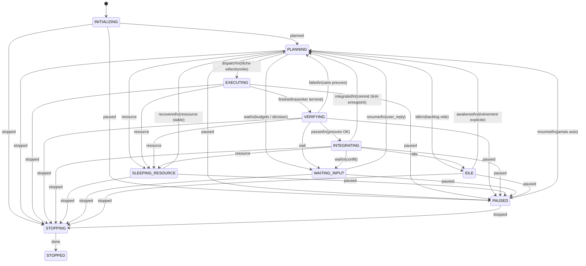
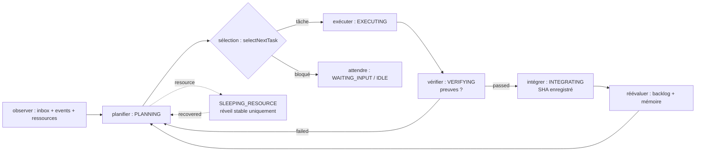

# Ontogenèse : orchestrateur résident de projet à missions bornées et vérifiées

- **Statut** : Partiel
- **Portée** : contrôleur d'Ontogenèse (`backend/src/services/ontogenesis/`), machine à états, boucle de pilotage, sélection bornée, politique de réveil, persistance `ontogenesis_*` ; décision tracée par l'ADR 0235.
- **Dernière revue** : 2026-10-06

> Convention de lecture de cette fiche : chaque affirmation porte son statut.
> **Implémenté** = comportement présent dans le dépôt et vérifiable (chemin de fichier cité).
> **Partiel** = seulement une partie est implémentée, écarts précisés.
> **Cadre conceptuel** = modèle ou intention de l'ADR 0235 sans implémentation complète vérifiée.
> Aucune métaphore biologique de cette fiche n'est une fonctionnalité prouvée.

## 1. Définition du domaine

L'Ontogenèse est l'orchestrateur résident de projet de GenOS : une instance de durée de vie indéfinie attachée à un projet, un cahier des charges versionné et une branche d'intégration dédiée, qui enchaîne des missions bornées et vérifiées (**Cadre conceptuel** — objectif défini par [ADR 0235](../adr/0235-ontogenese-orchestrateur-resident-projet.md)).

Deux rôles séparés structurent le domaine (**Cadre conceptuel**, ADR 0235 §1) :

- le daemon résident actuel reste un observateur (sensing, cartographie, findings, handoff) : il ne dispatche pas, n'édite pas, ne committe pas ;
- un contrôleur d'Ontogenèse distinct possède l'autorité explicite de dispatch, d'édition et de commit sur un projet donné.

Ce qui distingue l'Ontogenèse du runtime agentique décrit dans [runtime-agentique.md](runtime-agentique.md) : le runtime exécute une mission autorisée bornée vers une sortie terminale (**Implémenté** — `backend/src/services/agentRuntimeAdapter/index.js`), tandis que le contrôleur d'Ontogenèse possède la responsabilité entre les missions : backlog, priorités, mémoire, réveils, intégration (**Partiel** — le tick résident, le runner, la vérification et l'intégrateur sont raccordés dans `tickService.js`, `runtimeHarness.js` et `integrationController.js`; l'exploitation continue, la couverture de reprise et certains contrôles OS demeurent limités, voir §7–§10).

La règle épistémique GenOS s'applique sans exception : un transport réussi n'est pas une preuve de décision valide ; une tâche terminée sans preuves suffisantes reste non vérifiée, jamais promue (**Implémenté** — refus de promotion sans preuves dans `backend/src/services/ontogenesis/loopController.js`, fonction `stepVerifying`).

Les 375 contrats philosophiques peuvent maintenant accompagner ce cycle sans
élargir son autorité (**Partiel** — résolution, planification, transport et audits
logiciels bornés implémentés ; utilité sur missions réelles et validation
indépendante non établies). Le chemin détaillé est décrit dans
[Contrats philosophiques dans l’Ontogenèse](../03-reference/contrats-philosophiques-ontogenese.md) :
`canonicalConceptRegistry` fournit la référence, `missionCapabilityPlanService`
la déduplique dans `philosophicalContracts`, puis `runtimeHarness` la transmet
avec les preuves et topologies attendues. Les concepts explicitement demandés
imposent un audit avant `verified` ; les concepts ajoutés automatiquement restent
consultatifs. L'audit lit des valeurs liées à des sources JSON confinées et refuse
une observation absente, violée ou obsolète. Il vérifie ces déclarations, pas leur
vérité externe. Le champ `promotionEligible` reste `false`.

## 2. Modèle formel

### 2.1 Machine à états (contrat pur, sans E/S)

La machine à états est le contrat opposable du contrôleur (**Implémenté** — `backend/src/services/ontogenesis/stateMachine.js`, constantes `STATES` et `TRANSITIONS`, fonctions `nextState`, `canTransition`, `allowedEvents`, `isValidState`).

Les 11 états réels du code sont :

`INITIALIZING`, `PLANNING`, `EXECUTING`, `VERIFYING`, `INTEGRATING`, `SLEEPING_RESOURCE`, `WAITING_INPUT`, `IDLE`, `PAUSED`, `STOPPING`, `STOPPED`.

Les transitions réelles du code (`TRANSITIONS` dans `backend/src/services/ontogenesis/stateMachine.js`) sont :

| État source | Événement → état cible |
| --- | --- |
| `INITIALIZING` | `planned` → `PLANNING`, `paused` → `PAUSED`, `stopped` → `STOPPING` |
| `PLANNING` | `dispatch` → `EXECUTING`, `wait` → `WAITING_INPUT`, `idle` → `IDLE`, `resource` → `SLEEPING_RESOURCE`, `paused` → `PAUSED`, `stopped` → `STOPPING` |
| `EXECUTING` | `finished` → `VERIFYING`, `resource` → `SLEEPING_RESOURCE`, `paused` → `PAUSED`, `stopped` → `STOPPING` |
| `VERIFYING` | `passed` → `INTEGRATING`, `failed` → `PLANNING`, `resource` → `SLEEPING_RESOURCE`, `wait` → `WAITING_INPUT`, `paused` → `PAUSED`, `stopped` → `STOPPING` |
| `INTEGRATING` | `integrated` → `PLANNING`, `idle` → `IDLE`, `resource` → `SLEEPING_RESOURCE`, `wait` → `WAITING_INPUT`, `paused` → `PAUSED`, `stopped` → `STOPPING` |
| `SLEEPING_RESOURCE` | `recovered` → `PLANNING`, `paused` → `PAUSED`, `stopped` → `STOPPING` |
| `WAITING_INPUT` | `resumed` → `PLANNING`, `paused` → `PAUSED`, `stopped` → `STOPPING` |
| `IDLE` | `awakened` → `PLANNING`, `paused` → `PAUSED`, `stopped` → `STOPPING` |
| `PAUSED` | `resumed` → `PLANNING`, `stopped` → `STOPPING` |
| `STOPPING` | `done` → `STOPPED` |
| `STOPPED` | (aucune transition) |

Propriétés vérifiées par le code et les tests (**Implémenté** — `backend/src/services/ontogenesis/stateMachine.js`, `backend/tests/test_ontogenesis_loop.js`) :

- depuis chaque état actif (`PLANNING`, `EXECUTING`, `VERIFYING`, `INTEGRATING`), l'événement `resource` conduit à `SLEEPING_RESOURCE` ;
- `allowsAutoWake` retourne vrai uniquement pour `SLEEPING_RESOURCE` et faux pour `PAUSED` ;
- `STOPPED` est absorbant : aucune sortie.

### 2.2 Boucle observer → planifier → sélectionner → exécuter → vérifier → intégrer → réévaluer

La boucle est une fonction pure : elle décide l'événement machine et les effets à appliquer, sans E/S (**Implémenté** — `backend/src/services/ontogenesis/loopController.js`, fonction `stepLoop`, table `HANDLERS` par état).

Règles réelles du code, par état :

- `INITIALIZING` : événement `planned`, sans effet (`stepInitializing`).
- `PLANNING` (`stepPlanning`) : si budgets épuisés → `wait` + effet `notify-blocked:budgets-epuises` ; si mémoire `constrained` → maintien (`hold`) avec raison `ressources-contraintes` ; si une tâche est sélectionnée → `dispatch` ; si le blocage est `backlog-vide` → `idle` ; sinon → `wait` + `notify-decision_needed:<raison>`.
- `EXECUTING` (`stepExecuting`) : sans `workerResult` → maintien (`attente-worker`) ; si `workerResult === 'resource'` → `resource` ; sinon → `finished`.
- `VERIFYING` (`stepVerifying`) : si `proofsOk` → `passed` ; sinon → `failed` + effets `bump-attempt` et `record-failure`. Autrement dit : pas de preuves, pas de promotion — retour en planification avec comptabilisation de la tentative.
- `INTEGRATING` (`stepIntegrating`) : si `integration === 'committed'` → `integrated` + `notify-result:integre` ; si `conflict` → `wait` + `notify-decision_needed:conflit` et `create-resolution-task` ; sinon → `wait` + `notify-blocked:integration-rejetee`.
- `SLEEPING_RESOURCE`, `WAITING_INPUT`, `IDLE`, `PAUSED`, `STOPPING`, `STOPPED` : maintien (`hold`) avec raison `attente-<etat>` (`stepHolding`).
- Priorité globale (`stepLoop`) : le mode de contrôle `paused` force `paused`, `stopping`/`stopped` force `stopped` ; un niveau mémoire `critical` force l'événement `resource` quel que soit l'état courant.

Formellement, le pas de boucle est une fonction déterministe (**Implémenté** — signature réelle `stepLoop(snapshot)`) :

$$\text{stepLoop} : \text{Snapshot} \to \{\text{event}, \text{effects}[]\} \cup \{\text{hold}, \text{reason}\}$$

où `Snapshot = ⟨state, controlMode, memoryLevel, budgetsOk, selection, workerResult, proofsOk, integration⟩`. Les chaînes d'effets réellement émises sont `notify-blocked:<raison>`, `notify-decision_needed:<raison>`, `notify-result:integre`, `bump-attempt`, `record-failure`, `create-resolution-task`.

### 2.3 Exclusion mutuelle

Un claim transactionnel empêche deux instances de traiter le même projet (**Implémenté** au niveau du tick — table `ontogenesis_claims`, acquisition exclusive, expiration, remplacement d'un claim périmé, prolongation périodique et libération dans `backend/src/services/ontogenesis/claimService.js` et `tickService.js`). Le claim comporte un `operationId` fencing : un détenteur qui l'a perdu ne peut plus le prolonger. La réconciliation de tous les états de processus après chaque panne reste une propriété plus large et partielle.

Principe et mécanismes (**Partiel**) : le dispatch persiste l'exécution avant de lancer le runner et le runner réclame atomiquement la phase `prepared` ; à l'intégration, le contrôleur réconcilie le SHA d'un commit déjà créé avant de recommencer (`backend/src/services/ontogenesis/dispatchService.js`, `backend/bin/ontogenesisMissionRunner.cjs`, `backend/src/services/ontogenesis/integrationController.js`). Cela couvre des fenêtres de panne ciblées, mais ne constitue pas une garantie générale de reprise transparente de tous les processus ou worktrees.

### 2.4 Persistance de l'intention : PAUSED contre SLEEPING_RESOURCE

La distinction est explicite et testée (**Implémenté** — `backend/src/services/ontogenesis/stateMachine.js` avec `allowsAutoWake`, `backend/src/services/ontogenesis/wakeupPolicy.js` avec `shouldWake`, `backend/tests/test_ontogenesis_loop.js`) :

- une pause manuelle (`PAUSED`) survit au redémarrage et n'autorise jamais un réveil automatique : `shouldWake('PAUSED', { type: 'user_reply' })` retourne `{ wake: false }` ;
- seul un sommeil lié aux ressources (`SLEEPING_RESOURCE`) autorise un réveil automatique, et uniquement quand la disponibilité redevient suffisante et stable : `shouldWake('SLEEPING_RESOURCE', { type: 'resource', stable: true })` réveille, tandis qu'un événement `git` ou une ressource instable (`stable: false`, raison `ressource-instable`) ne réveille pas ;
- `WAITING_INPUT` exige une `user_reply` (raison `reponse-attendue` sinon) ; `IDLE` se réveille sur tout événement explicite de la liste `WAKE_EVENTS` (`git`, `worker_done`, `resource`, `deadline`, `user_reply`, `wake` dans `backend/src/services/ontogenesis/wakeupPolicy.js`).

La persistance de l'intention au redémarrage (la pause manuelle survit, le sommeil ressource se réévalue) est un contrat de l'ADR 0235 §5 (**Partiel** — la politique de réveil est implémentée et testée en pur ; la reprise complète avec autostart Windows et réconciliation appartient à l'exploitation décrite en ADR §Conséquences).

## 3. Analogies biologiques et limites réelles

L'ontogenèse, en biologie, désigne le développement d'un organisme individuel de l'œuf à l'adulte : un même génome s'exprime différemment selon les stades, sous contraintes de ressources, jusqu'à une forme mature capable de se maintenir (**Cadre conceptuel** — vocabulaire analogique, pas une équivalence avec un organisme vivant).

Transposée à GenOS, l'analogie dit : le contrôleur d'Ontogenèse est l'organisme-projet qui grandit par stades (ses états), consomme des ressources bornées, dort quand le milieu est contraint, et n'intègre que ce qui est vérifié — comme un développement soumis à des points de contrôle (**Cadre conceptuel**).

Distinction explicite avec la morphogenèse, au même niveau d'exigence que [morphogenese.md](../02-orchestration/topologies/morphogenese.md) :

- la **morphogenèse** construit les organisations cognitives nécessaires à une mission (choix et assemblage de topologies, graphe vivant, spawn/fusion/split) — c'est l'embryologie des formes collectives ;
- l'**ontogenèse** développe le projet dans le temps long (backlog, missions successives, mémoire, intégration Git, réveils) — c'est le cycle de vie de l'individu-projet qui utilise la morphogenèse comme moteur d'exécution.

Formule de l'ADR 0235 §7 : conversation et événements → contrôleur d'Ontogenèse → missions GenOS → preuves et intégration Git → mémoire et notifications ; la morphogenèse, les topologies et les workers sont le moteur d'exécution que le contrôleur ne contourne jamais (**Cadre conceptuel** — le branchement des huit topologies sur cette base vient après, en commençant par une topologie).

Limites réelles de l'analogie : aucun état de la machine ne mesure une maturation biologique ; `SLEEPING_RESOURCE` n'est pas une dormance cellulaire mais une garde sur un niveau mémoire ; `allowsAutoWake` n'est pas un réveil hormonal mais un prédicat booléen. Les termes biologiques désignent des politiques logicielles, comme le rappelle [runtime-agentique.md](runtime-agentique.md).

## 4. Cas d'usage et objectifs métier

L'Ontogenèse porte une responsabilité durable : un objectif versionné, des critères de réussite et des limites d'autorité attachés au projet (tables `ontogenesis_projects` et configuration versionnée, ADR 0235 §7) (**Partiel** — schéma `ontogenesis_projects` créé par `backend/src/db/migrations/migrateOntogenesis.js` ; la gestion de configuration versionnée vit dans `backend/src/services/ontogenesis/configSchema.js`).

Comportements documentés, observables depuis l'extérieur — ce sont des comportements, pas une description d'architecture interne (**Partiel** — boîte de réception, événements, mémoire, notifications et demandes d'approbation existent en persistance : `backend/src/db/migrations/migrateOntogenesisConversation.js` crée `ontogenesis_inbox`, `ontogenesis_events`, `ontogenesis_memory`, `ontogenesis_notifications`, `ontogenesis_approval_requests`, avec la logique dans `backend/src/services/ontogenesis/inboxService.js`, `memoryService.js`, `notificationService.js`) :

- **conversation pendant l'exécution** : une boîte de réception persistante reçoit messages et événements (Git, fin de worker, retour des ressources, échéances, réponse utilisateur) ; un message actualise les priorités du backlog, jamais tout l'état ;
- **mémoire continue** : préférences, décisions, contraintes, échecs et questions ouvertes avec provenance ; les mémoires d'échecs sont consultées avant chaque choix d'approche ;
- **initiative** : le contrôleur choisit la prochaine action autorisée depuis le backlog et les événements, puis dort en attendant l'événement suivant ; léger par construction, il n'appelle un modèle que lorsqu'une décision l'exige ;
- **réveils autonomes** : Git, fin de worker, retour des ressources, échéance, réponse utilisateur (liste `WAKE_EVENTS` dans `backend/src/services/ontogenesis/wakeupPolicy.js`) ;
- **délégation suivie** : missions GenOS lancées, preuves examinées, instructions complémentaires envoyées ; aucune promotion sans preuves exécutables portant sur le résultat intégré ;
- **retour vers l'opérateur** : notification sur résultat significatif, blocage ou décision nécessaire ; silence pendant les périodes sans changement ;
- **vue d'activité** : tâches, workers, preuves, changements et commits exposés ; réorientation ou arrêt toujours possibles (service dédié : `backend/src/services/ontogenesis/activityView.js`).

Cas d'usage visés (**Cadre conceptuel**, scénarios de validation ADR 0235) : petit projet de bout en bout, échec worker avec repli borné, saturation mémoire avec sommeil et réveil, redémarrage à chaque étape critique, double lancement, arrêt pendant travail ou intégration, résultat sans preuves refusé, exécution prolongée sans croissance incontrôlée.

## 5. Exemples concrets

Tous les exemples ci-dessous sont tirés du code et des tests réellement lus ; les valeurs sont exactes.

### 5.1 Sélection bornée à 3 tentatives

La sélection de la prochaine tâche est déterministe et borne les tentatives (**Implémenté** — `backend/src/services/ontogenesis/taskSelector.js`, constante `MAX_ATTEMPTS = 3`, fonction `selectNextTask`) :

- les dépendances priment sur la priorité : avec `a` (priorité 1, sans dépendance) et `b` (priorité 5, dépend de `a`), le sélecteur choisit `a` tant que `a` n'est pas `done` (`backend/tests/test_ontogenesis_loop.js`) ;
- une tâche `todo` avec `attempt: 3` n'est plus exécutable (`attempt >= MAX_ATTEMPTS`) et le sélecteur retourne `{ blocked: 'tentatives-epuisees' }` ; une tâche épuisée ne replanifie jamais seule ;
- backlog vide → `{ blocked: 'backlog-vide' }` ; dépendance manquante → `dependances-manquantes` ; tâche en cours → `execution-en-cours` (fonction `blockedReason`).

### 5.2 Réveil ressource stable uniquement

La politique de réveil est pure et testée (**Implémenté** — `backend/src/services/ontogenesis/wakeupPolicy.js`, `backend/tests/test_ontogenesis_loop.js`) :

```js
wakeup.shouldWake('SLEEPING_RESOURCE', { type: 'resource', stable: true }); // { wake: true }
wakeup.shouldWake('SLEEPING_RESOURCE', { type: 'git' });                    // { wake: false }
wakeup.shouldWake('PAUSED', { type: 'user_reply' });                       // { wake: false, reason: 'pause-manuelle' }
```

Un événement Git ne réveille pas un sommeil ressource ; une ressource instable retourne la raison `ressource-instable`. C'est l'hystérésis contractuelle : seul un signal `resource` stable fait sortir de `SLEEPING_RESOURCE` vers `PLANNING` (événement `recovered`).

### 5.3 Refus sans preuves

La vérification refuse toute promotion sans preuves suffisantes (**Implémenté** — `backend/src/services/ontogenesis/loopController.js`, `backend/tests/test_ontogenesis_loop.js`) :

```js
controller.stepLoop({ state: 'VERIFYING', controlMode: 'running', memoryLevel: 'normal', proofsOk: false });
// { event: 'failed', effects: ['bump-attempt', 'record-failure'] }
```

L'effet `bump-attempt` incrémente le compteur (persistance : `UPDATE ontogenesis_backlog SET attempt = attempt + 1` dans `backend/src/services/ontogenesis/projectStore.js`) et `record-failure` alimente la mémoire d'échecs consultée avant le choix d'approche suivant. Au bout de 3 tentatives, `tentatives-epuisees` bloque explicitement au lieu de boucler.

### 5.4 Budgets, mémoire et conflits

- Budgets épuisés en planification → `{ event: 'wait', effects: ['notify-blocked:budgets-epuises'] }` (**Implémenté** — `stepPlanning`, test boucle).
- Mémoire `constrained` en planification → maintien `ressources-contraintes` sans changer d'état ; mémoire `critical` quel que soit l'état → événement `resource` (**Implémenté** — `stepLoop`, test boucle).
- Conflit d'intégration → `wait` + `create-resolution-task` : le conflit devient une tâche de résolution bornée, pas un échec silencieux (**Implémenté** — `stepIntegrating`, test boucle).
- Sélection de topologie avec justification et mémoire des échecs : matrice de 8 topologies, repli explicite sur capacité manquante, report des topologies lourdes sous contrainte mémoire, blocage `aucune-topologie-admissible` après échecs répétés, seuils mémoire Normal / Contraint / Critique avec hystérésis (**Implémenté** — `backend/src/services/ontogenesis/topologySelector.js` et `backend/src/services/ontogenesis/memoryPressure.js`, vérifiés par `backend/tests/test_ontogenesis_selection.js`).

## 6. Schéma

États réels (`stateMachine.js`) et boucle réelle (`loopController.js`). Les arêtes portent les événements exacts du code.



Boucle de pilotage (un tour = observer → décider → appliquer) :



## 7. Architecture technique

Périmètre modulaire, un fichier par responsabilité (**Implémenté** — répertoire `backend/src/services/ontogenesis/`, vérifié par glob ; chaque fichier porte son rôle en en-tête) :

| Fichier réel | Responsabilité |
| --- | --- |
| `stateMachine.js` | contrat pur de la machine à états (11 états, `TRANSITIONS`, `allowsAutoWake`) |
| `loopController.js` | boucle pure `stepLoop` (décide événement + effets, sans E/S) |
| `wakeupPolicy.js` | politique pure de réveil (`WAKE_EVENTS`, `shouldWake`) |
| `taskSelector.js` | sélection déterministe (`MAX_ATTEMPTS = 3`, `selectNextTask`) |
| `topologySelector.js` | choix de topologie justifié (matrice 8 topologies, replis, échecs) |
| `memoryPressure.js` | mesure et admission mémoire (seuils, hystérésis) |
| `claimService.js` | exclusion mutuelle (`ontogenesis_claims`, expiration, idempotence) |
| `tickService.js` | tick du contrôleur : claim, échéances, observation, décision, effets et release |
| `dispatchService.js` | admission, budgets dérivés, choix de topologie, persistance et démarrage d'une exécution |
| `runtimeHarness.js` | préparation du worktree d'intégration, runner enfant, observation, arrêt et mesure du périmètre processus |
| `executionStore.js` / `executionLifecycle.js` | phases d'exécution, budgets réservés, contrôle, arrêt, échec et compte de tentative |
| `integrationController.js` | vérification du candidat, contrôles, intégration unique, réconciliation du commit et clôture |
| `proofService.js` | hash d'arbre, contrôles prescrits et preuve du candidat |
| `missionCompletion.js` | attente des agents et gate de complétion de mission avant succès runtime |
| `projectStore.js` | persistance projets, backlog, runs, transitions d'état |
| `integrationService.js` | intégrateur Git unique (base SHA, statuts, SHA résultat) |
| `inboxService.js` | boîte de réception et événements (`ontogenesis_inbox`, `ontogenesis_events`) |
| `memoryService.js` | mémoire continue avec provenance (`ontogenesis_memory`) |
| `notificationService.js` | notifications et demandes d'approbation |
| `controlService.js` | pause/arrêt/sommeil, vue d'exploitation, rétention bornée |
| `authorizationService.js` | enveloppe d'autorité (branches, chemins, budgets, push/fusion séparés) |
| `configSchema.js` | schéma de configuration versionnée du projet |
| `activityView.js` | vue d'activité (tâches, workers, preuves, changements, commits) |
| `autostartService.js` | reprise de l'intention au démarrage |

Tables dédiées `ontogenesis_*` (**Implémenté** — migrations `backend/src/db/migrations/migrateOntogenesis.js` : `ontogenesis_projects`, `ontogenesis_backlog`, `ontogenesis_runs`, `ontogenesis_decisions`, `ontogenesis_integrations`, `ontogenesis_control`, `ontogenesis_claims` ; et `backend/src/db/migrations/migrateOntogenesisConversation.js` : `ontogenesis_inbox`, `ontogenesis_events`, `ontogenesis_memory`, `ontogenesis_notifications`, `ontogenesis_approval_requests`).

Réutilisation des contrats GenOS par leurs interfaces, jamais contournés (**Cadre conceptuel** comme intégration complète, ADR 0235 §2 ; les contrats cibles eux-mêmes sont **Implémentés** indépendamment) : morphogenèse et topologies via `morphogenesis/*` et adaptateurs, workers via `workerKindService.js` et `workerContractEnforcement.js`, snapshots et forks via les stores contrefactuels, budgets via les services métaboliques, preuves et promotion via les gates (ADR 0198, 0206, 0135, 0234), mémoire d'échecs avant choix d'approche. Créer une mission n'élargit jamais les autorisations et ne réinitialise jamais les budgets : les plafonds sont hérités du projet et décroissants (**Cadre conceptuel** — règle d'autorité de l'ADR).

Les contrats d'implémentation philosophiques sont maintenant raccordés au cycle
de mission : `canonicalConceptRegistry` résout le concept et son contrat,
`missionCapabilityPlanService` transmet les références de scénario, de preuves et
de topologies dans le plan, puis `runtimeHarness` les remet au runner. Le raccord
inclut désormais `philosophicalMissionContract.js` et
`philosophicalObservationService.js` : les références comportent l'empreinte
complète du contrat, le champ et le prédicat ; les observations de mission sont
liées par un manifeste à des fichiers JSON du candidat. `integrationController`
rejoue les audits au passage `verified`, avant la copie, sur les sources intégrées,
après fencing, après commit et lors de sa récupération. Un manifeste présent mais
lié à une autre mission ne suffit jamais. Les plafonds sont de 128 Kio par fichier,
32 sources et 375 contrats ; les liens symboliques et chemins hors capsule sont
refusés (**Implémenté** pour ces audits bornés).

Les états d'audit exposent incertitudes, tâches de vérification et réserves ;
ils ne représentent pas un modèle complet du monde, une révision des croyances
ou un changement de topologie. La lecture d'une déclaration issue du worker
n'est pas une validation indépendante (**Partiel** pour l'objectif philosophique).
Le service de maturité rejoue les reçus de scénario mais ne reconnaît pas encore
les attestations runtime/indépendantes : `integrated` et `validated` restent
bloqués, et aucun reçu ne dispense des checks, leases, budgets et gates existants.

### 7.1 Maturité vérifiable par sous-système

| Capacité | Statut courant | Périmètre réellement couvert |
| --- | --- | --- |
| Machine, sélection, budgets et tick | **Implémenté** | `tickOnce` prend un claim, lit les événements, choisit une transition et applique ses effets; budgets dépensés/réservés et mesures de ressources entrent dans le contexte si un harnais est fourni. |
| Dispatch local | **Implémenté** avec prérequis | branche/worktree géré, contrôle de configuration, estimation mémoire, budgets plafonnés, runner enfant; sans checks configurés, le dispatch est bloqué. |
| Résultat worker et preuve | **Implémenté** | le runner attend la mission et sa gate de complétion; le contrôleur vérifie le candidat, les chemins autorisés, le hash d'arbre et les checks configurés avant `INTEGRATING`. |
| Intégration Git et récupération ciblée | **Implémenté** avec limites | intégrateur unique, vérification répétée sur l'arbre intégré, commit contrôlé, SHA enregistré et réconciliation d'un commit présent après crash. |
| Claim et concurrence | **Implémenté** | unicité, expiration, fencing, heartbeat de 10 secondes et libération dans `finally`. |
| Conversation, mémoire, notifications et approbation | **Partiel** | schéma et services persistants présents; l'expérience conversationnelle unifiée et tous les canaux d'événements ne sont pas équivalents à une disponibilité permanente. |
| Réveil planifié et ressources | **Partiel** | échéances traitées par tick; sommeil ressource ne se réveille qu'après récupération stable; l'autostart local est opt-in et ne rend pas le service disponible machine éteinte. |
| Reprise après arrêt/crash | **Partiel** | certaines phases sont idempotentes ou réconciliées; reprise universelle d'un arbre de processus, garanties Job Objects Windows et réconciliation exhaustive ne sont pas fournies. |
| Push, fusion et promotion | **Hors autorité** | `authorizationService.js` refuse explicitement push et merge; l'Ontogenèse crée des commits dans le périmètre local autorisé, sans droit implicite de publier ou fusionner. |

## 8. Processus d'exécution et de validation

Ordre d'une tâche dans le chemin local raccordé (**Implémenté sous prérequis** — `tickService.tickOnce` pilote le contrôleur avec `runtimeHarness`; les branches sans harnais peuvent encore ne réaliser que la décision pure) :

1. **Observer et verrouiller** : le tick acquiert le claim du projet, renouvelle son fencing, traite les échéances et événements réveillants, lit le backlog, le contrôle, les budgets et les ressources (`tickService.js`).
2. **Planifier / sélectionner** : `selectNextTask` vérifie dépendances et tentatives; `selectTopology` justifie le choix selon les capacités disponibles, la mémoire et les échecs antérieurs.
3. **Autoriser / admettre** : `reviewPolicy.js` vérifie le périmètre; `ritualService.js` peut requérir un rituel d'approbation. Le dispatch exige les checks configurés, réserve mémoire et budget, prépare le worktree, puis persiste avant le spawn (`dispatchService.js`).
4. **Exécuter** : le runner séparé lance une mission dans le worktree candidat sans commit ni push. Le tick observe son PID et son échéance; le worker doit passer la gate de complétion (`runtimeHarness.js`, `ontogenesisMissionRunner.cjs`, `missionCompletion.js`).
5. **Vérifier** : le contrôleur contrôle le succès runtime, l'autorisation des tests, les fichiers modifiés, le worktree candidat, les checks et le hash du contenu (`integrationController.verifyExecution`). Un résultat sans gate de complétion ou sans preuve passe en échec, jamais en succès.
6. **Intégrer** : après revue d'action `commit`, l'intégrateur confirme le SHA parent, un index Git propre, l'identité du candidat et les checks sur le worktree d'intégration. Il crée le commit avec le tag requis, vérifie l'arbre, puis persiste son SHA. Un commit créé avant une panne est réconcilié si parent, HEAD et contenu correspondent (`integrationController.js`).
7. **Clore et réévaluer** : transactionnellement, exécution et tâche sont finalisées puis le projet retourne en planification. Les conflits ou échecs deviennent blocage/notif et les échecs incrémentent une tentative; le claim est libéré dans tous les cas du tick.

Autorisation et vérification sont distinctes (**Partiel** — `authorizationService.js`, `pathAuthority.js`, `reviewPolicy.js` et les rituels contrôlent une enveloppe locale; persistance des demandes d'approbation présente) : branche et chemins sont vérifiés, édition/test/commit dépendent des drapeaux explicites, push/fusion sont refusés. Les gates vérifient le résultat après autorisation. Une demande d'approbation persistée n'est pas une autorisation tant que la revue n'a pas retourné `proceed`. Autoriser n'est pas prouver.

Validation obligatoire (**Implémenté** pour les suites citées, **Cadre conceptuel** pour les scénarios d'exploitation) : `backend/tests/test_ontogenesis_loop.js` (transitions, pause contre réveil ressource, refus sans preuves), `backend/tests/test_ontogenesis_selection.js` (matrice 8 topologies, replis, seuils mémoire), `backend/tests/test_ontogenesis_integration.js` et `backend/tests/test_ontogenesis_ops.js` (réconciliation, exploitation) ; portes du dépôt `python scripts/ci/check_code_quality.py`, `npm test`, `cargo test --workspace`. Les scénarios ADR (crash à chaque étape critique, double lancement, saturation mémoire, exécution prolongée sans croissance) restent les critères d'acceptation de la V1.

## 9. Comparaison avec le marché

Référence : ChatGPT Dots (documentation publique des comportements : `https://learn.chatgpt.com/docs/dots` et `https://learn.chatgpt.com/docs/dots/controls`, citée par l'ADR 0235). Seuls les comportements observables sont repris ; l'architecture interne de Dots n'est pas connue et n'est pas revendiquée ici.

Ce qui est repris = comportements observables (**Partiel** — persistance et politiques existent, expérience complète à construire) :

- responsabilité durable attachée à un projet (objectif, critères, limites) ;
- conversation permanente : travail entre les messages, nouvelles priorités sans relancer le projet ;
- initiative et réveils sur événements (code, fin de tâche, ressources, échéances, réponse) avec silence pendant les périodes sans changement ;
- délégation suivie avec preuves examinées avant clôture ;
- retour vers l'opérateur sur résultat, blocage ou décision nécessaire.

Ce qui ne l'est pas = cloud et canaux propriétaires (**Cadre conceptuel** exclu par conception, ADR 0235 §9) : aucune exécution cloud GenOS, aucun canal mobile ou propriétaire ; la V1 est locale (un projet, une conversation, une branche, une responsabilité durable). L'exécution distante et les canaux supplémentaires viennent ensuite, sans changer le contrat d'autorité ni les gates.

Différence structurante avec les assistants conversationnels : l'Ontogenèse ne répond pas seulement — elle possède une machine à états opposable, une exclusion mutuelle, des budgets décroissants et un intégrateur unique qui refuse toute promotion sans preuves exécutables portant sur le résultat intégré.

## 10. Limites, garde-fous, non-objectifs

Limites fermes, sans euphémisme :

- **Pas de suspension fiable → arrêt propre + reprise** : il n'existe pas de gel transparent d'un arbre de processus avec reprise à l'identique. Le contrat est donc : arrêt propre et tracé, persistance de l'unité de travail, puis reprise depuis l'état persisté réconcilié avec le réel (processus, worktrees, commits). `continuation_queue` reste une brique de transport, pas une garantie de reprise complète (**Cadre conceptuel**, ADR 0235 §3).
- **Local s'arrête avec la machine** : une Ontogenèse exclusivement locale ne travaille pas, ne se réveille pas et ne notifie pas pendant l'extinction. La continuité hors-ligne exige un contrôleur et des workers hébergés sur une machine toujours disponible, avec la même base réconciliée et les mêmes claims (**Cadre conceptuel**, ADR 0235 §9).
- **Job Objects à étudier, pas implémentés** : sous Windows, borner les processus détenus exige d'étudier les Job Objects ; une limite de heap Node ne couvre ni les enfants ni la mémoire native. Le Biome seul ne mesure pas la pression mémoire Windows (**Partiel** — mesure et admission existent : `backend/src/services/ontogenesis/memoryPressure.js` avec `sampleMemory`, `classifyLevel`, `admitWork` ; confinement OS **non implémenté**).
- **Garde-fous non négociables** : budgets hérités et décroissants sans élargissement silencieux ; séparation observateur / contrôleur (aucun chemin de dispatch ou de commit via le runtime d'observation) ; intégrateur unique (aucun commit worker direct) ; toute élévation d'autorisation exige une décision explicite, tracée et prouvable (**Cadre conceptuel**, ADR 0235 §2 et §8).
- **Non-objectifs** : ordonnanceur distribué avec reprise transparente ; garantie de correction d'un modèle ; exécution distante et canaux supplémentaires en V1 ; huit topologies branchées d'emblée (elles viennent ensuite, en commençant par une) ; confiance dans le transport comme preuve.

Exploitation (**Implémenté** pour le CLI et le tick local — `backend/bin/genos-ontogenesis.cjs` avec `init|start|status|pause|resume|stop|autostart|prune`, runner enfant, vue, contrôles et service d'autostart) : le tick peut piloter un run réel lorsque la configuration contient les checks et adaptateurs nécessaires. La continuité dépend du processus local et de SQLite; autostart Windows est opt-in et ne couvre pas l'extinction de la machine. `prune` rétient une partie des événements/notifications; purge des logs, traces et worktrees temporaires **non couverte**. Les tests d'intégration documentent les cas exécutés, mais cette fiche n'affirme pas qu'une validation de ces suites a été relancée lors de cette mise à jour documentaire.

## Voir aussi

- [ADR 0235 — Ontogenèse](../adr/0235-ontogenese-orchestrateur-resident-projet.md) — décision, machine à états, mémoire, Git, hébergement.
- [runtime-agentique.md](runtime-agentique.md) — runtime d'exécution d'une mission (le moteur sous le contrôleur).
- [continuite-mission.md](continuite-mission.md) — organisme de mission et systèmes de survie.
- [epistemologie-et-evidence.md](epistemologie-et-evidence.md) — preuves, succès ≠ vérité.
- [../02-orchestration/topologies/morphogenese.md](../02-orchestration/topologies/morphogenese.md) — construction des organisations cognitives (le moteur que l'Ontogenèse pilote).

## Raccords opérationnels du 6 octobre 2026

L’inbox est consommée transactionnellement ; les messages et priorités disposent
de commandes CLI. La reprise utilise la phase persistée, une tâche arrêtée ne peut
plus être intégrée, et la pause conserve les candidats terminés/vérifiés. La boucle
résidente est interruptible et silencieuse sans changement. La rétention optionnelle
contrôle l’empreinte des capsules avant suppression. Voir le
[guide opérateur](../04-exploitation/ontogenese.md) et
[ADR 0334](../adr/0334-ontogenese-pilotage-reprise-et-retention.md).
Le statut global reste partiel pour les garanties OS, le fournisseur externe et les
validations indépendantes ; ces raccords ne les présentent pas comme acquis.
