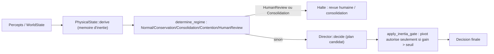

# Physique computationnelle — l'inerte comme couche de réalité contraignante

- **Statut** : Partiel — `PhysicalState`, profils d'action, matériaux, régimes et
  gating d'inertie sont implémentés et testés dans `genos-orchestrator::physics`.
  La dérivation depuis la télémétrie réelle (workspace, Git, budget CI) et le
  branchement automatique dans `tick()`/`GenosEcosystem` restent à faire (voir
  §10).

Les sorties qui reposent sur des proxys de nommage ou des constantes calibrées
portent une maturité `heuristic`; elles peuvent guider le contrôle, mais ne sont
pas des preuves physiques ou métier indépendantes.
- **Portée** : `crates/genos-orchestrator/src/physics.rs`, exemple
  `crates/genos-orchestrator/examples/mission_physics.rs`.
- **Dernière revue** : 2026-09-16.

## 1. Définition du domaine

Le vivant (biologie) donne des boucles de survie ; l'animal (sensorimoteur) donne
perception, action, coordination. Il manque une troisième couche : **l'inerte**,
qui donne des lois, des contraintes, une matière, une inertie, des seuils, une
conservation, une usure. Sans elle, l'orchestrateur choisit « la meilleure action
logique » dans un monde sans coût ni friction — un pur langage. La physique
computationnelle fait que chaque décision est évaluée **dans un monde matériel
contraint** : rien n'est gratuit, tout changement laisse une trace, tout état se
dégrade s'il n'est pas maintenu, toute force excessive crée des dommages, tout
système a une capacité maximale, tout franchissement de seuil change le régime.

## 2. Modèle mathématique ou logique

`PhysicalState` (0..1 par champ) : `energy`, `entropy`, `friction`, `inertia`,
`pressure`, `temperature`, `viscosity`, `elasticity`, `plasticity`,
`rupture_risk`, `resonance`, `structural_gravity: {chemin -> poids}`.

Dérivation (`PhysicalState::derive`) depuis un `WorldState` observé, avec
propagation d'inertie/plasticité depuis l'état précédent (mémoire, pas une
recopie instantanée — même principe que `VolitionState::propagate`) :

```text
energy      = budget / budget_max
entropy     = f(workers/requis, stress, dissonance, taux d'echec)
friction    = f(stress, 1 - energy)
pressure    = max(budget_pressure, threat)
rupture_risk = f(threat, entropy, malades)
elasticity  = 1 - f(rupture_risk, entropy)
inertia_t   = 0.7 * inertia_(t-1) + 0.3 * cible(stabilite, pression)
```

Chaque action a une **masse** (`ActionProfile`) : `mass`, `friction`,
`blast_radius`, `reversibility`, `latency`, `entropy_delta`,
`evidence_debt_delta`. Le score d'utilité (loi « faire payer les décisions ») :

```text
utility = expected_gain
        - friction_action * (1 + friction_monde)
        - blast_radius * (1 - reversibilite) * (1 + rupture_risk)
        - entropy_delta_action * (1 + entropy_monde)
```

Seuil d'inertie anti-pivot (`inertia_threshold`) :

```text
seuil = clamp(0.05 + 0.2*inertia + 0.1*(succes_actuel - 0.5) - 0.1*pression, 0, 0.4)
pivot autorise ssi  score(nouvelle_strategie) - score(strategie_actuelle) > seuil
```

## 3. Analogies biologiques et limites réelles

Les champs reprennent des phénomènes physiques (inertie, friction, gravité,
entropie, pression, température, cristallisation, viscosité, élasticité,
plasticité, seuil de rupture, résonance, diffusion) traduits en règles de
contrôle mesurables — voir le tableau §5. Ce ne sont **pas** des simulations
physiques réelles (pas d'équations différentielles, pas de conservation
d'énergie stricte) : ce sont des heuristiques bornées [0,1] calibrées pour
produire un comportement de contrôle plausible, au même titre que les autres
métaphores biologiques du dépôt (voir `docs/CONVENTIONS.md` §3 : ne jamais
présenter une métaphore comme une fonctionnalité prouvée au-delà de ce qui est
implémenté).

## 4. Cas d'usage et objectifs métier

- Empêcher l'orchestrateur de pivoter de stratégie à chaque signal faible
  (inertie).
- Faire payer chaque action en tokens/risque/entropie avant de la choisir
  (friction).
- Bloquer l'expansion (nouveaux workers, nouvelles branches) quand l'entropie
  est trop haute, forcer une consolidation.
- Exiger une preuve plus forte avant de modifier un fichier « cristal »
  (schéma DB, contrat API, permissions) qu'un fichier « sédiment » (logs).
- Basculer en revue humaine obligatoire quand le risque de rupture est trop
  élevé, plutôt que de continuer à planifier normalement.

## 5. Exemples concrets — phénomènes physiques -> primitives

| Phénomène | Primitive GenOS | Fonction |
| --- | --- | --- |
| Inertie | résistance au changement de stratégie | `inertia_threshold` |
| Friction | coût de chaque action | `utility_score` |
| Gravité | dépendances structurantes | `PhysicalState::record_gravity` / `gravity_of` |
| Entropie | dérive vers le désordre | `PhysicalState::derive` (champ `entropy`) |
| Pression | urgence / contrainte externe | `PhysicalState.pressure` |
| Température | activité/excitation du système | `PhysicalState.temperature` |
| Cristallisation | stabilisation en invariant | `Material::Crystal` |
| Viscosité | lenteur de propagation | `PhysicalState.viscosity` |
| Élasticité | absorber puis revenir (rollback) | `PhysicalState.elasticity` |
| Plasticité | changement durable après contrainte | `PhysicalState.plasticity` |
| Seuil de rupture | point de casse (kill/quarantine) | `PhysicalState.rupture_risk`, `Regime::HumanReview` |
| Résonance | amplification de signaux répétés | `PhysicalState.resonance` |
| Matériaux | classe de résistance au changement | `classify_material`, `Material::required_evidence` |

## 6. Schéma ou diagramme



## 7. Architecture technique

- `crates/genos-orchestrator/src/physics.rs` : module autonome (pas de champ
  ajouté à `Director`/`DirectorState`/`GenosEcosystem` pour respecter la limite
  de 400 lignes déjà atteinte par `director.rs`/`ecosystem.rs`/`tick.rs`).
  - `PhysicalState` + `derive` (dérivation pure depuis `WorldState`).
  - `action_profile(Concept) -> ActionProfile` (registre de masses/frictions).
  - `Material` + `classify_material(path)` (heuristique de nommage).
  - `Regime` + `determine_regime(state, phys)` (transitions de phase).
  - `inertia_threshold(phys, succes_actuel)`.
  - `utility_score(&UtilityInputs)`.
  - `Director::decide_physical(&DecisionContext)` : nouvelle méthode inhérente
    (impl block ajouté depuis un autre fichier du même crate), qui applique le
    régime puis le gating d'inertie **par-dessus** `Director::decide` existant
    sans le modifier.
  - `Director::estimate` est passé de privé à `pub(crate)` (seul changement
    dans `director.rs`, à coût de lignes nul) pour être réutilisé par le
    gating d'inertie.
- Exemple bout-en-bout : `crates/genos-orchestrator/examples/mission_physics.rs`.
- Re-exports publics dans `crates/genos-orchestrator/src/lib.rs`.

## 8. Processus d'exécution ou de validation

```bash
cargo test -p genos-orchestrator physics
cargo run -p genos-orchestrator --example mission_physics
python scripts/ci/check_code_quality.py
```

Tests couvrant : régime de conservation sous budget bas, régime de revue
humaine sous risque de rupture élevé, effet de l'inertie et de la pression sur
le seuil de pivot, pénalisation d'une action lourde/risquée par
`utility_score`, robustesse d'une action légère en crise, classification
matérielle (cristal vs sédiment) et blocage de toute expansion en régime de
consolidation.

## 9. Comparaison avec le marché

Les moteurs d'orchestration LLM classiques (LangGraph, AutoGen, CrewAI)
scorent des actions sur un gain attendu seul, sans notion de coût matériel
composé (friction + risque + entropie), sans gating d'inertie anti-pivot, et
sans classification différenciée des artefacts touchés. La couche physique de
GenOS rend ces trois aspects explicites, mesurables et testés, plutôt que
délégués au prompt.

## 10. Limites, garde-fous, non-objectifs

- Pas encore branché automatiquement dans `tick()`/`GenosEcosystem` : la
  dérivation depuis la télémétrie réelle (nombre de branches Git, taille de
  contexte, dette de preuve réelle) reste à faire — `derive()` n'utilise
  aujourd'hui que les champs déjà présents sur `WorldState`.
  `classify_material` est une heuristique de nommage, pas une analyse réelle
  du graphe d'imports/dépendants/couverture de tests.
- Les constantes (seuils de régime, poids de `derive`) sont des valeurs de
  départ raisonnables, pas des valeurs apprises par mission — la persistance
  de constantes apprises par type de mission (dernier point de la feuille de
  route) n'est pas implémentée.
- `decide_physical` est une méthode additionnelle : elle n'est pas encore
  appelée par défaut dans la boucle de mission (`run_autonomous`/`tick`) ; les
  appelants doivent l'invoquer explicitement pour bénéficier du gating.
- Non-objectif : ceci n'est pas un moteur physique (pas de conservation
  d'énergie stricte, pas d'intégration temporelle) — c'est un ensemble de
  règles de contrôle bornées inspirées de phénomènes physiques.

## Voir aussi

- [../CONVENTIONS.md](../CONVENTIONS.md) — canevas de documentation.
- [runtime-agentique.md](runtime-agentique.md) — `WorldState`, `Director`, boucle de décision.
- [epistemologie-et-evidence.md](epistemologie-et-evidence.md) — dette de preuve, seuils de promotion.
- [../02-orchestration/README.md](../02-orchestration/README.md) — où cette couche s'exécute.
