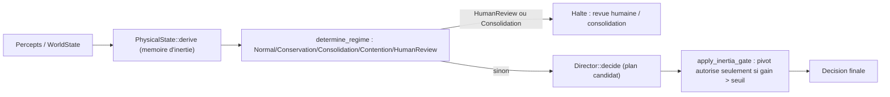

# Physique computationnelle — l'inerte comme couche de réalité contraignante

- **Statut** : Intégré — `tick()` dérive et conserve l'état physique, l'enrichit
  des mesures disponibles du workspace, de Git et du budget CI, puis appelle
  `decide_physical`. Les heuristiques restent bornées et leurs proxys ne sont
  pas des preuves indépendantes.

Les sorties qui reposent sur des proxys de nommage ou des constantes calibrées
portent une maturité `heuristic`; elles peuvent guider le contrôle, mais ne sont
pas des preuves physiques ou métier indépendantes.
- **Portée** : `crates/genos-orchestrator/src/physics.rs`, exemple
  `crates/genos-orchestrator/examples/mission_physics.rs`.
- **Dernière revue** : 2026-09-25.

## 1. Définition du domaine

Cette couche de contrôle emprunte à la physique un vocabulaire pour représenter
des coûts, des limites, de l'inertie et des seuils. Le runtime calcule des
indices à partir de `WorldState` et applique des règles de décision bornées;
il ne simule pas un monde matériel, une conservation, une usure ni des lois
physiques générales.

## 2. Modèle de contrôle (indices sans unité)

`PhysicalState` (0..1 par champ) : `energy`, `entropy`, `friction`, `inertia`,
`pressure`, `temperature`, `viscosity`, `elasticity`, `plasticity`,
`rupture_risk`, `resonance`, `structural_gravity: {chemin -> poids}`.

Dérivation exacte de `PhysicalState::derive` depuis `WorldState`. Les quantités
sont des indices de contrôle bornés dans `[0,1]`, sans unité physique : `budget`
est normalisé par la constante 120, les poids et seuils sont des paramètres du
code, et les noms « énergie » ou « entropie » ne leur donnent pas le sens des
grandeurs thermodynamiques. Avec `clamp01(x)=min(1,max(0,x))` :

```text
energy       = clamp01(budget / 120)
entropy      = clamp01(.25*min(workers/max(required_workers,1),1)
                       + .35*stress + .25*dissonance + .15*failure_rate)
pressure     = clamp01(max(budget_pressure, threat))
friction     = clamp01(.5*stress + .5*(1-energy))
rupture_risk = clamp01(.5*threat + .3*entropy + .2*min(diseased/5,1))
elasticity   = clamp01(1 - .5*rupture_risk - .3*entropy)
temperature  = clamp01(.6*stress + .4*il6)
viscosity    = clamp01(.5*(1-energy) + .5*entropy)
resonance    = clamp01(.6*failure_rate + .4*I[traitor])
target       = clamp01(.3 + .5*(1-clamp01(failure_rate)) - .3*pressure)
inertia_t    = target                         (sans état antérieur)
             = clamp01(.7*inertia_(t-1) + .3*target) (sinon)
plasticity_t = clamp01(.3*rupture_risk)       (sans état antérieur)
             = clamp01(.8*plasticity_(t-1) + .2*rupture_risk) (sinon)
structural_gravity_t = copie de la valeur précédente (ou map vide)
```

Parmi ces champs, le contrôle de régime utilise `rupture_risk`, `energy` et
`entropy`; le seuil anti-pivot utilise `inertia` et `pressure`; le score
`utility_score` utilise `friction`, `rupture_risk` et `entropy`. Les champs
`temperature`, `viscosity`, `elasticity`, `plasticity`, `resonance` et la carte
`structural_gravity` sont dérivés ou conservés, mais ne modulent pas ces trois
décisions dans le chemin documenté.

Le profil d'action contient `mass`, `friction`, `blast_radius`, `reversibility`,
`latency`, `entropy_delta` et `evidence_debt_delta`. La formule du score ci-dessous
ne consomme qu'une partie de ce profil.

Le score d'action réellement utilisé par `utility_score` est :

```text
utility = expected_gain
        - profile.friction * (1 + phys.friction)
        - profile.blast_radius * (1-profile.reversibility) * (1+phys.rupture_risk)
        - profile.entropy_delta * (1+phys.entropy)
```

La masse, la latence et la variation de dette de preuve font partie du profil,
mais n'entrent pas dans cette fonction de score. Elles ne doivent donc pas être
présentées comme des coûts déjà pris en compte par cette formule.

Seuil d'inertie anti-pivot (`inertia_threshold`) :

```text
seuil = clamp(0.05 + 0.2*inertia + 0.1*(succes_actuel - 0.5) - 0.1*pression, 0, 0.4)
pivot autorisé ssi estimation(nouvelle_strategie) - estimation(strategie_actuelle) > seuil
```

Ces calculs sont des règles déterministes testables, pas des lois physiques ni
des modèles prédictifs validés. Les coefficients n'ont pas été calibrés par une
étude comparative; les tests établissent les cas codés, pas la qualité générale
des décisions.

## 3. Analogies biologiques et limites réelles

Les champs empruntent des noms à des phénomènes physiques (inertie, friction,
gravité, entropie, pression, température, cristallisation, viscosité, élasticité,
plasticité, seuil de rupture, résonance, diffusion) traduits en indices de
contrôle — voir le tableau §5. Ce ne sont **pas** des simulations
physiques réelles (pas d'équations différentielles, pas de conservation
d'énergie stricte) : ce sont des heuristiques bornées [0,1], sans calibration
empirique annoncée, qui produisent un comportement de contrôle déterminé par les
constantes du code, au même titre que les autres
métaphores biologiques du dépôt (voir `docs/CONVENTIONS.md` §3 : ne jamais
présenter une métaphore comme une fonctionnalité prouvée au-delà de ce qui est
implémenté).

## 4. Cas d'usage et objectifs métier

- Empêcher l'orchestrateur de pivoter de stratégie à chaque signal faible
  (inertie).
- Faire payer chaque action en tokens/risque/entropie avant de la choisir
  (friction).
- Bloquer l'expansion (nouveaux workers, nouvelles branches) quand l'entropie
  est trop haute, forcer une consolidation.
- Exiger une preuve plus forte avant de modifier un fichier « cristal »
  (schéma DB, contrat API, permissions) qu'un fichier « sédiment » (logs).
- Basculer en revue humaine obligatoire quand le risque de rupture est trop
  élevé, plutôt que de continuer à planifier normalement.

## 5. Exemples concrets — phénomènes physiques -> primitives

| Phénomène | Primitive GenOS | Fonction |
| --- | --- | --- |
| Inertie | résistance au changement de stratégie | `inertia_threshold` |
| Friction | coût de chaque action | `utility_score` |
| Gravité | dépendances structurantes | `PhysicalState::record_gravity` / `gravity_of` |
| Entropie | dérive vers le désordre | `PhysicalState::derive` (champ `entropy`) |
| Pression | urgence / contrainte externe | `PhysicalState.pressure` |
| Température | activité/excitation du système | `PhysicalState.temperature` |
| Cristallisation | stabilisation en invariant | `Material::Crystal` |
| Viscosité | lenteur de propagation | `PhysicalState.viscosity` |
| Élasticité | absorber puis revenir (rollback) | `PhysicalState.elasticity` |
| Plasticité | changement durable après contrainte | `PhysicalState.plasticity` |
| Seuil de rupture | point de casse (kill/quarantine) | `PhysicalState.rupture_risk`, `Regime::HumanReview` |
| Résonance | amplification de signaux répétés | `PhysicalState.resonance` |
| Matériaux | classe de résistance au changement | `classify_material`, `Material::required_evidence` |

## 6. Schéma ou diagramme



## 7. Architecture technique

- `crates/genos-orchestrator/src/physics.rs` : lois de dérivation, profils,
  matériaux et décision gatée.
- `crates/genos-orchestrator/src/physical_telemetry.rs` : échantillonnage best
  effort du nombre de fichiers du workspace (hors `.git`, `target`,
  `node_modules`), fichiers Git modifiés et branches locales. Le budget CI est
  lu depuis `CI_BUDGET_REMAINING` / `CI_BUDGET_TOTAL` (ou leurs variantes
  `GITHUB_RUN_ATTEMPT_REMAINING` / `GITHUB_RUN_ATTEMPT_TOTAL`). Les sources
  absentes restent `None` et n'affectent pas l'état.
  - `PhysicalState` + `derive` (dérivation pure depuis `WorldState`).
  - `action_profile(Concept) -> ActionProfile` (registre de masses/frictions).
  - `Material` + `classify_material(path)` (heuristique de nommage).
  - `Regime` + `determine_regime(state, phys)` (transitions de phase).
  - `inertia_threshold(phys, succes_actuel)`.
  - `utility_score(&UtilityInputs)`.
  - `Director::decide_physical(&DecisionContext)` : nouvelle méthode inhérente
    (impl block ajouté depuis un autre fichier du même crate), qui applique le
    régime puis le gating d'inertie **par-dessus** `Director::decide` existant
    sans le modifier.
  - `Director::estimate` est passé de privé à `pub(crate)` (seul changement
    dans `director.rs`, à coût de lignes nul) pour être réutilisé par le
    gating d'inertie.
- Exemple bout-en-bout : `crates/genos-orchestrator/examples/mission_physics.rs`.
- Re-exports publics dans `crates/genos-orchestrator/src/lib.rs`.

## 8. Processus d'exécution ou de validation

```bash
cargo test -p genos-orchestrator physics
cargo run -p genos-orchestrator --example mission_physics
python scripts/ci/check_code_quality.py
```

Tests couvrant : régime de conservation sous budget bas, régime de revue
humaine sous risque de rupture élevé, effet de l'inertie et de la pression sur
le seuil de pivot, pénalisation d'une action lourde/risquée par
`utility_score`, robustesse d'une action légère en crise, classification
matérielle (cristal vs sédiment) et blocage de toute expansion en régime de
consolidation.

## 9. Comparaison avec le marché

Cette fiche ne formule pas de comparaison empirique avec d'autres orchestrateurs.
Une telle comparaison nécessiterait des versions identifiées, des tâches communes,
des budgets contrôlés et des mesures reproductibles.

## 10. Limites, garde-fous, non-objectifs

- Les compteurs workspace/Git et le budget CI sont des proxys bornés qui
  modulent friction, entropie, inertie et pression. La taille de contexte, la
  dette de preuve réelle, les dépendances/imports et la couverture de tests ne
  sont pas mesurés. Les erreurs d'accès aux sources optionnelles laissent ces
  mesures absentes ; l'état dérivé de `WorldState` reste actif.
  `classify_material` est une heuristique de nommage, pas une analyse réelle
  du graphe d'imports/dépendants/couverture de tests.
- Les constantes (seuils de régime, poids de `derive`) sont des valeurs de
  départ raisonnables, pas des valeurs apprises par mission — la persistance
  de constantes apprises par type de mission (dernier point de la feuille de
  route) n'est pas implémentée.
- Non-objectif : ceci n'est pas un moteur physique (pas de conservation
  d'énergie stricte, pas d'intégration temporelle) — c'est un ensemble de
  règles de contrôle bornées inspirées de phénomènes physiques.

## Voir aussi

- [../CONVENTIONS.md](../CONVENTIONS.md) — canevas de documentation.
- [runtime-agentique.md](runtime-agentique.md) — `WorldState`, `Director`, boucle de décision.
- [epistemologie-et-evidence.md](epistemologie-et-evidence.md) — dette de preuve, seuils de promotion.
- [../02-orchestration/README.md](../02-orchestration/README.md) — où cette couche s'exécute.
