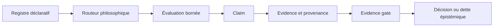

# Savoir et épistémologie

## Raisonnement formel borné

Le registre expose désormais un premier niveau opérationnel pour certains raisonnements
formels : logique modale et cadres de Kripke, logique déontique et dynamique, logiques
paraconsistante et paracomplète, ainsi que déduction, induction, abduction et mise à jour
bayésienne. Ces adaptateurs évaluent uniquement les entrées fournies ; ils ne constituent
pas un prouveur général et ne déclenchent aucune action du runtime.

Toute analyse exposée par le routeur respecte le contrat
`genos.philosophy-analysis/v1` : `status`, `evidence`, `uncertainty`, `provenance` et
`promotionEligible`. La promotion est toujours désactivée (`promotionEligible: false`) tant
qu’une preuve indépendante et les gates de promotion ne l’ont pas établie. Une analyse
contradictoire ou indéterminée reste donc un résultat explicite, jamais un succès implicite.

Les modèles modaux doivent déclarer des mondes uniques et des arêtes d’accessibilité qui
référencent ces mondes. Les annonces publiques sont simulées sur une copie logique du
modèle ; elles ne modifient pas l’état du runtime.

- **Statut** : Partiel — registre déclaratif étendu ; infrastructure de claims, preuves et confiance déjà disponible ; analyses philosophiques spécialisées encore progressives.
- **Portée** : nature du savoir, justification, inférence, vérité, science, scepticisme et épistémologie sociale.
- **Dernière revue** : 2026-09-17.

## 1. Définition du domaine

Le savoir concerne les conditions dans lesquelles un agent peut tenir une proposition,
une capacité ou une personne pour connue. Le registre GenOS distingue le vocabulaire
philosophique de la garantie opérationnelle : enregistrer un concept ne rend pas ce
concept vrai et ne fournit pas automatiquement une méthode d'inférence.

Dans le modèle classique attribué à Platon, le savoir propositionnel est une croyance
vraie justifiée. L'analyse tripartite est utile comme point de départ, mais le problème
de Gettier montre qu'une croyance vraie et justifiée peut être vraie par accident. GenOS
conserve donc séparément la croyance, la preuve, la provenance, la confiance et les
incertitudes.

## 2. Modèle logique et probabiliste

Un claim GenOS est une assertion typée accompagnée d'éléments de preuve. Sa qualité
épistémique dépend de la nature et du contenu de ces éléments, et non d'un simple score
de confiance fourni par un modèle.

```text
claim
 ├── type : factual | normative | preference | belief
 ├── statement
 ├── evidence[]
 ├── provenance
 ├── probability / confidence (facultatif, dérivé et calibrable)
 ├── phase : explore | commit
 └── uncertainty / epistemic debt
```

La distinction opérationnelle est la suivante :

| Notion | Sens philosophique | Traduction GenOS |
| --- | --- | --- |
| Croyance | position tenue par un agent | claim de type `belief` |
| Opinion / doxa | position insuffisamment établie ou contestable | claim provisoire et dette possible |
| Justification | raisons qui soutiennent une croyance | preuves typées et provenance |
| Vérité | propriété de la proposition ou de son adéquation | non déduite d’un statut `success` |
| Certitude | confiance maximale ou absence subjective de doute | seuil de décision, jamais preuve en soi |
| Vraisemblance | degré de soutien ou de plausibilité | qualité, probabilité et calibration |
| Savoir-faire | capacité pratique à réussir une opération | résultat reproductible, distinct d’un claim propositionnel |

## 3. Formes de connaissance

Le registre couvre plusieurs sens du mot « savoir » :

- connaissance propositionnelle : savoir que `p` ;
- connaissance par acquaintance : familiarité directe avec un objet, une personne ou
  une expérience, au sens de Russell ;
- connaissance pratique : savoir-faire, qui ne se réduit pas à pouvoir énoncer une
  règle ;
- connaissance de type `knowledge-wh` : savoir qui, quoi, où, quand, pourquoi ou
  comment ;
- connaissance sociale : contenu reçu par témoignage, discussion ou division du
  travail cognitif.

Les concepts `knowledge-first`, `knowledge account of assertion`, la théorie causale,
le reliabilisme et la virtue epistemology sont enregistrés comme cadres distincts.
Ils ne sont pas confondus avec la validation actuelle des claims.

## 4. Sources, méthodes et écoles

Le registre déclaratif couvre notamment :

| Famille | Concepts principaux | Statut actuel |
| --- | --- | --- |
| Sources | empirisme, rationalisme, kantisme, idées innées, tabula rasa | conceptuel ou partiel |
| Inférence | déduction, induction, abduction, meilleure explication | conceptuel |
| Probabilité | probabilisme objectif/subjectif, bayésianisme, Dutch book | partiel ou planifié |
| Science | hypothético-déductivisme, confirmation, falsification | partiel — analyses bornées |
| Histoire des sciences | Duhem-Quine, Lakatos, Kuhn, incommensurabilité | partiel pour Duhem-Quine ; conceptuel pour le reste |
| Fiabilité | reliabilisme, process/indicator reliabilism, vertus intellectuelles | partiel ou planifié |
| Limites | scepticisme, doute cartésien, Gödel | partiel ou conceptuel |

L’induction produit une généralisation ampliative ; la déduction préserve la vérité
sous ses prémisses et sa forme valides ; l’abduction propose une explication. Aucune
de ces trois formes ne transforme à elle seule une hypothèse en fait établi.

## 5. Gettier et défenses post-Gettier

Un cas Gettier est représenté comme un contre-exemple :

```text
croyance(agent, p) = vraie
justification(agent, p) = présente
relation(agent, vérité de p) = accidentelle ou mal connectée
résultat = connaissance contestée
```

Les réponses enregistrées dans le registre comprennent :

- reliabilisme : la croyance provient-elle d’un processus fiable ?
- théorie causale : le fait rend-il causalement compte de la croyance ?
- virtue epistemology : la vérité résulte-t-elle d’une compétence intellectuelle ?
- knowledge-first : faut-il prendre le savoir comme notion primitive ?
- approches anti-luck : la vérité est-elle suffisamment protégée contre la chance ?

Le runtime actuel peut suivre preuves, qualité, provenance et dette épistémique, mais
ne tranche pas automatiquement entre ces théories philosophiques.

## 5.1 Effets runtime contrôlés

Une évaluation philosophique est d’abord sans effet de bord. Quand un agent doit
émettre un signal opérationnel, il utilise `genos_philosophy.applyRuntimeEffect`
avec un `concept`, un `agentId` et un effet explicite. Sans `apply: true`, le
runtime retourne uniquement un aperçu.

Les effets autorisés sont `require_evidence`, `hold_promotion` et
`prefer_observation`. Une application réussie émet un événement de télémétrie
avec `controlled: true` et un receipt. Le signal ne modifie ni les fichiers, ni
les leases, ni les droits MCP ; son traitement ultérieur reste soumis aux
barrières d’autorité et d’évidence. Voir [ADR 0016](../adr/0016-effets-runtime-philosophiques-controles.md).

## 6. Vérité, confirmation et science

Le registre distingue les théories suivantes :

- correspondance : une proposition est vraie par rapport à un état de choses ;
- cohérence : elle s’insère dans un ensemble cohérent ;
- pragmatisme : la vérité est liée aux conséquences de l’enquête ;
- déflationnisme et minimalisme : le prédicat « vrai » ne porte pas nécessairement une
  propriété métaphysique substantielle ;
- réalisme interne de Putnam : la vérité dépend de conditions rationnelles d’assertion
  dans un cadre conceptuel, sans être réduite à une préférence.

La confirmation, la vérification et la falsification sont trois opérations différentes.
Une observation compatible avec une hypothèse ne la vérifie pas nécessairement ; un
contre-exemple reproductible peut la réfuter selon le contrat retenu ; et la thèse de
Duhem-Quine rappelle qu’un test porte souvent sur un ensemble d’hypothèses auxiliaires.

Les adaptateurs scientifiques sont exécutables pour des entrées bornées et testables.
Ils retournent leur méthode, leur statut et leur contexte épistémique, mais aucune
sortie ne constitue une preuve générale ou une autorisation de promotion.

Les références à Kuhn, Lakatos et à l’incommensurabilité décrivent des cadres
d’histoire et de philosophie des sciences. Elles ne doivent pas être utilisées comme
algorithmes automatiques de sélection de code.

## 7. Architecture technique

Le registre canonique est défini dans
[`backend/src/philosophy/conceptDefinitions.js`](../../backend/src/philosophy/conceptDefinitions.js).
Il est consultable par le routeur
[`backend/src/services/philosophyRouter.js`](../../backend/src/services/philosophyRouter.js)
et par l’opération MCP `genos_philosophy`.

Les primitives épistémiques existantes sont réparties entre :

- [`backend/src/services/epistemics.js`](../../backend/src/services/epistemics.js) pour
  la validation des claims, la qualité des preuves, la confiance, les phases et la
  dette épistémique ;
- [`backend/src/services/epistemic/registry.js`](../../backend/src/services/epistemic/registry.js)
  pour le registre des types de claims et leur provenance ;
- [`backend/src/db/epistemic-schema.js`](../../backend/src/db/epistemic-schema.js) pour
  les tables de claims, dettes et tendances de confiance ;
- [`backend/src/services/epistemologyService.js`](../../backend/src/services/epistemologyService.js)
  pour les mappings historiques du platonisme, de l’aristotélisme et du kantisme.
- [`backend/src/services/philosophyRuntimeEffectService.js`](../../backend/src/services/philosophyRuntimeEffectService.js)
  pour les signaux runtime philosophiques explicitement appliqués.



## 8. Processus de validation

1. Un agent formule une proposition et indique son type de claim.
2. Le système vérifie que les preuves sont typées et non vides.
3. La qualité de preuve et la confiance dérivée sont calculées séparément.
4. La provenance, les contradictions et les incertitudes sont conservées.
5. Une dette épistémique est créée si la position reste provisoire, faible ou
   contradictoire.
6. Une promotion ou une action n’est autorisée que si le contrat de preuve applicable
   est satisfait.

Une réponse du modèle, un transport réussi, une sortie `success` ou un consensus ne
constituent donc pas, à eux seuls, une preuve de vérité.

## 9. Épistémologie sociale, féministe et située

Le savoir GenOS peut être distribué entre agents. Le témoignage est traité comme une
source avec provenance, et non comme une autorité absolue. La discussion, le désaccord,
la division du travail cognitif et la révision d’une croyance doivent conserver les
contributions rejetées autant que les contributions retenues.

L’épistémologie féministe, la standpoint theory et les savoirs situés de Haraway
introduisent une contrainte de contexte : qui produit un énoncé, depuis quelle
position, avec quelles asymétries d’accès et quels intérêts ? Ces cadres enrichissent
l’audit de provenance ; ils ne sont pas réduits à un simple score de fiabilité.

## 10. Limites, garde-fous et non-objectifs

- Le registre ne prouve aucune thèse philosophique.
- Gödel ne constitue pas une preuve générale que toute connaissance est impossible ;
  le concept est limité aux résultats formels et à leurs conditions.
- Un score bayésien ou de confiance n’est pas une vérité objective sans modèle,
  données, calibration et hypothèses explicites.
- Le reliabilisme ne permet pas encore d’évaluer automatiquement toutes les capacités
  cognitives d’un agent.
- La connaissance par acquaintance, le savoir-faire, le témoignage et la connaissance
  propositionnelle ne doivent pas être fusionnés dans un même champ sans perte de sens.
- Les concepts marqués `planned` dans le registre restent documentaires et retournent
  une évaluation non supportée tant qu’aucun adaptateur vérifiable n’existe.

Les tests du registre et du routeur se trouvent dans
[`backend/tests/test_philosophy_router.js`](../../backend/tests/test_philosophy_router.js).
