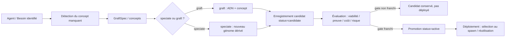

# Spéciation et graft autonomes — flux complet d'innovation

- **Statut** : Partiel — opérations `speciate`/`graft` implémentées côté Rust, boucle d'innovation côté JS, mais flux machine complet évaluation→promotion→déploiement pas encore observable dans tous les cas.
- **Portée** : `crates/genos-genome`/`crates/genos-reproduction`, `backend/src/services/agentDnaInnovation.js`, `workerEvidenceBarrierLocal.js`.
- **Dernière revue** : 2026-09-17.

Le runtime expose la maturité `partial` pour `speciate` et `graft` tant que la
chaîne évaluation → gate → promotion → déploiement n'est pas reliée dans tous
les contextes. Un résultat structurel réussi ne vaut donc pas promotion.

## Position sur les métaphores

Comme pour l'ensemble du runtime, les termes biologiques (spéciation, graft, radiation adaptative, HGT, lignée, candidat) désignent des **politiques logicielles**, pas une équivalence avec une biologie réelle. La spéciation autonome est un modèle d'organisation : un agent peut produire une nouvelle lignée génomique réutilisable si le contexte le permet, mais l'autonomie reste un pouvoir donné au runtime, pas une capacité physique de reproduction cellulaire.

## 2. Modèle logique du flux autonome

### 2.1 Déclencheurs

Le flux peut être déclenché par :

- **succès validé d'un worker** : un agent réussit une mission avec un outil/capacité absent de son génome de base et la preuve est enregistrée (`hasDecisionEvidence`, `WORKER_CAPABILITY_LEASED`).
- **détection explicite d'un besoin** : un agent ou l'orchestrateur identifie un vide fonctionnel (capacité, stratégie, outil) et décide de produire un candidat.
- **demande externe** : opérateur, orchestrateur, autre agent demande l'exploration d'une mutation/spéciation sur un génome existant.

### 2.2 Résolution du besoin

Une fois le besoin identifié, le système :

1. détermine le **génome de base** de référence (le génome sélectionné/original de l'agent) ;
2. identifie les **concepts manquants** : outils, capacités, stratégie, comportements encodés dans les loci ;
3. produit des **GraftSpec** (`locus`, `instruction`, `plasmid`) pour chaque concept à distiller ;
4. choisit l'opération : **graft** (ajout sur génome existant) ou **speciate** (nouveau génome dérivé).

### 2.3 Spéciation vs graft autonomes

- **graft** ajoute un concept acquis à un génome existant. C'est l'opération légère : un gène localisé ou un plasmide, tracé dans `PROV.mutations`. L'identité du génome reste la même.
- **speciate** dérive un **nouveau** génome (`genome_id` neuf, `generation+1`, `parents=[base]`) et y distille un ou plusieurs concepts. C'est l'opération lourde : nouvelle lignée, nouveau phénotype potentiel.

Dans les deux cas, la provenance est obligatoire : `parents`, `selection = concept`, et si applicable `agent_genome_innovations`.

### 2.4 Statut candidate

Un candidat issu de spéciation/graft autonome est enregistré avec `status = 'candidate'` :

- il est **exclu de la sélection automatique** (`selectGenome`, `bestMatch`) tant qu'il n'est pas promu ;
- il reste **chargeable explicitement** et observable dans l'audit ;
- il porte l'évidence source (`agent_genome_innovations.evidence_json`) et le concept distillé.

Voir aussi `spec/AGENT_DNA_SPEC.md` §Opérations normatives et `docs/adr/0002-agentdna-innovation-loop.md`.

## 3. Flux complet autonome

### 3.1 Vue d'ensemble

### 3.2 Étape 1 — Identification du besoin

L'agent (ou l'orchestrateur) constate :

- une mission réussie avec un outil/capacité absent du génome de base ;
- un besoin fonctionnel non couvert (capacité manquante, stratégie inadaptée, outil absent) ;
- un avantage potentiel à capitaliser le concept.

La détection automatique est réalisée par `detectNovelConcepts(baseModel, tools)` dans `backend/src/services/agentDnaInnovation.js` : elle compare les gènes du génome de base aux outils effectivement utilisés et produit des `GraftSpec`.

### 3.3 Étape 2 — Spéciation ou graft

Le candidat est produit par les opérations normatives :

- `speciate` : `Genome::derive_child` + greffe(s) → nouveau génome avec `PROV.selection` = concept déclencheur.
- `graft` : `Genome::insert_gene` ou `Plasmid::new` → génome modifié avec `PROV.mutations` enrichi.

L'opération est invoquée via `agentDnaOperations.runOperation(...)` avec `operation: 'speciate'` ou `'graft'`, et produit un `AgentDNA` + `contentHash`.

### 3.4 Étape 3 — Enregistrement candidat

Le candidat est stocké avec :

- `status = 'candidate'` sur `agent_genomes` ;
- une ligne d'audit `agent_genome_innovations` : `source_agent_id`, `base_genome_ref`, `candidate_genome_ref`, `concept`, `evidence_json`, `status`, scope tenant/projet.

C'est ce qui est implémenté dans `captureCandidate(...)` / `captureFromSuccess(...)` de `backend/src/services/agentDnaInnovation.js`.

### 3.5 Étape 4 — Évaluation

Le candidat est évalué avant toute promotion. L'évaluation porte sur :

- **viabilité** : `Genome::validate` + vérification conteneur + signature si politique active ;
- **preuve** : l'évidence source est-elle falsifiable, réelle, liée à un succès validé ? ;
- **coût** : le concept a-t-il un coût réel (ressources, risque, maintenance) ? ;
- **risque** : le concept introduit-il un comportement dangereux, instable, non fiable ?

L'évaluation peut être :

- automatique (heuristique, checks structurels, preuve existante) ;
- pilotée par un agent/juge dédié (par exemple un agent de sécurité, de qualité, ou un juge comparatif) ;
- soumise à un gate humain selon la politique du tenant.

Ce qui n'est pas encore un pipeline machine complet autonome dans tous les cas, c'est la partie **décision d'évaluation → gate → éviction ou promotion** qui doit être orchestrée explicitement selon le contexte.

### 3.6 Étape 5 — Promotion (gate)

Si le gate est franchi :

- `agent_genome_innovations.status` passe à `'promoted'` ;
- `agent_genomes.status` du candidat passe à `'active'` ;
- le candidat devient **sélectionnable automatiquement**.

C'est ce qui est implémenté dans `promoteCandidate(...)` de `backend/src/services/agentDnaInnovation.js`.

### 3.7 Étape 6 — Déploiement

Une fois promu, le génome est déployé par :

- **sélection au spawn** : un nouvel agent (ou un agent remplacé) peut être spawné avec ce génome via `selectGenome`/`applyAgentDna` ;
- **réutilisation par la population** : le concept devient disponible pour les agents du même domaine/tenant ;
- **capitalisation** : le candidat fait partie du pool de génomes réutilisables.

Le déploiement n'est pas automatique au sens "tous les agents se mettent à jour". C'est une sélection future, pilotée par le recrutement et les politiques en vigueur.

## 4. Ce qui est implémenté

- **Opérations normatives** : `speciate`, `graft` (Rust `genos-dna::operations`), `validate`, `express`.
- **Détection** : `detectNovelConcepts` (backend `agentDnaInnovation.js`).
- **Capture candidat** : `captureCandidate`, `captureFromSuccess` (backend `agentDnaInnovation.js`).
- **Hook de succès** : `publishLocalSuccess` → `agentDnaInnovation.captureFromSuccess` (backend `workerEvidenceBarrierLocal.js`).
- **Promotion** : `promoteCandidate` (backend `agentDnaInnovation.js`).
- **Statut candidate** : `agent_genomes.status`, `agent_genome_innovations`.

Voir aussi :

- `backend/src/services/agentDnaInnovation.js`
- `backend/src/services/agentDnaOperations.js`
- `backend/src/services/workerEvidenceBarrierLocal.js`
- `backend/src/services/agentDnaStore.js`
- `crates/genos-dna/src/operations.rs`
- `docs/adr/0002-agentdna-innovation-loop.md`
- `spec/AGENT_DNA_SPEC.md`

## 5. Ce qui n'est pas encore produit comme flux autonome complet

Le socle permet la spéciation/graft et la capture de candidats, mais **le pipeline complet "agent identifie un besoin → speciate → évalue → promeut → déploie" n'est pas encore un flux machine unique, observable dans tous les cas** :

- la détection est automatique dans le cas du succès validé, mais pas obligatoire ni universelle ;
- l'évaluation et la décision de promotion ne sont pas encore un pipeline autonome complet et exécutable sans orchestration externe selon le contexte (gate humain, juge dédié, politique tenant) ;
- le déploiement reste une sélection future, pas une propagation automatique.

Donc : la capacité existe, les primitives existent, le hook existe, mais le flux **bout-en-bout autonome** n'est pas le scénario par défaut documenté comme produit fini.

## 6. Contraintes et garde-fous

- Un génome `candidate` n'est **jamais recruté automatiquement** avant promotion.
- La preuve source est enregistrée, mais la promotion reste gated (preuve falsifiable, coût réel, approbation/signature selon politique).
- Un génome issu de spéciation/graft autonome est traité comme **entrée non fiable** jusqu'à preuve/passage du gate.
- L'autonomie est un pouvoir du runtime ; le cas d'usage principal documenté reste piloté (orchestrateur/opérateur/agent juge), pas l'autonomie totale non supervisée.

## Voir aussi

- [agent-dna-runtime.md](agent-dna-runtime.md) — format et opérations normatives.
- [biologie-computationnelle.md](biologie-computationnelle.md) — position sur les métaphores.
- [spec/AGENT_DNA_SPEC.md](../../spec/AGENT_DNA_SPEC.md) — spécification normative du format et des opérations.
- [docs/adr/0002-agentdna-innovation-loop.md](../../docs/adr/0002-agentdna-innovation-loop.md) — boucle d'innovation et gate de promotion.
- [GENOME_EPIGENETIQUE.md](genome-et-epigenetique.md), [REPRODUCTION_REPLICATION.md](../02-orchestration/reproduction-et-replication.md), [EPISTEMOLOGIE_EVIDENCE.md](epistemologie-et-evidence.md).
