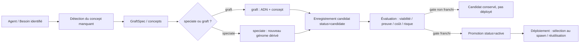

# Spéciation et graft autonomes — flux complet d'innovation

- **Statut** : Capture et évaluation disponibles via API backend ; après gate, la promotion reste une décision explicite d'opérateur.
- **Portée** : `crates/genos-genome`/`crates/genos-reproduction`, `backend/src/services/agentDnaInnovation.js`, `workerEvidenceBarrierLocal.js`.
- **Dernière revue** : 2026-09-17.

Le flux distingue quatre états persistés : `candidate` (en attente ou gate refusée),
`evaluated` (gate admissible), `promoted` et `rejected`. L'évaluation admissible
rend le candidat promouvable ; elle ne déclenche pas elle-même la décision opérateur.
Un résultat structurel réussi ne vaut donc pas promotion.

## Position sur les métaphores

Comme pour l'ensemble du runtime, les termes biologiques (spéciation, graft, radiation adaptative, HGT, lignée, candidat) désignent des **politiques logicielles**, pas une équivalence avec une biologie réelle. La spéciation autonome est un modèle d'organisation : un agent peut produire une nouvelle lignée génomique réutilisable si le contexte le permet, mais l'autonomie reste un pouvoir donné au runtime, pas une capacité physique de reproduction cellulaire.

## 2. Modèle logique du flux autonome

### 2.1 Déclencheurs

Le flux peut être déclenché par :

- **succès validé d'un worker** : un agent réussit une mission avec un outil/capacité absent de son génome de base et la preuve est enregistrée (`hasDecisionEvidence`, `WORKER_CAPABILITY_LEASED`).
- **détection explicite d'un besoin** : un agent ou l'orchestrateur identifie un vide fonctionnel (capacité, stratégie, outil) et décide de produire un candidat.
- **demande externe** : opérateur, orchestrateur, autre agent demande l'exploration d'une mutation/spéciation sur un génome existant.

### 2.2 Résolution du besoin

Une fois le besoin identifié, le système :

1. détermine le **génome de base** de référence (le génome sélectionné/original de l'agent) ;
2. identifie les **concepts manquants** : outils, capacités, stratégie, comportements encodés dans les loci ;
3. produit des **GraftSpec** (`locus`, `instruction`, `plasmid`) pour chaque concept à distiller ;
4. choisit l'opération : **graft** (ajout sur génome existant) ou **speciate** (nouveau génome dérivé).

### 2.3 Spéciation vs graft autonomes

- **graft** ajoute un concept acquis à un génome existant. C'est l'opération légère : un gène localisé ou un plasmide, tracé dans `PROV.mutations`. L'identité du génome reste la même.
- **speciate** dérive un **nouveau** génome (`genome_id` neuf, `generation+1`, `parents=[base]`) et y distille un ou plusieurs concepts. C'est l'opération lourde : nouvelle lignée, nouveau phénotype potentiel.

Dans les deux cas, la provenance est obligatoire : `parents`, `selection = concept`, et si applicable `agent_genome_innovations`.

### 2.4 Statut candidate

Un candidat issu de spéciation/graft autonome est enregistré avec `status = 'candidate'` :

- il est **exclu de la sélection automatique** (`selectGenome`, `bestMatch`) tant qu'il n'est pas promu ;
- il reste inspectable par référence via le registre, mais il n'est pas applicable à un worker tant qu'il n'est pas promu ;
- il porte l'évidence source (`agent_genome_innovations.evidence_json`) et le concept distillé.

Voir aussi `spec/AGENT_DNA_SPEC.md` §Opérations normatives et `docs/adr/0002-agentdna-innovation-loop.md`.

## 3. Flux complet autonome

### 3.1 Vue d'ensemble

```mermaid
flowchart LR
    A[Agent / Besoin identifié] --> D[Détection du concept manquant]
    D --> E[GraftSpec / concepts]
    E --> S{speciate ou graft ?}
    S -->|graft| G[graft : ADN + concept]
    S -->|speciate| SP[speciate : nouveau génome dérivé]
    G --> C[Enregistrement candidat status=candidate]
    SP --> C
    C --> V[Évaluation : viabilité / preuve / coût / risque]
    V -->|gate non franchi| X[Candidat conservé, pas déployé]
    V -->|gate franchi| P[Promotion status=active]
    P --> DP[Déploiement : sélection au spawn / réutilisation]
```

### 3.2 Étape 1 — Identification du besoin

L'agent (ou l'orchestrateur) constate :

- une mission réussie avec un outil/capacité absent du génome de base ;
- un besoin fonctionnel non couvert (capacité manquante, stratégie inadaptée, outil absent) ;
- un avantage potentiel à capitaliser le concept.

La détection automatique est réalisée par `detectNovelConcepts(baseModel, tools)` dans `backend/src/services/agentDnaInnovation.js` : elle compare les gènes du génome de base aux outils effectivement utilisés et produit des `GraftSpec`.

### 3.3 Étape 2 — Spéciation ou graft

Le candidat est produit par les opérations normatives :

- `speciate` : `Genome::derive_child` + greffe(s) → nouveau génome avec `PROV.selection` = concept déclencheur.
- `graft` : `Genome::insert_gene` ou `Plasmid::new` → génome modifié avec `PROV.mutations` enrichi.

L'opération est invoquée via `agentDnaOperations.runOperation(...)` avec `operation: 'speciate'` ou `'graft'`, et produit un `AgentDNA` + `contentHash`.

### 3.4 Étape 3 — Enregistrement candidat

Le candidat est stocké avec :

- `status = 'candidate'` sur `agent_genomes` ;
- une ligne d'audit `agent_genome_innovations` : `source_agent_id`, `base_genome_ref`, `candidate_genome_ref`, `concept`, `evidence_json`, `status`, scope tenant/projet.

C'est ce qui est implémenté dans `captureCandidate(...)` / `captureFromSuccess(...)` de `backend/src/services/agentDnaInnovation.js`.

### 3.5 Étape 4 — Évaluation

Le candidat est évalué avant toute promotion. L'évaluation porte sur :

- **viabilité** : `Genome::validate` + vérification conteneur + signature si politique active ;
- **preuve** : l'évidence source est-elle falsifiable, réelle, liée à un succès validé ? ;
- **coût** : le concept a-t-il un coût réel (ressources, risque, maintenance) ? ;
- **risque** : le concept introduit-il un comportement dangereux, instable, non fiable ?

L'évaluation peut être :

- automatique (heuristique, checks structurels, preuve existante) ;
- pilotée par un agent/juge dédié (par exemple un agent de sécurité, de qualité, ou un juge comparatif) ;
- soumise à un gate humain selon la politique du tenant.

Les captures issues d'un succès validé ou d'un fossile vérifié déclenchent aussi cette évaluation automatiquement. Les contrôles, les motifs d'échec et le résultat de confiance sont conservés dans `evaluation_json`. Les juges spécialisés de risque/coût restent externes ; leur résultat n'est pas simulé par la gate structurelle.

### 3.6 Étape 5 — Promotion (gate)

Si le gate est franchi :

- `agent_genome_innovations.status` passe à `'evaluated'` ;
- le candidat est admissible à une décision opérateur, mais n'est pas encore sélectionnable ;
- l'opérateur appelle explicitement `promote` ou `reject` ;
- `agent_genome_innovations.status` passe à `'promoted'` après approbation ;
- `agent_genomes.status` du candidat passe à `'active'` ;
- le candidat devient **sélectionnable automatiquement**.

La transition `evaluated → promoted`, l'activation du génome et son reçu d'audit
sont enregistrés ensemble. Les états finaux (`promoted`, `rejected`) ne peuvent
pas être réévalués.

C'est ce qui est implémenté dans `promoteCandidate(...)` de `backend/src/services/agentDnaInnovation.js`.

### 3.7 Étape 6 — Déploiement

Une fois promu, le génome est déployé par :

- **sélection au spawn** : un nouvel agent (ou un agent remplacé) peut être spawné avec ce génome via `selectGenome`/`applyAgentDna` ;
- **réutilisation par la population** : le concept devient disponible pour les agents du même domaine/tenant ;
- **capitalisation** : le candidat fait partie du pool de génomes réutilisables.

Le déploiement n'est pas automatique au sens "tous les agents se mettent à jour". C'est une sélection future, pilotée par le recrutement et les politiques en vigueur.

## 4. Ce qui est implémenté

- **Opérations normatives** : `speciate`, `graft` (Rust `genos-dna::operations`), `validate`, `express`.
- **Détection** : `detectNovelConcepts` (backend `agentDnaInnovation.js`).
- **Capture candidat et évaluation automatique** : `captureFromSuccess`, `captureFromFossil` et `captureAndEvaluate` (backend `agentDnaInnovation.js`). L'API `POST /genomes/innovations` permet aussi une capture explicite.
- **Hook de succès** : `publishLocalSuccess` → `agentDnaInnovation.captureFromSuccess` (backend `workerEvidenceBarrierLocal.js`).
- **Évaluation, gate, promotion et rejet** : `evaluateCandidate`, `promoteCandidate`, `rejectCandidate` (backend `agentDnaInnovation.js`).
- **Audit opérateur** : chaque promotion enregistre l'identité de l'opérateur et une entrée `GENOME_INNOVATION_PROMOTED` dans `audit_logs` dans la même transaction que l'activation.
- **Statut candidate** : `agent_genomes.status`, `agent_genome_innovations`.

Voir aussi :

- `backend/src/services/agentDnaInnovation.js`
- `backend/src/services/agentDnaOperations.js`
- `backend/src/services/workerEvidenceBarrierLocal.js`
- `backend/src/services/agentDnaStore.js`
- `crates/genos-dna/src/operations.rs`
- `docs/adr/0002-agentdna-innovation-loop.md`
- `spec/AGENT_DNA_SPEC.md`

## 5. Flux observable dans le backend

Le registre d'innovations expose maintenant la chaîne opérable suivante (sous les routes AgentDNA, avec `workspace:write` pour les mutations) :

- `POST /genomes/innovations` reçoit le besoin identifié (`baseGenomeRef`, `concept`, `concepts`, `evidence`) et crée un génome dérivé en statut `candidate` ; la capture automatique après succès vérifié et la capture depuis fossile utilisent le même stockage.
- `GET /genomes/innovations` montre les candidats, preuves, évaluations et décisions dans le périmètre tenant/projet.
- `POST /genomes/innovations/:id/evaluate` conserve un résultat de gate vérifiable : validité du génome décodé, preuve de décision substantivée et conformité à la politique de signature du tenant.
- Les captures de succès/fossile exécutent la même évaluation automatiquement ; une évaluation admissible donne le statut `evaluated`, un échec reste `candidate` avec ses contrôles et ses motifs.
- `POST /genomes/innovations/:id/promote` est refusé tant que la dernière évaluation n'est pas admissible. L'identité de l'opérateur est requise et auditée avec la promotion ; le candidat devient `active` dans la même transaction.
- `POST /genomes/innovations/:id/reject` conserve la décision et sa raison, puis marque le génome `rejected`.
- Après promotion, la sélection normale de génome peut le choisir au spawn. Chaque application de gènes AgentDNA écrit aussi une ligne consultable dans `GET /genomes/selections`, liée à l'innovation promue si applicable. Cela ne met pas à jour les agents déjà en cours d'exécution.

L'entrée explicite peut décrire un besoin, mais ne transforme pas une preuve soumise par l'appelant en preuve vérifiée : la gate n'accepte que la preuve du hook de succès vérifié ou l'intégrité d'un fossile. Le flux n'invente pas de score de coût ou de risque ; ces évaluations spécialisées et l'approbation humaine restent apportées par l'orchestrateur ou la politique opérateur. Une évaluation refusée reste consultable et ne rend jamais le candidat sélectionnable.

Donc : la capacité existe, les primitives existent, le hook existe, mais le flux **bout-en-bout autonome** n'est pas le scénario par défaut documenté comme produit fini.

## 6. Contraintes et garde-fous

- Un génome `candidate` ou `evaluated` n'est **jamais appliqué à un worker** avant promotion, même si son identifiant est fourni explicitement.
- La preuve source est enregistrée, mais la promotion reste gated (preuve falsifiable, coût réel, approbation/signature selon politique).
- Un génome issu de spéciation/graft autonome est traité comme **entrée non fiable** jusqu'à preuve/passage du gate.
- L'autonomie est un pouvoir du runtime ; le cas d'usage principal documenté reste piloté (orchestrateur/opérateur/agent juge), pas l'autonomie totale non supervisée.

## Voir aussi

- [agent-dna-runtime.md](agent-dna-runtime.md) — format et opérations normatives.
- [biologie-computationnelle.md](biologie-computationnelle.md) — position sur les métaphores.
- [spec/AGENT_DNA_SPEC.md](../../spec/AGENT_DNA_SPEC.md) — spécification normative du format et des opérations.
- [docs/adr/0002-agentdna-innovation-loop.md](../../docs/adr/0002-agentdna-innovation-loop.md) — boucle d'innovation et gate de promotion.
- [GENOME_EPIGENETIQUE.md](genome-et-epigenetique.md), [REPRODUCTION_REPLICATION.md](../02-orchestration/reproduction-et-replication.md), [EPISTEMOLOGIE_EVIDENCE.md](epistemologie-et-evidence.md).
