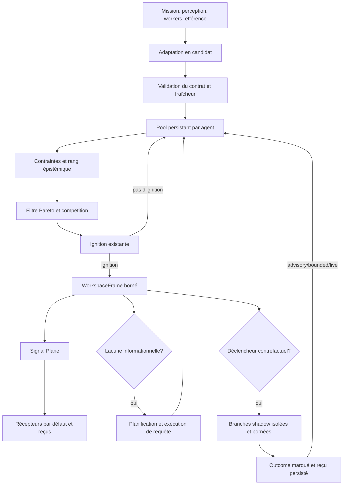

# Active Global Organism Workspace (AGOW)

- **Statut** : circuit cognitif logiciel expérimental, exécuté par le backend Node
- **Portée** : admission et sélection des candidats, ignition, frames, diffusion vers les organes, requêtes actives et instrumentation causale
- **Revue** : 2026-10-01
- **Autorité de référence** : [ADR 0006](../adr/0006-active-global-organism-workspace.md)
- **Persistance et évaluation** : [ADR 0007](../adr/0007-agow-runtime-persistence-et-evaluation.md)
- **Provenance réel/simulé** : [ADR 0239](../adr/0239-agow-provenance-epistemique.md)
- **Arbitrage par regret** : [ADR 0240](../adr/0240-agow-regret-predictif.md)
- **Simulation contrefactuelle isolée** : [ADR 0241](../adr/0241-agow-shadow-contrefactuel-isole.md)

---

## 1. Définition et portée

AGOW (Active Global Organism Workspace) est le circuit du backend qui reçoit des
observations sous forme de candidats cognitifs, les arbitre, déclenche éventuellement
une ignition et expose le résultat dans un frame borné. Le frame est diffusé aux
récepteurs métier enregistrés. Une lacune informationnelle peut ouvrir une requête
ciblée, dont les réponses documentées reviennent dans le pool comme de nouveaux
candidats.

Le terme « organisme » décrit ici une organisation logicielle de services et d'états.
Il ne constitue ni une affirmation de conscience, ni une preuve qu'un workspace
simule fidèlement une théorie cognitive. De même, un broadcast réussi prouve le
transport d'un frame, pas son effet sur une décision ou la réussite d'une mission.

AGOW ne remplace pas les gardes de sécurité, les baux, les politiques utilisateur,
les contrôles de preuve, le scheduler existant ou les autorités propres aux organes.
Il fournit une coordination observable à ces composants. Un candidat n'est jamais
une autorisation de mutation par lui-même.

### 1.1 Ce que le circuit couvre

- Normaliser et valider les observations destinées au workspace.
- Persister un pool par agent, dédupliquer les candidats et expirer les entrées TTL.
- Déterminer l'éligibilité selon les contraintes, comparer les candidats et sélectionner
  un ensemble borné.
- Utiliser le service d'ignition existant et produire un frame seulement lorsqu'un
  candidat sélectionné franchit l'ignition.
- Publier le frame par le Signal Plane, appeler les récepteurs disponibles et conserver
  des reçus de livraison et de médiation.
- Formuler des requêtes ciblées en présence d'une lacune épistémique et créditer leurs
  réponses selon leurs résultats déclarés.
- Mesurer la boucle perceptive récurrente et fournir des runners d'expériences
  descriptives.

### 1.2 Ce que le circuit ne démontre pas

- Qu'un frame représente un état mental ou un accès global au sens d'une théorie
  scientifique.
- Que le traitement d'un récepteur a causé une amélioration de mission; les reçus
  instrumentent des effets, mais ne garantissent pas une comparaison contrefactuelle.
- Qu'une campagne d'ablation, de médiation contrôlée ou de réplication a été exécutée
  simplement parce qu'un runner existe.
- Qu'une politique s'améliore, qu'un score est calibré, ou que l'architecture est
  supérieure à une baseline.
- Qu'un résultat de transport vaut preuve, qu'un résultat worker est exact, ou qu'une
  transition de morphogenèse a été autorisée.

---

## 2. Statut des modèles et des affirmations

Les services et schémas ci-dessous définissent des contrats logiciels. Leurs nombres,
seuils et règles de sélection sont des heuristiques tant qu'une calibration externe ne
les a pas validés. Un test vérifie uniquement les cas qu'il exécute. Les résultats de
campagne ont besoin d'un protocole préenregistré, d'entrées contrôlées, d'une analyse
et d'une réplication indépendante avant toute conclusion causale ou décision de
promotion.

Dans cette fiche :

| Terme | Sens utilisé ici |
| --- | --- |
| **Invariant logiciel** | Précondition ou postcondition contrôlée par du code ou un schéma. |
| **Mesure** | Valeur calculée ou fournie par une source; sa présence ne la calibre pas. |
| **Heuristique** | Règle déterministe ou seuil choisi pour piloter le circuit. |
| **Reçu** | Trace structurée d'un traitement déclaré ou observable. |
| **Résultat expérimental** | Résultat produit sur les données et conditions d'un protocole défini. |
| **Promotion causale** | Décision externe étayée par des contrôles et réplications; AGOW ne la prend pas. |

Les contrats JSON sont fermés (`additionalProperties: false`) : les producteurs
doivent passer par l'adaptateur et maintenir leur compatibilité avec la version de
schéma dans `shared/agow/`.

---

## 3. Autorité, modes et compatibilité

[ADR 0006](../adr/0006-active-global-organism-workspace.md) place l'autorité AGOW
dans le backend Node. Le prototype Rust d'orchestration n'est pas l'autorité du
workspace et ne partage pas encore ce stockage. `globalWorkspaceService` conserve
également des opérations historiques (`admit`, `compete`, `diffuse`, `consume` et
`causalEffect`) pour les parcours qui n'ont pas migré.

La variable `GENOS_AGOW_MODE` accepte `off`, `shadow`, `advisory`, `bounded`,
`morphogenesis-shadow`, `live` ou `experimental`. Une valeur absente ou inconnue
retombe sur `off`.

| Mode | Effet de contrôle du parcours mission | État d'usage documenté |
| --- | --- | --- |
| `off` | Aucun branchement AGOW sur le parcours mission; chemin historique. | Valeur par défaut. |
| `shadow` | Produit l'observation AGOW en parallèle; garde le workspace historique. | Observation sans transfert d'autorité. |
| `advisory` | Conserve l'autorité historique; le frame peut être exposé comme information. | Pas de décision de mission automatique. |
| `bounded` | Le frame AGOW prend l'autorité au point d'intégration de mission. | Seul mode qui remplace ce workspace à cet endroit. |
| `morphogenesis-shadow` | Ajoute le préflight morphogenèse en mode shadow. | Aucune transition morphologique commise. |
| `live` | Mode réservé au parcours vivant/promu. | `awaiting_causal_promotion`; ne contourne aucun gate. |
| `experimental` | Mode réservé aux expériences explicitement activées. | N'implique pas de preuve ni d'acceptation de résultat. |

Ces modes ne sont pas des contrôles d'accès. Ils ne remplacent ni la configuration de
sécurité ni les règles d'admissibilité d'une mission. Le déploiement doit commencer
par `off`, observer les effets en shadow, vérifier les reçus et budgets, puis décider
du contrôle par une modification de configuration assumée.

---

## 4. Architecture du circuit



L'admission, le cycle et les événements métier peuvent être déclenchés par différents
points d'entrée. `globalWorkspaceService.submitCandidate` publie la référence de
candidat dans le Signal Plane puis lance un cycle, sauf demande explicite de différer
le cycle. `workspaceCycleService.cycle` effectue la sélection, charge l'ignition et
produit le frame. Le service `idleTickService` peut aussi demander un cycle depuis le
tick idle déjà existant lorsque AGOW n'est pas `off`; AGOW n'introduit pas son propre
scheduler.

---

## 5. Contrats canoniques

Les cinq schémas versionnés sont dans [`shared/agow/`](../../shared/agow/). Les
validateurs runtime sont sous `backend/src/services/agow/`.

### 5.1 `CognitiveCandidate`

[`cognitiveCandidate.schema.json`](../../shared/agow/cognitiveCandidate.schema.json)
impose les propriétés suivantes :

| Groupe | Champs | Rôle opérationnel |
| --- | --- | --- |
| Identité | `candidateId`, `agentId` | Identifie le candidat et l'agent propriétaire. |
| Provenance producteur | `source.module`, `source.modality`, `source.instanceId` | Attribue le producteur et la modalité. |
| Provenance épistémique | `epistemicOrigin.origin`, `realityMode`, `agency`, `simulationId`, `parentRealityFrameId` | Distingue observation, inférence, action, mémoire et simulation; `unknown` reste explicite lorsque la source ne suffit pas. |
| Contexte épistémique | importance du belief, descendants causaux, irréversibilité, état allostatique attendu optionnel | Contexte facultatif; l'état attendu est une prédiction du producteur. |
| Contenu | `content.semanticType`, `artifactRef`, `compactPreview` | Référence un artefact; le preview reste court. |
| Preuve et causalité | `evidenceRefs`, `causalParents` | Références uniques aux preuves et aux parents. |
| Mesures | erreur, incertitude, pertinence, gain attendu, urgence, nouveauté, actionnabilité, confiance causale, dette de preuve, coût | Mesures bornées entre 0 et 1, sauf coût non négatif. |
| Contraintes | `safety`, `integrity`, `viability`, `userPolicy` | Chaque garde vaut `clear`, `review` ou `blocked`. |
| Cycle de vie | `producedAt`, `expiresAt`, `stateHash`, `redundancyKey` | Fraîcheur, provenance d'état et déduplication. |

Les producteurs ne sont pas les arbitres. Les nombres qu'ils fournissent sont les
entrées du classement actuel; ils ne constituent pas une preuve indépendante de leur
propre exactitude.

Les adaptateurs attribuent une valeur conservatrice par famille de source. `origin`
décrit d'où vient le contenu; `realityMode` décrit le monde où le candidat a été
produit. Ils restent indépendants : une réponse de mémoire calculée dans un monde
simulé garde `memory_retrieved` avec `realityMode: counterfactual`. Le tag est
une métadonnée fournie par le producteur, pas une attestation cryptographique. Toute
entrée dont `realityMode` vaut `counterfactual` doit porter un identifiant de simulation
et référencer le frame réel parent.
Les receivers `world_model` et `self_model` refusent d'écrire dans leurs stores
canoniques à partir d'un tel candidat. Le runner shadow crée un namespace d'agent
simulé enregistré et n'autorise ses écritures que dans ce namespace. Cette isolation
porte sur les stores AGOW adressés par agent; elle ne clone pas les outils, modèles ou
services externes.

### 5.2 `WorkspaceFrame`

[`workspaceFrame.schema.json`](../../shared/agow/workspaceFrame.schema.json) borne la
sortie du cycle :

- `primaryContent` et au plus deux `secondaryContents` sont des identifiants de
  candidat, pas des copies d'artefacts.
- `activeGoal`, au plus seize `unresolvedQuestions` et `attentionTarget` contextualisent
  l'attention.
- `epistemicState` contient confiance, incertitude et contradiction agrégées.
- `causalContext` conserve le frame précédent, les candidats déclencheurs et l'erreur
  de prédiction moyenne.
- `createdAt` et `decayAt` bornent la période de validité logique du frame.

Les moyennes et règles de construction sont celles de `workspaceFrameService`; elles
ne sont pas une estimation calibrée de l'état réel du système. Les frames portent aussi
`realityMode`, `simulationId` et `parentRealityFrameId`; les frames réels ont les deux
identifiants simulés à `null`.

#### Politique d'arbitrage contrefactuel

`agowMechanismPolicyService` persiste une politique par agent dans `adaptive_state`.
Les mécanismes disposent des modes `disabled`, `observe`, `shadow`, `advisory`,
`bounded` et `live`. Le regret prédictif reste calculé pour l'observation; il n'influe
sur la sélection qu'en modes `bounded` ou `live`. Le contrefactuel est désactivé avec
`disabled`; les autres modes permettent le runner shadow. Seuls `advisory`, `bounded`
et `live` réinjectent les outcomes dans le pool canonique, toujours avec une provenance
contrefactuelle.

`counterfactualTriggerPolicyService` déclenche sur irréversibilité élevée, regret
prédictif élevé, compétition serrée, incertitude avec enjeu important, ou besoin de
discrimination causale. Ces seuils sont des heuristiques configurables à l'appel, pas
des seuils calibrés. En l'absence d'exécuteur environnemental enregistré, le cycle
retourne `executor_unavailable` et ne fabrique aucun outcome.

Le runner `counterfactual/shadowWorkspaceService` crée jusqu'à trois branches
(`attend` chaque candidat sélectionné et `ignore` le premier), clone les candidats dans
un namespace temporaire et exécute le cycle AGOW local sans transport. Les plafonds
sont trois frames, trois requêtes, deux workers et coût 1. Il persiste le hash et
l'identifiant du snapshot, les frames, les requêtes, le budget et le résultat de chaque
branche sous `agow_shadow_receipts` (100 derniers reçus par agent). L'exécuteur est un
callback fourni par l'hôte via `registerExecutor` ou par le cycle; il reçoit un snapshot
copié, le namespace et les plafonds, mais pas l'objet DB. Son résultat doit inclure
`success`, `uncertainty`, `cost`, `workersUsed` et `evidenceRefs` valides.

Le namespace isole les écritures couvertes par les receivers AGOW et est nettoyé après
la branche. Le callback d'environnement doit lui-même isoler les effets d'outils,
modèles et services externes. Le registre d'exécuteurs est en mémoire et doit être
réinstallé à chaque démarrage du processus backend. Voir [ADR 0241](../adr/0241-agow-shadow-contrefactuel-isole.md).

### 5.3 `WorkspaceQuery`

[`workspaceQuery.schema.json`](../../shared/agow/workspaceQuery.schema.json) consigne
la capacité et le type de question, le gain d'information attendu, un budget de coût,
une échéance, le seuil de références probantes, les modules sélectionnés et la date
de création. La date limite décrit une contrainte donnée à la requête; le service ne
garantit pas à lui seul que tout handler termine avant cette échéance.

### 5.4 Reçus de broadcast et de médiation

[`broadcastReceipt.schema.json`](../../shared/agow/broadcastReceipt.schema.json)
trace par frame et module la consommation, les hashes d'état observés, un type d'effet,
le changement déclaré et les artefacts associés.

[`mediationReceipt.schema.json`](../../shared/agow/mediationReceipt.schema.json)
relie le candidat source et le frame à un récepteur cible, une transformation, un
éventuel downstream action, des hashes et une sortie. L'absence d'un hash ou d'une
action est permise et doit rester visible dans l'interprétation.

Un reçu `consumed: true` signifie que le handler n'a pas retourné `consumed: false`;
il ne prouve pas que le module a utilisé utilement l'information. `changed: true` peut
être déclaré par le récepteur. Même un changement d'état entre deux hashes ne prouve
pas son effet sur la performance de tâche.

---

## 6. Admission, pool et cycle de vie d'un candidat

### 6.1 Validation et arrivée

`candidateAdapterService` construit les candidats à partir des observations métier.
`candidateValidationService` rejette les formes invalides. Le pool rejette les
candidats futurs ou expirés et persiste l'état sous `agow_candidate_pool`.

Le pool :

1. relit l'état de l'agent et retire les entrées dont `expiresAt` est dépassé;
2. fusionne un doublon par `candidateId` ou `redundancyKey` en unissant preuves et
   parents causaux;
3. signale une contradiction lorsque deux candidats partagent un `artifactRef` mais
   déclarent des `semanticType` différents;
4. conserve les candidats restants jusqu'à leur expiration ou au nettoyage explicite.

La constante `DEFAULT_TTL_MS` est une référence de service; la durée réellement portée
par un candidat est `expiresAt - producedAt`. Le pool ne limite pas, à lui seul, le
nombre d'éléments actifs par agent.

### 6.2 Publication du signal d'admission

Après persistance, la façade publie `cognitive_candidate` sur
`agow:candidate:<agentId>` en joignant la référence du candidat et sa modalité. Si le
Signal Plane refuse la publication ou échoue, le nouveau candidat non fusionné est
retiré et la façade rend une raison explicite. Un doublon fusionné n'est pas supprimé.

Cette publication est un avis de disponibilité, non une ingestion par tous les
consommateurs. `subscribe` permet à un consommateur local de suivre le topic, mais
l'arbitrage consulte le pool persistant.

### 6.3 Fraîcheur et rétention

Les timestamps sont des millisecondes Unix. `list` ne renvoie pas les candidats
expirés, et `clear` exige explicitement un `agentId`. Les reçus d'expérience sont
tronqués aux mille derniers éléments par agent. Les reçus de broadcast et médiation
utilisent également les services de persistance backend; leur politique de rétention
est celle de ces services.

---

## 7. Arbitrage, compétition et ignition

### 7.1 Ordre des filtres

`workspaceArbitrationService` applique d'abord un rang de priorité :

| Condition | Rang courant | Effet |
| --- | ---: | --- |
| Au moins une contrainte `blocked` | Rejet | Le candidat n'est pas admissible. |
| Au moins une contrainte `review` | 2 | La revue passe avant les candidats ordinaires. |
| Contradiction, incertitude ≥ 0,8 ou réponse active | 3 | File dédiée aux problèmes de preuve et réponses. |
| Pertinence mission ≥ 0,5 | 4 | Candidat lié à l'objectif. |
| Autre candidat | 5 | Priorité générale. |

Seul le rang le plus prioritaire présent dans le pool participe au tour. Les candidats
de rang inférieur ne peuvent donc pas gagner contre un candidat de rang supérieur
dans le même arbitrage.

### 7.2 Drives et filtre Pareto

Avant le Pareto, `predictiveRegretService` calcule deux profils de pertes :
`attend` et `ignore`. Il estime les regrets de but, épistémique, viabilité, intégrité
et opportunité. Le regret épistémique augmente avec l'incertitude, l'erreur prédictive,
la dette de preuve et la faiblesse de confiance causale; l'importance du belief et ses
descendants causaux amplifient ce risque. Il s'agit d'une heuristique explicitement
non calibrée, conservée avec provenance dans le résultat d'arbitrage.

`allostaticRegretAdapter` réutilise le calcul de drives de `valenceService`. Il compare
la distance allostatique machine courante à un état attendu déclaré par le candidat.
Une préemption n'intervient que si la pression courante dépasse le seuil de catastrophe
et si l'état attendu la réduit suffisamment avec une confiance causale minimale. Sans
mesure courante ou état attendu, la composante de viabilité est indisponible et vaut
zéro. Une contrainte `blocked` continue d'exclure le candidat avant ce calcul.

Le service construit des drives d'information, pertinence, urgence, erreur de
prédiction, dette de preuve, actionnabilité, confiance causale, nouveauté et coût
inverse `1 / (1 + estimatedCost)`, ainsi que les composantes de regret et
d'irréversibilité. Il écarte les candidats dominés sur toutes ces
dimensions par un pair strictement meilleur sur au moins l'une d'elles. Les candidats
non dominés entrent dans `ignitionService.competeWinners`.

Les poids de la compétition sont fournis par le service d'ignition et ses options.
Les drives et leurs signes sont des heuristiques, pas une optimisation garantie de la
qualité de mission.

### 7.3 Capacité et sélection

Le cycle transmet à l'arbitrage une capacité égale à `primaryCapacity +
secondaryCapacity`, avec les valeurs par défaut 1 et 2. Le frame conserve le premier
candidat sélectionné comme contenu primaire et jusqu'à deux candidats secondaires.
La propriété JSON Schema limite explicitement `secondaryContents` à deux références.

### 7.4 Ignition

Chaque candidat sélectionné est présenté à `ignitionService.charge`. La pondération
utilise `max(urgency, goalRelevance, predictionError)`. Le seuil et l'état réfractaire
relèvent du service d'ignition partagé. Si aucun candidat n'ignite, le cycle retourne
le frame antérieur et ne le remplace pas. Si au moins un candidate ignite, AGOW crée,
persiste et diffuse un frame pour la sélection du cycle.

Le résultat du cycle rend le nombre de candidats vus, l'arbitrage, les reçus d'ignition,
le frame, le broadcast et la requête active éventuelle. L'absence de nouveau frame est
un résultat normal, pas nécessairement une erreur.

---

## 8. Frame et durée de vie attentionnelle

`workspaceFrameService.create` calcule le frame suivant avec un identifiant unique,
un compteur incrémenté et un lien au frame précédent. Les mesures de confiance,
d'incertitude et d'erreur de prédiction sont des moyennes des candidats sélectionnés.
La contradiction vaut 1 si au moins l'un d'eux porte une contradiction, sinon 0.

Le TTL est configurable par `frameTtlMs`, avec une borne minimale d'une seconde et une
valeur de repli d'une minute. Ce TTL marque `decayAt`; il n'efface pas instantanément
les reçus associés. `workspaceFrameStore` garde et restaure l'état par agent via
`adaptive_state`.

Les receivers reçoivent le frame et le candidat primaire source retrouvé dans le pool.
Ils ne reçoivent pas automatiquement les corps complets de tous les candidats
secondaires. Le frame est un pointeur compact : les services métier restent
responsables de résoudre et d'autoriser leurs propres artefacts.

### 8.1 Plasticité rapide/lente

`plasticity/agowPlasticityCoordinator` stocke des voies contextuelles sous le scope
persistant `agow_pathway_plasticity`. Chaque voie conserve `fastWeight`, `slowWeight`,
`eligibilityTrace`, support/échecs, erreur de prédiction, statut, expiration et références
de preuve. Les erreurs prédictives, surprises, résolutions critiques, améliorations
allostatiques et réductions de regret proposées par l'appelant augmentent la trace
d'éligibilité. La trace n'est pas une mesure d'apprentissage validé.

Le mode `observe` retourne une mise à jour proposée sans modifier les poids persistés.
`shadow` et les modes supérieurs peuvent mettre à jour le poids rapide, uniquement sur
des outcomes marqués `verified` avec preuve. Le poids lent reste inchangé jusqu'à trois
succès supportés; `consolidatePathway` exige ensuite une demande explicite et le mode
`bounded` ou `live`, puis délègue LTP à `proceduralPlasticityService`. Le tag `verified`
doit être produit par un intégrateur qui a réellement validé les références; AGOW ne
vérifie pas cette assertion à lui seul. Voir [ADR 0242](../adr/0242-agow-plasticite-rapide-lente.md).

### 8.2 Voies directes

`pathways/directPathwayRegistry` enregistre des routes persistantes par agent, chacune
liant source, cible, capacité, sémantique, signature de contexte, confiance et statut.
Le routeur réutilise `signalEventBus` et les topics `agow:pathway:<target>`; il n'ajoute
pas un transport parallèle. Les organes intégrateurs peuvent s'abonner avec
`directPathwayRouter.subscribe`. Active Query consulte le registre avant l'allocation
par attention et sélectionne le handler direct lorsque la voie est consolidée, adaptée
au contexte et autorisée par la politique `bounded` ou `live`.

Une voie critique impose `requiresGlobalReview`; le registre en déduit ce garde pour
les mutations irréversibles, les enjeux élevés, la faible confiance causale, les
approbations utilisateur, les opérations sensibles à la sécurité et les contextes non
stationnaires. Une route suspendue cesse immédiatement d'être admissible. La remise
directe in-process n'est pas un reçu de réussite ni une livraison durable. Voir [ADR
0243](../adr/0243-voies-directes-agow.md).

### 8.3 Compilation de trajectoires

`proceduralization/cognitiveTrajectoryService` enregistre, par agent, des références
compactes aux frames, candidats, requêtes, actions, outcomes et preuves. Il n'enregistre
pas les payloads complets. Il refuse les frames contrefactuels. Le compilateur réutilise
`proceduralConsolidationService` pour extraire un sous-chemin répété et son support de
succès. Il rend une proposition `proposal_only`; il ne crée ni procédure active, ni voie
consolidée et n'appelle pas de gate de promotion.

Une trajectoire réussie sans référence de preuve bloque la proposition. L'intégrateur
doit garantir que les identifiants envoyés forment bien une séquence causale complète.
L'approbation et la validation ultérieures restent dans le runtime procédural déjà
présent. Voir [ADR 0244](../adr/0244-compilateur-de-trajectoires-agow.md).

### 8.4 Décompilation sur surprise ou dérive

`proceduralization/decompilationService.recordOutcome` ferme une voie consolidée dès
que l'intégrateur signale une erreur prédictive d'au moins 0,5, une dérive, un outcome
inattendu, une contradiction, une exigence de preuve accrue ou un changement de
contexte de sécurité. Le routeur suspend la voie et soumet un candidat au workspace
avec `epistemicOrigin.origin: procedural_generated`, réalité réelle et confiance
explicite. `agow_decompilation_receipts` garde les déclencheurs et références.

L'intégrateur doit émettre ces faits depuis un résultat réellement observé. La réception
du candidat par AGOW ne garantit pas qu'une nouvelle procédure sera validée. Le même
outcome est présenté au coordinateur de plasticité; seules les preuves reconnues par
celui-ci peuvent contribuer au poids durable. Voir [ADR
0245](../adr/0245-decompilation-voie-agow.md).

---

## 9. Signal Plane, diffusion et médiation

### 9.1 Topic et charge utile

Le broadcast publie le type ligand sur `agow:workspace:<agentId>`. Sa charge utile
comprend le type sémantique `workspace_broadcast`, `frameId`, le numéro de cycle,
`primaryContent` et `secondaryContents`. La diffusion métier locale est effectuée
ensuite par le registre de récepteurs. Ainsi, `transportReceipt.published` et les
`deliveries` sont deux observations distinctes.

### 9.2 Cycle de traitement d'un récepteur

Pour chaque handler inscrit, le broadcast appelle deux fois le handler :

1. **`inspect`** : permet de retourner l'état précédant le traitement;
2. **`apply`** : traite le frame et retourne consommation, effet, hashes et références.

Le service enregistre le reçu de diffusion puis, si un candidat source existe, le reçu
de médiation correspondant. Si le handler lève une erreur, un reçu est émis avec
`consumed: false`, `effectType: receiver_error` et sans hashes d'état. L'erreur du
handler est contenue dans ce chemin et n'interrompt pas les récepteurs suivants.

Le contrat recommande que la phase `inspect` soit sans mutation et que l'opération
`apply` soit idempotente pour un même `frameId`. Cette discipline évite que la mesure
avant/après altère elle-même l'état et aide à gérer les répétitions; elle n'est pas
encore imposée par le registre.

### 9.3 Lecture des reçus

Un état peut ne pas changer alors que le récepteur a consommé le frame : par exemple,
un rappel mémoire peut trouver des épisodes sans modifier de store. Un état peut aussi
changer pendant l'exécution, sans que cela démontre un effet aval. Comparer une
condition diffusée à une condition témoin où le broadcast est supprimé est une étape
nécessaire pour l'analyse causale, mais le contrôle de l'exécuteur et la réplication
restent indispensables.

---

## 10. Récepteurs métier intégrés

`workspaceBroadcastService.publish` appelle `ensureRegistered()` avant la diffusion.
Le registre est en mémoire du processus Node; l'enregistrement est automatique au
premier broadcast de ce processus, et non une migration d'état dans SQLite. Les
modules demandés par `options.modules` sont filtrés à ceux qui sont connus du registre.

| Module | Phase `inspect` | Traitement `apply` | Conditions de non-consommation / portée |
| --- | --- | --- | --- |
| `memory` | Retient le `frameId`. | Si le frame a un objectif actif, rappelle jusqu'à trois épisodes et trois leçons autobiographiques. | Pas d'objectif : `no_recall_goal`; les références rappelées n'impliquent pas une mutation mémoire. |
| `world_model` | Observe `frameId` et candidat. | Pour une conséquence d'action attribuable, transmet la transition observée au modèle du monde. | Exige `semanticType: action_consequence` et un `artifactRef`; succès dérivé de `predictionError < 0.5`. |
| `self_model` | Charge l'état du soi. | Attribue une conséquence d'action au soi si sa source est `efference`, sinon au non-soi, et enregistre l'erreur de prédiction. | Sans action attribuable : `no_attributable_action`. |
| `interoception` | Lit `agow_attention_policy`. | Mesure l'état machine, applique la posture allostatique puis persiste budget de modules, coût maximum et seuil de preuve. | Mesure indisponible : `interoception_unavailable`. La mission synthétique fixe trois workers et autorise l'édition pour calculer la posture. |
| `metacognition` | Lit `agow_meta_policy`. | Hausse `minimumEvidenceRefs` à au moins 2 si contradiction ou incertitude ≥ 0,7; conserve sinon le seuil actuel. | La politique peut être persistée même quand sa valeur numérique ne change que par le nouveau frame/date. |
| `daemon` | Lit la politique daemon. | Mesure le territoire rattaché et l'interoception machine, combine les pressions et persiste `agow_daemon_policy`. | Exige un territoire lié à l'espace de travail et une mesure machine valide. |
| `morphogenesis` | Si un plan shadow existe, expose un identifiant. | Exécute le préflight via `morphogenesisShadowAdapter`. | Sans plan : `no_morphogenesis_plan`. Le récepteur ne commet aucune transition. |

Les cinq premiers récepteurs couvrent mémoire, modèle du monde, soi, interoception et
métacognition; daemon et morphogenèse sont maintenant également inscrits par défaut.
Le fait qu'ils soient enregistrés n'implique pas que chaque frame ait un effet : les
conditions de consommation ci-dessus restent applicables. Les politiques sont
spécifiques à l'agent grâce à leurs scopes `adaptive_state`.

Les handlers locaux supplémentaires peuvent être ajoutés via
`workspaceReceiverRegistry.register({ module, handle })`. Un registre personnalisé
doit respecter les phases, les budgets métier, la validation des artefacts et
l'isolation agent. `clear()` vide les deux registres du processus; les handlers par
défaut sont réinstallés au prochain appel du service qui invoque leur initialisation.

---

## 11. Requêtes actives et attention contrôlée

### 11.1 Déclenchement

Après qu'un frame a été créé et diffusé, le cycle planifie au plus une requête si :

- au moins une question non résolue est présente; ou
- le niveau de contradiction est positif; ou
- l'incertitude atteint 0,5; ou
- l'erreur de prédiction causale atteint 0,5.

Une réponse `active_query_response` déjà présente parmi les candidats du tour empêche
une nouvelle requête dans ce cycle. Un cycle sans ignition ne construit pas de frame
et ne déclenche donc pas la planification en aval.

### 11.2 Capacités et handlers par défaut

| Capacité | Modules éligibles connus |
| --- | --- |
| `verification` | `verifier`, `memory`, `world_model` |
| `causal_discrimination` | `world_model`, `verifier`, `memory` |
| `recall` | `memory`, `autobiographical_memory` |
| `perception` | `perception`, `predictive_hierarchy` |
| `calibration` | `self_model`, `metacognition` |

Les handlers intégrés enregistrés dans ce dépôt couvrent `memory`,
`autobiographical_memory`, `self_model` et `perception`. Un identifiant éligible sans
handler exécutable ne retourne pas de réponse. Les appels personnalisés peuvent
fournir `handlers` à `execute`.

Les besoins causaux choisissent `causal_discrimination`; les autres lacunes utilisent
par défaut la vérification. Dans un appel direct, le type et la capacité peuvent être
spécifiés; les appels du cycle déterminent la capacité depuis la prédiction ou
l'incertitude.

### 11.3 Budget, sélection et répétitions

`modelControlledAttentionService.reallocate` choisit des modules selon le gain
d'information et un budget de modules. Le coût maximum est plafonné par la politique
interoceptive persistée. Le seuil de preuves minimal combine la politique métacognitive
et la politique d'attention. Les politiques ne désactivent pas les vérifications
propres à un handler.

Une empreinte SHA-256 de l'objectif, la capacité, le type de question, les questions,
la bande de contradiction, d'incertitude et d'erreur de prédiction empêche de
replanifier la même lacune pendant cinq minutes. Cette anti-répétition est stockée
sous `agow_query_policy`, isolée par agent.

### 11.4 Exécution et admission d'une réponse

Chaque handler retourne éventuellement un résumé, un candidat et un résultat pour le
crédit d'attention. Si un candidat est fourni, AGOW compare le nombre de références
de preuve à `minimumEvidenceRefs`, puis le soumet au pool avec `triggerCycle: false`.
Le candidat devra gagner un prochain arbitrage; la réponse ne force pas un frame
récursif. Le crédit sous `attentionCreditService` enregistre les signaux de progrès,
réduction d'erreur, amélioration probatoire, coût et latence déclarés par le handler.
Ces valeurs sont des observations à auditer, pas des mesures indépendantes.

---

## 12. Boucle perceptive récurrente

`agowRuntimeIngressService.process` ignore les événements lorsque le mode est `off`.
Il envoie `PERCEPTION_OBSERVED` à `perceptualLoopService`, qui :

1. restaure le posterior et les bindings précédents;
2. incorpore le feedback du frame courant;
3. calcule une prédiction hiérarchique avec `generativePerceptualService`;
4. met à jour les bindings via `perceptiveBindingService.recurrentUpdate`;
5. persiste bindings, posterior, dernier frame, compteur et timestamp;
6. calcule erreur et incertitude et, si l'erreur dépasse le seuil, soumet un candidat
   `prediction_error`;
7. route aussi `PERCEPTUAL_ERROR` dans la hiérarchie prédictive.

La mesure d'erreur combine l'erreur de prédiction et la magnitude moyenne des erreurs
de la hiérarchie objet. Le seuil par défaut est 0,25. Les états sont persistés sous
`agow_perceptual_state`. Les bindings sont des références cognitives internes; ils ne
valident pas la vérité d'une perception externe.

---

## 13. Branchement aux flux runtime

| Source | Point de branchement observé | Candidat ou effet | Condition |
| --- | --- | --- | --- |
| Mission | `agentRuntimeAdapter/missionPlanning.js` | Adapte le plan en candidat morphogenèse, soumet et expose `ctx.agow`. | Seulement si mode non `off`; `bounded` donne l'autorité à AGOW à ce point. |
| Perception | `agowRuntimeIngressService` | Met à jour la boucle récurrente et produit éventuellement `prediction_error`. | Événement `PERCEPTION_OBSERVED`; mode non `off`. |
| Résultat worker final | Même ingress | Produit `worker_outcome` sur les événements finaux répertoriés. | Le succès est lu depuis type d'événement ou payload; la qualité n'est pas vérifiée par cet adaptateur. |
| Efférence | `efferenceCopyService` | Envoie les conséquences d'action observées comme candidats. | Mode non `off`; l'artefact d'action doit être résolu côté récepteurs. |
| Tick idle | `idleTickService` | Demande un cycle du workspace existant. | Mode non `off`; cadence du scheduler idle hôte. |
| Daemon | Récepteur de broadcast | Actualise la politique de pression d'un territoire lié. | Frame diffusé, territoire trouvé, mesures d'interoception disponibles. |
| Morphogenèse | Récepteur de broadcast | Préflight shadow d'un plan déjà persisté. | Plan enregistré; aucune transition n'est commise par ce chemin. |

Les événements worker non finaux ne sont pas tous convertis en candidats par
l'ingress. Le support de plusieurs sources de candidats dans l'adaptateur n'implique
pas qu'elles soient toutes raccordées à un producteur runtime dans chaque parcours.

---

## 14. Persistance et isolation

`agowStatePersistenceService` délègue à `AdaptiveStateService` et utilise la base
backend reçue par l'appelant ou la connexion backend par défaut. Les scopes observés
comprennent :

| Scope | Contenu |
| --- | --- |
| `agow_candidate_pool` | Candidats en attente et leurs liens de contradiction. |
| Store frame AGOW | Frame courant et continuité de cycle. |
| Scopes des reçus | Livraison et médiation par frame/récepteur. |
| `agow_attention_policy` | Budget et seuil déterminés par interoception. |
| `agow_meta_policy` | Seuil de preuve et dernier frame observé. |
| `agow_query_policy` | Empreintes de lacunes récemment requêtées. |
| `agow_perceptual_state` | Posterior et bindings de perception récurrents. |
| `agow_daemon_policy` | Territoire, variables, pressions et date de mesure. |
| `agow_morphogenesis_plans` | Plan préexistant consulté par le receiver shadow. |
| `agow_experiment_receipts` | Les mille derniers reçus d'expérience au plus par agent. |

`adaptive_state` procure un stockage durable et une isolation logique par `agentId`.
Cela ne signifie pas que les registres de handlers sont persistés : ils sont mémoire
de processus et s'initialisent au besoin. Les données de workspace ne sont pas
répliquées vers un store Rust; le runtime est cohérent à travers les processus qui
utilisent la même base backend, sous les garanties de cette base et des transactions
qu'elle expose.

La soumission au pool utilise une transaction backend. Les autres opérations
(cycle, appel externe du Signal Plane, plusieurs receivers et reçus) n'enveloppent pas
l'ensemble de bout en bout dans une transaction atomique. Une panne après persistance
mais avant diffusion peut donc laisser une étape persistée et une suivante absente; les
reçus permettent de diagnostiquer ce cas mais n'effectuent pas de reprise générale.

---

## 15. API et exemples d'intégration

La façade est `backend/src/services/globalWorkspaceService.js`. Les implémentations
spécialisées sont dans `backend/src/services/agow/`.

```js
const workspace = require('./globalWorkspaceService');

const mode = workspace.getMode();
const admission = await workspace.submitCandidate({
  candidate,                 // CognitiveCandidate validé par l'adaptateur métier
  agentId: candidate.agentId,
  db,
  activeGoal: missionId
});

const frame = await workspace.getCurrentFrame({ agentId, db });
const plan = frame ? await workspace.query({
  frame,
  capability: 'verification',
  expectedInformationGain: frame.epistemicState.uncertainty,
  db
}) : null;
```

`submitCandidate` admet, publie le signal et déclenche un cycle par défaut. Passer
`triggerCycle: false` est prévu pour les réponses de requête qui doivent attendre
l'arbitrage ultérieur. `cycle` retourne son propre résultat; il ne faut pas confondre
`admission.accepted` avec un frame créé ou un succès de mission.

Pour diffuser aux modules choisis :

```js
const result = await workspace.cycle({
  agentId,
  db,
  activeGoal: missionId,
  unresolvedQuestions: openQuestions,
  primaryCapacity: 1,
  secondaryCapacity: 2,
  frameTtlMs: 60_000
});
```

Les noms de modules de diffusion sont des clés du registre, par exemple `memory`,
`world_model`, `self_model`, `interoception`, `metacognition`, `daemon` et
`morphogenesis`. Les modules absents ne génèrent pas de handler artificiel.

---

## 16. Expériences contrôlées

Le service [`agowExperimentService.js`](../../backend/src/services/agow/agowExperimentService.js)
fournit un runner d'ablation, un runner de médiation contrôlée et une campagne de
réplication holdout. Il enregistre des reçus descriptifs. La présence d'un runner ne
vaut pas campagne exécutée.

### 16.1 Contrat d'entrée

Chaque exécution exige :

- `agentId`;
- un `snapshot` initial que l'adaptateur d'exécution sait réellement cloner et
  appliquer à chaque condition;
- un manifeste `environment` avec `model`, `dependencies` et `toolLease`;
- un corpus non vide, marqué explicitement `holdout: true`, où chaque entrée porte
  `caseId` et `input`;
- un protocole préenregistré : `hypothesis`, `primaryMetric` et `analysisPlan`;
- un callback `execute({ caseId, input, condition, seed, snapshot })` qui retourne un
  objet avec `success` booléen;
- une liste de conditions unique, ou les conditions d'ablation par défaut.

Le runner crée un clone structuré du snapshot à chaque cas-condition et enregistre
son hash initial. Il ne peut pas vérifier que l'adaptateur restaure un environnement
externe, applique fidèlement la condition ou empêche les contaminations entre runs.
Cette responsabilité appartient à l'implémentation du callback et à l'audit du
protocole.

### 16.2 Ablations disponibles

La liste par défaut contient `full`, `workspace_ablated`, `broadcast_ablated`,
`memory_ablated`, `self_ablated` et `interoception_ablated`. Ce sont des étiquettes de
condition transmises au callback. Le runner ne modifie pas l'application AGOW pour
désactiver automatiquement un composant : le callback doit réaliser l'ablation et
fournir les mêmes conditions de base. Des conditions personnalisées peuvent être
fournies.

Le reçu contient les sorties par cas et condition, leur graine, le hash du snapshot,
ainsi que des résumés de taux de succès, erreurs, coût et latence. Un résultat absent
ou une sortie callback sans `success` booléen fait échouer l'exécution.

### 16.3 Médiation contrôlée

`runControlledMediation` compare les conditions `broadcast_delivered` et
`broadcast_suppressed`. Il réutilise les validations et le callback de l'appelant.
Le protocole doit isoler la livraison du broadcast en maintenant les autres facteurs
constants. Un contraste entre ces conditions estime l'effet du traitement seulement
dans le domaine, l'environnement et les hypothèses réellement contrôlés par le
callback.

### 16.4 Réplication holdout

`runReplicationCampaign` exige au moins trois exécutions avec :

- un manifeste d'environnement, un snapshot, un protocole et une liste de conditions
  identiques;
- des seeds explicites distinctes;
- des corpus distincts par identifiants `caseId` et hash du contenu d'entrée;
- `holdout: true` et toutes les validations normales pour chaque réplication.

La compatibilité contrôlée ne prouve pas l'indépendance organisationnelle ou humaine
des jeux de données. Une campagne retournée avec
`descriptive_replication_complete` signifie que ces contrôles logiciels sont passés;
elle n'établit ni significativité statistique, ni généralisation, ni promotion. Chaque
reçu conserve `promotionDecision: null` et `evidenceStatus: replication_required`.

### 16.5 Préenregistrement et analyse

Le runner valide la présence de texte pour l'hypothèse, la métrique primaire et le plan
d'analyse, puis enregistre leur hash avec les reçus. Il ne vérifie ni l'horodatage de
préenregistrement externe, ni l'absence de changement du plan, ni la validité de
l'analyse. Pour une campagne, le protocole devrait préciser au minimum : estimand,
population et critères d'exclusion, unités d'assignation, unité d'analyse, métrique
primaire et secondaires, direction de l'effet, traitement des données manquantes,
méthode statistique et règle de décision.

Exemple de structure d'appel (l'orchestrateur de test fournit le callback réel) :

```js
const experiment = require('./agow/agowExperimentService');

const receipt = await experiment.run({
  agentId,
  snapshot,
  environment: { model, dependencies, toolLease },
  protocol: { hypothesis, primaryMetric, analysisPlan },
  cases: holdoutCases,
  holdout: true,
  seed: 'replication-01',
  execute: async ({ caseId, input, condition, seed, snapshot }) =>
    runIsolatedCase({ caseId, input, condition, seed, snapshot })
});
```

Ne fournissez pas un corpus d'entraînement sous l'étiquette holdout. Le code ne peut
pas détecter cette fuite à partir du booléen; la provenance et le gel des données sont
à documenter hors du callback.

---

## 17. Télémétrie et diagnostic

Pour diagnostiquer une mission, suivre l'identité agent et les références de bout en
bout :

1. décision de mode effective (`getMode()`);
2. résultat d'admission, raison de rejet, signal et état de fusion;
3. taille du pool après expiration, motifs de déduplication/contradiction;
4. rangs éligibles, candidats Pareto, vainqueurs d'ignition et période réfractaire;
5. frame créé ou frame précédent conservé, `cycle`, candidats déclencheurs et TTL;
6. reçu du Signal Plane, puis un reçu par receiver;
7. hashes avant/après, `consumed`, `changed`, `effectType` et artefacts;
8. besoin, empreinte, budget, handlers sélectionnés et candidat de réponse de requête;
9. résultat runtime en aval et preuves de réussite indépendantes du transport.

Pour un receiver silencieux, vérifier d'abord si le module est dans la liste demandée,
s'il est enregistré, puis ses conditions de non-consommation. Pour une requête absente,
vérifier qu'un frame neuf a été créé, le seuil de lacune, la politique de cooldown et
les modules ayant un handler. Pour un frame absent, lire séparément les contraintes,
le rang/filtre Pareto et les reçus d'ignition.

Les hashes d'état ne contiennent pas à eux seuls la valeur métier. Ils servent à
comparer ou relier les reçus; l'audit exige les artefacts correspondants et leurs
contrôles d'accès.

---

## 18. Rollout et critères d'exploitation

### 18.1 Déploiement prudent

1. Conserver le mode par défaut `off` pendant le déploiement initial.
2. Activer `shadow` sur des agents choisis et vérifier la qualité des candidats, la
   croissance du pool, les ignitions, les reçus d'erreur et les coûts.
3. Vérifier le comportement de chaque receiver avec ses préconditions métier et
   l'isolation agent.
4. Tester les requêtes sur des lacunes maîtrisées et vérifier leur anti-répétition,
   budget et seuil de preuve.
5. N'activer `bounded` que pour les parcours où le frame et ses conséquences sont
   compris, mesurés et couverts par des rollback opératoires.
6. Garder `live` en attente jusqu'à ce qu'une gouvernance externe accepte des preuves
   causales et une réplication appropriée.

### 18.2 Signaux d'arrêt ou de retour arrière

Revenir à `off` pour un agent ou un déploiement si le nouveau chemin produit des
rejets anormaux, une hausse inattendue de la latence ou du coût, des receivers qui
mutent un état hors périmètre, une fuite entre agents, une explosion de requêtes, des
frames incohérents ou un désaccord avec les gates d'autorité existants. Les seuils
opérationnels doivent être définis par service avant l'activation; cette fiche ne fixe
pas de SLO arbitraire.

---

## 19. Limites connues et travaux restant à prouver

| Sujet | État vérifié dans le code | Travail nécessaire pour conclure davantage |
| --- | --- | --- |
| Récepteurs métier par défaut | Sept handlers enregistrés au premier broadcast. | Campagne couvrant les préconditions, l'idempotence et les effets sur sorties de tâche. |
| Déclenchement des requêtes | Automatique après frame si une lacune passe les seuils. | Vérifier coûts, échéances, utilité et absence d'amplification sur des parcours réels. |
| Organes runtime | Mission, ingress perception/worker, efférence, idle tick, receivers daemon/morphogenèse branchés à des points existants. | Audit exhaustif par producteur et exécution de bout en bout des parcours métier. |
| Persistance | Scopes `adaptive_state` durables, isolés par agent. | Validation de charge multi-processus, contention, reprise et rétention sur la base configurée. |
| Ablations | Runner descriptif et callback contrôlé par appelant. | Implémenter des conditions qui désactivent réellement chaque organe et produire les reçus. |
| Médiation | Comparaison `broadcast_delivered` / `broadcast_suppressed`. | Contrôler les variables confondantes et relier les changements à des résultats aval. |
| Réplication holdout | Garde logicielle : trois runs minimum, seeds et corpus distincts. | Préparer des holdouts indépendants, exécuter la campagne et publier l'analyse reproductible. |
| Autorité `live` | État `awaiting_causal_promotion`; pas de décision automatique. | Revue de preuves, gates de promotion et décision mainteneur séparée. |
| Autorité Rust | Prototype distinct, non autoritaire et sans store partagé. | Concevoir puis valider explicitement une migration d'autorité. |
| Robustesse des mesures | Mesures et réponses viennent des producteurs/adaptateurs. | Validation indépendante, calibration, incertitude et provenance. |

Les expériences de la table ne sont pas marquées « terminées » par l'existence de
leurs services ou tests unitaires. Tant que le callback n'est pas contrôlé, le corpus
holdout n'est pas qualifié et les reçus ne sont pas publiés, les conclusions restent
non établies. Voir aussi [ADR 0007](../adr/0007-agow-runtime-persistence-et-evaluation.md).

---

## 20. Inventaire des composants

| Composant | Responsabilité |
| --- | --- |
| `globalWorkspaceService.js` | Façade, modes, admission + transport, cycle, query et compatibilité historique. |
| `candidateAdapterService.js` | Adaptation des observations en candidats contractuels. |
| `candidateValidationService.js` | Validation de candidat. |
| `epistemicRegretService.js` | Risque d'erreur de belief, importance et descendants causaux. |
| `allostaticRegretAdapter.js` | Comparaison allostatique via `valenceService`. |
| `predictiveRegretService.js` | Comparaison attend/ignore et attribution de regrets. |
| `candidatePoolService.js` | Persistance, fraîcheur, déduplication et liens de contradiction. |
| `workspaceArbitrationService.js` | Priorité, drives, Pareto et sélection par compétition. |
| `workspaceCycleService.js` | Cycle, ignition, frame, broadcast et requête déclenchée. |
| `workspaceFrameService.js` / `workspaceFrameStore.js` | Construction et persistance du frame. |
| `workspaceBroadcastService.js` | Signal Plane, sélection des handlers et reçus. |
| `workspaceReceiverRegistry.js` | Registres runtime des receivers et handlers query. |
| `agowDefaultReceiversService.js` | Récepteurs intégrés mémoire, monde, soi, interoception, méta, daemon et morphogenèse. |
| `workspaceQueryService.js` / `agowDefaultQueriesService.js` | Politique, planification, dispatch et handlers query intégrés. |
| `attentionCreditService.js` | Enregistrement des résultats déclarés par query handler. |
| `workspaceMediationService.js` / `broadcastReceiptService.js` | Reçus de médiation et de livraison. |
| `perception/perceptualLoopService.js` | Binding et prédiction perceptive récurrents. |
| `agowRuntimeIngressService.js` | Entrée événementielle perception et outcomes worker. |
| `agowStatePersistenceService.js` | Accès aux scopes `adaptive_state`. |
| `agowExperimentService.js` | Ablation, médiation contrôlée, holdout, résumé et reçus. |
| `agowMechanismPolicyService.js` | Politique persistée des modes regret, contrefactuel, plasticité, voies directes et marchés. |
| `counterfactualTriggerPolicyService.js` / `counterfactual/shadowWorkspaceService.js` | Déclencheurs, branches shadow bornées, isolation, snapshots et reçus. |
| `agowMechanismPolicyService.js` | Politique persistée des modes regret, contrefactuel, plasticité, voies directes et marchés. |
| `plasticity/agowPlasticityCoordinator.js` / `plasticity/pathwayEligibilityService.js` | Trace contextuelle rapide, support validé et consolidation lente via LTP procédurale. |
| `pathways/directPathwayRegistry.js` / `pathways/directPathwayRouter.js` | Registre contextuel, revue globale obligatoire et routage direct sur le Signal Plane existant. |
| `proceduralization/cognitiveTrajectoryService.js` / `proceduralization/consciousnessCompilerService.js` | Références causales compactes et propositions de sous-chemins répétées, sans promotion. |
| `proceduralization/decompilationService.js` | Suspension d'une voie sur dérive/outcome inattendu, candidat de retour AGOW et reçu causal. |
| `counterfactual/counterfactualFrameAdapter.js` / `counterfactual/counterfactualOutcomeService.js` | Construction des branches et admission des outcomes avec provenance. |

---

## 21. Vérification disponible

Les suites AGOW ciblées du backend sont :

```powershell
npm --prefix backend run test:agow
```

La validation de dépôt suit `AGENTS.md` :

```powershell
python scripts/ci/check_code_quality.py
npm test
cargo test --workspace
```

Ces tests de code peuvent vérifier des contrats, des appels et des cas synthétiques.
Ils ne signifient pas qu'une expérience holdout de mission réelle a été effectuée. Une
campagne empirique doit publier séparément son protocole, manifeste, références de
corpus, seeds, reçus, méthode d'analyse et limitations. Les résultats devraient
également distinguer le succès du transport, la consommation receiver, le changement
d'état et l'issue de tâche.

---

## 22. Références

- [ADR 0006 — Active Global Organism Workspace](../adr/0006-active-global-organism-workspace.md)
- [ADR 0007 — Persistance, activation des organes et évaluation AGOW](../adr/0007-agow-runtime-persistence-et-evaluation.md)
- [Répertoire des contrats JSON](../../shared/agow/)
- [Façade backend](../../backend/src/services/globalWorkspaceService.js)
- [Services runtime AGOW](../../backend/src/services/agow/)
- [Adaptateur runtime mission](../../backend/src/services/agentRuntimeAdapter/missionPlanning.js)
- [Ingestion runtime](../../backend/src/services/agow/agowRuntimeIngressService.js)
- [Épistémologie et preuves](../01-concepts/epistemologie-et-evidence.md)

---

## 23. Conclusion

AGOW possède désormais un parcours logiciel documenté de l'observation jusqu'au
frame, à ses organes destinataires et aux requêtes de suivi. La persistance par agent,
les receivers par défaut et le démarrage automatique des requêtes rendent ce parcours
exécutable sur les points d'intégration actuellement branchés. Les reçus exposent les
étapes et les conditions; ils ne transforment pas ces étapes en preuves causales.

Le prochain jalon scientifique n'est pas d'ajouter un score de promotion au runner.
Il consiste à fournir des exécuteurs d'ablation fidèles, un protocole gelé, des
holdouts indépendants, des reçus auditables et une réplication analysée avant toute
revendication d'amélioration ou d'autorité `live`.
