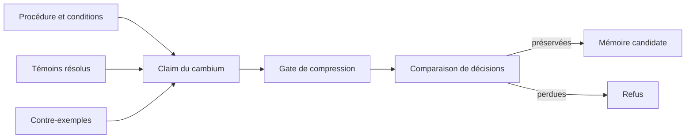

# Cambium des contre-exemples — préserver les conditions d'une procédure

- **Statut** : Partiel — registre, gate et rappel Holobionte conditionné aux témoins implémentés ; rejeu automatisé de la mémoire générale à faire.
- **Portée** : procédures mémorisées avec témoins vérifiables et conditions d'application.
- **Dernière revue** : 2026-10-04.

## 1. Domaine et objectif

Une procédure utile n'est pas une règle universelle. Le cambium protège la
frontière entre « appliquer » et « ne pas appliquer », en conservant les
conditions, les versions d'environnement, les contre-exemples et les artefacts
qui permettent de vérifier la distinction. Un seul contre-exemple pertinent
peut valoir davantage que de nombreuses répétitions ordinaires.

L'objectif est d'éviter qu'une consolidation ou compression de mémoire
réactive une conclusion devenue trop générale ou invérifiable.

## 2. Modèle logique

Une claim procédurale enregistrée porte `claimId`, `scopeId`, procédure,
`verificationRef`, `environmentVersion`, conditions et au moins un témoin
`VERIFIED` dont la référence d'artefact est résolue avant écriture. Le reçu
de vérification de la procédure doit lui aussi être résoluble. Un contre-exemple porte sa
condition d'application et un artefact résoluble. L'ajout d'un contre-exemple
fait passer la claim de `VERIFIED` à `QUALIFIED` ; il ne l'efface pas.

La compression candidate est permise si :

```text
tous les témoins conservés et contre-exemples sont résolubles
ET les décisions ciblées sont préservées par le comparateur injecté
ET (un témoin subsiste OU la claim devient UNVERIFIED)
```

Le dernier terme est aussi protégé par un trigger SQLite : une suppression
directe du dernier témoin d'une claim encore vérifiée ou qualifiée échoue. Les
contre-exemples ne peuvent pas être supprimés directement de leur table.

## 3. Inspiration biologique et limite

Le cambium est une métaphore de croissance et de conservation de structure.
Le service ne simule pas la croissance d'un arbre. Il sélectionne des liens
de preuve et des frontières de décision dans une mémoire versionnée. Une
politique de niveaux d'âge fondée sur φ serait une variante à comparer ; elle
n'est pas nécessaire à l'invariant de préservation.

## 4. Architecture technique



- [Service Cambium](../../backend/src/services/morphogenesis/capabilities/cambiumService.js) : enregistrement, qualification et compression transactionnelle.
- [Migration](../../backend/src/db/migrations/migrateMorphogenesisCapabilities.js) : claims, témoins, contre-exemples, contraintes SQL.
- [Consolidation](../../backend/src/services/memory/consolidationPolicyService.js) : transporte conditions et références ; l'option `cambiumRequired` bloque une procédure sans applicabilité ou témoin déclaré.
- [Mémoire Holobionte](../../backend/src/services/holobionte/memory/symbioticMemoryService.js) : enregistre le contrat optionnel et, au rappel, fournit conditions et contre-exemples seulement si les artefacts restent résolubles.
- [Propagation des contre-exemples](../../backend/src/services/epistemicScheduler/counterexamplePropagation.js) : primitive existante d'invalidation de descendants, encore à relier au registre du Cambium.

`scopeId` confine la recherche d'une claim ; Holobionte le construit à partir
de la portée et de l'identifiant de mission, workspace, projet ou hôte. Les
appels directs doivent fournir le même scope. L'autorité de l'hôte et sa
politique de données continuent à s'appliquer avant l'enregistrement.

## 5. Processus d'exécution et validation

1. Le producteur fournit une procédure déjà admise par les contrôles de
   mémoire existants, son reçu de vérification, ses conditions et des témoins.
   Un résolveur interne confirme l'accessibilité des artefacts avant `registerProcedure`.
2. Lorsqu'une exception est vérifiée, `attachCounterexample` confirme son
   artefact et qualifie la claim dans le même scope.
3. Avant compression, `evaluateCompression` vérifie les références
   conservées et appelle `compareDecisions` sur les épreuves ciblées.
4. `commitCompression` refait cette évaluation dans une transaction. Si le
   dernier témoin doit partir, `degradeClaim` est exigé et le statut devient
   `UNVERIFIED` avant la suppression.
5. Le rappel d'une procédure protégée exige un résolveur. Il renvoie ses
   conditions et contre-exemples lorsque les témoins restent accessibles ;
   une claim `UNVERIFIED` ou un artefact perdu n'est pas rappelé.

Le comparateur est une dépendance de confiance injectée, pas un test
universel fourni automatiquement par le registre.

## 6. Exemple

Une opération peut être réessayée après timeout dans un service idempotent.
Un autre service a produit l'effet avant de perdre sa réponse ; le retry y
double cet effet. Le second cas devient un contre-exemple lié à la condition
`idempotent`. Une compression qui ne conserve que « retry après timeout »
est refusée si elle fait prendre la même décision dans les deux contextes.

## 7. Épreuves et mesures

Le [test de contrat](../../backend/tests/test_morphogenesis_capabilities.js)
vérifie la qualification d'une claim, le refus de supprimer le dernier
témoin, le refus d'un artefact non résoluble, la protection SQL d'un
contre-exemple et la dégradation explicite à `UNVERIFIED`.
Le [test de seconde tranche](../../backend/tests/test_morphogenesis_capabilities_phase2.js)
vérifie le rappel contextualisé et le refus fermé après perte d'un témoin.

Le benchmark à réaliser doit contenir des exceptions rares, de nombreuses
répétitions communes et des changements de version. À stockage égal,
mesurer les mauvaises généralisations, témoins perdus, procédures réactivées
à tort et coût de rappel. Les comparaisons doivent couvrir des décisions
« appliquer » et « s'abstenir ».

## 8. Comparaison avec l'existant

GenOS dispose déjà de mémoire négative, de reconsolidation et de propagation
de contradictions. Le Cambium ajoute un **contrat de conservation des
distinctions et des témoins**, vérifié avant une compression. Il ne remplace
pas les couches existantes de persistance ou d'immunité Holobionte.

## 9. Limites et garde-fous

- Une référence résoluble aujourd'hui peut disparaître demain ; un audit
  périodique d'accessibilité reste nécessaire.
- Le hash d'un artefact ne remplace pas son contenu accessible.
- Le registre ne choisit pas seul les épreuves ciblées ni ne prouve que le
  comparateur couvre tous les cas importants.
- Le chemin générique de compression de toutes les mémoires n'appelle pas
  encore automatiquement ce gate ; l'usage actuel est explicite et opt-in.
- Si les témoins indispensables dépassent la capacité de stockage, il faut
  augmenter les ressources ou restreindre les garanties annoncées.

## 10. Références internes

Voir [Morphogenèse](topologies/morphogenese.md), [Holobionte](topologies/holobionte.md),
[Épistémologie et évidence](../01-concepts/epistemologie-et-evidence.md) et
[ADR 0299](../adr/0299-capacites-transversales-morphogenese.md).
