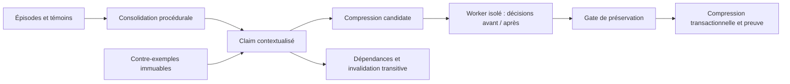

# Cambium à contre-exemples — préserver les décisions pendant la compression

- **Statut** : rejeu isolé, consolidation, rappel contextualisé et invalidation implémentés.
- **Portée** : procédures déclaratives vérifiées du backend.
- **Dernière revue** : 2026-10-06.

## 1. Domaine et objectif

Compresser une mémoire peut effacer la condition qui rendait une procédure sûre.
Le cambium conserve témoins et contre-exemples et compare les décisions avant
et après compression sur leurs cas. La mémoire devient réutilisable dans ses
conditions attestées ; elle s'abstient en dehors de ce domaine.

## 2. Contrat de mémoire

Une procédure enregistrée porte `claimId`, `scopeId`, `verificationRef`,
`environmentVersion`, `conditions` et au moins un témoin vérifié résoluble.
La procédure déclarative utilise `rules: [{when, decision}]` ; les conditions
et les règles comparent des faits concrets. Un contre-exemple ajoute une
condition d'abstention avec son artefact ; il est conservé indépendamment
du score ou de l'âge de la mémoire.

Les anciens textes de procédure restent lisibles. La compression avec rejeu
exige une procédure structurée et des artefacts contenant des `cases`.
Une affirmation ne devient pas exécutable en évaluant du JavaScript arbitraire.

## 3. Décision et compression

[cambiumDecision](../../backend/src/services/morphogenesis/capabilities/cambiumDecision.js)
s'abstient si la version d'environnement diffère, si les conditions ne tiennent
pas ou si un contre-exemple s'applique. Il parcourt ensuite les règles déclarées.
Le rejeu compare les décisions de l'ancienne et de la nouvelle représentation
sur tous les cas des témoins originaux et des contre-exemples.

La proposition de compression n'est acceptée que si ces décisions sont préservées.
Un booléen ou un comparateur libre fourni par l'appelant n'est pas une preuve.
Supprimer tous les témoins exige une dégradation explicite vers UNVERIFIED.

## 4. Architecture technique

[cambiumReplay](../../backend/src/services/morphogenesis/capabilities/cambiumReplay.js)
utilise un Worker avec heap de 32 Mo, stack de 2 Mo, timeout de cinq secondes
et au plus 10 000 cas. Le résultat, les représentations et les différences
de décision sont persistés avec leur empreinte.
[cambiumConsolidationRuntime](../../backend/src/services/memory/cambiumConsolidationRuntime.js)
relie classification, enregistrement et parents dans une transaction.
Le rappel Holobionte transporte faits, version et résolution des preuves.

## 5. Processus d'exécution

1. Qualifier l'épisode pour la consolidation procédurale.
2. Enregistrer le claim, ses conditions, témoins et références de vérification.
3. Relier les parents dont dépend la procédure dans le même scope.
4. Ajouter chaque contre-exemple avec condition et preuve accessibles.
5. Proposer une compression avec témoins retenus et représentation candidate.
6. Rejouer tous les cas originaux dans le worker ; refuser une décision différente.
7. Écrire la représentation acceptée et les suppressions autorisées atomiquement.

L'ajout d'un contre-exemple qualifie le domaine de validité. Une invalidation
explicitement étayée rend aussi les descendants UNVERIFIED. Le rappel revalide
les preuves, les conditions des ancêtres et leurs contre-exemples avant de
déclarer une mémoire utilisable. Les liens cycliques sont refusés.

## 6. Exemple

Une procédure « réessayer » est attestée dans l'environnement v1 pour une opération
idempotente. Un cas non idempotent devient contre-exemple. Compresser la mémoire
en supprimant cette distinction provoque une décision RETRY au lieu d'ABSTAIN :
le rejeu refuse la compression, même si un comparateur externe prétend l'accepter.

## 7. Activation et exploitation

L'API de consolidation reçoit `episode`, `history`, `memoryId`, `contract`
et éventuellement `parentClaimIds`. Le CLI local expose `cambium.register`,
`counterexample`, `compress`, `context`, `link` et `invalidate`.
Pour le rappel, fournir `environmentVersion` et `facts` au lieu d'inférer
que les conditions historiques s'appliquent au nouveau contexte.

Le dernier témoin d'un claim vérifié ne peut pas être supprimé par SQL.
Les contre-exemples ne peuvent pas être supprimés. Un timeout de rejeu refuse
l'opération ; il n'autorise pas un résultat de secours optimiste.

## 8. Validation et comparaisons

[test_capability_cambium_runtime](../../backend/tests/test_capability_cambium_runtime.js)
teste le comparateur mensonger, l'élargissement de conditions, le worker réel,
le rappel hors domaine et l'invalidation transitive.
Le test d'intégration exerce consolidation et rappel avec des faits incompatibles.

Le benchmark compare le gate de préservation à des politiques simplifiées
de rétention par récence, fréquence et âge. Il mesure des décisions modifiées
sur un corpus synthétique ; ce n'est pas une qualification de toutes les
mémoires LLM ni une preuve universelle de préservation sémantique.

## 9. Limites et garde-fous

La préservation vaut sur les cas conservés ; leur représentativité reste à
évaluer. Une règle déclarative peut être erronée et néanmoins stable au rejeu.
La gate de compression ne remplace pas la vérification initiale. Les versions
d'environnement et les conditions sont déclarées explicitement. Une dépendance
inaccessible rend la mémoire inutilisable ; un ancien statut VERIFIED ne suffit pas.

## 10. Références internes

Voir [Morphogenèse](topologies/morphogenese.md),
[ADR initial](../adr/0299-capacites-transversales-morphogenese.md) et
[ADR runtime](../adr/0332-capacites-morphogenese-runtime.md).
