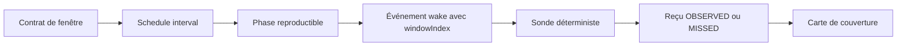

# Chronotaxie apériodique — couvrir les phases d'observation

- **Statut** : Partiel — schedules persistés, reçus d'observation résolus et fenêtres manquées comptées ; sondes résidentes et qualification terrain à faire.
- **Portée** : observations récurrentes soumises à une fenêtre et un délai maximal.
- **Dernière revue** : 2026-10-04.

## 1. Domaine et objectif

Une panne de courte durée peut rester invisible si toutes les sondes
échantillonnent la même phase d'un cycle. Ajouter des sondes identiques au
même instant ne corrige pas cette erreur. La chronotaxie décale les instants
d'observation tout en conservant les bornes de latence et de capacité. Elle
mesure ensuite les phases **réellement observées**.

Ce mécanisme vise les diagnostics intermittents et les évaluations dont la
qualité dépend du moment de mesure. Une échéance obligatoire n'est jamais
déplacée par cette politique.

## 2. Modèle mathématique

La politique implémentée utilise le pas de phase :

```text
a = (3 - sqrt(5)) / 2
u_n = frac(offset + n × a)
t_n = anchor + n × period + min(period × u_n, maximumLatency)
```

`index`, `anchorMs` et `offset` sont persistés dans `spec_json`, ce qui rend
la séquence reproductible après redémarrage. Si une fenêtre est devenue
impossible au vu de `minimumSpacingMs`, le calcul avance à une fenêtre
admissible. Les dates sont stockées en UTC. La précision finie et les bornes
peuvent modifier la distribution théorique des phases.

La couverture découpe une période en `bins` et compte uniquement les reçus
`OBSERVED`. `MISSED`, une échéance calculée ou un événement de réveil ne
constituent pas une observation.

## 3. Inspiration biologique et limite

L'angle d'or sert ici de suite de déphasage. Il n'établit aucune garantie
universelle de détection. Un adversaire connaissant la graine et le calendrier
peut anticiper les sondes. La chronotaxie n'est donc pas une défense
cryptographique ; pour ce besoin, il faudrait une autre source d'aléa et un
autre protocole de menace.

## 4. Architecture technique



- [Calcul](../../backend/src/services/morphogenesis/capabilities/chronotaxis.js) : phases, échéance et couverture.
- [Schedules](../../backend/src/services/ontogenesis/scheduleService.js) : politique `chronotaxis` d'un `interval` existant, `recordTemporalObservation` et `temporalCoverage`.
- [Tick résident](../../backend/src/services/ontogenesis/tickService.js) : transmet `scheduleId` et `windowIndex` au réveil.
- [Migration](../../backend/src/db/migrations/migrateMorphogenesisCapabilities.js) : table `morph_temporal_observations`, avec unicité par schedule et fenêtre.

La politique est logée dans `spec_json` car le schéma SQLite existant borne
`kind` à `interval`, `once` et `deadline`. Les dates `once` et `deadline`
suivent leur chemin normal.

## 5. Processus d'exécution

1. Créer un schedule `interval` avec `policy: 'chronotaxis'`, `periodMs`,
   `minimumSpacingMs`, `maximumLatencyMs`, `offset` et éventuellement
   `anchorMs`. Une spécification invalide échoue avant l'insertion.
2. Le tick émet l'événement de réveil prévu et avance l'index persistant.
   Une fenêtre manquée peut être sautée lors du calcul suivant.
3. Une sonde en lecture seule réalise l'observation. `OBSERVED` exige une
   heure dans la fenêtre et une référence de preuve résolue. `MISSED` n'est
   accepté qu'après la fin de la fenêtre, sans référence de preuve.
4. `temporalCoverage` compte les phases observées et les fenêtres manquées
   séparément. Une observation normale ne nécessite aucun prompt.

Le branchement d'une sonde résidente générique à cet événement reste à
réaliser ; la table et l'API de reçus ne supposent pas que cette sonde existe
déjà pour toutes les missions.

## 6. Exemple

Un défaut dure 300 ms toutes les dix secondes. Un polling strict toutes les
dix secondes peut répéter indéfiniment une phase saine. Le déphasage explore
plusieurs positions dans les fenêtres permises. La carte montre si les
observations réalisées ont couvert ces positions et si un problème de
capacité a fait manquer certaines fenêtres.

## 7. Validation et protocole

Le [test de contrat](../../backend/tests/test_morphogenesis_capabilities.js)
contrôle la reproductibilité, l'avancement du schedule et la distinction
entre observation réalisée et fenêtre manquée.
Le [test de seconde tranche](../../backend/tests/test_morphogenesis_capabilities_phase2.js)
refuse les observations hors fenêtre et les artefacts introuvables.

Le benchmark à ajouter simule des défauts périodiques, quasi périodiques et
aléatoires. Comparer polling fixe, décalages fixes, jitter et chronotaxie à
nombre de sondes et budget identiques. Mesurer défauts manqués, délai de
détection, distribution des phases, coût et respect du délai maximal. Inclure
des cas adverses synchronisés sur la séquence déterministe.

## 8. Comparaison avec les politiques proches

Le jitter réduit souvent la synchronisation et la contention. La
chronotaxie se distingue par une séquence reproductible et une mesure de
couverture des observations, utile pour audit et replay. Sa supériorité sur
le jitter n'est pas établie par les tests de contrat.

## 9. Limites et garde-fous

- `maximumLatencyMs` et `minimumSpacingMs` peuvent rendre certaines phases
  inaccessibles ; la couverture mesurée doit le montrer.
- Une sonde qui ne produit pas de reçu n'est pas comptée comme observation.
- Les timestamps de résultats et les horloges entre hôtes demandent une
  politique de synchronisation avant comparaison inter-dèmes.
- L'unicité par fenêtre évite le double comptage, mais ne valide pas le
  contenu du reçu ni l'authenticité de l'artefact référencé.
- Le déphasage des migrations de Métapopulation n'est pas câblé à cette
  première implémentation.

## 10. Références internes

Voir [Morphogenèse](topologies/morphogenese.md), [Holobionte](topologies/holobionte.md),
[Métapopulation](topologies/metapopulation.md) et [ADR 0299](../adr/0299-capacites-transversales-morphogenese.md).
