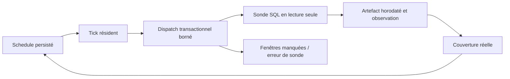

# Chronotaxie apériodique — observer sans verrouillage de phase

- **Statut** : planification, sondes résidentes, couverture et agrégation implémentées.
- **Portée** : observations backend en lecture seule, sous fenêtres temporelles bornées.
- **Dernière revue** : 2026-10-06.

## 1. Domaine et objectif

Un contrôle toujours exécuté à la même phase peut manquer un phénomène périodique.
La chronotaxie varie les phases d'observation à l'intérieur de fenêtres définies.
Elle conserve les contraintes de latence et d'espacement ; elle mesure les
observations réellement exécutées, pas les échéances simplement proposées.

## 2. Contrat temporel

Le schedule est un intervalle avec `spec.policy = chronotaxis`.
`periodMs`, `anchorMs` et `index` définissent les fenêtres UTC.
`minimumSpacingMs` interdit une rafale d'observations ; `maximumLatencyMs`
borne le délai depuis le début de fenêtre. Les indices sont des entiers sûrs.
`bins` définit entre deux et 512 secteurs de phase pour la couverture.

Le payload fixe `probeId`, `hostId` et `environmentId`. Par défaut, les deux
identités utilisent le projet ; en production, déclarer l'hôte réel pour rendre
l'espacement commun à ses schedules dans le même projet.

## 3. Algorithme

La rotation d'or fournit une phase candidate. Le retour de couverture privilégie
un secteur moins observé parmi ceux compatibles avec la latence et l'espacement,
puis la proximité avec cette phase. `nextObservation` avance vers la première
fenêtre admissible. Le schedule persiste l'indice effectivement choisi,
y compris lorsque plusieurs fenêtres ont été sautées.

La rotation ne garantit pas l'observation de toutes les anomalies. Une contrainte
de latence restrictive peut rendre certains secteurs inaccessibles ; la couverture
observée reflète cette restriction.

## 4. Architecture technique



[residentProbeRuntime](../../backend/src/services/morphogenesis/capabilities/residentProbeRuntime.js)
autorise `database-health`, `project-backlog` et `resident-agents`.
Le tick dispatch ces sondes directement ; il ne réveille pas un worker pour
une simple observation. Le maximum est de 32 sondes par tick.
[scheduleService](../../backend/src/services/ontogenesis/scheduleService.js)
persiste fenêtres, observations, secteurs et plages de fenêtres manquées.
La transaction recontrôle l'échéance et l'unicité de la fenêtre pour éviter
de compter deux fois un dispatch concurrent.

## 5. Processus d'exécution

1. Créer le schedule avec un identifiant de sonde autorisé.
2. Calculer la prochaine fenêtre admissible et persister son indice.
3. Au tick, recharger le schedule actif et vérifier son échéance.
4. Différer si l'espacement avec la dernière observation de l'hôte est insuffisant.
5. Exécuter la sonde ou marquer MISSED si la deadline est dépassée.
6. Sceller la preuve avec fenêtre, heure, hôte, environnement et résultat.
7. Calculer la couverture à partir des preuves résolues ; recalculer l'échéance.

Une indisponibilité prolongée produit une plage compacte de fenêtres manquées.
Une erreur SQL produit `FAILED` et un artefact `resident-probe-error` ; elle
n'augmente pas la couverture. L'agrégation accepte une borne de un à 1000 observations.

## 6. Exemple d'activation

```json
{
  "operation": "chronotaxis.create", "scopeId": "PROJECT:p", "projectId": "p",
  "kind": "interval",
  "spec": { "policy": "chronotaxis", "periodMs": 60000,
    "minimumSpacingMs": 5000, "maximumLatencyMs": 55000, "bins": 12 },
  "payload": { "probeId": "database-health", "hostId": "host-a", "environmentId": "prod-readonly" }
}
```

Cette configuration appartient à un projet existant. Le runner résident doit
continuer à appeler le tick ; créer un schedule ne démarre pas un daemon.
Une échéance fixe reste utilisable lorsque la deadline domine la diversité.

## 7. Exploitation et reprise

Le CLI local expose `chronotaxis.create`, `chronotaxis.coverage` et
`chronotaxis.aggregate`. Les preuves sont confinées au scope du projet.
Une pause conserve index, historique et couverture. Après reprise, les fenêtres
manquées sont comptées ; aucun rattrapage en rafale n'est nécessaire.
Une sonde inconnue est refusée à la création. Un ancien schedule contenant
un payload invalide est mis en pause avec une erreur persistée ; il ne bloque
pas les autres sondes. Les sondes n'acceptent ni shell ni URL arbitraire.

## 8. Validation et ablations

[test_capability_probe_runtime](../../backend/tests/test_capability_probe_runtime.js)
exécute la sonde réelle, vérifie unicité, espacement, retard, scopes et agrégation.
Les tests précédents exercent la perte d'une preuve et le calcul des phases.

Le benchmark compare phase fixe, offset, jitter, rotation et feedback sur des
signaux périodiques et quasi périodiques synthétiques à nombre de sondes égal.
Le jitter peut détecter davantage d'anomalies dans ce corpus ; la rotation
n'est pas annoncée comme toujours optimale.

## 9. Limites et garde-fous

L'heure du runner est une entrée opérationnelle ; une horloge non fiable compromet
les garanties temporelles. Les sondes sont locales et SQL ; les observations
distantes nécessitent un adaptateur distinct. L'espacement est partagé dans
le scope du projet, pas entre toutes les installations. Une observation manquée
ne prouve jamais que l'environnement était sain.

## 10. Références internes

Voir [Morphogenèse](topologies/morphogenese.md),
[ADR initial](../adr/0299-capacites-transversales-morphogenese.md) et
[ADR runtime](../adr/0332-capacites-morphogenese-runtime.md).
