# Types de communication : Écologie communicationnelle GenOS

- **Statut** : Partiel (enveloppe versionnée branchée au Signal Plane et aux messages d'organisation ; checkpoint en shadow par défaut ; mesure réelle des tokens et adaptateurs généraux non branchés)
- **Portée** : les 7 types de communication inter-agents, leurs déclencheurs, leurs garanties et leur gouvernance (coût, métriques, shadow, apprentissage)
- **Dernière revue** : 2026-09-25

---

## 1. Définition du domaine

L'**écologie communicationnelle** GenOS est le système de décision qui choisit, pour chaque intention d'un agent, **s'il faut communiquer, à qui, sous quel encodage et avec quel niveau de preuve de réception**. Le principe fondateur est le **silence par défaut** : aucune sortie sans justification (ADR `003x`, invariant 1).

Contrairement à un système multi-agent bavard (texte intégral diffusé à tous, chaque message réveillant un LLM), GenOS empile des canaux par coût croissant et ne monte d'un cran que si le cran inférieur est insuffisant :

$$\text{Communication} : \text{Intent} \times \text{CommonGround} \times \text{Politique} \mapsto \text{Decision}(action, scope, encoding, grounding)$$

Les 7 types effectifs, par coût croissant (échelle imposée par `selectiveEncodingService.js:3-9`) :

| # | Type | Encodage | Support réel |
|---|------|----------|--------------|
| 0 | **Silence** | — | `SILENCE/SELF` (`communicationPolicyEngine.js:168-173`) |
| 1 | **Stigmergie** | trace environnementale | `epistemicStigmergyService.js`, `stigmergyInterProcessBridge.js`, `genos-signal/stigmergy.rs` |
| 2 | **Signal zero-texte** | `ligand/voltage/pheromone/plasmid/tensor` | `signalingTransportService.js:183`, `dynamicOrganizationService.js:266`, `biomimeticSignalingBus.js:15-22` |
| 3 | **Structuré direct** | fingerprint / contrat | `agent_organization_messages` (`dynamicOrganizationService.js:67-122`), `commonGroundService.js` |
| 4 | **Dialecte compilé** | symbole partagé | `dialectService.js:19-52`, `spec/dialect-contract.schema.json` |
| 5 | **Micro-utterance** | 1 tour, 200 tokens | `verbalEscalationService.js:27-35`, `selectiveEncodingService.js:41-43` |
| 6 | **Dialogue borné** | ≤ 8 tours, 2000 tokens, artefact obligatoire | `dialogueSessionService.js:10-17,48-55,85-91` |
| 7 | **Humain** | escalade `HUMAN_EXPLANATION_REQUIRED` | `selectiveEncodingService.js:35-37`, `communicationPolicyEngine.js:218-219` |

Règle de fond (rappelée par l'ADR `003x` et le socle épistémique) : **un transport réussi n'est pas une décision valide**. Chaque cran possède sa propre échelle de grounding (`none → transport_ack → semantic_ack → action_ack → verified_ack → human_confirmation`, `groundingService.js:5-11`).

---

## 2. Modèle formel et statut des modèles

Les formules ci-dessous ont des statuts différents. **Invariant logiciel** = contrôlé par une précondition ou un validateur. **Heuristique** = règle déterministe non calibrée empiriquement. **Simulation** = comportement de test, pas d'exécution réelle. Aucune calibration empirique des pondérations n'est affirmée.

### 2.1 Fonction de décision (implémentée)

`decideCommunication` (`communicationPolicyEngine.js:319-350`) applique dans l'ordre :

$$\text{necessityPass} \rightarrow \text{tryPrescoped} \rightarrow \text{audience} \rightarrow \text{encoding} \rightarrow \text{utility}$$

1. **Necessity** (`:175-178`, invariant logiciel) : `!requiresAction ∧ urgency < 0.15 ∧ risk ≤ 1 → SILENCE/NOVELTY_LOW`.
2. **Pré-scopé** (`:312-317`) : `receptorTopic` prioritaire > `globalEligible` (`purpose = warn ∧ urgency ≥ 0.8 ∧ risk ≥ 2 ∧ allowGlobal`, `:72-77`) > `stigmergyEligible` (`inform|coordinate ∧ urgency < 0.3 ∧ risk ≤ 1 ∧ stigmergyAvailable`, `:65-70`).
3. **Audience** : `selectAudience` + `withoutSender` + `restrictAudience` (`:60-63`) ; audience vide → `SILENCE/COMMON_GROUND_HIGH` (`:331-333`).
4. **Encodage** : `selectEncoding` (`selectiveEncodingService.js:31-51`, voir §6).
5. **Utilité** (`computeGain :136-140` moins `cost.total`) : `utility ≤ 0 → SILENCE/TOKEN_SAVINGS` (`:344-346`).

$$\text{Gain} = novelty \cdot relevance \cdot actionability \cdot urgency \cdot capability \cdot (1 + 0.25 \cdot risk) \cdot (0.5 + 0.5 \cdot baseRate)$$

où `baseRate = signalPlane.voi.pDeltaDecision` sinon `0.5` (`:142-159`, heuristique). `novelty = unknown / total` et `groundEstimate = 1 - unknown / total` (`:113-124, 131-134`).

### 2.2 Grounding (implémenté, fail-closed)

`groundingService.js:62-66, 96-101` : `critical → human_confirmation`, `high → verified_ack`, `medium → action_ack/semantic_ack`. La remontée d'échelle est monotone et vérifiée :

- `ackSemantic` refuse si empreinte mismatch (`SEMANTIC_MISMATCH`, `:141-148`).
- `ackAction` exige `semantic_ack` préalable (`:166-168`).
- `ackVerified` exige `action_ack` + `EVIDENCE_MISMATCH` si preuve absente (`:179-184`).
- `ackHuman` exige `approverId` (`:195`).

`requireGrounding` (`:62`) et `groundingFor` (`:96-101`) sont **dupliqués avec divergence** sur `low` (`transport_ack` vs `none`) — écart connu, sans impact sur les niveaux critiques.

### 2.3 Coût (implémenté comme projection, pas mesure réelle)

`estimateCost` (`communicationCostService.js:54-73`, heuristique à coefficients surchargeables `:38-40`) :

$$\text{total} = \text{tokens} + \text{wake} + \text{fanout} + \text{grounding} + \text{contamination} + \text{disclosure}$$

`tokenCost = (in × 0.06 + out × 0.18) / 1000`, `wake = wakes × 0.4`, `fanout = n × 0.02`, grounding `none:0 … human_confirmation:2.0` (`:29-36`), `contamination = 0.2 × risk`, `disclosure = 0.1 × risk`. Table `ENCODING_TOKENS` hardcodée (`:19-27`) : `semantic-fingerprint:10/0/0`, `symbol-dialect:8/0/0`, `micro-utterance:30/25/1 wake`, `dialogue-turn:200/150/1 wake`.

**Non-objectif tenu (invariant 11 de l'ADR `003x` non satisfait)** : aucune mesure réelle de tokens. `recordTokens({measured:false})` incrémente `tokensProjected` (`communicationMetricsService.js:38-43`), aucun appel tokenizer/LLM, `runCycleDriver.js:37-40` approxime `tokens = cost × 500`. La référence naïve d'économie (`estimateNaiveBroadcast :75-80`) suppose `300 in + 100 out + 1 wake` par destinataire sur 42 destinataires par défaut.

---

## 3. Analogies biologiques et limites réelles

| Analogie | Ce qu'elle organise | Limite réelle (ne pas sur-vendre) |
|----------|--------------------|------------------------------------|
| Ligands / récepteurs paracrines | routage déterministe sans LLM | simple comparaison `ligand === target && concentration ≥ threshold` (`biomimeticSignalingBus.js:48-59`, `cascade.rs:48-58`) |
| Phéromones / stigmergie | coordination par traces + évaporation | `deposit/evaporate/dominant_trail` in-memory Rust (`stigmergy.rs:92-186`) ; pont inter-process persistant mais pull-only, pas de push cross-process |
| Potentiel de membrane / Kuramoto | consensus de phase | simple score `order ≥ 0.70` + `sum V ≥ 300 mV` (`biomimeticSignalingBus.js:61-95`), pas de synchronisation temps réel |
| Plasmides | transfert horizontal de capacité | blob opaque `packBioPolymer/unpackBioPolymer`, pas de transfert de code vérifié |
| Tenseurs latents | signal riche | contrat seul (`signalingTransportService.js:67-80`), contenu non interprété |
| Synapses / plasticité Hebbienne | renforcement des canaux utiles | `+0.10 / -0.05 / -0.15` comptables, pas de preuve d'apprentissage (`signal-plane-zero-text.md:119-123`) |
| Cryptophasie / dialecte | compilation d'un jargon partagé | symboles `sha256:` fail-closed (`dialectService.js:151-211`), mais `confidence` écrite jamais seuillée |

---

## 4. Cas d'usage et objectifs métier

- **Coordination sans réveil LLM** : un signal banal (déploiement prêt, contradiction locale) déclenche une action déterministe (`emit_signal, wake_worker, update_agent, change_organization` via `signalReceptorService.matchAndDispatch`).
- **Évitement du broadcast cognitif** : le transport peut être global, le réveil cognitif reste sélectif (invariant 5). `fanoutTransport` vs `fanoutCognitive` sont comptés séparément (`communicationMetricsService.js:15-25`).
- **Routage vers l'expert** : `transactiveMemoryService.findExperts (:325-342)` score `0.5·competence + 0.2·calibration + 0.2·reliability + 0.1·freshness` (`:253-256`), filtre indépendance ≥ 0.5 par défaut.
- **Négociation bornée** : engagement, patch de contrat ou question humaine via dialogue à artefact obligatoire, sinon `UNRESOLVED` explicite (invariant 10).
- **Capitalisation** : toute conversation récurrente devient candidate à la compilation dialectale (`observePhrase → compilationCandidates → acceptCandidate`, `dialectService.js:226-289`).

---

## 5. Exemples concrets

### 5.1 Signal ligand déterministe (0 LLM)

```js
// Garde zero-texte — dynamicOrganizationService.js:234-240
if (!normalizedType || normalizedType === 'text')
  throw organizationError('ZERO_TEXT_REQUIRED',
    'Inter-agent organization messages require a non-text biomimetic signal.');

// Publication — signalingTransportService.js:183
await signalingTransportService.publishSignal({
  signalType: 'ligand',
  signalData: { concentration: 0.9, semanticType: 'DEPLOY_READY' },
  topic: 'deploy/auth',
  senderAgentId: 'orchestrator-1',
});
```

### 5.2 Dépôt stigmergique persistant

```js
// stigmergyInterProcessBridge.js:78-94
if (!isSupportedType(signal.type)) throw new Error(`Unsupported pheromone type: ${signal.type}`);
const blob = packPheromone(bus, signal);
const db = await optionalDb(opts.db);
if (!db) return { localOnly: true, signalBlob: blob }; // non partagé hors process
```

```rust
// genos-signal/stigmergy.rs:92-109, 168-176
field.deposit("OPTIMAL_PATH", 10.0);
field.evaporate_dt(10.0); // I *= exp(-decay * dt)
field.deposit_repellent("DEAD_END_BUG", 15.0);
```

### 5.3 Delta de connaissance (on ne transmet que l'inconnu)

```js
// commonGroundService.js:128-133
known = receiverPrints(db, { senderId, receiverId }); // fingerprints 'grounded' de la paire
return (semanticRefs || []).filter((ref) => !known.has(ref));
// → audienceSelectorService.js:23-32 → communicationPolicyEngine.js:121-124 (novelty)
```

### 5.4 Escalade verbale bornée + artefact

```js
// verbalEscalationService.js:52-62 — refuse sans trigger, sans ≥2 participants, sans question
// dialogueSessionService.js:10-17 — défauts { tokenBudget: 2000, maxTurns: 8 }
await openDialogue({ escalationId, requiredArtifact: 'Commitment' });
await appendTurn({ escalationId, speaker: 'a', utterance: 'je prends le build', tokensUsed: 30 });
await closeSession({ escalationId, artifactKind: 'Commitment', artifact: {...} });
// budget dépassé → forceCloseUnresolved : artefact UNRESOLVED + status 'unresolved' (:48-55)
```

---

## 6. Schémas et diagrammes

### 6.1 Échelle d'escalade et gates

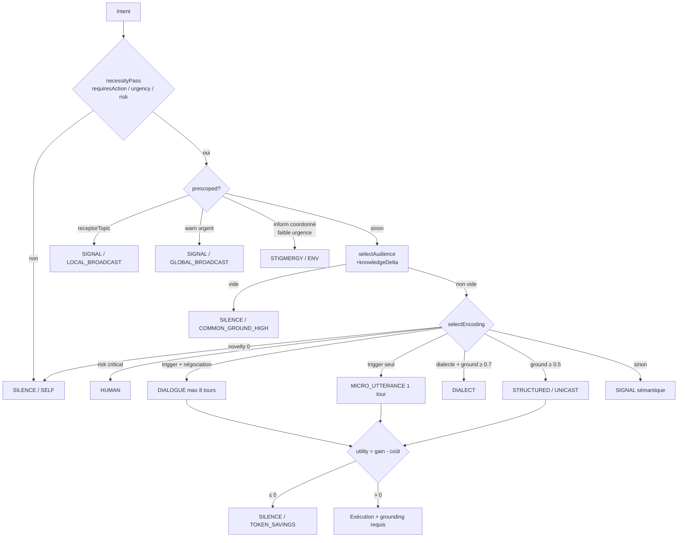

### 6.2 Cycle de vie du verbal rare

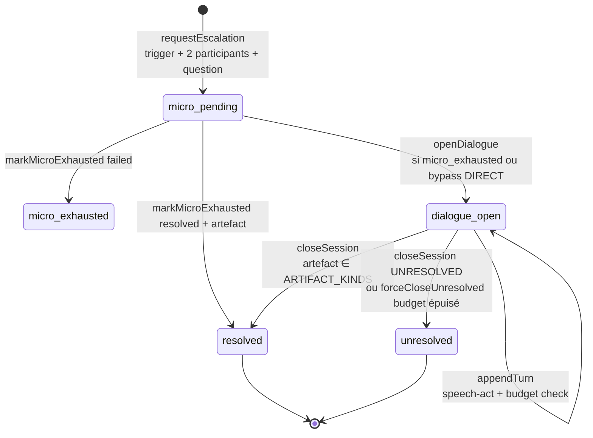

### 6.3 Pin et pull du Signal Plane

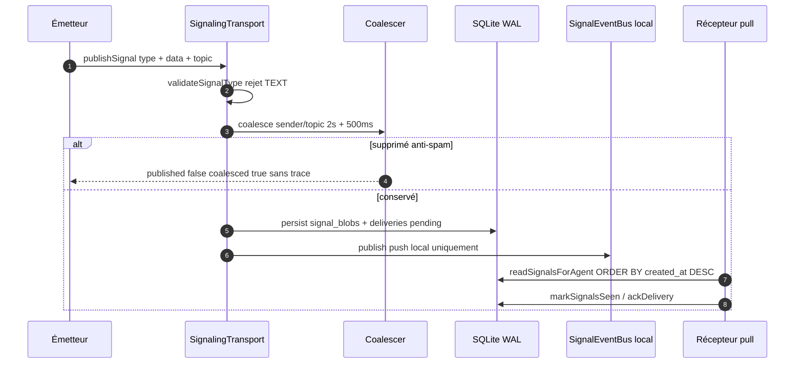

### 6.4 Type 0 — Silence (défaut)

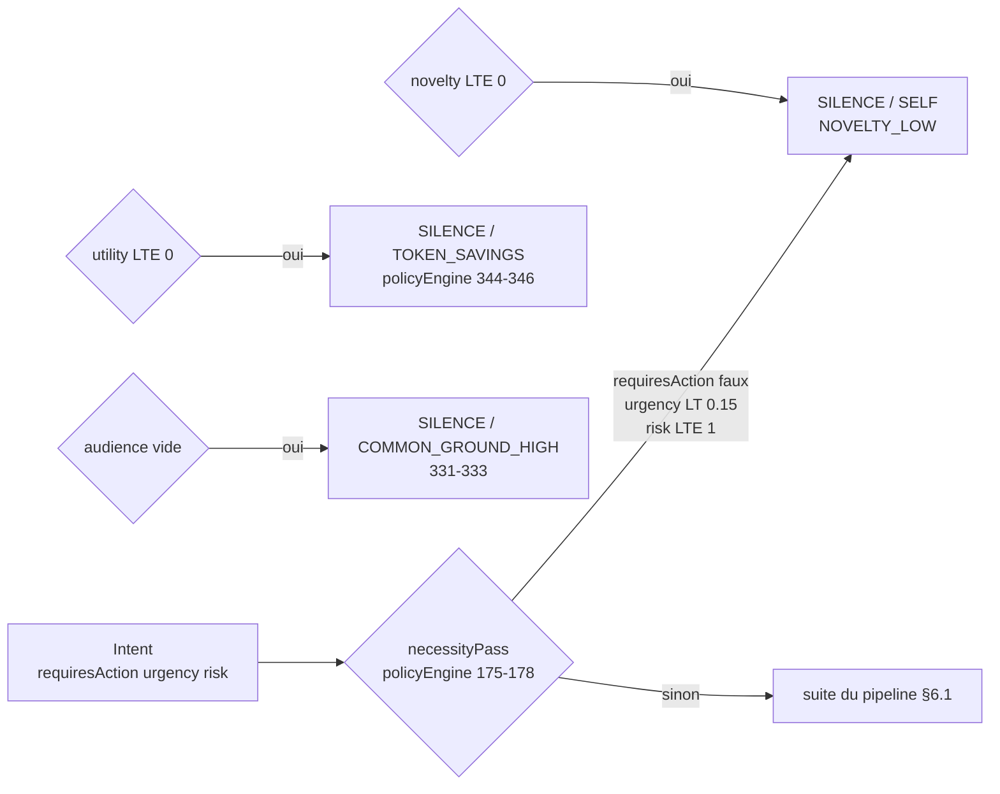

Gates réels : `necessityPass`, audience vide, `novelty ≤ 0` (`selectiveEncodingService.js:32-34`), `utility ≤ 0`. Compteur `silence` + taux `silenceRate` (`communicationMetricsService.js:15-25, 91-106`).

### 6.5 Type 1 — Signal zero-texte (ligand / voltage / phéromone / plasmide / tenseur)

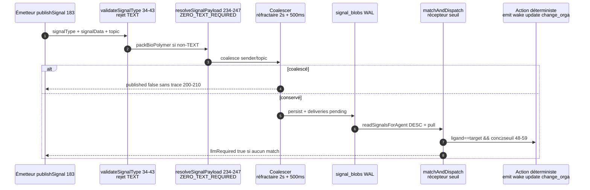

Garanties : best-effort, push local au processus (`signalEventBus.js:65-66`), pull `pending/delivered/seen/acked`, TTL 30 s + purge, pas d'ordre causal (`ORDER BY created_at DESC`).

### 6.6 Type 2 — Stigmergie (trace d'environnement + évaporation)

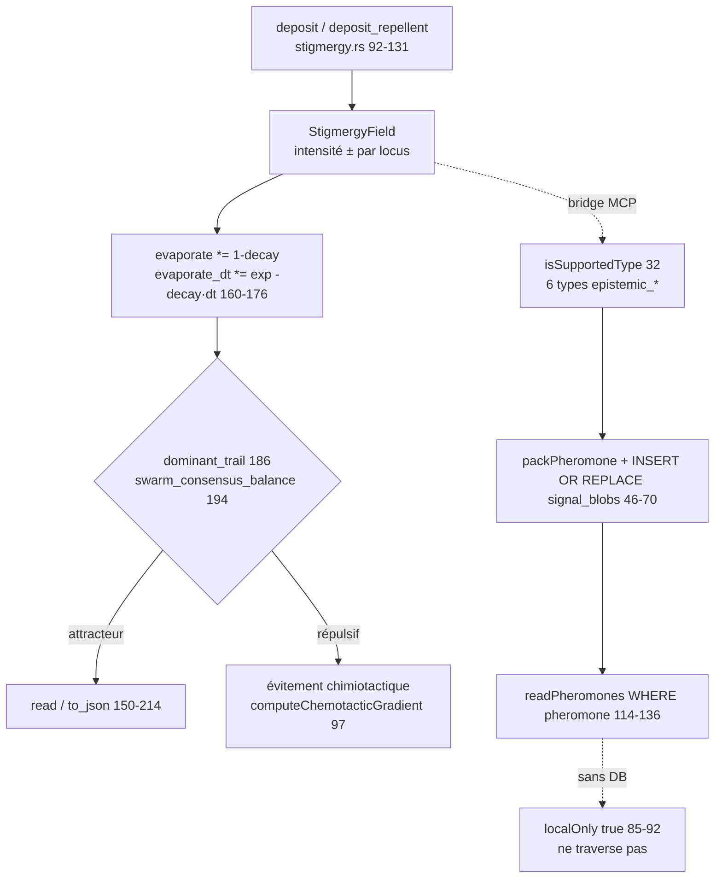

Vocabulaires disjoints : Rust générique (répulsifs négatifs) vs Node volatil (6 `PHEROMONE_TYPES` épistémiques, `broadcast` = deposit + handlers sync) vs pont persistant (6 `epistemic_*`). TTL + `dominant_trail` = seule "décision" collective.

### 6.7 Type 3 — Message d'organisation structuré (canal routé + inbox)

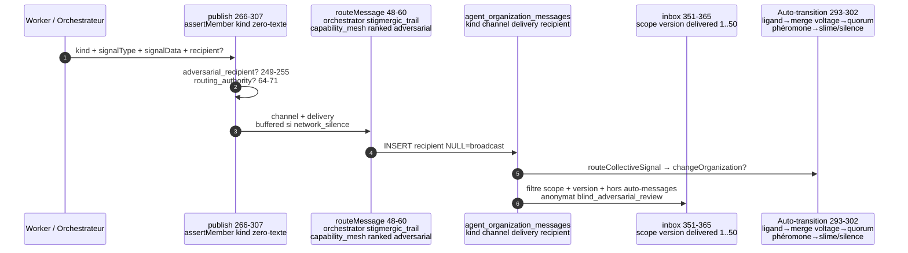

Tables sœurs : `agent_organization_state` (1 ligne par orchestrateur, `version+1` par transition) + `agent_organization_transitions` (journal `org-transition-<uuid>`). `changeOrganization` idempotent (`changed:false` si même topologie), `flushBufferedMessages` sauf vers `network_silence`.

**Enveloppe canonique v1 (partiellement intégrée).** `spec/communication-envelope.schema.json` et `communicationEnvelopeService.js` définissent un contrat commun. Le Signal Plane l'embarque dans les signaux et `dynamicOrganizationService.publish` l'ajoute aux messages d'organisation. Les champs historiques restent lisibles pour compatibilité; les consommateurs ne vérifient pas encore l'empreinte à la lecture.

### 6.8 Type 4 — Common Ground / delta (on ne transmet que l'inconnu)

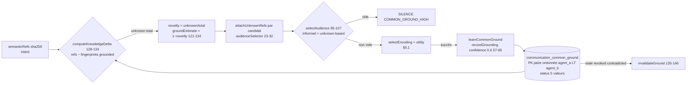

Sans filtre `domain` dans `computeKnowledgeDelta` (filtre `domain` seulement dans `getSharedGround` / `pairPrints`). Variante groupe : intersection sur N paires (`computeGroupGrounding:184-193`, sans appelant — partiel).

### 6.9 Type 5 — Mémoire transitive (qui sait quoi faire)

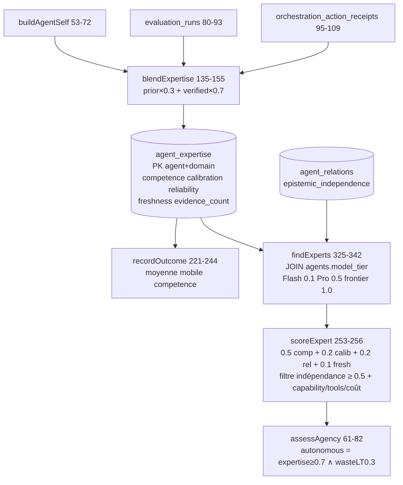

Dégradés silencieux si sources absentes (`:69-71, 90-93, 106-108`). `recommendActions` (conseil `SILENCE/SIGNAL/STIGMERGY/HUMAN`, fenêtre 1 h) non branché au policy engine — partiel.

### 6.10 Type 6 — Dialecte compilé (jargon fail-closed)

```mermaid
stateDiagram-v2
    [*] --> proposed: observePhrase 226-252<br/>phrase_hash sha256 frequency 1
    proposed --> proposed: récurrence<br/>frequency++ variance=count/freq
    proposed --> accepted: compilationCandidates 254-268<br/>freq≥3 variance≤0.2 succès≥2<br/>acceptCandidate → defineSymbol 279-289
    accepted --> retired: retireSymbol 175-182<br/>expires_at
    accepted --> encode: encode fingerprint→symbole 184-199
    accepted --> decode: decode symbole→fingerprint 200-211
    encode --> UNKNOWN_SYMBOL: throw sans deviner 191
    decode --> UNKNOWN_DIALECT_VERSION: throw fallback canonique 205
    encode --> recordUsage: confidence = success/use 213-224
    decode --> recordUsage: confidence = success/use 213-224
```

Contrat miroir SQL ↔ `spec/dialect-contract.schema.json:8-36` (`participants[2]` ordonnés, `version ≥ 1`, `commonGroundHash = sha256(dialectId|version|symboles)`, `status active|retired`). Sélection : `dialectAvailable ∧ ground ≥ 0.7 ∧ risk ≤ 1 → DIALECT` (`selectiveEncodingService.js:44-46`), sinon `STRUCTURED` ou `SIGNAL`.

### 6.11 Type 7 — Verbal borné + humain (micro → dialogue → artefact)

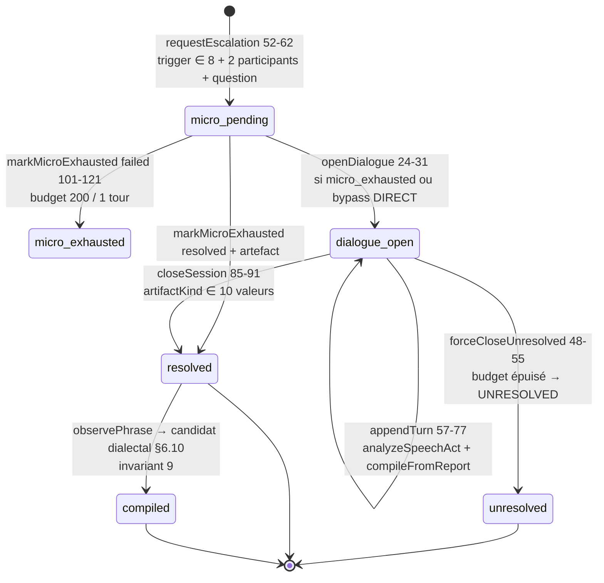

Budgets : `MICRO {1 tour, 200}` / `DIALOGUE {8 tours, 2000}` (`communicationPolicyEngine.js:208-219`). `DIALOGUE_DIRECT = {COMMITMENT_NEGOTIATION, HUMAN_EXPLANATION_REQUIRED}` bypass `MICRO_FIRST`. `requiredArtifact` stocké mais non vérifié à la clôture (écart connu). `HUMAN` = escalade sans pupitre opérateur dédié (partiel).

---

## 7. Architecture technique

Cinq couches, du substrat vers la cognition :

| Couche | Composants réels | Fichiers |
|--------|-----------------|----------|
| **Substrat signal** | bus 6 types, pack/unpack, gradients, Kuramoto, matrice TTL | `backend/src/services/biomimeticSignalingBus.js:15-108`, `crates/genos-signal/src/{cascade,stigmergy,kuramoto,matrix}.rs` |
| **Transport** | validation, coalescing, persistance WAL, EventBus local, deliveries, purge TTL | `backend/src/services/signalingTransportService.js:34-289`, `signalEventBus.js:19-66`, `signalDeliveryService.js:19-64` |
| **Organisation** | `agent_organization_messages/state/transitions`, `publish/inbox`, routage `orchestrator/stigmergic_trail/capability_mesh/ranked/adversarial_pair`, buffer `network_silence` | `backend/src/services/dynamicOrganizationService.js:19-365`, `organizationRouting.js:11-71` |
| **Mémoire partagée** | ledger paire-à-paire, annuaire d'expertise, échelle de grounding, encodage sélectif, firewall d'indépendance, profils relationnels | `backend/src/services/communication/{commonGroundService,transactiveMemoryService,groundingService,selectiveEncodingService,epistemicIndependenceService,relationshipCommunicationProfileService}.js` |
| **Verbal + gouvernance** | escalade, sessions bornées, speech-acts, dialectes, policy engine, coûts, métriques, shadow, apprentissage, checkpoints, drivers | `backend/src/services/communication/{verbalEscalationService,dialogueSessionService,speechActCompilerService,dialectService,communicationPolicyEngine,communicationCostService,communicationMetricsService,communicationShadowLogService,communicationLearningService,communicationCheckpointService,agencyDriver,runCycleDriver,recommendActions}.js` |

### 7.1 Détail par type

**Type 1 — Signal zero-texte (implémenté).** `SIGNAL_TYPES = {ligand, voltage, pheromone, plasmid, tensor, text}` (`biomimeticSignalingBus.js:15-22`) ; `text` rejeté à deux niveaux (`signalingTransportService.js:34-43`, `dynamicOrganizationService.js:234-247` avec `ZERO_TEXT_REQUIRED`, `INVALID_SIGNAL_TYPE`, `SIGNAL_DATA_REQUIRED`). Pipeline : valid → coalesce → persist → route → bus → plasticité (`signalingTransportService.js:183`). Récepteurs déterministes (`signalReceptorService.matchAndDispatch` → `{triggered, dispatched, llmRequired}`).

**Type 2 — Stigmergie (implémentée, deux vocabulaires).** Rust in-memory (`deposit, deposit_repellent, evaporate, dominant_trail`, `stigmergy.rs:92-214`) ; Node épistémique volatil `PHEROMONE_TYPES = [CLAIM_CONTRADICTION, EVIDENCE_FAILURE, ASSUMPTION_UNEXPLORED, VERIFIER_SUCCESS, VERIFIER_FAILURE, DOMAIN_GAP]` (`epistemicStigmergyService.js:14-89`, `broadcast` = deposit + handlers sync) ; pont persistant `SIGNAL_TYPES = {epistemic_contradiction, …, epistemic_high_risk}` (`stigmergyInterProcessBridge.js:23-136`, `INSERT OR REPLACE INTO signal_blobs`). Sans DB le pont retourne `{localOnly:true}` et ne traverse pas les processus (`:85-92`).

**Type 3 — Messages d'organisation (implémenté).** Table créée lazy (`ensureTables :67-122`), `kind ∈ {evidence, question, answer, challenge, proposal, vote, trace, budget, critical, success, handoff}` (`:41-44`), `recipient_agent_id NULL` ou `'broadcast'` = diffusion, `channel` décidé par `routeMessage` (`orchestrator_handoff, stigmergic_trail, capability_mesh, ranked_handoff, adversarial_pair`, fallback nom de topologie, `local_buffer` si `network_silence`). `publish` (`:266-307`) applique dans l'ordre : `assertMember` (`UNKNOWN_AGENT`, `ORGANIZATION_ACCESS_DENIED`), whitelist `kind`, garde zero-texte, `ADVERSARIAL_RECIPIENT_REQUIRED` (`:249-255`), autorité de routage (`organizationRouting.js:64-71`), puis auto-transition signal→topologie (`ligand+cascade → hierarchical_merge`, `voltage+kuramoto ≥ 0.7 → quorum_with_abstention`, gradient phéromone → `slime_mould_network/network_silence`). `inbox` (`:351-365`) : scope `organization_id/project_id` + `organization_version` courante + `delivery = 'delivered'`, hors auto-messages, `limit 1..50`, anonymisation `blind_adversarial_review → anonymous_worker` (`:309-320`). Outils MCP : `genos_change_organization`, `genos_organization_state`, `genos_worker_publish` (`kind + signal_type` requis), `genos_worker_inbox` (`shared/toolDefinitions.json:346-435`).

**Type 4 — Common Ground / delta (implémenté).** Table `communication_common_ground(agent_a, agent_b, domain, semantic_fingerprint, status, confidence, …)`, `PK` paire ordonnée (`agent_a < agent_b`), `status ∈ 5` (`commonGroundService.js:13-44`). `computeKnowledgeDelta` = `semanticRefs − fingerprints 'grounded'` de la paire (`:128-133`, sans filtre domain — le filtre domain n'existe que dans `getSharedGround` et `pairPrints`). Schémas miroirs : `spec/common-ground.schema.json:8-22`, `spec/communication-intent.schema.json:8-44` (14 purposes, `risk` 4 niveaux), `spec/communication-decision.schema.json:8-62` (`action` 10 valeurs, `scope` 7, `encoding` 5, `grounding` 6, `ttlMs`, 14 `reasonCodes`).

**Type 5 — Transactive Memory (implémenté avec dégradés silencieux).** Table `agent_expertise(agent_id, domain, competence, calibration, reliability, evidence_count, freshness, …)` (`transactiveMemoryService.js:23-36`). `refreshExpertise` fusionne `buildAgentSelf` + `evaluation_runs` + `orchestration_action_receipts` (`blendExpertise :135-155`, `prior×0.3 + verified×0.7`) ; si les sources manquent, défauts silencieux (`:69-71, 90-93, 106-108`). `findExperts` joint `agents.model_tier` (coûts `Flash:0.1, Pro:0.5, frontier:1.0`, `:16`) et filtre `epistemic_independence` (`:278-296`, seuil 0.5).

**Type 6 — Dialecte compilé (implémenté, fail-closed).** Spec `spec/dialect-contract.schema.json:8-36` (`dialectId, participants[2] ordonnés, domain, version, symbols{sha256: → canonicalMeaning}`, `status active|retired`). Tables `dialects, dialect_symbols, dialect_candidates` (`dialectService.js:19-52`, `CHECK participant_a < participant_b`). `defineSymbol` exige `sha256:` (`:151-157`), `encode/decode` lèvent `UNKNOWN_SYMBOL/UNKNOWN_DIALECT_VERSION` sans deviner (`:191-205`), `recordUsage` recalcule `confidence = success/use` (`:213-224`). Compilation : `observePhrase` (`phrase_hash = sha256`, `variance = variance_count/frequency`, `:226-252`) → `compilationCandidates({minFrequency:3, maxVariance:0.2, minSuccess:2})` (`:254-268`) → `acceptCandidate → defineSymbol + bumpVersion` recalculant `commonGroundHash` (`:99-114, 279-289`).

**Type 7 — Verbal borné (implémenté) + humain (partiel).** 8 triggers exclusifs (`selectiveEncodingService.js:11-14`). `requestEscalation` exige trigger + ≥ 2 participants + `unresolvedQuestion` (`verbalEscalationService.js:52-62`), crée `micro_pending` (budget 200 tokens / 1 tour, `:27-35`). Ordre **MICRO_FIRST** : `openDialogue` refuse sauf `micro_exhausted` ou bypass `DIALOGUE_DIRECT = {COMMITMENT_NEGOTIATION, HUMAN_EXPLANATION_REQUIRED}` (`dialogueSessionService.js:24-31`). Défauts dialogue `{tokenBudget:2000, maxTurns:8}` (`:10-17`), `appendTurn` analyse chaque tour (`analyzeSpeechAct` + `compileFromReport` → `commissive→Commitment, question/assertive→AssumptionSet, directive→Commitment, declarative→ContractPatch, expressive→null`, `speechActCompilerService.js:50-70`) et force `UNRESOLVED` au dépassement (`:48-55`). `closeSession` exige `artifactKind ∈ ARTIFACT_KINDS` (10 valeurs dont `UNRESOLVED`, `verbalEscalationService.js:7-10`) mais ne vérifie pas `requiredArtifact` (écart connu). `HUMAN` = escalade `HUMAN_EXPLANATION_REQUIRED` sans pupitre opérateur dédié (partiel).

---

## 8. Processus d'exécution et de validation

### 8.1 Publier et lire (chemin organisation)

```
changeOrganization (autorité orchestrateur, idempotent, flush buffer sauf network_silence)
  → publish (membre ? kind ? zero-texte ? adversarial ? routage ? → INSERT + routeCollectiveSignal + auto-transition)
  → inbox (membre, scope, version courante, delivered, pagination, anonymat adversarial)
```

Garanties réelles : **best-effort, pas exactly-once**. Push `EventEmitter` singleton par process (`signalEventBus.js:65-66` ; la doc du Signal Plane admet que les workers d'autres processus ne reçoivent pas le push, `signal-plane-zero-text.md:213-215`). Compensation par pull (`readSignalsForAgent`, `signal_deliveries {pending, delivered, seen, acked}`). **Aucun ordre causal/FIFO** : lectures `ORDER BY created_at DESC` (`signalingTransportService.js:249`, `stigmergyInterProcessBridge.js:116`). Persistance SQLite WAL + TTL (`DEFAULT_SIGNAL_TTL_MS = 30 000`, purge + grâce ACK 7 j, `:280-289`). **Coalescing destructif avant persistance** : signal supprimé sans trace, `{published:false, coalesced:true}` (`:200-210`). `persistSignalRow` ne fait jamais échouer `publish` (`catch + console.warn`, `:49-65`).

### 8.2 Décider, journaliser shadow, apprendre

- **Policy** : `decideCommunication` (voir §2.1) ; mode par défaut `shadow` (`communicationPolicyEngine.js:29-38`), `logAndDecide` ne publie jamais lui-même en shadow (`:352-355`).
- **Shadow** : table `communication_shadow_log(intent_json, decision_json, current_behavior_json, utility, gain, cost)` + `shadowReceipt{reduction = 1 − cost/naive}` (`communicationShadowLogService.js:13-66`). **Écart** : `communicationCheckpointService.evaluateCheckpoint` appelle `decideCommunication` puis `executeSignal` sans tester `getMode()` (`:203-219`) — le flag shadow n'empêche pas cette voie de publication.
- **Apprentissage** : `learnFromOutcome` (`communicationLearningService.js:122-134`) — `mapOutcome` (`dialectError→error`, `actionTaken ∧ interpretationCorrect→action_taken`, `recipientKnew→no_effect`, sinon `ignored`, `:32-37`), journal `communication_outcomes` (`:19-30, 39-49`), puis `learnExpertise → recordOutcome` (skip si `recipientKnew`), `learnCommonGround → recordGrounding confidence 0.6`, `learnDialect → recordUsage/observePhrase`, `learnRelation → familiarity ± 0.05`, `learnChannel → plasticité + signalMetrics`. Les seuils et coefficients de coût ne sont pas auto-ajustés (partiel).
- **Checkpoints** : 8 points (`CHECKPOINTS :16-25`), `buildIntent/buildPolicyInput` (`ttlMs:60 s, maxCandidates:10`), `executeSignal` (`SILENCE→false`, `STIGMERGY→true/signalId:null` non persisté, sinon `publishSignal topic checkpoint|global`, `:150-162`), historique mémoire capé à 100 (`:143-148`).
- **Drivers** : `assessAgency` (`autonomous = expertise ≥ 0.7 ∧ wasteRate < 0.3`, `agencyDriver.js:61-82`, seuils en dur) ; `recommendActions` (`wasteRate > 0.5 → SILENCE`, `actionRate > 0.6 → SIGNAL`, sinon `STIGMERGY`, + `HUMAN` si `urgency > 0.7`, fenêtre 1 h, `:88-127`, non branché au policy engine — partiel) ; `runCycle` (`decide → recordDecision → tryLogShadow → simulateExecution → learnFromReceivers → assessAgency`, `:127-163`) dont `simulateExecution` est **stochastique** (`recipientKnew = Math.random() > 0.3`, `tokensUsed = cost × 500`, `:42-63`) — harness de test, pas exécution réelle.

---

## 9. Comparaison avec le marché

| Aspect | MAS bavard classique | Protocoles A2A / MCP-outils | Écologie GenOS |
|--------|---------------------|-----------------------------|----------------|
| Défaut | broadcast texte à tous | appel d'outil adressé | **silence**, escalade par coût |
| Réveil modèle | chaque message = inférence | à chaque appel | signal déterministe d'abord, LLM = interruption |
| Adressage | fan-out total | point à point | audience + delta de connaissance, quorum possible |
| Mémoire partagée | historique brut | aucune | ledger paire-à-paire + annuaire d'expertise + grounding |
| Jargon | prompts ad hoc | schémas d'outils | dialectes compilés `sha256:` fail-closed |
| Négociation | fils illimités | hors scope | dialogue ≤ 8 tours + artefact ou `UNRESOLVED` |
| Coût | non mesuré | facturé côté provider | projeté par encodage (mesure réelle = non-objectif actuel) |

---

## 10. Limites, garde-fous, non-objectifs

### 10.1 Garde-fous implémentés (fail-closed)

`ZERO_TEXT_REQUIRED`, `INVALID_SIGNAL_TYPE`, `SIGNAL_DATA_REQUIRED` (`dynamicOrganizationService.js:234-247`) ; `UNKNOWN_ORGANIZATION`, `ORCHESTRATOR_AUTHORITY_REQUIRED`, `UNKNOWN_AGENT`, `ORGANIZATION_ACCESS_DENIED`, `ADVERSARIAL_RECIPIENT_REQUIRED`, `ORGANIZATION_AUTHORITY_VIOLATION` ; idempotence `changeOrganization` (`changed:false`) ; buffer `network_silence` + `flushBufferedMessages` ; `SEMANTIC_MISMATCH`, `GROUNDING_LADDER`, `EVIDENCE_MISMATCH` ; `MICRO_FIRST` ; `UNKNOWN_SYMBOL/UNKNOWN_DIALECT_VERSION` sans devinette ; `expires_at` et `retired` dialectaux ; anonymat `blind_adversarial_review`.

### 10.2 Limites structurelles

- Push local au processus ; pas de broadcast cognitif global garanti.
- Pas d'ordre causal ; lecture LIFO (`created_at DESC`).
- Coalescing avec perte assumée (anti-spam 2 s + 500 ms) ; métriques mémoire perdues au restart (`resetMetrics`).
- `signal_type DEFAULT 'text'` en DDL coexiste avec le rejet au `publish` (lignes historiques `text` possibles, ex. inserts `collectiveConsensus.js:103`).
- `VALID_CHANNELS = {SIGNAL, STIGMERGY, UNICAST, MULTICAST, QUORUM, DIALOGUE}` (`communicationManifestService.js:15-17`) et `selectAudience` (`audienceSelectorService.js:95-107`) **ne sont pas appelés** par `publish/inbox` — le `suggestedScope` n'alimente pas `channel/delivery` (écart d'intégration connu).
- `computeGroupGrounding` et `deriveProfile` exportés mais sans appelant dans `backend/` ; `expires_at` du common ground écrit jamais purgé ; `transactiveMemory` dégrade silencieusement vers défauts ; `GroundingReceipt` (`spec/grounding-receipt.schema.json`) sans producteur branché à la livraison signal.

### 10.3 Non-objectifs

- Pas de mesure réelle de tokens (`chars/4` déjà banni, compteur réel non branché — invariant 11 non tenu).
- Le policy engine reste en shadow par défaut. Le pont checkpoint refuse maintenant
  tout effet en shadow; en mode active il n'exécute que les signaux ligand dont
  l'audience a été vérifiée. Les autres encodages attendent un adaptateur réel.
- Pas de `STIGMERGY` persistant via `executeSignal` (`signalId:null`).
- Pas de bouclage `recommendActions → policy engine`.
- Pas de preuve qu'un `transport_ack` vaut décision valide (la beard épistémique reste entière : seul `verified_ack/human_confirmation` + gate de preuve autorise une promotion).

---

## 11. Configuration

| Paramètre (code) | Défaut | Effet |
|---|---|---|
| `currentMode` (`communicationPolicyEngine.js:29-38`) | `shadow` | journalise sans publier (voie `logAndDecide` uniquement) |
| `MICRO = {maxTurns:1, tokenBudget:200}` (`:208-212`) | 1 tour / 200 | borne micro-utterance |
| `DIALOGUE = {maxTurns:8, tokenBudget:2000}` (`:213-217`) | 8 tours / 2000 | borne dialogue |
| `DIALOGUE_DIRECT` (`dialogueSessionService.js:8`) | `{COMMITMENT_NEGOTIATION, HUMAN_EXPLANATION_REQUIRED}` | bypass `MICRO_FIRST` |
| `compilationCandidates({minFrequency, maxVariance, minSuccess})` (`dialectService.js:254-268`) | `3 / 0.2 / 2` | seuil de compilation dialectale |
| `DEFAULT_SIGNAL_TTL_MS` (`signalingTransportService.js:18`) | `30 000` | TTL signal + purge, grâce ACK 7 j |
| Coalescer | réfractaire 2 s + fenêtre 500 ms | anti-spam avec perte assumée |
| `inbox limit` (`dynamicOrganizationService.js:322-340`) | clamp `1..50` | pagination boîte de réception |
| Checkpoint `ttlMs / maxCandidates` (`communicationCheckpointService.js:84-115`) | `60 s / 10` | horizon d'évaluation |
| `assessAgency` seuils (`agencyDriver.js:61-82`) | `expertise ≥ 0.7 ∧ wasteRate < 0.3` | autonomie |
| `recommendActions` seuils (`:88-127`) | `waste > 0.5 → SILENCE`, `action > 0.6 → SIGNAL` | conseil (non branché) |

---

## 12. Télémétrie

Compteurs mémoire (`communicationMetricsService.js:15-43`, perdus au restart) : `attempts, silence, structured, signal, dialect, micro, dialogue, human, stigmergy, verbalWakeups, verbalUseful, tokensInput/Output/Avoided/Measured/Projected, fanoutTransport/Cognitive, variants, usefulActions, redundant, groundHits/Checks, groundingFailures, semanticMismatch, dialectDecodeFailures, contaminationEvents, independenceViolations`. Taux (`getRates :91-106`) : `recipientPrecision, redundancyRatio, commonGroundHitRate, groundingFailureRate, semanticMismatchRate, dialectDecodeFailureRate, usefulInformationPerToken, cognitiveWakePrecision, silenceRate, decidedRate`. Persisté : `communication_outcomes` + `getOutcomeRates` (`action_taken/no_effect/ignored/error`, `:144-158`), `getShadowReduction` (`totalCost/totalNaive/reduction`, `:118-132`), `getExtendedMetrics` (`byDomain/byChannel/byAgent top50`, wake com vs signal plane, `:160-227`).

---

## 13. Références

### 13.1 Code (chemins relatifs depuis `docs/02-orchestration/`)

- Substrat : `../../backend/src/services/biomimeticSignalingBus.js`, `../../crates/genos-signal/src/lib.rs`, `../../crates/genos-signal/src/cascade.rs`, `../../crates/genos-signal/src/stigmergy.rs`, `../../crates/genos-signal/src/kuramoto.rs`, `../../crates/genos-signal/src/matrix.rs`
- Transport : `../../backend/src/services/signalingTransportService.js`, `../../backend/src/services/signalEventBus.js`, `../../backend/src/services/signalDeliveryService.js`, `../../backend/src/services/signalReceptorService.js`, `../../backend/src/services/signalCoalescerService.js`, `../../backend/src/services/synapticPlasticityService.js`
- Organisation : `../../backend/src/services/dynamicOrganizationService.js`, `../../backend/src/services/organizationRouting.js`, `../../backend/src/services/mcpBioTools/handlers/stigmergy.js`
- Mémoire partagée : `../../backend/src/services/communication/commonGroundService.js`, `../../backend/src/services/communication/transactiveMemoryService.js`, `../../backend/src/services/communication/groundingService.js`, `../../backend/src/services/communication/selectiveEncodingService.js`, `../../backend/src/services/communication/epistemicIndependenceService.js`, `../../backend/src/services/communication/relationshipCommunicationProfileService.js`, `../../backend/src/services/communication/audienceSelectorService.js`, `../../backend/src/services/communication/communicationManifestService.js`
- Verbal : `../../backend/src/services/communication/verbalEscalationService.js`, `../../backend/src/services/communication/dialogueSessionService.js`, `../../backend/src/services/communication/speechActCompilerService.js`, `../../backend/src/services/communication/dialectService.js`, `../../backend/src/services/philosophy/speechActService.js`
- Gouvernance : `../../backend/src/services/communication/communicationPolicyEngine.js`, `../../backend/src/services/communication/communicationCostService.js`, `../../backend/src/services/communication/communicationMetricsService.js`, `../../backend/src/services/communication/communicationShadowLogService.js`, `../../backend/src/services/communication/communicationLearningService.js`, `../../backend/src/services/communication/communicationCheckpointService.js`, `../../backend/src/services/communication/agencyDriver.js`, `../../backend/src/services/communication/runCycleDriver.js`, `../../backend/src/services/communication/recommendActions.js`, `../../backend/src/services/communication/index.js`
- Stigmergie épistémique : `../../backend/src/services/epistemic/epistemicStigmergyService.js`, `../../backend/src/services/epistemic/stigmergyInterProcessBridge.js`
- Schémas : `../../spec/communication-envelope.schema.json`, `../../spec/communication-intent.schema.json`, `../../spec/communication-decision.schema.json`, `../../spec/common-ground.schema.json`, `../../spec/grounding-receipt.schema.json`, `../../spec/dialect-contract.schema.json`
- Outils : `../../shared/toolDefinitions.json` (`genos_change_organization`, `genos_organization_state`, `genos_worker_publish`, `genos_worker_inbox`)

### 13.2 Documentation liée

- [Signal Plane zero-texte](../01-concepts/signal-plane-zero-text.md) — transport, coalescing, plasticité.
- [Intelligence de nuée](../01-concepts/intelligence-de-nuee.md) — phéromones, consensus, quorum, stigmergie.
- [Épistémologie et évidence](../01-concepts/epistemologie-et-evidence.md) — succès ≠ vérité, gates de preuve.
- [Topologies et capacités](topologies-et-capacites.md) — 8 modes + 19 organisations, leases effectifs.
- [Morphogenèse](topologies/morphogenese.md) — construction des organisations ; la communication en est une arête typée transverse, pas une modification implicite d'autorité.
- [API et contrats](../03-reference/api-et-contrats.md) — surfaces REST/gRPC/MCP/CLI.
- [Outils MCP](../03-reference/outils-mcp.md) — catalogue, leases, gating.
- [ADR 003x — invariants d'écologie communicationnelle](../adr/003x-communication-ecology.md) — les 12 invariants (statut : propositionnel).
- [ADR 0116 — exécution fiable](../adr/0116-execution-fiable-communication.md) — mode shadow sans effet, audience vérifiée et persistance requise.
- [ADR 0117 — enveloppe canonique](../adr/0117-enveloppe-canonique-communication.md) — contrat commun pour les signaux et messages d'organisation.
- [Index documentation](../README.md) — hub par familles.
