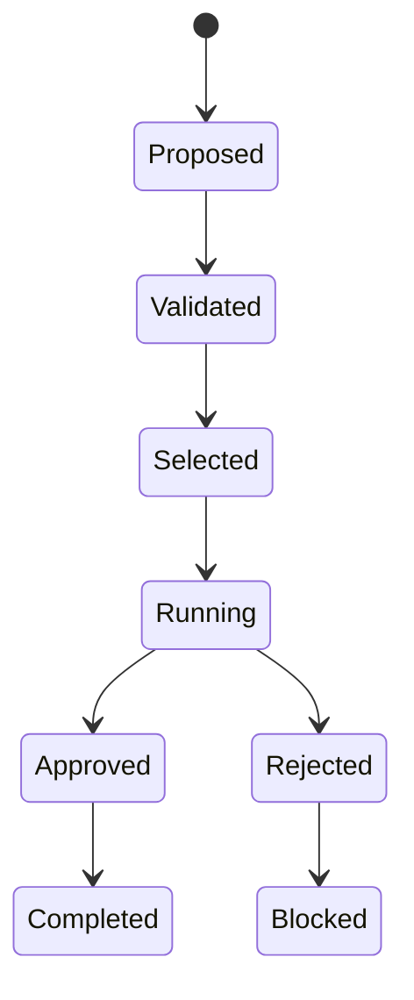

# Contrats de stratégie et exécution

- **Statut** : Implémenté
- **Portée** : contrats versionnés, sélection de stratégie et runs contrôlés.
- **Dernière revue** : 2026-09-18

## 1. Rôle

Un contrat décrit l’engagement d’un agent avant exécution : stratégie primaire,
fallbacks, capacités requises, budget et approbation. Le contrat sélectionné est
versionné et sert de référence lors de l’exécution.

## 2. Machine d’états



## 3. Validité

\[
Valid(c)=Preconditions(c)\land Authority(c)\land Resources(c)\land Budget(c)
\]

Un contrat valide n’autorise pas nécessairement l’action : le lease, le scope et une
approbation éventuelle doivent encore être satisfaits.

## 4. Exemple

```json
{
  "primaryStrategy": "tree-search",
  "fallbacks": ["breadth-first"],
  "requiredCapabilities": ["evidence", "workspace"],
  "budget": 5000,
  "approvalRequired": true
}
```

## 5. Surface opérateur

- `GET /api/agents/:id/strategy-contract` : contrat courant ;
- `GET /api/agents/:id/strategy-contracts` : historique ;
- `POST /api/agents/:id/strategy-contracts` : sélectionner une version ;
- `GET /api/agents/:id/execution-runs` : runs ;
- `POST /api/execution-runs/:runId/approve` : approuver un run.

## 6. Limites

Le contrat rend la décision traçable ; il ne garantit pas que le provider respecte la
stratégie. La preuve finale doit inclure les événements d'exécution et les artefacts
de test. Les mutations de contrat doivent produire une nouvelle version.

## 7. Boucle de contrôle cognitive (implémenté)

- **Statut** : Implémenté (périmètre : sélection de topologie pilotée par les 5 états).
- **Dernière revue** : 2026-09-23.

Le choix de morphologie ne dépend plus seulement de `mission + capabilities + budget`.
[backend/src/services/morphogenesis/cognitiveControlLoopService.js](../../backend/src/services/morphogenesis/cognitiveControlLoopService.js)
(`decideMorphology`) score chaque topologie candidate à partir de :

- pression épistémique (`uncertainty`, `contradiction`, `evidenceDeficit`,
  `independenceDeficit`, `unresolvedHypotheses`, `calibrationError`) ;
- réutilisation mémoire (`MemoryContext`, pénalité des dead-ends) ;
- poids régulateurs (exploration, conservation, tolérance au risque) ;
- ajustement cognitif / stratégique ;
- biais topologique : `seek_independent_verification` → `trinity`,
  `explore` → topologie exploratoire, `commit`/`hold` → stabilisation.

[backend/src/services/morphogenesis/morphogenesisPlannerService.js](../../backend/src/services/morphogenesis/morphogenesisPlannerService.js)
(`planMorphogenesis`) construit les candidats `{courante, proposée, trinity}`,
délègue le choix quand `ctx.expression` est présent (`plan.selectedTopology`,
`plan.controlReceipt`), sinon garde le comportement historique. La fermeture
post-action (`Evidence → révision → RPE → consolidation → performances
stratégie/recette → expérience morphologique`) est assurée par le
`causalLoopService`.

Limites : `MemoryRouter`, `StrategyResolver` et `PhenotypeResolver` ne sont pas
encore appelés en live dans l'expression (stubs enrichis avec fallback) ; les
priors empiriques inter-missions restent hors périmètre.

## 8. Routage minimal et mémoire des meilleurs résultats (ADR 0046)

- **Statut** : Implémenté (périmètre : heuristiques déterministes, primitive arithmétique, champion SQLite).
- **Dernière revue** : 2026-09-24.

Avant tout contrat, `backend/bin/genos-orchestrate.cjs` appelle
`backend/bin/requestMemoryBridge.cjs` (`maybeHandleMinimal`) :

1. `requestProfilerService.profileRequest` : normalisation (minuscules, espaces),
   empreinte `req_<sha256-32>` et `RequestProfile` + `request_class`
   (ex. `deterministic_trivial`, `repo_understanding`, `hard_combinatorial`).
2. `bestKnownResultService.lookupReusable` : réutilisation du champion si statut
   `VERIFIED` ou `PROVISIONAL`, non expiré et dépendances identiques
   (`repo_head`, workspace) ; sinon marquage `STALE` et recalcul.
3. `executionRouterService.chooseExecutionPath` : mode minimal suffisant
   (`primitive -> procedure -> single_worker -> adaptive_worker ->
   specialists -> collective -> large_search`) ; `2+2` s’exécute en
   `primitive` sans agent, avec reçu `deterministic-eval:2+2=4`.
4. Après mission : `storeMissionResult` archive le résumé en `PROVISIONAL`
   (dette épistémique explicite) ; la primitive arithmétique est archivée en
   `VERIFIED`. La promotion d’un meilleur candidat bascule l’ancien champion en
   `SUPERSEDED` (`promoteChampion`), jamais par remplacement silencieux ;
   `REFUTED` est terminal et non réutilisable.

Contrat d’échange : [spec/request-memory.schema.json](../../spec/request-memory.schema.json).
Tables : `request_problems`, `request_results` (migration `071-request-memory`).
Test : [backend/tests/test_request_memory_routing.js](../../backend/tests/test_request_memory_routing.js).

Limites : classification par heuristiques de mots-clés (pas de modèle), seule
la primitive arithmétique est exécutée en direct, les classes non couvertes
retombent sur `single_worker`.
