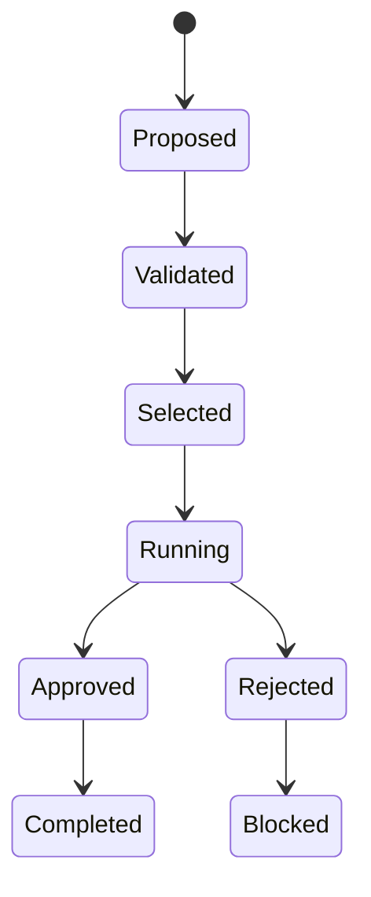

# Contrats de stratégie et exécution

- **Statut** : Implémenté
- **Portée** : contrats versionnés, sélection de stratégie et runs contrôlés.
- **Dernière revue** : 2026-09-18

## 1. Rôle

Un contrat décrit l’engagement d’un agent avant exécution : stratégie primaire,
fallbacks, capacités requises, budget et approbation. Le contrat sélectionné est
versionné et sert de référence lors de l’exécution.

## 2. Machine d’états



## 3. Validité

\[
Valid(c)=Preconditions(c)\land Authority(c)\land Resources(c)\land Budget(c)
\]

Un contrat valide n’autorise pas nécessairement l’action : le lease, le scope et une
approbation éventuelle doivent encore être satisfaits.

## 4. Exemple

```json
{
  "primaryStrategy": "tree-search",
  "fallbacks": ["breadth-first"],
  "requiredCapabilities": ["evidence", "workspace"],
  "budget": 5000,
  "approvalRequired": true
}
```

## 5. Surface opérateur

- `GET /api/agents/:id/strategy-contract` : contrat courant ;
- `GET /api/agents/:id/strategy-contracts` : historique ;
- `POST /api/agents/:id/strategy-contracts` : sélectionner une version ;
- `GET /api/agents/:id/execution-runs` : runs ;
- `POST /api/execution-runs/:runId/approve` : approuver un run.

## 6. Limites

Le contrat rend la décision traçable ; il ne garantit pas que le provider respecte la
stratégie. La preuve finale doit inclure les événements d’exécution et les artefacts
de test. Les mutations de contrat doivent produire une nouvelle version.
