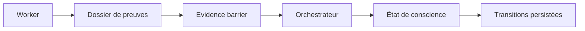

# Dossiers d’agents, evidence et conscience opérationnelle

- **Statut** : Implémenté
- **Portée** : dossiers de workers, barrière d’évidence, synthèse et transitions de conscience du control plane Node.
- **Dernière revue** : 2026-09-26

## 1. Définition

Un dossier rassemble les événements, claims et preuves produits par un agent. Il sert à
la synthèse supervisée ; il ne devient pas automatiquement une vérité.

## 2. Architecture



Le dossier est une vue de travail par worker et par tour. Les événements sont
enregistrés via `agentEvidenceService`, regroupés et contrôlés avant qu'un prompt
de synthèse soit construit. La conscience opérationnelle suit séparément l'état
de l'agent et ses transitions persistées : l'état de conscience ne remplace pas
la validation du dossier.

## 2.1 Parcours d'une décision collective

| Moment | Contrôle | Conséquence en cas d'échec |
| --- | --- | --- |
| Affectation des branches | comparer les workers attendus aux dossiers reçus | un dossier manquant reste une absence, pas une réussite implicite |
| Collecte | borner et conserver les événements, claims et références de preuve | les entrées mal formées ou hors limite ne deviennent pas des faits validés |
| Validation | vérifier présence, cohérence et support des claims | la décision collective est bloquée si l'évidence est insuffisante |
| Synthèse | représenter l'influence de chaque worker attendu, y compris les contributions rejetées | une omission ne peut pas être présentée comme un consensus |
| Transition | persister l'état résultant et sa raison | l'historique permet d'auditer `blocked` et les autres états terminaux |

Les fonctions publiques de référence sont exposées par
[`agentEvidenceService.js`](../../backend/src/services/agentEvidenceService.js).
La validation du dossier, l'évidence de décision et le calcul de score sont
séparés dans `agentEvidence/` pour rendre chaque barrière explicite.

## 3. Invariants

Un dossier utilisable doit satisfaire :

\[
D_{usable}=D_{present}\land D_{coherent}\land D_{substantiated}
\]

La synthèse doit également représenter l’influence de chaque worker attendu : une
contribution rejetée doit être explicitement marquée comme rejetée.

Une preuve doit rester typée et attribuable à son producteur. Un score agrégé,
un résumé de worker ou une confiance déclarée n'est pas une preuve brute. Les
références d'artefacts doivent rester consultables pour permettre la vérification
indépendante de la synthèse.

## 4. État de conscience

L’état combine budget, dissonance, activité et issue de la dernière évaluation :

\[
C_{t+1}=f(C_t,E_t,B_t,\Delta_t)
\]

Une hausse de la dissonance ou l’épuisement du budget peut conduire à `blocked` ou
`apoptosis`, selon la politique de supervision.

Les prompts embarquent le même matériau des deux runtimes (Codex supervisé et
local) via `agentSelfBlocks` : `selfIntro`, `agentSelfBlock` (AgentSelf),
`workerSelfBlock` (9 questions, contraintes héritées, leçons) et
`conscienceBlock`, plus la trace de réverbération entretenue. Les verdicts des
sondes attentionnelles (`attentionProbes`) sont attachés au plan en barrière.
Tout chargement est best-effort : bloc vide plutôt que mission bloquée.

## 5. Contrats exposés

- `GET /api/agents/:id/dossier` ;
- `GET /api/agents/:id/conscience` ;
- `GET /api/agents/:id/conscience/transitions`.

Ces lectures restent soumises au scope tenant.

Les endpoints sont en lecture seule et ne permettent pas de modifier un dossier
ni de promouvoir un résultat. Les vérifications tenant restent obligatoires
même lorsqu'un identifiant d'agent ou de worker est connu.

## 6. Exemple

```json
{
  "workerId": "worker-7",
  "assignedBranch": "hypothesis-b",
  "events": [{"claim":"B est préférable","evidenceStatus":"supported"}],
  "influence": "A réduit le risque sur le cas limite"
}
```

Un dossier vide, incohérent ou sans evidence utilisable bloque la synthèse plutôt que
de produire un succès fictif.

## 7. Science et limites

La « conscience » est ici un état de contrôle logiciel et non une expérience subjective.
La métaphore biologique aide à nommer les transitions, mais ne fournit aucune preuve
de conscience phénoménale. Les tests doivent couvrir dossier manquant, contradiction,
worker rejeté et transition vers `blocked`.

La couverture ciblée se trouve dans
[`test_agent_dossier.js`](../../backend/tests/test_agent_dossier.js),
[`test_agent_evidence.js`](../../backend/tests/test_agent_evidence.js) et
[`test_worker_dossiers_suite.js`](../../backend/tests/test_worker_dossiers_suite.js).
Ces tests étayent les cas codés ; ils ne rendent pas automatiquement vérifiable
un artefact externe qui n'a pas été conservé ou référencé dans le dossier.
