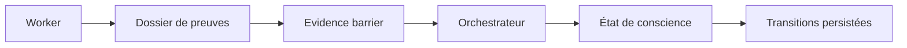

# Dossiers d’agents, evidence et conscience opérationnelle

- **Statut** : Implémenté
- **Portée** : dossiers de workers, barrière d’evidence et état de conscience des agents.
- **Dernière revue** : 2026-09-18

## 1. Définition

Un dossier rassemble les événements, claims et preuves produits par un agent. Il sert à
la synthèse supervisée ; il ne devient pas automatiquement une vérité.

## 2. Architecture



## 3. Invariants

Un dossier utilisable doit satisfaire :

\[
D_{usable}=D_{present}\land D_{coherent}\land D_{substantiated}
\]

La synthèse doit également représenter l’influence de chaque worker attendu : une
contribution rejetée doit être explicitement marquée comme rejetée.

## 4. État de conscience

L’état combine budget, dissonance, activité et issue de la dernière évaluation :

\[
C_{t+1}=f(C_t,E_t,B_t,\Delta_t)
\]

Une hausse de la dissonance ou l’épuisement du budget peut conduire à `blocked` ou
`apoptosis`, selon la politique de supervision.

## 5. Contrats exposés

- `GET /api/agents/:id/dossier` ;
- `GET /api/agents/:id/conscience` ;
- `GET /api/agents/:id/conscience/transitions`.

Ces lectures restent soumises au scope tenant.

## 6. Exemple

```json
{
  "workerId": "worker-7",
  "assignedBranch": "hypothesis-b",
  "events": [{"claim":"B est préférable","evidenceStatus":"supported"}],
  "influence": "A réduit le risque sur le cas limite"
}
```

Un dossier vide, incohérent ou sans evidence utilisable bloque la synthèse plutôt que
de produire un succès fictif.

## 7. Science et limites

La « conscience » est ici un état de contrôle logiciel et non une expérience subjective.
La métaphore biologique aide à nommer les transitions, mais ne fournit aucune preuve
de conscience phénoménale. Les tests doivent couvrir dossier manquant, contradiction,
worker rejeté et transition vers `blocked`.
