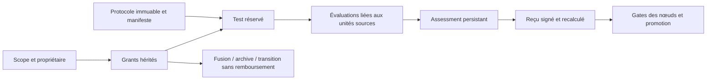

# Infini sous contrat — conserver le risque statistique dans une lignée

- **Statut** : provenance, allocation sommable, héritage et gates backend implémentés.
- **Portée** : promotions statistiques d'une famille explicitement enregistrée.
- **Dernière revue** : 2026-10-06.

## 1. Domaine et objectif

Multiplier les candidats et consulter les résultats à répétition augmente les
occasions de promouvoir une amélioration illusoire. La capacité conserve une
enveloppe de risque dans la lignée et bloque les promotions sans reçu admissible.
Le budget concerne une hypothèse statistique définie ; il ne remplace pas
les preuves déterministes, la sécurité ni les gates de dissentiment.

## 2. Invariants comptables

```text
somme des allocations α_i ≤ δ
initial = disponible + réservé + dépensé + délégué
```

Le registre utilise des entiers de 10⁻⁹. Le fork soustrait la délégation du
parent. Une réservation précède la consommation. La finalisation dépense
l'allocation, même pour un résultat négatif. Fusion, archive, reprise et
transition conservent les grants ; aucune opération ne rembourse une dépense.
Un scope possède une racine unique et ne peut pas être réinitialisé.

La borne `Pr(au moins une fausse promotion) ≤ δ` repose sur l'inégalité de
l'union et la validité individuelle de chaque test. Elle n'exige pas l'indépendance
entre tests ; elle exige que chaque test tienne ses hypothèses effectives.

## 3. Test séquentiel et préenregistrement

Sous `Pr(gain suivant | passé) ≤ 1/2`, le produit des facteurs 1,5 pour un gain
et 0,5 pour une perte est une surmartingale positive. Le maximum historique
donne `p_anytime = 1 / max(1, max_t E_t)`. Le calcul est effectué en log et
le gate compare cette valeur à l'allocation du test.

Le protocole fixe avant l'évaluation `method: bernoulli-e-process-v1`,
`nullConditionalWinProbability: 0.5`, `unitDefinition`, `successPredicate`,
`environmentVersion` et `evaluationUnits`, un manifeste ordonné distinct.
Une séquence observée doit être un préfixe exact de ce manifeste. Les artefacts
d'évaluation doivent être postérieurs à la réservation ; une séquence SQLite
immuable vérifie cet ordre même si l'horloge change. Réordonner
les gains ou sélectionner seulement les résultats favorables est refusé.

## 4. Architecture technique



[riskLineage](../../backend/src/services/morphogenesis/capabilities/riskLineage.js)
gère propriétaires et cycles de vie. [statisticalProvenance](../../backend/src/services/morphogenesis/capabilities/statisticalProvenance.js)
contrôle protocole, ordre, scope, vérificateur et unités sources.
Les artefacts `paired-evaluation` portent sampleId, evaluationUnitId, unitRef,
outcome, protocolHash, verifierId et environmentVersion. Les `unitRef` pointent
vers des artefacts `statistical-evaluation-unit`. Leur empreinte de contenu
interdit une réutilisation sous un autre identifiant ou dans un autre test.

Le vérificateur ne peut pas être le propriétaire du grant. Le reçu HMAC exige
`GENOS_STATISTICAL_RECEIPT_SECRET` d'au moins 32 caractères. Une signature seule
ne suffit pas pour un scope protégé : la gate relit la provenance persistée.

## 5. Héritage entre topologies

`graphCapabilityRuntime.bindGraph` associe le graphe et ses nœuds à une seule
famille. Le lien entre l'identité de mission et son scope est immuable :
renommer la racine ou omettre le contrat lors d'une reprise ne supprime pas
cette protection. Les enfants reçoivent des fractions du disponible. MorphologyRuntime
propage la base et les contrats par nœud jusqu'aux exécuteurs et vérifie leurs
sorties ainsi que la sortie racine. Un graphe étendu exige des grants pour ses
nouveaux nœuds, prélevés sur le disponible actuel ; il ne reçoit pas de budget
frais. Changer de topologie exige une transition de propriétaire explicite.

Les propriétaires acceptés sont Trinity, A-Team, Biome, Métapopulation,
Holobionte, Biocénose, Syncytium, Rhizome et les compositions Morphogenèse. Les points de promotion
Trinity, A-Team, Biome, Métapopulation et Biocénose recontrôlent leur propriétaire.
Un nœud lié ne peut pas omettre son contrat statistique pour éviter la gate.
Les transitions contrôlent le test avant d'appliquer leur patch.

## 6. Processus d'exécution

1. Définir la famille, δ, le critère de gain, les unités et l'hypothèse nulle.
2. Créer le scope et enregistrer son protocole ; déléguer avant les essais.
3. Réserver un test avec grant, protocole et jeu d'évaluation distinct.
4. Persister les observations du vérificateur dans l'ordre préenregistré.
5. Émettre le receipt depuis les artefacts, puis demander la promotion.
6. Vérifier les autres gates et le bilan des grants ; conserver les preuves.

`reserveNext` alloue `floor(initial × (1-r) × r^n)` unités, `0 < r < 1`.
Le défaut est `r = 1/φ`, choisi à la première réservation et fixé pour ce grant.
Changer ce ratio pendant la série est refusé ; la somme est bornée par l'initial.
Quand l'allocation devient inférieure à une unité, la recherche s'arrête
avec `RISK_PRECISION_EXHAUSTED` ; « infini » n'annonce pas des ressources infinies.

## 7. Activation et reprise

Le CLI local expose `risk.create`, `fork`, `merge`, `lifecycle`, `protocol`,
`reserve`, `receipt` et `promote`. Un graphe reçoit `statisticalRisk` et
`statisticalContracts` dans son contexte runtime. Un contrat de promotion
contient `testId` et `receipt`. Archive/reprise emploient une révision attendue
pour refuser les changements concurrents.

Le même contrat de réservation est idempotent ; un autre protocole ou jeu sous
le même testId est refusé. La fusion change le propriétaire sans recréer ses grants.
Les APIs historiques sans scope enregistré restent compatibles ; elles ne
constituent pas le chemin complet de protection décrit ici.

## 8. Validation et campagnes

[test_capability_risk_runtime](../../backend/tests/test_capability_risk_runtime.js)
teste reset, réordonnancement, renommage des unités, indépendance, propriétaire,
conservation, archive/reprise, fusion et immutabilité. Les tests d'intégration
vérifient qu'un enfant et la racine liés ne contournent pas la gate.
Les deux premières tranches conservent leurs tests de reçu et de budget.

Le benchmark répète des campagnes nulles et avec gain, à seed fixe, et compare
deux ratios d'allocation. Le taux empirique varie avec la taille du corpus ;
il ne doit pas être présenté comme une preuve de la borne théorique.
Une qualification statistique externe nécessite des intervalles d'incertitude.

## 9. Limites et garde-fous

Le logiciel contrôle l'intégrité et les liens ; il ne prouve pas que la probabilité
conditionnelle nulle est correcte ni que le vérificateur est honnête.
Des données identiques transformées sémantiquement peuvent échapper à une empreinte
de contenu. Les unités sources doivent être stables et représentatives.
Le contrat porte sur une installation et un registre durable : un transfert
vers une autre installation exige de transporter la lignée entière.

## 10. Références internes

Voir [Morphogenèse](topologies/morphogenese.md),
[Épistémologie et évidence](../01-concepts/epistemologie-et-evidence.md),
[ADR initial](../adr/0299-capacites-transversales-morphogenese.md) et
[ADR runtime](../adr/0332-capacites-morphogenese-runtime.md).
