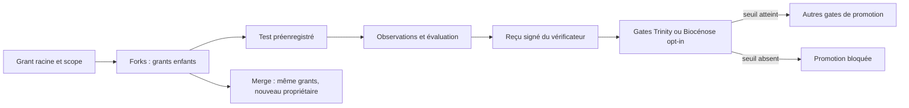

# Infini sous contrat — conserver le risque statistique dans une lignée

- **Statut** : Partiel — registre transactionnel et gates Trinity/Biocénose opt-in implémentés ; provenance des jeux et campagne empirique à qualifier.
- **Portée** : suites adaptatives de comparaisons statistiques appartenant à un périmètre explicite.
- **Dernière revue** : 2026-10-04.

## 1. Domaine et objectif

Multiplier les candidats, regarder les résultats à répétition et changer de
topologie crée des occasions supplémentaires de promouvoir une amélioration
illusoire. Un fork, un merge ou un rollback ne doit pas remettre à zéro le
budget de risque déjà engagé. Cette capacité conserve une enveloppe héritée
dans la lignée des tests et rend sa consommation auditable.

Le budget traite **un risque statistique défini**, par exemple la probabilité
de promouvoir au moins une fausse amélioration parmi une famille de tests.
Il ne remplace pas les preuves déterministes d'invariants, les contrôles de
sécurité ou l'évaluation du monde réel.

## 2. Modèle de risque

Pour un budget global `δ` et des allocations `α_i` prélevées avant chaque
test, une famille de tests individuellement valide satisfait :

```text
somme_i α_i ≤ δ
Pr(au moins une fausse promotion) ≤ somme_i α_i ≤ δ
```

La seconde ligne repose sur l'inégalité de l'union. Elle n'exige pas
l'indépendance des événements d'erreur entre tests. Elle exige en revanche
que chaque test tienne sa borne annoncée sous son protocole, sa sélection
adaptative et ses règles d'arrêt réels.

Le registre représente le budget en unités entières de `10⁻⁹`. Pour chaque
grant, l'invariant comptable est :

```text
initial = disponible + réservé + dépensé + délégué
```

Un fork délègue seulement une partie du disponible. Un test préenregistré
réserve des unités avant l'observation. Sa finalisation les déplace vers
`dépensé`, quel que soit le résultat. Une fusion transfère la propriété des
grants existants sans émettre un nouveau grant ; rollback et replay ne
remboursent rien.

## 3. Test séquentiel de la première tranche

Le reçu implémenté utilise une épreuve binaire appariée : `outcome = 1` si
le candidat gagne selon un critère préétabli, `0` sinon. Sous l'hypothèse
nulle conditionnelle `Pr(gain au prochain essai | passé) ≤ 1/2`, le facteur
de pari est `1,5` pour un gain et `0,5` pour une perte. Le produit `E_t`
est alors une surmartingale positive sous cette hypothèse. Le maximum
historique donne `p_anytime = 1 / max(1, max_t E_t)`. Le gate compare cette
valeur à l'allocation du test. Le calcul en log évite un débordement rapide.

Cette construction est valide sous arrêt facultatif **si** la condition sur
chaque prochain essai tient. Le logiciel vérifie les entrées binaires, les
références distinctes et recalcule le résultat ; il ne prouve pas que les
essais sont honnêtes, que les critères étaient fixés avant les observations
ou que les données d'évaluation sont indépendantes des choix de candidats.

## 4. Architecture technique



- [Registre](../../backend/src/services/morphogenesis/capabilities/riskLedgerService.js) : création, split, réservation, finalisation, fusion de propriété et bilan.
- [Reçu statistique](../../backend/src/services/morphogenesis/capabilities/statisticalReceipt.js) : calcul séquentiel, HMAC et vérification constante du contenu signé.
- [Gate](../../backend/src/services/morphogenesis/capabilities/statisticalPromotionGate.js) : résultat opt-in avant la préparation d'un artefact Trinity.
- [Promotion Trinity](../../backend/src/services/trinityComparativeBarrier.js) : refuse une promotion statistique sans test préenregistré et reçu admissible.
- [Promotion Biocénose](../../backend/src/services/biocenose/judgment/promotionGateService.js) : applique le contrat après ses gates factuels et de dissentiment ; un refus préalable ne consomme pas le test réservé.
- [Persistance](../../backend/src/db/migrations/migrateMorphogenesisCapabilities.js) : grants, tests et événements d'audit immuables.

SQLite `BEGIN IMMEDIATE` sérialise les transferts et réservations sur la
connexion ; les contraintes empêchent un solde négatif. Le même
`evaluationSetId` ne peut être réservé deux fois dans cette première
implémentation. L'HMAC exige `GENOS_STATISTICAL_RECEIPT_SECRET` d'au moins
32 caractères. Sans secret, l'émission et la vérification échouent fermées.

## 5. Processus d'exécution

1. Définir la famille de promotions, le critère binaire, l'hypothèse nulle,
   le protocole d'évaluation, le jeu de données et `δ` avant la campagne.
2. Créer un grant racine avec un `scope` explicite. Déléguer des unités aux
   branches avant leurs essais. Aucun enfant ne reçoit le total du parent
   après une dépense du parent.
3. Réserver chaque test avec identifiant, grant, allocation, hash de
   protocole et jeu d'évaluation. La réservation est idempotente pour le
   même contrat et refuse une réutilisation conflictuelle.
4. Un vérificateur backend contrôle les preuves d'observation et émet un
   reçu signé. Le moteur recalcule la statistique à partir des observations
   incluses ; une `pValue` librement fournie ne suffit pas.
5. Finaliser le test consomme l'allocation même si le seuil n'est pas atteint.
   Une mission Trinity peut fournir `trinityStatisticalContract` pour exiger
   ce résultat avant ses autres vérifications de promotion.
6. Vérifier `grantBalance` et les événements de lignée après fork, fusion,
   replay ou reprise. Le registre ne possède pas d'opération de remboursement.

## 6. Exemple et comptabilité

Un grant racine de 0,1 délègue 0,02 et 0,03 à deux mondes. Le parent garde
0,05. Le premier monde réserve 0,01 puis termine un test négatif ; ses 0,01
sont dépensés. Si les mondes fusionnent, les 0,01 disponibles du premier et
les 0,03 du second restent dans leurs grants respectifs, maintenant détenus
par le nœud fusionné. Aucun nouveau 0,05 n'apparaît.

## 7. Validation

Le [test de contrat](../../backend/tests/test_morphogenesis_capabilities.js)
exerce split, réservation idempotente, refus de double usage d'un jeu,
falsification d'un reçu, test positif, test négatif, fusion de propriété et
conservation des comptes. Les tests de promotion Trinity existants restent
applicables à leur chemin sans contrat statistique.
Le [test de seconde tranche](../../backend/tests/test_morphogenesis_capabilities_phase2.js)
vérifie qu'un refus préalable Biocénose laisse la réservation intacte et
qu'un reçu admissible permet la promotion factuelle opt-in.

Une qualification empirique exige de longues campagnes répétées avec de
nombreuses modifications sans gain et quelques gains réels. Mesurer fausses
promotions par campagne, puissance de détection, coût d'évaluation et
épuisement tardif du budget. Ajouter concurrence, fork, merge, replay et
crash à chaque étape transactionnelle. Le taux observé doit être comparé à
la borne annoncée avec des intervalles d'incertitude.

## 8. Alternatives et série géométrique

Une suite telle que `α_n = δ φ^-(n+2)` est sommable à `δ` ; elle peut donc
être proposée par un allocateur futur. Le registre n'impose pas φ. Son
allocation devient vite petite pour les tests tardifs. Comparer des suites
plus lentes ou des politiques adaptatives correctement justifiées avant de
fixer une stratégie par défaut.

## 9. Limites et garde-fous

- Le HMAC protège l'origine et l'intégrité du reçu, pas la représentativité
  des données ni l'indépendance du vérificateur.
- Un même jeu réel renommé sous deux identifiants échappe à l'unicité SQL ;
  le contrôle de provenance des jeux reste indispensable.
- L'hypothèse `Pr(gain suivant | passé) ≤ 1/2` doit correspondre au protocole
  et à la définition de gain. Sinon la borne statistique annoncée ne tient pas.
- Les branchements concernent Trinity et Biocénose lorsqu'un contrat est
  fourni. Les autres topologies, archives et transferts entre installations
  restent à intégrer et à tester.
- Une preuve formelle de conservation des unités serait utile, mais ne
  remplacerait pas la validation du modèle statistique et des données.

## 10. Références internes

Voir [Morphogenèse](topologies/morphogenese.md), [Trinity](topologies/trinity.md),
[Épistémologie et évidence](../01-concepts/epistemologie-et-evidence.md) et
[ADR 0299](../adr/0299-capacites-transversales-morphogenese.md).
