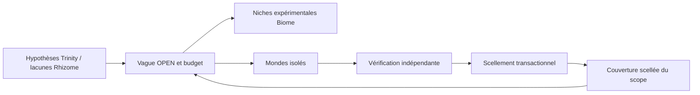

# Méristème épistémique — occuper des distinctions expérimentales

- **Statut** : runtime backend implémenté, activation par contrat explicite.
- **Portée** : sélection expérimentale Rhizome, hypothèses Trinity et niches Biome.
- **Dernière revue** : 2026-10-06.

## 1. Domaine et objectif

Une équipe peut avoir plusieurs spécialités et répéter la même erreur. Le méristème
sélectionne des expériences capables de distinguer les hypothèses encore ouvertes.
L'unité de diversité est le comportement expérimental annoncé : intervention,
outcomes discriminants, outils, prédictions et hypothèses de départ.

Une expérience proposée ne constitue pas une occupation. Seule une vague terminée,
vérifiée et scellée augmente la couverture utilisée pour la vague suivante.
L'analogie avec la croissance végétale décrit ce mécanisme ; elle ne mesure
aucune intelligence biologique et n'établit aucune supériorité scientifique.

## 2. Contrat et invariants

| Champ | Rôle |
| --- | --- |
| `experimentId`, `hypothesisId` | Identité de l'essai et hypothèse distinguée |
| `intervention`, `tools`, `sourceRefs` | Action, capacités et provenance accessibles |
| `predictions`, `discriminatingOutcomes`, `assumptions` | Différences observables déclarées |
| `verifierId` | Identité attendue du vérificateur |
| `utility`, `cost` | Classement et allocation du budget fini |
| `replicationOf`, `independentVerifierId` | Réplication d'un essai couvert, autre vérificateur |

Les identifiants d'une vague sont distincts. Les coûts sont finis et non négatifs.
Une réplication doit désigner un essai vérifié et un vérificateur différent ;
le vérificateur effectif doit correspondre à celui de son contrat.
Les preuves sont résolues dans le même `scopeId`, jamais dans un scope voisin.

## 3. Algorithme

`rankExperiments` normalise les contrats et calcule leur similarité comportementale
avec les occupations vérifiées. L'inhibition pénalise la couverture déjà présente.
La réplication indépendante conserve son utilité. `openWave` choisit ensuite les
contrats dans la limite du budget ; il refuse un budget qui n'autorise aucun essai.
Les poids constituent une politique configurable, pas une loi du nombre d'or.

## 4. Architecture technique

[experimentWaveRuntime](../../backend/src/services/morphogenesis/capabilities/experimentWaveRuntime.js)
persiste les vagues OPEN/SEALED. Le scellement exige tous les résultats et lie
chaque reçu à l'essai, son vérificateur, l'outcome déclaré et ses références.
La couverture et le reçu scellé sont écrits dans la même transaction.
[trinityMeristemBridge](../../backend/src/services/morphogenesis/capabilities/trinityMeristemBridge.js)
traduit les évaluations scientifiques persistées, vérifie leurs claims et leurs
preuves, et conserve le dissentiment. Un auteur de claim ne devient pas son
propre vérificateur. `trinityHypothesisGenerationService` peut classer les
hypothèses fournies via `normalMission.epistemicMeristem`.

[epistemicNicheRuntime](../../backend/src/services/morphogenesis/capabilities/epistemicNicheRuntime.js)
attribue les contrats aux niches Biome, avec capacités, sources, conditions d'entrée
et capacité de charge de un. `BiomeRuntime.step` reçoit `experimentWave`.
Le recrutement Rhizome conserve ses gates de lacune, budget et autorité.

## 5. Processus d'exécution

1. Définir le scope et les contrats à partir des hypothèses ouvertes.
2. Appeler `openWave` avec candidats, budget et résolveur interne.
3. Créer les mondes isolés, exécuter et vérifier leurs résultats.
4. Fournir à `sealWave` un résultat par contrat avec `verificationRef` et `evidenceRefs`.
5. Recalculer la couverture avant la vague suivante ; une preuve inaccessible est écartée.

`runWave(db, input, adapters)` orchestre ces étapes avec les adaptateurs
`createIsolatedWorld`, `execute` et `verify`. Les adaptateurs doivent assurer
l'isolation réelle ; le score ne leur donne aucune nouvelle autorité.
Un essai interrompu laisse la vague ouverte sans créer d'inhibition.

## 6. Exemple

Face à des doubles livraisons, verrou, transaction et cache peuvent tous supposer
une livraison unique. Un contrat de rejeu avec délais variés distingue cette
hypothèse. Une réplication avec un autre vérificateur reste admissible après
le scellement, même si son comportement recouvre celui du premier essai.

## 7. Activation et exploitation

L'opérateur local utilise `backend/bin/genos-capabilities.cjs`, opération
`meristem.open`, `meristem.seal` ou `meristem.seal-scientific`, avec `scopeId`.
Sans argument, le CLI affiche les opérations. Les artefacts sont déposés par
`artifact.put` puis résolus côté backend. Ces opérations ne sont pas de nouveaux
outils MCP exposés à tous les clients.

Une ouverture répétée sous le même identifiant est refusée. Une vague déjà
scellée renvoie son reçu ; changer ses résultats exige une nouvelle vague.

## 8. Validation et ablations

[test_capability_wave_runtime](../../backend/tests/test_capability_wave_runtime.js)
teste atomicité, preuve mal liée, absence d'inhibition anticipée, dissentiment,
scopes, immutabilité et réplication indépendante.
[test_capability_scientific_runtime](../../backend/tests/test_capability_scientific_runtime.js)
exerce le registre scientifique réel et refuse les claims mal associés.
Les tests des deux premières tranches restent inclus dans `test:capabilities`.

Le benchmark reproductible compare recrutement par rôle, diversité d'embeddings
synthétiques, DPP, inhibition comportementale et ablation sans inhibition.
Il utilise des causes cachées synthétiques et des budgets identiques ; il ne
qualifie pas encore des incidents industriels ni des modèles de langage.

## 9. Limites et garde-fous

Les contrats peuvent être incomplets. La validité des interventions dépend des
adaptateurs et des vérificateurs autorisés. Les mondes scellés ne partagent pas
de résultats pendant une vague. Les sources restent consultables ; leur absence
annule leur contribution à la couverture. Aucun classement n'autorise un spawn.

## 10. Références internes

Voir [Morphogenèse](topologies/morphogenese.md), [Trinity](topologies/trinity.md),
[Biome](topologies/biome.md), [Rhizome](topologies/rhizome.md),
[ADR initial](../adr/0299-capacites-transversales-morphogenese.md) et
[ADR runtime](../adr/0332-capacites-morphogenese-runtime.md).
