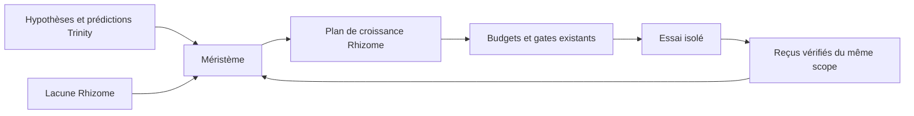

# Méristème épistémique — croissance par distinction expérimentale

- **Statut** : Partiel — couverture revalidée à la lecture et raccordée au plan Rhizome ; recrutement autonome, adaptation Trinity et calibration expérimentale à faire.
- **Portée** : missions à hypothèses concurrentes, avant l'allocation de workers.
- **Dernière revue** : 2026-10-04.

## 1. Domaine et objectif

Le méristème répond à une question plus précise que « quel rôle manque ? » :
**quelle observation pourrait encore départager des explications plausibles ?**
Une expérience n'occupe une niche que si une exécution vérifiée a effectivement
couvert cette distinction. Une affectation, une réponse textuelle ou un score de
diversité de modèles ne constituent pas cette couverture.

L'objectif est de réduire les erreurs communes à budget constant, sans éliminer
les réplications indépendantes nécessaires à la robustesse.

## 2. Contrat et modèle

`experiment()` normalise un contrat contenant `experimentId`, `hypothesisId`,
`verifierId`, prédictions, au moins deux résultats discriminants, hypothèses
auxiliaires, dépendances, outils, modes d'échec, utilité et coût. Le champ
`replicationOf` distingue une épreuve de réplication d'une exploration.

Pour le candidat `x`, le classement implémenté est :

```text
score(x) = utility(x) - inhibitionWeight × somme(similarity(x, couvert_i)) - cost(x)
```

La similarité est la moyenne des recouvrements de Jaccard des prédictions,
résultats discriminants, dépendances et modes d'échec. Ces dimensions sont
déclarées dans le contrat ; ce n'est pas une mesure démontrée de diversité
sémantique. Une réplication déclarée obtient une inhibition nulle, mais doit
être traitée par ailleurs avec un vérificateur indépendant.

Le classement est déterministe à score égal (`experimentId`). Les poids et
unités par défaut sont heuristiques. Leur calibration relève du benchmark.

## 3. Inspiration biologique et limite

L'inhibition locale de nouveaux primordia inspire la pénalité de couverture.
Le code ne simule ni auxine ni phyllotaxie géométrique. Un disque de tournesol
ne serait pas un modèle fidèle de l'espace des expériences de GenOS.

## 4. Architecture technique



- [Moteur de classement](../../backend/src/services/morphogenesis/capabilities/epistemicMeristem.js) : normalisation et similarité comportementale.
- [Stockage](../../backend/src/services/morphogenesis/capabilities/capabilityEvidenceStore.js) : reçus par `scopeId` dans `morph_experiment_coverage`.
- [Planificateur Rhizome](../../backend/src/services/rhizome/growth/growthPlanner.js) : sélection optionnelle lorsque `experimentalCoverageReceipts` est fourni.
- [Raccord Rhizome](../../backend/src/services/rhizome/growth/experimentalCoverageService.js) : charge les reçus du scope déclaré et revalide leurs artefacts avant `planGrowth`.
- [Contrat de croissance](../../backend/src/services/rhizome/contracts/growthCandidate.js) : transporte `experimentContract`.
- [Trinity](../../backend/src/services/trinityHypothesisDesignService.js) : fournit déjà hypothèses, prédictions et protocoles discriminants, sans traduction automatique vers tous les contrats du méristème.

Le stockage exige un statut `VERIFIED`, le `verifierId` prévu par le contrat,
un `verificationRef` et des références de preuve. Un résolveur interne doit
confirmer le reçu de vérification avant l'écriture. Il ne prouve pas à lui
seul la validité de l'expérience : son émetteur reste une frontière de
confiance à qualifier avant un recrutement autonome. Les reçus ne traversent
pas les mondes scellés pendant leurs essais.

## 5. Processus d'exécution

1. Construire des candidats à partir des hypothèses ouvertes et des lacunes
   de capacité. Chaque candidat doit déclarer ce qui distinguerait les
   hypothèses, pas seulement une spécialité de worker.
2. Fournir `experimentalScopeId`, une base et un résolveur d'artefacts à
   `planGrowth`. `loadVerifiedCoverage` écarte les reçus dont le témoin ou
   une preuve a disparu ; une liste fournie par l'appelant ne remplace pas
   la lecture du registre.
3. Classer par `rankExperiments`, puis présenter les candidats éligibles à
   Rhizome. Les contrôles de suffisance, budget, coût et preuve de lacune
   continuent à s'appliquer.
4. Exécuter dans une branche ou un monde isolé, faire vérifier le résultat,
   puis enregistrer la couverture avec `recordCoverage`.
5. Recalculer entre deux vagues expérimentales. Une expérience inactive ne
   crée pas de couverture.

## 6. Exemple

Dans un service qui traite parfois deux fois le même événement, trois workers
proposent un verrou, une transaction et un cache. Si tous présupposent une
livraison unique, le méristème préfère un rejeu contrôlé du même événement
avec délais variés. Un résultat vérifié peut ensuite couvrir cette niche ; une
réplication indépendante peut encore être choisie pour confirmer le constat.

## 7. Validation et comparaison

Le [test de contrat](../../backend/tests/test_morphogenesis_capabilities.js)
vérifie qu'un reçu simplement proposé n'inhibe pas une expérience, qu'une
couverture vérifiée modifie le classement et que la réplication est distincte.
Le [test de seconde tranche](../../backend/tests/test_morphogenesis_capabilities_phase2.js)
vérifie aussi qu'une preuve devenue inaccessible ne compte plus comme couverture.

Le benchmark à réaliser doit utiliser des incidents à causes cachées connues,
les mêmes modèles et le même budget. Baselines : recrutement par rôle,
similarité textuelle/embedding et sélection diversifiée. Mesures : causes
réellement identifiées, erreurs communes, coût par distinction utile et taux
de réplication concluante. Fixer les poids avant les campagnes tenues à part.

## 8. Comparaison avec des approches proches

Les méthodes de diversité de population optimisent un espace de comportements
défini à l'avance. Ici, l'unité sélectionnée est un **contrat de discrimination
expérimentale**, et l'occupation dépend d'un résultat vérifié. Cette différence
est une hypothèse d'architecture ; une contribution scientifique demanderait
une comparaison empirique et des définitions stables des comportements.

## 9. Limites et garde-fous

- Les dépendances et modes d'échec déclarés peuvent être incomplets ou faux.
- `VERIFIED` dans la table est une attestation du producteur, pas une preuve
  automatique que l'artefact est résolvable ni que le test était valide.
- La fonction de score n'autorise aucun spawn ; les frontières d'autorité et
  les gates de la morphogenèse gardent cette décision.
- Les mondes Trinity scellés ne reçoivent pas les découvertes des autres
  mondes durant une vague.
- L'adaptation des résultats Trinity vers la carte de couverture et
  l'allocation de niche Biome restent à implémenter et qualifier.

## 10. Références internes

Voir [Morphogenèse](topologies/morphogenese.md), [Trinity](topologies/trinity.md),
[Rhizome](topologies/rhizome.md) et [ADR 0299](../adr/0299-capacites-transversales-morphogenese.md).
