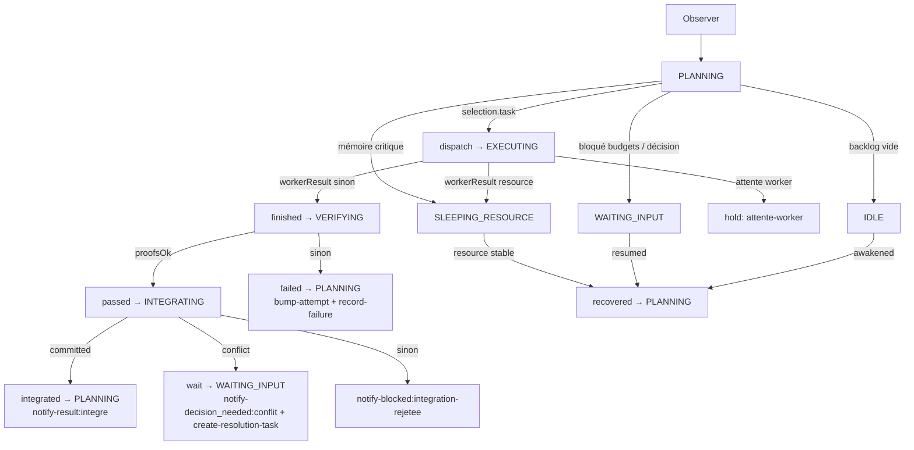
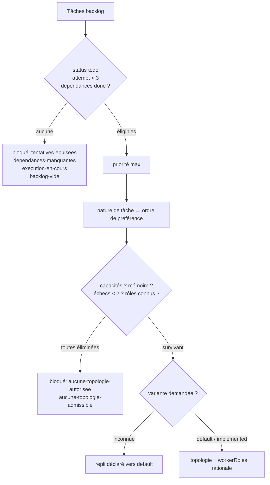

# Ontogenèse : boucle Observer → Réévaluer

- **Statut** : Partiel
- **Portée** : boucle de l'orchestrateur résident de projet (ADR 0235) : observer, planifier, sélectionner, exécuter, vérifier, intégrer, réévaluer, avec sélection des tâches et des topologies, autorisation, réveils et notifications.
- **Dernière revue** : 2026-10-01

## Contrat opérationnel courant — référence d'implémentation

Cette section décrit le chemin effectif du backend. Elle prévaut sur les exemples,
recommandations et projections des sections suivantes lorsqu'ils diffèrent.
Référence normative : [ADR 0235](../adr/0235-ontogenese-orchestrateur-resident-projet.md).
Un transport réussi n'est pas une preuve de décision valide.

Conventions de marquage utilisées dans cette fiche :

- **Implémenté** : comportement porté par du code existant (chemin de fichier cité).
- **Partiel** : contrat ou première tranche présente, câblage d'exécution manquant.
- **Cadre conceptuel** : décision ADR sans code correspondant dans le dépôt.

Le contrôleur de boucle est pur : il décide un événement machine et des effets
à appliquer, sans E/S. L'appelant persiste, notifie et dispatche
(**Implémenté** — `backend/src/services/ontogenesis/loopController.js`, lignes 1-9).
Le CLI `run` et `tick` injecte désormais `runtimeHarness` : une opération persistée
précède le lancement du runtime, les budgets sont réservés et une seule opération
reste active par projet. Les contrats sans harnais restent utilisables en tests.
L’intégration exécute les vérifications configurées dans la capsule puis dans un
worktree sur la branche dédiée, avec preuves liées à une empreinte du contenu.
Référence de ce câblage : [ADR 0238](../adr/0238-execution-et-integration-ontogenese.md).

`init --config fichier.json` accepte les commandes `checks` structurées
(`program`, `args`) et la configuration du fournisseur. `start` modifie l’intention ;
`run --project ID` maintient le processus résident. Le script autostart appelle `run`.
Pause, arrêt et pression critique suspendent les workers détenus ; le réveil requiert
une mémoire normale pendant `memory.recoveryStableMs` (10 secondes par défaut).
L’admission mémoire est mesurée, sans garantie physique instantanée de RAM.
Les budgets terminés débitent conservativement toute leur réservation une seule fois.
La sélection de topologie transmise au runtime ne prouve pas l’exécution des huit
topologies. Aucun fournisseur externe n’est exécuté par les tests de parcours.

## 1. La boucle : phases, entrées/sorties, événements et effets

Machine à états (**Implémenté** — `backend/src/services/ontogenesis/stateMachine.js`) :

- États : `INITIALIZING`, `PLANNING`, `EXECUTING`, `VERIFYING`, `INTEGRATING`,
  `SLEEPING_RESOURCE`, `WAITING_INPUT`, `IDLE`, `PAUSED`, `STOPPING`, `STOPPED`.
- Transitions (`TRANSITIONS`, lignes 23-35 de `stateMachine.js`), notamment :
  - `PLANNING` : `dispatch → EXECUTING`, `wait → WAITING_INPUT`, `idle → IDLE`,
    `resource → SLEEPING_RESOURCE`, `paused → PAUSED`, `stopped → STOPPING`.
  - `EXECUTING` : `finished → VERIFYING`, `resource → SLEEPING_RESOURCE`, `paused`, `stopped`.
  - `VERIFYING` : `passed → INTEGRATING`, `failed → PLANNING`, `resource`, `wait`, `paused`, `stopped`.
  - `INTEGRATING` : `integrated → PLANNING`, `idle → IDLE`, `resource`, `wait`, `paused`, `stopped`.
  - `SLEEPING_RESOURCE` : `recovered → PLANNING`. `WAITING_INPUT` : `resumed → PLANNING`.
    `IDLE` : `awakened → PLANNING`. `PAUSED` : `resumed → PLANNING`, `stopped → STOPPING`.

Décision pure par état (**Implémenté** — `backend/src/services/ontogenesis/loopController.js`) :

| Phase (état) | Entrées (`snapshot`) | Sortie (événement + effets) | Emplacement |
| --- | --- | --- | --- |
| Observer / initialiser (`INITIALIZING`) | — | `{ event: 'planned' }` | `stepInitializing` |
| Planifier (`PLANNING`) | `budgetsOk`, `memoryLevel`, `selection` | `budgetsOk=false` → `{ event: 'wait', effects: ['notify-blocked:budgets-epuises'] }` ; `memoryLevel='constrained'` → `{ hold: true, reason: 'ressources-contraintes' }` ; `selection.task` → `{ event: 'dispatch' }` ; sélection bloquée `backlog-vide` → `{ event: 'idle' }` ; sinon `{ event: 'wait', effects: ['notify-decision_needed:<raison>'] }` | `stepPlanning`, `selectionBlocked`, `waitBlocked`, `waitDecision` |
| Sélectionner | voir §2 et §3 | produit `snapshot.selection` consommé par `stepPlanning` (**Partiel** : câblage appelant à brancher) | `taskSelector.js`, `topologySelector.js` |
| Exécuter (`EXECUTING`) | `workerResult` | absent → `{ hold: true, reason: 'attente-worker' }` ; `'resource'` → `{ event: 'resource' }` ; sinon `{ event: 'finished' }` | `stepExecuting` |
| Vérifier (`VERIFYING`) | `proofsOk` | `true` → `{ event: 'passed' }` ; `false` → `{ event: 'failed', effects: ['bump-attempt', 'record-failure'] }` — une tâche sans preuves suffisantes reste non vérifiée, jamais promue | `stepVerifying` |
| Intégrer (`INTEGRATING`) | `integration` | `'committed'` → `{ event: 'integrated', effects: ['notify-result:integre'] }` ; `'conflict'` → `{ event: 'wait', effects: ['notify-decision_needed:conflit', 'create-resolution-task'] }` ; sinon `notify-blocked:integration-rejetee` | `stepIntegrating` |
| Réévaluer / tenir (`SLEEPING_RESOURCE`, `WAITING_INPUT`, `IDLE`, `PAUSED`, `STOPPING`, `STOPPED`) | `snapshot.state` | `{ hold: true, reason: 'attente-<etat-minuscule>' }` | `stepHolding` |
| Préemption globale | `controlMode`, `memoryLevel` | `controlMode='paused'` → `paused` ; `'stopping'`/`'stopped'` → `stopped` ; `memoryLevel='critical'` → `{ event: 'resource' }`, quel que soit l'état | `controlEvent`, `stepLoop` |

État inconnu : `{ hold: true, reason: 'etat-inconnu' }` (**Implémenté** — `stepByState`).

Vocabulaire d'effets exact (chaînes produites par le contrôleur, appliquées par l'appelant) :
`notify-blocked:<raison>`, `notify-decision_needed:<raison>`, `notify-result:integre`,
`bump-attempt`, `record-failure`, `create-resolution-task` (**Implémenté** — `loopController.js`).

## 2. Sélecteur de tâches

Sélection déterministe de la prochaine tâche (**Implémenté** —
`backend/src/services/ontogenesis/taskSelector.js`) :

- Éligibilité (`isRunnable`) : `status === 'todo'`, `attempt < MAX_ATTEMPTS`,
  toutes les dépendances (`depends_on_json`, tableau d'identifiants) au statut `done`.
  Dépendances illisibles (`JSON.parse` en échec ou non-tableau) valent liste vide.
- Priorité : parmi les éligibles, la plus grande `priority` gagne (`topPriority`,
  tri `right.priority - left.priority`).
- Borne : `MAX_ATTEMPTS = 3`. Une tâche épuisée ne replanifie jamais seule
  (elle est exclue de `isRunnable` et signalée par `blockedReason`).
- Raisons de blocage explicites (`blockedReason`, ordre de test fixe) :
  `tentatives-epuisees` (au moins une `todo` avec `attempt >= 3`) >
  `dependances-manquantes` (au moins une `todo` restante) >
  `execution-en-cours` (au moins une `doing`) >
  `backlog-vide` (sinon, y compris liste vide).
- Sortie : `{ task }` si au moins une éligible, sinon `{ blocked: <raison> }`
  (`selectNextTask`).

## 3. Sélecteur topologies / workers

Sélecteur déterministe topologie + rôles workers (**Implémenté** —
`backend/src/services/ontogenesis/topologySelector.js`) : préférence par nature
de tâche, filtres d'autorisation, de capacités réelles, de ressources et d'échecs.
Les rôles sont validés par `workerKindService` (fail-closed) et les variantes
par le catalogue de morphogenèse, avec repli déclaré.

### 3.1 Matrice exacte (`CATALOG`)

| Topologie | Besoins (`needs`) | Rôles workers (`roles`) | Coût (`cost`) |
| --- | --- | --- | --- |
| `trinity` | `execute`, `verify` | `specialist`, `bounded_worker`, `verifier_worker` | 2 |
| `a_team` | `execute`, `coordinate` | `sub_orchestrator`, `specialist`, `bounded_worker`, `verifier_worker` | 2 |
| `biocenose` | `execute`, `verify`, `coordinate` | `liaison_worker`, `bounded_worker`, `verifier_worker` | 2 |
| `holobionte` | `execute`, `verify` | `specialist`, `symbiotic_worker`, `verifier_worker` | 3 |
| `syncytium` | `execute`, `analyze` | `specialist`, `bounded_worker`, `verifier_worker` | 3 |
| `biome` | `execute`, `observe` | `adaptive_worker`, `scout_cell` | 1 |
| `rhizome` | `execute`, `observe` | `bounded_worker`, `scout_cell` | 1 |
| `metapopulation` | `execute`, `verify` | `bounded_worker`, `verifier_worker` | 2 |

`compatibilityMatrix()` expose pour chaque entrée `topology`, `needs`,
`workerRoles`, `costClass` (**Implémenté**).

### 3.2 Ordres de préférence par nature de tâche (`PREFERENCES`)

- `implement` : `a_team`, `trinity`, `rhizome`, `biome`, `metapopulation`, `syncytium`, `biocenose`, `holobionte`.
- `verify` : `biocenose`, `trinity`, `metapopulation`, `a_team`, `syncytium`, `holobionte`, `rhizome`, `biome`.
- `explore` : `rhizome`, `biome`, `metapopulation`, `trinity`, `a_team`, `biocenose`, `syncytium`, `holobionte`.
- `decide` : `biocenose`, `trinity`, `holobionte`, `metapopulation`, `a_team`, `syncytium`, `rhizome`, `biome`.
- `repair` : `a_team`, `biome`, `metapopulation`, `rhizome`, `trinity`, `syncytium`, `biocenose`, `holobionte`.
- Nature inconnue : ordre = `allowedTopologies` tel quel (`preferenceOrder`).

### 3.3 Filtres, justifications, repli

- Élimination (`elimination`, dans l'ordre) : capacité manquante
  (`capacite-manquante:<besoin>`, premier besoin de `needs` absent de
  `availableCapabilities`) ; mémoire `constrained` et coût ≥ 3
  (`tache-lourde-reportee`) ; mémoire `critical` (`memoire-critique`) ;
  échecs répétés (`echecs-repetes`, `FAILURE_LIMIT = 2` échecs sur la topologie).
  Chaque élimination est journalisée `<id>:elimine:<raison>` dans `rationale`.
- Blocage : aucune topologie autorisée → `aucune-topologie-autorisee` ;
  toutes éliminées → `aucune-topologie-admissible`.
- Rôles : chaque rôle du gagnant est résolu par `resolveWorkerKind` ;
  échec → blocage `role-worker-inconnu` (**Implémenté** — `validateRoles`).
- Variante : `default` ou absente → `{ variant: 'default' }` sans note ;
  variante demandée cherchée dans `morphogenesis/registry/variantCatalog`,
  retenue seulement si maturité `implemented`, sinon repli déclaré
  `variante-indisponible:<demandee>` ; catalogue inaccessible →
  `catalogue-indisponible`. Le repli est journalisé `<id>:repli:<note>`.
- Gagnant : premier survivant de l'ordre de préférence ; justification
  `<id>:retenu:cout-<cout>` (**Implémenté** — `selectTopology`).

## 4. Autorisation vs vérification

Autoriser n'est pas prouver (**Implémenté** pour l'autorisation préalable —
`backend/src/services/ontogenesis/authorizationService.js` ; **Implémenté**
pour les vérifications indépendantes via `proofService.js` et `integrationController.js`) :

- Périmètre pré-autorisé (`authority` de la configuration versionnée) :
  branches autorisées (`isBranchAllowed`, `*` accepté), chemins autorisés
  (`isPathAllowed`, `*` ou préfixe normalisé avec frontière de segment), drapeaux `allowEdit`
  (`edition-non-autorisee`), `allowTests` (`tests-non-autorises`), `allowCommit`
  (`commit-non-autorise`) — `isActionAllowed`.
- Refus catégoriques : `scope: 'push'` → `push-non-autorise`,
  `scope: 'merge'` → `fusion-non-autorisee`, même dans la branche dédiée
  (`checkPushMerge`). Hors branche → `branche-hors-perimetre` ; hors chemin →
  `chemin-hors-perimetre`.
- Demande d'approbation hors périmètre : toute action hors périmètre crée une
  demande précise au lieu d'être exécutée (**Partiel** : persistance du
  `pending` portée par `requestApproval` vers `ontogenesis_approval_requests`
  dans `backend/src/services/ontogenesis/notificationService.js` ; la boucle ne
  tranche pas l'approbation elle-même, elle attend en `WAITING_INPUT`).
- Gates après coup : les résultats sont toujours vérifiés ensuite
  (**Implémenté** : `VERIFYING`, commandes configurées, empreinte du contenu,
  nouvelle vérification en intégration ; refus des preuves vides ou en échec).

## 5. Réveils autonomes

Politique de réveil pure (**Implémenté** —
`backend/src/services/ontogenesis/wakeupPolicy.js`) combinée à la machine
(**Implémenté** — `allowsAutoWake` dans `stateMachine.js` : seul
`SLEEPING_RESOURCE` autorise un réveil auto).

Table des 6 événements (`WAKE_EVENTS = ['git', 'worker_done', 'resource', 'deadline', 'user_reply', 'wake']`) :

| État \ Événement | `git` | `worker_done` | `resource` (stable) | `resource` (instable) | `deadline` | `user_reply` | `wake` |
| --- | --- | --- | --- | --- | --- | --- | --- |
| `PAUSED` | non (`pause-manuelle`) | non | non | non | non | non | non |
| `STOPPING` / `STOPPED` | non (`arret-en-cours` / `arrete`) | non | non | non | non | non | non |
| `SLEEPING_RESOURCE` | non (`ressource-attendue`) | non | **oui** | non (`ressource-instable`) | non | non | non |
| `WAITING_INPUT` | non (`reponse-attendue`) | non | non | non | non | **oui** | non |
| autres attentes (`IDLE`, etc.) | oui | oui | oui | oui | oui | oui | oui |

Règles : type inconnu ou absent → `{ wake: false }` sans raison ; `PAUSED`
jamais auto-réveillé, même sur `user_reply` (le test l'exige :
`shouldWake('PAUSED', { type: 'user_reply' })` → `wake: false`).

## 6. Délégation suivie et retour opérateur sobre

- **Partiel** — boîte de réception, mémoire continue et notifications existent
  en persistance, sans boucle d'exécution câblée dans les fichiers lus :
  - Mémoire avec provenance (**Implémenté** —
    `backend/src/services/ontogenesis/memoryService.js`) : espèces
    `preference`, `decision`, `constraint`, `failure`, `question`
    (`MEMORY_KINDS`) ; `recordMemory` refuse toute autre espèce
    (`memory-kind-invalide`) ; `listFailures` lit les échecs avant choix d'approche.
  - Exclusion mutuelle (**Implémenté** —
    `backend/src/services/ontogenesis/claimService.js`) : un seul détenteur
    par projet (`ontogenesis_claims`), expiration contre les morts,
    `operation_id` idempotent contre les doubles dispatchs ; reprise sans
    double worker par expiration puis vol du claim expiré.
  - Notifications sobres (**Implémenté** —
    `backend/src/services/ontogenesis/notificationService.js`) : espèces
    `result`, `blocked`, `decision_needed` (`NOTIFICATION_KINDS`), toute autre
    espèce refusée ; `notify`, `listPendingNotifications` (statut `pending`),
    `markNotified`. Silence pendant les périodes sans changement
    (**Cadre conceptuel** : aucune politique d'envoi câblée ici, seuls les
    effets `notify-*` de la boucle la déclenchent).
- Retour opérateur : notification sur résultat significatif, blocage ou décision
  nécessaire ; une tâche terminée sans preuves suffisantes reste non vérifiée,
  jamais promue (**Partiel** : événements et effets définis, transport
  d'exécution à brancher).

## 7. Schémas

### 7.1 Boucle

### 7.2 Décision de sélection (tâche puis topologie)

## 8. Exemples d'exécution tirés des tests

Exemples ci-dessous extraits des tests (**Implémenté** — comportements vérifiés
par `backend/tests/test_ontogenesis_loop.js` et
`backend/tests/test_ontogenesis_selection.js`) :

- Dépendance contre priorité : `a` (priorité 1, sans dépendance) gagne contre
  `b` (priorité 5, dépend de `a`) ; une fois `a` à `done`, `b` est sélectionnée.
- Borne de tentatives : `attempt: 3` avec `MAX_ATTEMPTS = 3` →
  `{ blocked: 'tentatives-epuisees' }` ; backlog vide → `{ blocked: 'backlog-vide' }`.
- Planification : `PLANNING` + `budgetsOk: true` + `selection.task` →
  `dispatch` ; `budgetsOk: false` →
  `{ event: 'wait', effects: ['notify-blocked:budgets-epuises'] }` ;
  `memoryLevel: 'constrained'` → `hold` ; `memoryLevel: 'critical'` en
  `VERIFYING` avec preuves → `resource`.
- Exécution / vérification / intégration : `EXECUTING` sans `workerResult` →
  `hold` ; `workerResult: 'done'` → `finished` ; `VERIFYING` sans preuves →
  `{ event: 'failed', effects: ['bump-attempt', 'record-failure'] }` ;
  `INTEGRATING` en `conflict` → `wait` avec `create-resolution-task`.
- Contrôle : `controlMode: 'paused'` en `EXECUTING` → `paused` ;
  `allowsAutoWake('PAUSED')` → `false`, `allowsAutoWake('SLEEPING_RESOURCE')` → `true`.
- Topologies : `implement` parmi `trinity`/`a_team`/`rhizome` avec toutes
  capacités → `a_team` (`a_team:retenu`) ; sans `coordinate` → repli `rhizome`
  (`capacite-manquante:coordinate`) ; `decide` contrainte entre `holobionte`
  (coût 3) et `biocenose` → `biocenose` ; 2 échecs `rhizome` →
  `aucune-topologie-admissible` (`echecs-repetes`) ; variante `inexistante-xyz`
  → `default` avec note de `repli`.
- Réveils : `PAUSED` + `user_reply` → pas de réveil ;
  `SLEEPING_RESOURCE` + `resource` stable → réveil ;
  `SLEEPING_RESOURCE` + `git` → pas de réveil.

## 9. Limites et non-objectifs

- Dispatch réel raccordé par le CLI à `runtimeHarness` et `ontogenesisMissionRunner.cjs`.
  Le contrôleur décide (`dispatch`, `finished`, `passed`, `failed`,
  `integrated`), il n'exécute pas lui-même : aucune E/S, aucun appel modèle,
  aucun lancement de worker dans `loopController.js`, `taskSelector.js`,
  `topologySelector.js`, `wakeupPolicy.js` (vérifié par lecture).
  Le runtime conserve ses propres gates ; le choix des huit topologies n’est
  pas certifié par les tests de parcours avec worker injecté.
- Compositions morphogénétiques avancées réutilisées par contrat, pas
  réimplémentées (**Cadre conceptuel** dans ce périmètre). Conformément à
  l'ADR 0235 §2, le contrôleur passe par `morphogenesis/*`, les adaptateurs
  (`trinityBranchAdapter.js`, `rhizomeBranchAdapter.js`), `workerKindService.js`
  et les gates de preuves ; cette fiche ne décrit que le contrat utilisé
  (validation des rôles, catalogue de variantes), pas les huit topologies
  branchées de bout en bout — l'ADR prévoit de commencer par une seule topologie.
- Mesure Windows, intégrateur Git, lancement interprocessus et autostart sont
  raccordés (ADR 0238). Les Job Objects et l’hébergement distant restent hors périmètre.
- Aucune promotion sans preuves exécutables portant sur le résultat intégré ;
  un succès de transport ne vaut jamais validation (**Implémenté**,
  règle permanente du dépôt).
