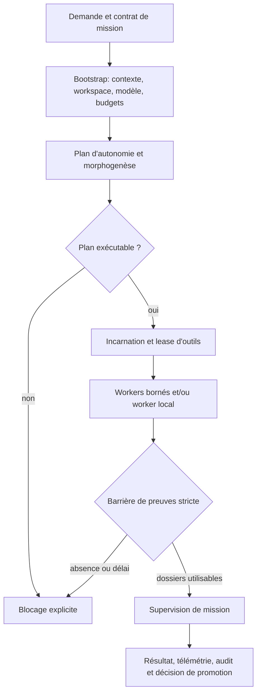
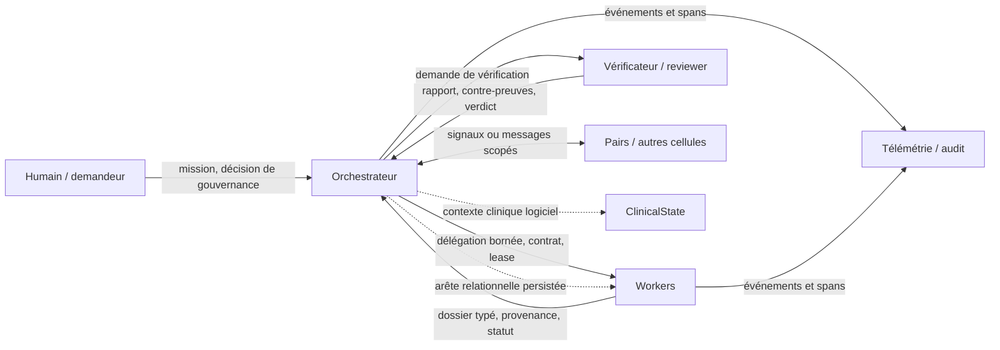

# Protocole d'exécution multi-agents

- **Statut** : référence opérationnelle avec niveaux de preuve explicités.
- **Portée** : cycle d'une mission, budgets, topologies, workers, communication,
  relations, nosologie, observabilité et protocole d'évaluation.
- **Dernière revue** : 2026-10-04.

Ce document décrit le runtime observé dans le dépôt. Les mentions « implémenté »
indiquent un chemin de code identifié; elles ne prouvent pas que chaque mission
l'emprunte. « Partiel » signifie qu'un contrat ou un service existe sans liaison
universelle. « Heuristique » désigne un calcul non calibré. Les analogies
biologiques sont des états logiciels, pas des mesures biologiques ou médicales.

## 1. Vue d'ensemble

Le point essentiel est la barrière de preuves : un worker lancé, un modèle qui
répond ou un outil qui retourne `ok` ne suffisent pas à établir la réussite.
L'issue doit respecter le contrat, le format d'artefact, la provenance et les
gates propres à la mission.

## 2. Cycle d'exécution

Le chemin standard `agentRuntimeAdapter/missionExecution.js` suit cet ordre :

1. Initialiser le contexte et résoudre le contrat de mission.
2. Préparer le workspace et le modèle.
3. Normaliser et contrôler la cohérence des budgets.
4. Provisionner la capsule, activer le suivi d'hallucinations et planifier.
5. Refuser un plan bloqué; incarner l'orchestrateur si le plan passe.
6. Joindre le contexte mémoire, appliquer la politique et imposer le lease.
7. Calculer le budget runtime, créer le run et annoncer le démarrage.
8. Exécuter le worker en processus local ou orchestrer les workers autonomes.
9. Si des workers autonomes ont été créés, exiger leurs dossiers par la barrière
   stricte; `WORKER_BARRIER_NO_EVIDENCE` et `WORKER_BARRIER_TIMEOUT` bloquent.
10. Superviser la mission, puis émettre les événements de résultat et de suivi.

Le plan morphogénétique peut être joint au plan d'autonomie. Le mode shadow
(`GENOS_MORPHOGENESIS_V2_SHADOW`) n'engage pas la proposition. Il ne faut pas
confondre composition d'une topologie avec lancement de ses workers : certaines
compositions créent seulement une session ou des membres opérables.

## 3. Carte des agents et de leurs liens

Une relation (parent, manager, collaborateur, etc.) est une arête orientée
persistée. Elle n'est ni un canal, ni une preuve, ni une délégation d'autorité
effective par elle-même. L'autorité pratique vient du contrat worker, de la
politique de mission et du lease. Les presets numériques de relations sont des
valeurs heuristiques et ne sont pas calibrés comme mesures de confiance ou
d'indépendance. Seuls certains chemins consultent actuellement ces relations.

## 4. Topologies et variants

Le runtime expose huit topologies : **Trinity, A-Team, Biome, Biocénose,
Holobionte, Syncytium, Rhizome** et **Métapopulation**. Les parcours Trinity et
A-Team sont dédiés; les six autres passent par la composition biologique, avec
des différences d'opérabilité et de persistance. Les contrats de capacités
restent déclaratifs quand aucun appel runtime ne les applique.

Le catalogue Morphogenèse compte les variants spécifiques suivants, hors
`default` :

| Topologie | Variants | Lecture opérationnelle |
|---|---:|---|
| A-Team | 11 | Runtimes et politiques dédiés; couverture variant par variant à vérifier. |
| Biocénose | 12 | Mécanismes communautaires; niveau de complétude varie par variant. |
| Holobionte | 12 | Contrats et plans sélectionnables; moteurs/adaptateurs manquants selon le mécanisme. |
| Syncytium | 13 | Sessions persistées et opérations CRDT; cela ne garantit pas un appel dans chaque mission. |
| Rhizome | 12 | Sessions et dépôt/routage directs; pas de routage multi-hop automatique établi. |
| Métapopulation | 16 | 12 identifiants décrits + 4 alias historiques; mécanismes partiels. |
| Biome | 11 | Sessions, opérations et boucle de mission vérifiable; actions réelles soumises aux gates. |
| Trinity | 12 | Adaptateurs dédiés; présence au catalogue ne prouve pas un cycle complet validé. |

Un variant répertorié n'est pas automatiquement sélectionné par le planner. La
résolution et la maturité sont documentées dans le [catalogue morphologique](topologies/variants-morphologiques.md)
et les raccordements dans [topologies et capacités](topologies-et-capacites.md).
Les 12 variants Biocénose peuvent être classés exécutables au sens des chemins
runtime et tests déterministes; cela ne garantit ni les réponses d'un modèle
réel, ni les preuves indépendantes d'une mission donnée.

## 5. Workers, contrats et rôles

Le registre Node définit 19 `WorkerKind` : `scout_cell`, `resident_daemon`,
`bounded_worker`, `adaptive_worker`, `specialist`, `procedural_executor`,
`symbiotic_worker`, `verifier_worker`, `red_worker`, `experimental_worker`,
`formal_worker`, `synthesis_worker`, `creative_worker`, `medical_worker`,
`recovery_worker`, `forensic_worker`, `liaison_worker`, `teaching_worker` et
`sub_orchestrator`.

Le type est distinct du rôle de mission. Le sélecteur combine les capacités
requises par le rôle et la méthode; une capacité absente ou une méthode inconnue
sans contrat échoue fermé. Le contrat détermine capacités, autorité, limites,
artefact attendu et règles de preuve. Les leases restent limités à la liste
d'outils connue. Le worker répond par un dossier typé (par exemple observation,
rapport de vérification, certificat ou synthèse avec provenance). Les presets
Rust et Node ont des sémantiques distinctes; voir [types de workers](../03-reference/types-de-workers.md).

## 6. Budget, temps et modèles

Il n'existe pas un seul budget global exprimé dans une unité commune. Les
contrôles pertinents sont superposés :

| Ressource | Valeur observée dans le code | Portée / limite |
|---|---|---|
| Part cognitive worker | Par défaut, budget parent × `0.6`, divisé par nombre de workers. | Allocation cognitive; pas une garantie de tokens modèle. |
| Réserve orchestrateur | Part déclarée dans `executionBudget` ou `tokenPolicy`; les parts doivent être cohérentes. | Pour un plan, le runtime réserve `total × orchestratorReserve`. |
| Événements de capsule | `executionBudget.events || 100`. | Nombre d'événements de capsule, pas durée murale. |
| Barrière workers | Si seul `timeoutMs` est fourni, défaut `max(2000, floor(timeoutMs × 0.45))`. | Délai propre à l'attente de preuves workers. |
| Appel modèle routeur | Défaut 30 000 ms, ou `timeoutMs` fourni; `deadlineMs`/`deadlineAt` peuvent fixer l'échéance. | Par appel/route; retry et fournisseur influencent le temps total. |
| Appel Biocénose | Défaut 60 000 ms et 2 500 tokens max par invocation. | Valeurs du service d'invocation, surchargeables. |
| Profil worker Rust | Socle documenté 8 000 tokens, 300 000 ms et 60 000 ms CPU. | Contrat Rust; ce n'est pas automatiquement un plafond Node/runtime. |
| Coût monétaire | Estimé depuis les tarifs `provider_configs` et tokens si configurés. | Une estimation de route n'est pas toujours un plafond cumulé de mission. |

En conséquence, le temps global peut excéder le délai d'un appel modèle si une
mission enchaîne plusieurs appels. Les plafonds doivent être enregistrés avec
leur portée : run, worker, appel, barrière ou capsule. Le routeur peut appliquer
une préférence locale stricte (`preferLocal`) qui échoue sans candidat local,
sauf fallback cloud explicitement permis.

## 7. Échanges et moyens de communication

Les huit niveaux répertoriés (indices 0 à 7 dans le catalogue) vont du silence vers l'escalade humaine :

1. silence;
2. stigmergie (trace environnementale);
3. signal sans texte (ligand, voltage, phéromone, plasmide, tenseur);
4. message direct structuré;
5. dialecte compilé;
6. micro-utterance (un tour, budget indicatif 200 tokens);
7. dialogue borné (jusqu'à 8 tours, 2 000 tokens et artefact obligatoire);
8. confirmation humaine pour les décisions critiques.

Le choix suit le principe du silence par défaut et une progression de grounding :
`none → transport_ack → semantic_ack → action_ack → verified_ack → human_confirmation`.
Un accusé de transport ne valide pas le sens ou l'action. Les limites de tours
et tokens sont des contrats du dialogue, tandis que le coût de communication
est en partie une projection heuristique. L'enveloppe versionnée est reliée au
Signal Plane et aux messages d'organisation; les adaptateurs généraux et la
mesure réelle de tokens ne sont pas raccordés partout. Voir [communication](communication.md).

## 8. Utilisation de la nosologie

La nosologie regroupe des marqueurs cliniques simulés de l'état des agents. Le
backend stocke un `ClinicalState` par agent (vitals, indice inflammatoire,
charge pathogène, état de cycle, bien-être, etc.). L'assemblage du contexte
d'expression peut charger ce résumé; les services de surveillance peuvent
scanner l'état persistant, créer des détections/quarantaines et consigner des
événements. La détection, le diagnostic, la thérapie et l'application effective
sont des étapes distinctes; il n'existe pas de scan clinique automatique dans
chaque chemin de mission.

Dans le runtime Rust, certaines transformations systémiques déterministes sont
appelables explicitement. La documentation nosologique indique qu'aucun
chaînage universel diagnostic → thérapie n'est attesté; la commande biomimétique
échoue fermé tant que son exécuteur persistant n'est pas branché. Ces marqueurs
ne diagnostiquent pas une personne et les noms des thérapies ne sont pas des
recommandations médicales. Référence : [vue d'ensemble nosologique](../01-concepts/nosologie/vue-ensemble.md).

## 9. Télémétrie, traces et audit

`TelemetryObserver` diffuse les événements vers un ring buffer en mémoire de
10 000 entrées, les abonnés SSE et une file de persistance asynchrone. La file
par défaut accepte jusqu'à 4 096 entrées (`GENOS_TELEMETRY_QUEUE_CAPACITY`);
si elle déborde, l'événement le plus ancien de cette file est écarté et le
compteur `droppedEvents` augmente. Une file non persistée n'est donc pas une
preuve durable. Les clés sensibles (token, secret, mot de passe, autorisation,
cookie, credential) sont expurgées du payload d'observabilité.

Les tables d'historique comprennent notamment `telemetry_events`, `trace_spans`,
`model_job_tokens` et `audit_logs`, avec rétentions configurables et plafonds
par défaut respectifs de 100 000, 100 000, 500 000 et 100 000 lignes. Les traces
peuvent porter le contexte de trace; le routeur modèle collecte selon le chemin
les tokens, latence, modèle servi et coût estimé. Le flush est borné et la
persistance peut échouer; vérifier ses compteurs/événements avant d'affirmer
qu'une trace est durable. `GENOS_MCP_TELEMETRY_FILE` active aussi un flux NDJSON
de processus.

## 10. Protocole de preuve d'une mission

Pour annoncer « réussi », enregistrer au minimum :

- l'identifiant de mission, le prompt/variant et la complexité;
- topologie, politique sélectionnée, versions du runtime et du modèle;
- composition des workers, types, lignages déclarés et leases;
- budgets et délais avec leur portée et les valeurs réellement consommées;
- horodatages de début/fin et chaque phase/blocage;
- réponses structurées et dossiers avec provenance;
- reçu de vérification indépendant, s'il est requis; sinon l'état reste non vérifié;
- événements et traces persistés, ou signalement explicite d'une télémétrie perdue;
- décision finale : réussite vérifiée, résultat partiel, revue humaine requise,
  échec ou blocage.

Ne pas présenter une simulation, un test de schéma ou un succès de transport
comme une mission réelle réussie. Un même fournisseur déployé sous plusieurs
noms de lignage ne constitue pas une indépendance de modèle démontrée. Pour les
missions réelles, conserver séparément les résultats du modèle et les verdicts
des vérificateurs; ne jamais inventer des reçus ou des sources.

## 11. Sources principales

- [Topologies et capacités](topologies-et-capacites.md) et [catalogue des variants](topologies/variants-morphologiques.md).
- [Communication](communication.md), [relations inter-agents](relations-inter-agents.md), [types de workers](../03-reference/types-de-workers.md).
- `backend/src/services/agentRuntimeAdapter/missionExecution.js`, `missionBootstrap.js`, `missionPlanning.js`.
- `backend/src/services/agents/workerKindService.js`, `backend/src/services/telemetryObserver.js`.
- `backend/src/services/medical/clinicalStateService.js`, `immuneSurveillanceService.js` et `docs/01-concepts/nosologie/vue-ensemble.md`.
