# Relations inter-agents : arêtes typées entre agents

- **Statut** : Partiel — persistance et lecture implémentées, sémantique runtime majoritairement non appliquée
- **Portée** : définition, taxonomie, persistance, cycle de vie, usages, fiches et schémas des 29 types de relations entre agents GenOS
- **Dernière revue** : 2026-09-25

---

## 1. Définition

Une **relation inter-agents** GenOS est une **arête typée et orientée** entre deux agents distincts :

$$\text{Relation} : \text{sourceAgentId} \xrightarrow{\langle \text{type}, \text{class} \rangle} \text{targetAgentId}$$

- **Implémenté** (`backend/src/services/crossAgentRelationalService.js:156-174`, `createRelation`) : la relation est persistée en table `agent_relations` avec un `id`, un couple `(source_agent_id, target_agent_id)`, un `relation_type`, une `relation_class`, des colonnes scalaires de métadonnées, un `metadata_json` canonique, un scope `(organization_id, project_id, provenance_hash)` et des timestamps.
- L'arête est **orientée** : `manager(A→B)` n'équivaut pas à `manager(B→A)`. Le code ne symétrise, n'inverse ni ne déduit aucune réciproque. L'arête inverse exige un second appel explicite.
- Elle est **distincte du containment morphologique** : elle ne crée ni hiérarchie `MorphologyNode`, ni `children[]`, ni `authorityBoundary`, ni `stateBoundary` au sens de [morphogenese.md](topologies/morphogenese.md) (§ 2.1). Une relation `manager` ou `guardian` pose une étiquette et des presets numériques ; elle ne modifie ni l'autorité d'exécution, ni le budget, ni le périmètre d'état.
- Cas particulier **Implémenté** (`recordPlasmid`, lignes 222-240) : une relation `plasmid` / classe `lineage` est couplée dans la même transaction à une ligne `plasmid_bindings` (`owner_agent_id = target`, `source_agent_id = source`, `status = 'active'`, upsert sur `plasmid_id`). C'est la seule relation avec un effet de bord persistant hors `agent_relations`.

Ce que la relation **n'est pas** : ni une preuve au sens de [epistemologie-et-evidence.md](../01-concepts/epistemologie-et-evidence.md), ni un canal de transport, ni une garantie de coopération, de confiance ou d'indépendance épistémique réelle. Un transport réussi n'est pas une décision valide.

### 1.1 Principe fondateur

$$\text{Relation} : \text{Agent} \times \text{Agent} \times \text{Type} \times \text{Scope} \mapsto \text{Arête persistée + preset}$$

La relation vise à rendre explicite, requêtable et scopée par `(organization_id, project_id)` la nature supposée d'un lien entre deux agents, avec des valeurs par défaut numériques qui documentent une intention (filiation, autorité, confiance, indépendance, corrélation d'erreur, divulgation). Elle ne prétend ni mesurer ces grandeurs, ni les faire respecter par le runtime.

---

## 2. Spécification formelle et statut des modèles

Les formules de cette fiche ont des statuts différents, comme dans [morphogenese.md](topologies/morphogenese.md) (§ 2). **Vérifié formellement** signifie accepté par un vérificateur de preuve ; **invariant logiciel** signifie contrôlé par une précondition ou un validateur qui lève ; **résultat empirique** exige protocole et données ; **heuristique** désigne une règle déterministe ou un score non calibré ; **analogie** est un vocabulaire inspiré d'un autre domaine. Les presets ci-dessous sont des **heuristiques non calibrées**. Les tests de contrat démontrent seulement les cas qu'ils exécutent.

### 2.1 Forme générale — Implémenté

D'après `buildEdge` (l. 176-184), `classOf` (l. 186-190), `scopeOf` (l. 192-198), `buildInsertValues` (l. 146-154) et `deserializeRelation` (l. 242-257) :

$$\text{Relation} = \langle \; \text{id}, \; \text{source}, \; \text{target}, \; \text{type}, \; \text{class}, \; \text{metadata}[11], \; \text{scope}, \; \text{createdAt}, \; \text{updatedAt} \; \rangle$$

$$\text{metadata} = \langle \; \text{familiarity}, \; \text{interactionCount}, \; \text{sharedHistory}, \; \text{authority}, \; \text{trustForDomain}, \; \text{commonGroundEstimate}, \; \text{epistemicIndependence}, \; \text{errorCorrelation}, \; \text{disclosureLevel}, \; \text{preferredDialect}, \; \text{lastInteraction} \; \rangle$$

$$\text{scope} = \langle \; \text{organizationId} : \text{string} \cup \{\text{null}\}, \; \text{projectId} : \text{string} \cup \{\text{null}\}, \; \text{provenanceHash} : \text{string} \cup \{\text{null}\} \; \rangle$$

- `id` : `input.id` s'il est fourni, sinon `rel_<randomUUID>` (`resolveRelationId`, l. 130-133). Variante déterministe réservée aux plasmides et aux handlers biomimétiques : `stableRelationId(type, key)` = `rel_<sha256(type:key)[0:32]>` (l. 115-118).
- `metadata` à la création : `Object.assign(deriveProperties(type), input.metadata)` (l. 159). Le preset du type fournit les défauts, `input.metadata` écrase champ par champ, y compris avec des clés libres (`topic`, `decisionId`, `subtype`, `status`, `pairId` — constaté chez les appelants).
- `scope` : `toNull` (l. 120-123) convertit toute valeur fausse en `null`. `provenanceHash` est stocké et restitué mais ne filtre pas `listRelations` (portée de lecture plus étroite que la portée de stockage — Partiel).
- Lecture (`deserializeRelation`, l. 242-257) : `relationClass = row.relation_class || metadata.relationClass || null`. Une classe injectée uniquement via `input.metadata.relationClass` est relue mais n'a jamais été validée par `assertRelationClass`.

### 2.2 Invariants vérifiables — Implémenté

Trois invariants logiciels, contrôlés à chaque `createRelation` via `assertRelationInput` (l. 76-85, fonction interne non exportée) :

$$\text{(I1) } \text{source} \neq \varnothing \;\land\; \text{target} \neq \varnothing \;\land\; \text{source} \neq \text{target}$$

> `assertDistinctAgents` (l. 87-91) : `throw 'A relation requires two distinct agents.'` après `trim()`. Aucune auto-relation.

$$\text{(I2) } \text{type} \in \text{RELATION\_TYPES}, \quad |\text{RELATION\_TYPES}| = 29$$

> `assertRelationType` (l. 93-95) : `throw 'Unsupported relation type ...'` sinon. Set exact (l. 15-20) recensé au § 3.

$$\text{(I3) } \text{class} = \varnothing \;\lor\; (\text{class} \in \text{RELATION\_CLASSES} \;\land\; \text{type} \in \text{RELATION\_CLASSES}[\text{class}].\text{types})$$

> `assertRelationClass` (l. 97-104) : classe absente = autorisée (inférée ensuite) ; classe inconnue ou incompatible = `throw`.

Deux invariants de persistance, **Partiels** (vérifiés après `INSERT`, pas avant) :

- **(I4) Unicité du propriétaire d'id** : `checkEdgeOwner` (l. 139-144) relit la ligne et compare `edgeKey = [source, target, type, class].join('\u0001')` (l. 135-137). Un `id` réutilisé pour une autre arête lève `already assigned to a different edge`. Il n'y a pas de contrainte d'unicité sur le quadruplet en dehors de la collision d'`id` : un doublon exact avec un `id` différent s'insère sans erreur.
- **(I5) Double écriture plasmide** : `recordPlasmid` exécute `createRelation(plasmid/lineage)` + upsert `plasmid_bindings` dans une même transaction `withTransaction` (l. 227). Hors transaction, rien ne garantit la cohérence entre les deux tables.

### 2.3 Fonctions `deriveProperties`, `inferRelationClass`, `assertRelationInput` — sémantique exacte

Chemins : `backend/src/services/crossAgentRelationalService.js:54-113`. Seules `deriveProperties` et `inferRelationClass` sont exportées (l. 259).

**`deriveProperties(relationType)` (l. 70-74) — Implémenté :**

```javascript
deriveProperties(t) = Object.assign(baseProperties(), RELATION_PROPERTY_PRESETS[t])
```

`baseProperties()` (l. 54-68) vaut exactement `{ familiarity: 0, interactionCount: 0, sharedHistory: 0, authority: 0, trustForDomain: 0, commonGroundEstimate: 0, epistemicIndependence: 1, errorCorrelation: 0, disclosureLevel: 1, preferredDialect: null, lastInteraction: null }`. Type inconnu → base seule, sans erreur. Champs absents d'un preset retombent sur la base. Défauts non nuls à retenir : `epistemicIndependence: 1`, `disclosureLevel: 1`.

**`inferRelationClass(relationType)` (l. 106-113) — Implémenté, ordre significatif :**

```javascript
for (name of ['lineage', 'organizational', 'collaborative', 'social', 'epistemic', 'adversarial'])
  if (RELATION_CLASSES[name].types.has(relationType)) return name;
return null;
```

Premier match gagne. Conséquences des recouvrements (§ 3.6) : `collaborator → 'organizational'`, `colleague → 'organizational'`, `partner → 'collaborative'`. Pour obtenir l'autre classe légitime, l'appelant doit passer `relationClass` explicitement.

**`assertRelationInput(input)` (l. 76-85) — Implémenté, interne :** `trim()` des quatre champs, puis I1, I2, I3. Retourne le quadruplet normalisé.

**Résolution finale (`classOf`, l. 186-190) :** `checked.relationClass || metadata.relationClass || inferRelationClass(type)`. Priorité : classe explicite validée > `metadata.relationClass` non validée > inférence.

---

## 3. Taxonomie exhaustive et exacte

Source : `RELATION_CLASSES` (l. 6-13), `RELATION_TYPES` (l. 15-20), `RELATION_PROPERTY_PRESETS` (l. 22-52). Valeurs **recopiées à l'identique** ; champ absent = défaut de `baseProperties()`. Statut : **Implémenté** comme défauts à la création ; **Cadre conceptuel** comme théorie des relations (aucun moteur ne les fait évoluer : `interactionCount`, `lastInteraction`, `familiarity` ne sont ni incrémentés ni datés par le service — seule une écriture explicite via `input.metadata` ou via `communicationLearningService` les change).

### 3.1 Classe `lineage` — 9 types (filiation / dérivation)

`types = { parent, child, sibling, twin, ancestor, descendant, chimera, plasmid, graft }`

| Type | Preset exact (l. 23-31) |
|------|--------------------------|
| `parent` | `familiarity: 0.8, sharedHistory: 0.7, authority: 0.9, trustForDomain: 0.7, epistemicIndependence: 0.2, errorCorrelation: 0.8, disclosureLevel: 0.6` |
| `child` | `familiarity: 0.8, sharedHistory: 0.7, authority: 0.3, trustForDomain: 0.7, epistemicIndependence: 0.2, errorCorrelation: 0.8, disclosureLevel: 0.6` |
| `sibling` | `familiarity: 0.8, interactionCount: 8, sharedHistory: 0.8, authority: 0.5, trustForDomain: 0.6, commonGroundEstimate: 0.7, epistemicIndependence: 0.4, errorCorrelation: 0.6, disclosureLevel: 0.6` |
| `twin` | `familiarity: 0.9, sharedHistory: 0.9, authority: 0.5, trustForDomain: 0.8, epistemicIndependence: 0.1, errorCorrelation: 0.9, disclosureLevel: 0.8` |
| `ancestor` | `familiarity: 0.6, sharedHistory: 0.6, authority: 0.7, trustForDomain: 0.6, epistemicIndependence: 0.3, errorCorrelation: 0.6, disclosureLevel: 0.5` |
| `descendant` | `familiarity: 0.6, sharedHistory: 0.5, authority: 0.3, trustForDomain: 0.5, epistemicIndependence: 0.3, errorCorrelation: 0.6, disclosureLevel: 0.5` |
| `chimera` | `familiarity: 0.7, sharedHistory: 0.6, authority: 0.5, trustForDomain: 0.6, epistemicIndependence: 0.4, errorCorrelation: 0.5, disclosureLevel: 0.5` |
| `plasmid` | `familiarity: 0.5, sharedHistory: 0.4, authority: 0.4, trustForDomain: 0.5, epistemicIndependence: 0.5, errorCorrelation: 0.4, disclosureLevel: 0.5` |
| `graft` | `familiarity: 0.5, sharedHistory: 0.4, authority: 0.4, trustForDomain: 0.5, epistemicIndependence: 0.5, errorCorrelation: 0.4, disclosureLevel: 0.5` |

Note : `plasmid` et `graft` partagent exactement le même preset ; seul `plasmid` possède l'effet `plasmid_bindings` via `recordPlasmid`.

### 3.2 Classe `organizational` — 8 types (structure de travail)

`types = { manager, subordinate, colleague, coworker, mentor, collaborator, client, supplier }`

| Type | Preset exact (l. 32-37, 45-46) |
|------|---------------------------------|
| `manager` | `familiarity: 0.5, authority: 0.8, trustForDomain: 0.5, disclosureLevel: 0.3` |
| `subordinate` | `familiarity: 0.5, authority: 0.3, trustForDomain: 0.5, disclosureLevel: 0.6` |
| `colleague` | `familiarity: 0.5, interactionCount: 5, sharedHistory: 0.4, authority: 0.4, trustForDomain: 0.6, commonGroundEstimate: 0.5, disclosureLevel: 0.5` |
| `coworker` | `familiarity: 0.5, interactionCount: 5, sharedHistory: 0.4, authority: 0.4, trustForDomain: 0.6, commonGroundEstimate: 0.5, disclosureLevel: 0.5` |
| `collaborator` | `familiarity: 0.6, interactionCount: 5, sharedHistory: 0.5, authority: 0.5, trustForDomain: 0.7, commonGroundEstimate: 0.6, disclosureLevel: 0.5` |
| `mentor` | `familiarity: 0.6, sharedHistory: 0.5, authority: 0.7, trustForDomain: 0.7, disclosureLevel: 0.5` |
| `client` | `familiarity: 0.4, sharedHistory: 0.3, authority: 0.2, trustForDomain: 0.5, commonGroundEstimate: 0.4, epistemicIndependence: 0.5, errorCorrelation: 0.4, disclosureLevel: 0.5` |
| `supplier` | `familiarity: 0.4, sharedHistory: 0.3, authority: 0.4, trustForDomain: 0.5, commonGroundEstimate: 0.4, epistemicIndependence: 0.5, errorCorrelation: 0.4, disclosureLevel: 0.5` |

Note : `colleague` et `coworker` ont des presets strictement identiques ; ils ne se distinguent que par le libellé.

### 3.3 Classe `collaborative` — 3 types (coopération déclarée)

`types = { collaborator, colleague, partner }` — aucun preset propre ; réutilise les presets de `collaborator` / `colleague` (§ 3.2) et `partner` (§ 3.4).

### 3.4 Classe `social` — 9 types (proximité / alliance / dépendance)

`types = { stranger, friend, partner, bonded_partner, neighbor, rival, temporary_ally, guardian, dependent }`

| Type | Preset exact (l. 38-44, 47-48) |
|------|---------------------------------|
| `stranger` | `familiarity: 0, sharedHistory: 0, authority: 0, trustForDomain: 0, commonGroundEstimate: 0, epistemicIndependence: 1, errorCorrelation: 0, disclosureLevel: 0.3` |
| `friend` | `familiarity: 0.7, interactionCount: 12, sharedHistory: 0.6, authority: 0.3, trustForDomain: 0.6, commonGroundEstimate: 0.5, disclosureLevel: 0.4` |
| `partner` | `familiarity: 0.6, interactionCount: 8, sharedHistory: 0.5, authority: 0.5, trustForDomain: 0.6, commonGroundEstimate: 0.5, disclosureLevel: 0.5` |
| `bonded_partner` | `familiarity: 0.8, sharedHistory: 0.7, authority: 0.5, trustForDomain: 0.8, commonGroundEstimate: 0.7, epistemicIndependence: 0.4, errorCorrelation: 0.5, disclosureLevel: 0.7` |
| `neighbor` | `familiarity: 0.3, sharedHistory: 0.2, authority: 0.3, trustForDomain: 0.4, commonGroundEstimate: 0.3, epistemicIndependence: 0.7, errorCorrelation: 0.3, disclosureLevel: 0.5` |
| `rival` | `familiarity: 0.4, sharedHistory: 0.3, authority: 0.3, trustForDomain: 0.2, commonGroundEstimate: 0.2, epistemicIndependence: 0.9, errorCorrelation: 0.1, disclosureLevel: 0.2` |
| `temporary_ally` | `familiarity: 0.3, sharedHistory: 0.2, authority: 0.3, trustForDomain: 0.4, commonGroundEstimate: 0.3, epistemicIndependence: 0.6, errorCorrelation: 0.3, disclosureLevel: 0.4` |
| `guardian` | `familiarity: 0.6, sharedHistory: 0.5, authority: 0.7, trustForDomain: 0.6, commonGroundEstimate: 0.5, epistemicIndependence: 0.3, errorCorrelation: 0.5, disclosureLevel: 0.6` |
| `dependent` | `familiarity: 0.5, sharedHistory: 0.4, authority: 0.2, trustForDomain: 0.4, commonGroundEstimate: 0.4, epistemicIndependence: 0.3, errorCorrelation: 0.5, disclosureLevel: 0.5` |

### 3.5 Classes `epistemic` et `adversarial` — 2 + 1 types

`epistemic.types = { verifier, reviewer }` ; `adversarial.types = { adversary }`

| Type | Preset exact (l. 49-51) |
|------|--------------------------|
| `verifier` | `familiarity: 0.3, authority: 0.4, trustForDomain: 0.6, epistemicIndependence: 0.9, errorCorrelation: 0.2, disclosureLevel: 0.7` |
| `reviewer` | `familiarity: 0.3, authority: 0.4, trustForDomain: 0.6, epistemicIndependence: 0.9, errorCorrelation: 0.2, disclosureLevel: 0.8` |
| `adversary` | `familiarity: 0.2, authority: 0.2, epistemicIndependence: 1.0, errorCorrelation: 0.1, disclosureLevel: 0.1` |

`verifier` et `reviewer` ne diffèrent que par `disclosureLevel` (`0.7` vs `0.8`). `adversary` est le seul type sans `trustForDomain`, `sharedHistory` ni `commonGroundEstimate` en preset (retombées à `0`) et le seul avec `epistemicIndependence: 1.0` explicite. Total : 9 + 8 + 3 + 9 + 2 + 1 = 32 appartenances pour **29 types uniques**.

### 3.6 Recouvrements réels — Implémenté

Trois types appartiennent à deux classes (comparaison des sets, l. 6-13) :

- `collaborator ∈ { organizational, collaborative }` — inféré `organizational` par défaut.
- `colleague ∈ { organizational, collaborative }` — inféré `organizational` par défaut.
- `partner ∈ { collaborative, social }` — inféré `collaborative` par défaut.
- `coworker` n'est **pas** multi-classe : `organizational` uniquement.

`(source, target, partner, collaborative)` et `(source, target, partner, social)` sont deux arêtes différentes au sens de `edgeKey`.

### 3.7 Analogies biologiques et sociales — limites réelles (Cadre conceptuel)

Le vocabulaire (`twin`, `chimera`, `plasmid`, `graft`, `friend`, `rival`, `guardian`, `mentor`, `adversary`) est une **analogie** : un lexique inspiré du vivant et des organisations humaines, pas une mesure.

- `familiarity`, `trustForDomain`, `sharedHistory`, `commonGroundEstimate` sont des flottants posés par preset ; le service ne les observe pas, ne les calibre sur aucune interaction réelle.
- `epistemicIndependence` et `errorCorrelation` n'isolent ni ne corréllent réellement les erreurs : annotations d'intention sans pare-feu associé dans ce fichier.
- `authority` et `disclosureLevel` n'accordent aucun droit et ne cloisonnent rien : `manager → authority 0.8` ne donne aucun pouvoir, `stranger → disclosureLevel 0.3` n'applique aucun filtre.
- `preferredDialect` et `lastInteraction` valent toujours `null` par preset ; réservés à une écriture explicite.
- Créer `friend` ne rend pas deux agents amicaux, `adversary` ne les met pas en compétition, `parent/child` ne prouve aucune dérivation de code. La seule filiation à effet persistant est `plasmid` via `recordPlasmid`, et son effet porte sur `plasmid_bindings`.

---

## 4. Architecture technique

### 4.1 Table `agent_relations` — registre durable

Source DDL : `backend/src/db/migrations/migrateDurableAgentCoordination.js:28-40`, enrichie par `enrichAgentRelations` (:43-54), indexée par `indexAgentRelations` (:70-77) ; profil communicationnel en `backend/src/db/migrations/migrateRelationCommunicationProfile.js:11-38` (migration `046`).

Colonnes déclarées (21) :

```sql
id TEXT PRIMARY KEY, source_agent_id TEXT NOT NULL, target_agent_id TEXT NOT NULL,
relation_type TEXT NOT NULL DEFAULT 'peer', familiarity REAL NOT NULL DEFAULT 0,
interaction_count REAL NOT NULL DEFAULT 0, shared_history REAL NOT NULL DEFAULT 0,
authority REAL NOT NULL DEFAULT 0, trust_for_domain TEXT,
common_ground_estimate REAL NOT NULL DEFAULT 0, epistemic_independence REAL NOT NULL DEFAULT 0,
error_correlation REAL NOT NULL DEFAULT 0, disclosure_level REAL NOT NULL DEFAULT 0,
preferred_dialect TEXT, last_interaction DATETIME, organization_id TEXT, project_id TEXT,
provenance_hash TEXT, relation_class TEXT, metadata_json TEXT NOT NULL DEFAULT '{}',
updated_at DATETIME DEFAULT CURRENT_TIMESTAMP,
FOREIGN KEY(source_agent_id) REFERENCES agents(id) ON DELETE CASCADE,
FOREIGN KEY(target_agent_id) REFERENCES agents(id) ON DELETE CASCADE
```

Écarts à connaître :

- `listRelations` trie par `ORDER BY created_at ASC` (l. 212-216) et `deserializeRelation` lit `created_at`/`updated_at` (l. 242-257), mais **aucun `CREATE TABLE agent_relations` du dépôt ne déclare `created_at`**. Seul `updated_at` est garanti par le DDL. Sur une base créée par la migration courante, le tri `created_at` est fragile.
- `trust_for_domain` est `TEXT` dans le DDL initial mais traité comme `REAL` par `ensureColumnTyped` et par la migration 046 (`REAL NOT NULL DEFAULT 0`). La 046 précise l'intention : les colonnes sont des *projections indexées de `metadata_json`, seule source de vérité lue par le service*.
- Les `FOREIGN KEY ... ON DELETE CASCADE` ne s'appliquent sous SQLite que si `PRAGMA foreign_keys=ON`. La suppression manuelle vit hors service, dans `backend/src/storage/graph/graphRepository.js:52-62`.

Index réellement créés :

```sql
idx_agent_relations_source(source_agent_id, relation_type)
idx_agent_relations_target(target_agent_id, relation_type)
idx_agent_relations_scope(organization_id, project_id)
idx_agent_relations_class(relation_class)
idx_agent_relations_familiarity(familiarity)
idx_agent_relations_epistemic(epistemic_independence)
```

Scoping : `organization_id IS ? AND project_id IS ?`. La sémantique `IS` (et non `=`) est volontaire : `NULL IS NULL` est vrai. Une relation sans scope ne matche qu'une requête sans scope, et inversement. Pas de joker inter-scopes.

`metadata_json` est le miroir des colonnes (`buildInsertValues`, l. 146-154) et `deserializeRelation` (l. 242-257) le reparse, avec repli `relationClass: row.relation_class || metadata.relationClass || null`.

### 4.2 Table `plasmid_bindings` — attachement courant

```sql
-- backend/src/db/schema-tables-ops.js:97-106
plasmid_id TEXT PRIMARY KEY, owner_agent_id TEXT, source_agent_id TEXT,
organization_id TEXT, project_id TEXT,
status TEXT NOT NULL DEFAULT 'active' CHECK (status IN ('active','disabled','superseded')),
created_at DATETIME DEFAULT CURRENT_TIMESTAMP, updated_at DATETIME DEFAULT CURRENT_TIMESTAMP
```

Une seule ligne par `plasmid_id`. Autres écrivains hors `recordPlasmid` (sans `agent_relations` associée) : `synapticTransmissionService.js:200-208` (même upsert), `agentGitService/state.js:34`, `agentGitService/replaceStateHelpers.cjs:43-45`. Lecteurs : `agentGitService/index.js:89`, `helpers.js:66`.

---

## 5. Cycle de vie

Seuls **create + read** existent dans le service. **Pas d'`updateRelation` ni de `deleteRelation`** : store append-only de fait.

### 5.1 Create — `createRelation(input)` (l. 156-174)

```javascript
await createRelation({
  sourceAgentId: 'agent-A', targetAgentId: 'agent-B',
  relationType: 'friend', relationClass: 'social',
  id: 'rel_...', metadata: { familiarity: 0.9 },
  organizationId: 'org', projectId: 'proj', provenanceHash: 'sha...', db
});
```

1. **Assert** : I1, I2, I3.
2. **Presets + override** : `Object.assign(deriveProperties(type), input.metadata)`.
3. **Classe** : explicite validée, sinon `metadata.relationClass`, sinon inférence.
4. **Id** : fourni ou `rel_<UUID>`.
5. **Insert 20 valeurs** + `metadata_json`.
6. **Relit + `checkEdgeOwner`** : l'id doit exister et appartenir à la même arête.

### 5.2 Read

- `getRelation({id, db})` (l. 200-205) : `SELECT * WHERE id = ?`, `null` si absent.
- `listRelations({agentId, organizationId, projectId, db})` (l. 207-220) : bidirectionnel (`source = ? OR target = ?`), scope `IS ?`, `ORDER BY created_at ASC`. Sans filtre par type, sans pagination.

### 5.3 Identifiants stables — `stableRelationId(type, key)` (l. 115-118)

```javascript
crypto.createHash('sha256').update(`${type}:${key}`).digest('hex').slice(0, 32)
// → `rel_<32hex>`
```

Utilisé par `recordPlasmid` et les handlers biomimétiques (`conjoinedTwinBind.js`, `chimericMerge.js`, `marmosetGermlineChimerism.js`, `sesquizygoticSplit.js`), pas par `createRelation` générique.

---

## 6. Cas spécial plasmid — `recordPlasmid(input)` (l. 222-240)

Double écriture atomique : arête `lineage/plasmid` + attachement courant.

```javascript
// backend/src/services/primitiveHandlers/evolutionSpeciation.js:152-160
await recordPlasmid({
  db: tx, plasmidId: newPlasmidId,
  sourceAgentId: mutantId, targetAgentId: agentId,
  organizationId, projectId,
  metadata: { originalPlasmidId, subtype: 'mutant_promotion' }
});
```

1. `plasmidId` obligatoire, sinon `throw`.
2. Id d'arête : `input.id` ou `stableRelationId('plasmid', plasmidId:source:target)` — déterministe par triplet.
3. `withTransaction` : `createRelation({relationType: 'plasmid', relationClass: 'lineage'})` (type/classe **forcés**) + upsert `plasmid_bindings ... ON CONFLICT(plasmid_id) DO UPDATE ... status='active'` avec `[plasmidId, target→owner, source→source]`. Réécrire le même `plasmid_id` déplace la propriété sans historique.

---

## 7. Distinction ontologique : `agent_relations` vs `ontology_relations`

|  | `agent_relations` (`crossAgentRelationalService.js`) | `ontology_relations` (`ontologyRelations.js`) |
|---|---|---|
| **Objets** | agents (`source_agent_id`, `target_agent_id`) | concepts (`source_kind, source_id → target_kind, target_id`) |
| **Types** | 29 sociaux/organisationnels (6 classes) | 17 conceptuels : `subclass_of, part_of, contrasts_with, depends_on, refines, exemplifies, presupposes, entails, disputes, interprets, translates, has_variant, historically_precedes, other, encounter, recognizes, refuses_control` |
| **Poids** | 9 propriétés numériques par preset | `confidence REAL 0..1` + `metadata_json` / `provenance_json` libres |
| **Id / upsert** | `rel_<uuid>` ou `rel_<sha32>` ; `INSERT` pur, doublons possibles | `orel_<sha24>` ; `INSERT ... ON CONFLICT(quintuplet) DO UPDATE` — idempotent |
| **Lecture** | par agent (bidirectionnel) + scope `IS ?` | `getRelations({entityKind, entityId, direction: outgoing\|incoming\|both, relationType?, limit 1..500})` |
| **Accès** | JS direct, **pas de route REST dédiée** constatée | exposé via `ontologyRouter.js` ; peuplé par `ontology/personOtherService.js` (`encounter`/`recognizes`/`refuses_control`) |

Ne pas confondre avec `collectiveStateService.js` (registre mémoire `subordinates`/`child_worker`), ni `philosophy/relationRegistry.js` (registre conceptuel en mémoire) : registres distincts, sans persistance `agent_relations`.

---

## 8. Rôles opérationnels et appelants réels

**Pas de daemon d'inférence** : toute arête naît d'un appel applicatif explicite. Sans ligne, `relationResolverService.js:74-88` replie sur un profil `stranger`.

Créateurs réels (grep `crossAgentRelationalService|recordPlasmid|createRelation`) :

- `agentCollaborativeDecisionMakingService.js:97-103` (`recordDecisionRelation` : `collaborator` + `{topic, decisionId}`) ; `collectiveSignalDecisionService.js:83-88` (`relateVoter`, idem). Écriture seule, sans appelant runtime détecté au-delà.
- `mcpBioTools/handlers/` : `conjoinedTwinBind.js`, `chimericMerge.js`, `marmosetGermlineChimerism.js`, `sesquizygoticSplit.js` — `createRelation` avec `stableRelationId`.
- `primitiveHandlers/evolutionSpeciation.js:152-160` — seul `recordPlasmid`.
- `benchmarks/communication-ecology/world.cjs:69` — seed de démonstration.

Lecteurs : `morphogenesis/relationResolverService.js` (`getRelationProfile`, `selectVerifier` qui exclut `LINEAGE_TYPES`, `selectPartner`), `communication/relationshipCommunicationProfileService.js:44`, `communication/*Service.js`, `storage/graph/graphRepository.js:70-118` et projections, tests biomimétiques et `test_agent_relation_profiles.js` (mocks, pas de SQLite réel).

Seule mutation post-création connue, hors service : `communicationLearningService.js:92-101` (`interaction_count + 1, familiarity ± 0.05 clampé [0,1], metadata_json=json_set(...), last_interaction=CURRENT_TIMESTAMP` sur la paire dans les deux sens).

---

## 9. Usages runtime, sémantique des champs et garde-fous épistémiques

> Statut du bloc : persistance **prouvée**, effets runtime **majoritairement non câblés**. Les presets sont stockés mais, sauf trois points marqués `PROUVÉ`, aucun filtre de diffusion, pondération de vote ou barrière de promotion ne les lit. Ne pas les présenter comme des politiques d'exécution.

### 9.1 Cas d'usage

| Cas | Types | Statut réel |
|---|---|---|
| Lignage et corrélation d'erreurs | `parent, child, twin, sibling, ancestor, descendant, chimera, plasmid, graft` | **PROUVÉ (écriture seule).** Handlers bio + `recordPlasmid` écrivent ; lecture vérifiée uniquement dans les tests. Déduire `errorCorrelation` pour interdire le double-comptage : non câblé. |
| Vérification indépendante | `verifier, reviewer` | **Non câblé.** `selectVerifier()` existe mais sans appelant runtime hors tests. |
| Revue contradictoire | `rival, adversary` | **Non câblé.** Presets sans consommateur ; `TYPE_OVERRIDES` dort dans `relationshipCommunicationProfileService.js`. |
| Tutelle / délégation | `guardian, dependent, manager, subordinate, mentor` | **Non câblé.** Stockage seul. |
| Échange contractuel | `client, supplier, partner, collaborator, colleague, coworker` | **Semi-prouvé (écriture seule).** `recordDecisionRelation` / `relateVoter` créent des `collaborator`, sans appelant runtime détecté. |
| Baseline d'inconnu | `stranger, neighbor, temporary_ally, friend, bonded_partner` | **PROUVÉ (repli de lecture).** `deriveProfile()` et `getRelationProfile()` retournent `stranger` par défaut, sans appelant runtime hors tests. |

Règle transversale (recommandation de lecture humaine, pas contrôle exécuté) : un `twin` (`errorCorrelation: 0.9`) ne doit jamais compter pour deux voix indépendantes ; un `stranger`/`adversary` (`epistemicIndependence: 1.0`) est le seul candidat crédible comme vérificateur.

### 9.2 Sémantique opérationnelle des champs

| Champ | Plage / défaut | Sens | Effet runtime |
|---|---|---|---|
| `familiarity` | `0..1`, défaut `0` (`twin 0.9`, `stranger 0`) | Familiarité supposée | **Potentiel-non-câblé.** Tri seulement dans `relationOrder()` (non appelée). |
| `interactionCount` | entier, défaut `0` (`friend 12`) | Compteur supposé | **Potentiel-non-câblé.** Jamais lu (seul `communicationLearningService` l'incrémente). |
| `sharedHistory` | `0..1`, défaut `0` | Historique supposé | **Potentiel-non-câblé.** |
| `authority` | `0..1`, défaut `0` (`parent 0.9`, `manager 0.8`) | Asymétrie supposée | **Partiel.** Lu dans `measuredOf()` + `adjustForDirection()`, non appelées en runtime. |
| `trustForDomain` | `0..1`, défaut `0` | Confiance déclarative | **Potentiel-non-câblé.** Ne conditionne ni routage ni promotion. |
| `commonGroundEstimate` | `0..1`, défaut `0` | Terrain d'entente estimé | **Potentiel-non-câblé.** |
| `epistemicIndependence` | `0..1`, défaut `1` (`twin 0.1`, `verifier 0.9`, `stranger/adversary 1.0`) | Indépendance supposée | **PROUVÉ (lecture étroite).** Lu par `communication/epistemicIndependenceService.js:assessIndependence()` (seuil défaut `0.5`), `measuredOf()` + `pickPrimary()`, `epistemicFirewall()` (`hide-conclusions`), branché dans `communicationPolicyEngine.js:finalizeDecision()`. Bout-en-bout : **partiel**. Ne pas confondre avec `epistemics/epistemicIndependenceService.js` et `typedEvidenceAlgebraService.js`, qui calculent sans lire `agent_relations`. |
| `errorCorrelation` | `0..1`, défaut `0` (`twin 0.9`, `rival 0.1`) | Corrélation supposée | **Potentiel-non-câblé.** Lu seulement par fonctions dormantes. L'`errorCorrelation()` de `biocenose/formation/effectiveCommunitySizeService.js` est homonyme et indépendante. |
| `disclosureLevel` | `0..1`, défaut `1` (`adversary 0.1`, `reviewer 0.8`) | Plafond **envisagé**, pas appliqué | **Potentiel-non-câblé.** Aucun filtre branché dessus. |
| `preferredDialect` / `lastInteraction` | `null` | Dialecte / horodatage | **Potentiel-non-câblé.** Persistés, jamais lus. |
| `organizationId` / `projectId` / `provenanceHash` | nullables | Scoping + traçabilité | **PROUVÉ.** `listRelations()` filtre `IS ?` ; testé dans `test_agent_relation_profiles.js`. |

### 9.3 Exemples concrets (code véridique)

```javascript
const { createRelation } = require('./src/services/crossAgentRelationalService');
await createRelation({
  sourceAgentId: 'agent-core-A', targetAgentId: 'agent-core-B',
  relationType: 'twin', organizationId: 'org-01', projectId: 'proj-07',
  metadata: { pairId: 'pair-42', subtype: 'conjoined', status: 'active' }
});
// throw si : mêmes agents, type inconnu, classe incohérente, id déjà possédé par une autre arête.
```

```javascript
const { listRelations, getRelation } = require('./src/services/crossAgentRelationalService');
const { getRelationProfile } = require('./src/services/morphogenesis/relationResolverService');
const edges = await listRelations({ agentId: 'agent-core-A', organizationId: 'org-01', projectId: 'proj-07' });
const profile = await getRelationProfile('agent-core-A', 'agent-core-B', { organizationId: 'org-01', projectId: 'proj-07' });
// Sans arête : { relationType: 'stranger', relationClass: 'social', direction: 'none' }. Fonction réelle, sans appelant runtime hors tests.
```

**Scénario 1 — Revue `verifier` (Cadre conceptuel, non câblé).** Créer `verifier` (`independence 0.9`), consulter `getRelationProfile()`, appliquer `epistemicFirewall()` en `hide-conclusions`. Aujourd'hui ces fonctions existent et sont testées mais ne sont appelées par aucune topologie ni barrière : sans invocation manuelle, deux agents `parent/child` peuvent se « vérifier » sans alerte.

**Scénario 2 — Transfert plasmid (Partiel-prouvé).** `promoteMutantPlasmid()` appelle `recordPlasmid(...)` : `agent_relations` (`plasmid`/`lineage`) + upsert `plasmid_bindings` (`active`) dans la même transaction. Effet réel et requêtable, mais contenu non validé : succès du transfert ≠ validité du mutant.

---

## 10. Composition avec les topologies et handoffs

Vérification honnête (grep `backend/`, `crates/`, `mcp/`, `shared/`) : **aucune** des 8 topologies n'importe `crossAgentRelationalService`, `relationResolverService` ni `relationshipCommunicationProfileService`. `signalingTransportService.js` et `signalEventBus.js` transportent sans lire les relations. Tout ce qui suit est **analogie de conception**, sauf mention `PROUVÉ`.

| Topologie | Composition plausible | Statut |
|---|---|---|
| Trinity | Exiger 3 mondes `stranger`/`adversary` (`independence ≥ 0.9`) avant `mergeTrinityEvidence` | Analogie. `trinityService.js` ne lit pas les relations. |
| A-Team | Lier `manager → subordinate`, `client → supplier` pour tracer les handoffs | Analogie. `aTeamDispatchService.js`, `aTeamHandoffEvidenceService.js` ignorent les relations. |
| Biocénose / Holobionte / Biome / Syncytium / Rhizome / Métapopulation | Noter `chimera / graft / bonded_partner`, mesurer l'anti-synchronie via `errorCorrelation` | Analogie. `biocenose/formation/*` calcule ses propres corrélations. |

**Handoffs et preuve.** Succès-transport ≠ décision valide :

- `conjoinedTwinBind.js:transfuse_shared_resource` retourne `success: true` (`transport: visceral_conjoined_plane`) sans écrire de relation : transport réussi, aucune décision promue.
- `recordPlasmid()` écrit relation + binding dans **une seule transaction** : si l'une échoue, rien n'est promu. Seul handoff relationnel atomique prouvé.
- `collectiveSignalDecisionService.js` exige quorum + `evidence_json` avant `accepted` ; `relateVoter()` (`collaborator`) est découplé et non appelé : relier n'est pas voter.
- Aucune barrière équivalente côté `workerEvidenceBarrier*` : ces modules ignorent les relations.

---

## 11. Fiches par type — schémas individuels

> Chaque fiche donne : classe(s) réelle(s), preset exact recopié du code, lecture opérationnelle et un schéma Mermaid minimal de l'arête. Les valeurs sont des **défauts de création** (`deriveProperties`), pas des mesures. `S` = source, `T` = cible. Sauf `plasmid`, aucun type n'a d'effet de bord hors `agent_relations`.

### 11.1 `parent` — lineage

Preset : `fam 0.8, hist 0.7, auth 0.9, trust 0.7, indep 0.2, errCorr 0.8, discl 0.6`. Forte autorité source, faible indépendance, forte corrélation d'erreur : ne jamais compter parent+child comme deux preuves indépendantes.

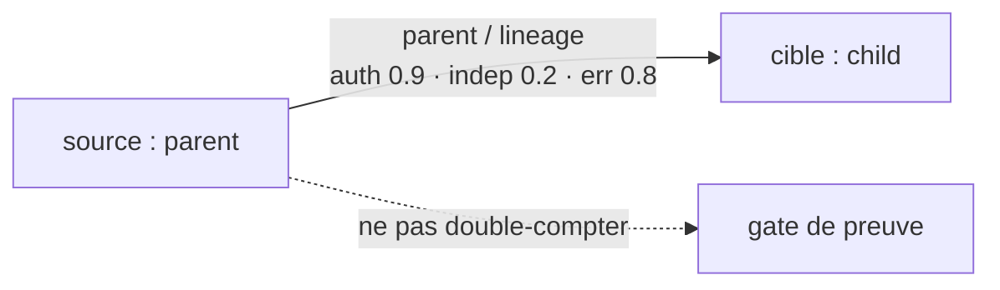

### 11.2 `child` — lineage

Preset : `fam 0.8, hist 0.7, auth 0.3, trust 0.7, indep 0.2, errCorr 0.8, discl 0.6`. Miroir asymétrique de `parent` (autorité basse côté enfant).

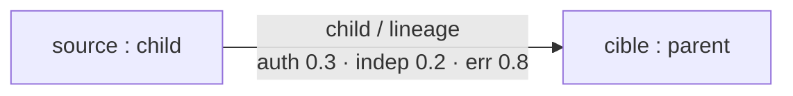

### 11.3 `sibling` — lineage

Preset : `fam 0.8, count 8, hist 0.8, auth 0.5, trust 0.6, ground 0.7, indep 0.4, err 0.6, discl 0.6`. Fratrie : terrain commun élevé, indépendance moyenne-basse.

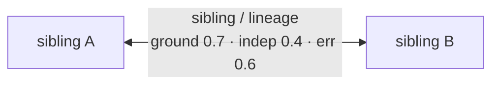

### 11.4 `twin` — lineage

Preset : `fam 0.9, hist 0.9, auth 0.5, trust 0.8, indep 0.1, err 0.9, discl 0.8`. Redondance maximale : `errorCorrelation 0.9` la plus haute du catalogue, `independence 0.1` la plus basse. Écrit par `conjoinedTwinBind.js` et `sesquizygoticSplit.js` avec `stableRelationId`.

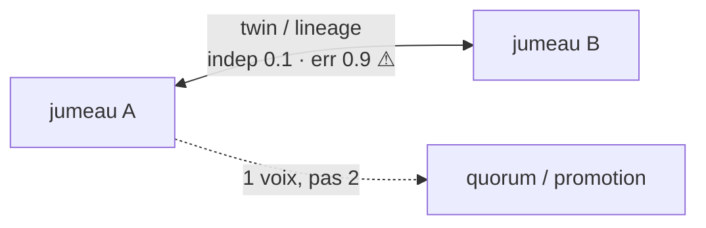

### 11.5 `ancestor` — lineage

Preset : `fam 0.6, hist 0.6, auth 0.7, trust 0.6, indep 0.3, err 0.6, discl 0.5`. Autorité historique sans contrôle runtime.

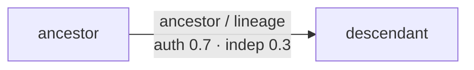

### 11.6 `descendant` — lineage

Preset : `fam 0.6, hist 0.5, auth 0.3, trust 0.5, indep 0.3, err 0.6, discl 0.5`. Miroir de `ancestor`, historique légèrement plus faible.

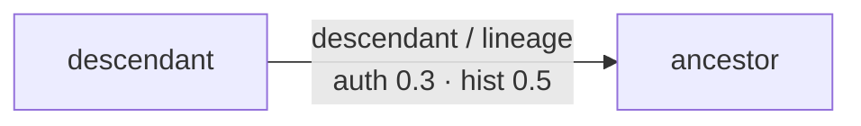

### 11.7 `chimera` — lineage

Preset : `fam 0.7, hist 0.6, auth 0.5, trust 0.6, indep 0.4, err 0.5, discl 0.5`. Fusion : valeurs médianes. Écrit par `chimericMerge.js` et `marmosetGermlineChimerism.js`.

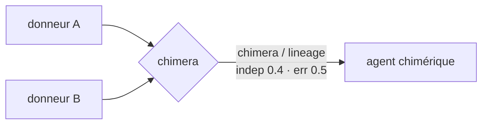

### 11.8 `plasmid` — lineage (effet de bord prouvé)

Preset : `fam 0.5, hist 0.4, auth 0.4, trust 0.5, indep 0.5, err 0.4, discl 0.5` (identique à `graft`). **Seul type avec double écriture** : `recordPlasmid` force `plasmid/lineage`, id déterministe `rel_<sha256(plasmid:id:src:dst)[0:32]>`, upsert `plasmid_bindings` (`owner = target`, `status = active`).

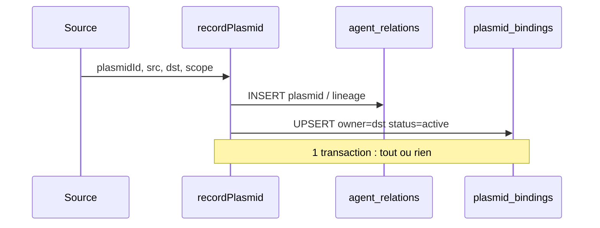

### 11.9 `graft` — lineage

Preset identique à `plasmid` (`fam 0.5, hist 0.4, auth 0.4, trust 0.5, indep 0.5, err 0.4, discl 0.5`) mais **sans** effet `plasmid_bindings`. Greffe déclarative seule.

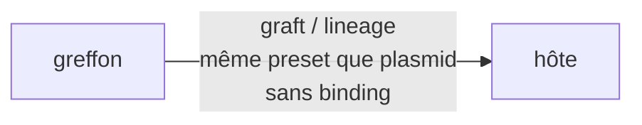

### 11.10 `manager` — organizational

Preset : `fam 0.5, auth 0.8, trust 0.5, discl 0.3`. Autorité étiquette la plus haute côté organisationnel, divulgation basse. Ne donne aucun droit d'orchestration.

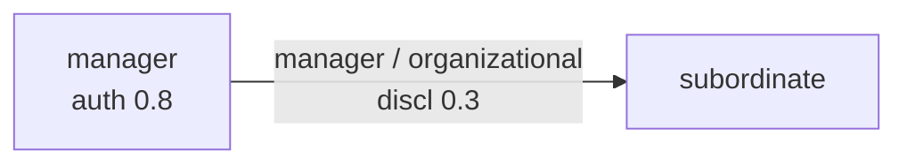

### 11.11 `subordinate` — organizational

Preset : `fam 0.5, auth 0.3, trust 0.5, discl 0.6`. Miroir de `manager`, divulgation plus haute vers le haut.

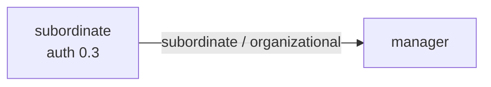

### 11.12 `colleague` — organizational ET collaborative (ambigu)

Preset : `fam 0.5, count 5, hist 0.4, auth 0.4, trust 0.6, ground 0.5, discl 0.5` (identique à `coworker`). Appartient à deux classes ; **infère `organizational`** par défaut. Passer `relationClass: 'collaborative'` pour l'autre lecture.

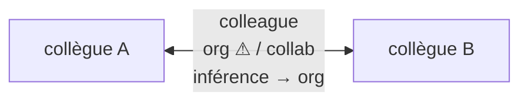

### 11.13 `coworker` — organizational (non ambigu)

Preset identique à `colleague` mais **une seule classe** (`organizational`). Ne pas confondre : même nombres, sémantique de classe différente.


### 11.14 `collaborator` — organizational ET collaborative (ambigu)

Preset : `fam 0.6, count 5, hist 0.5, auth 0.5, trust 0.7, ground 0.6, discl 0.5`. Le plus « confiant » des liens de travail (`trust 0.7`). Écrit par `recordDecisionRelation` et `relateVoter`. **Infère `organizational`** par défaut.

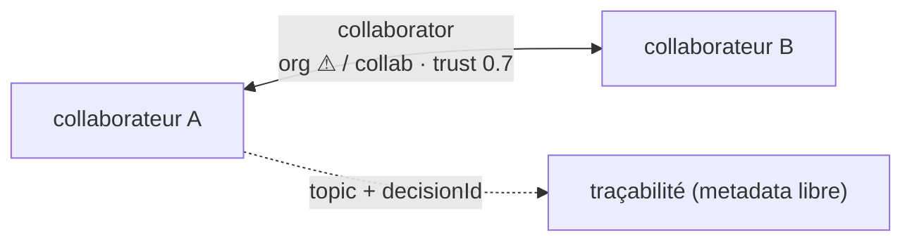

### 11.15 `mentor` — organizational

Preset : `fam 0.6, hist 0.5, auth 0.7, trust 0.7, discl 0.5`. Autorité + confiance hautes, sans pouvoir réel.

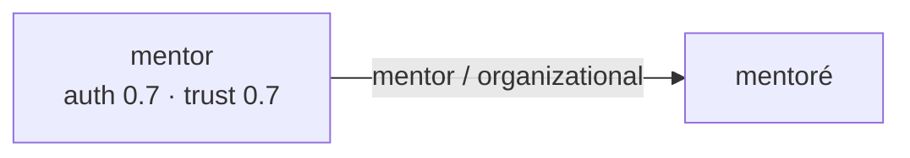

### 11.16 `client` — organizational

Preset : `fam 0.4, hist 0.3, auth 0.2, trust 0.5, ground 0.4, indep 0.5, err 0.4, discl 0.5`. Autorité la plus basse du catalogue (`0.2`).

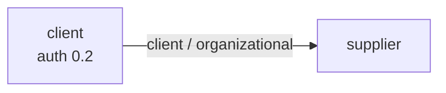

### 11.17 `supplier` — organizational

Preset : `fam 0.4, hist 0.3, auth 0.4, trust 0.5, ground 0.4, indep 0.5, err 0.4, discl 0.5`. Miroir de `client` avec autorité `0.4`.

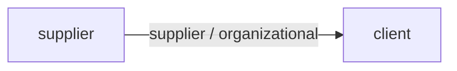

### 11.18 `partner` — collaborative ET social (ambigu)

Preset : `fam 0.6, count 8, hist 0.5, auth 0.5, trust 0.6, ground 0.5, discl 0.5` (`indep`/`err` retombent à `1`/`0`). **Infère `collaborative`** par défaut (premier match avant `social`).

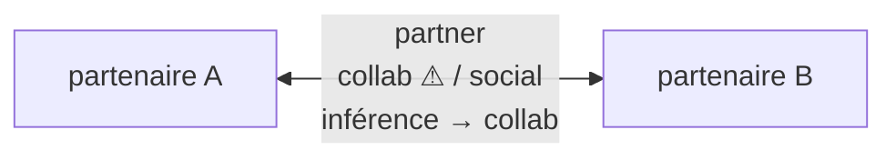

### 11.19 `stranger` — social (baseline)

Preset : `fam 0, hist 0, auth 0, trust 0, ground 0, indep 1, err 0, discl 0.3`. Zéro connaissance, indépendance maximale. **Repli de lecture** : `getRelationProfile` / `deriveProfile` retournent `stranger` quand aucune arête n'existe.

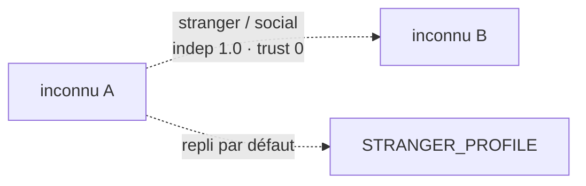

### 11.20 `friend` — social

Preset : `fam 0.7, count 12, hist 0.6, auth 0.3, trust 0.6, ground 0.5, discl 0.4`. `interactionCount 12` le plus haut du catalogue (déclaratif, non incrémenté par le service).

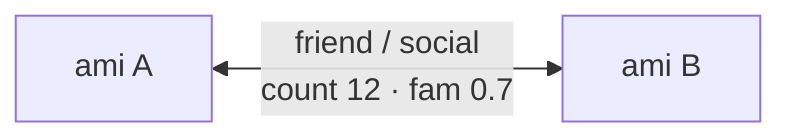

### 11.21 `bonded_partner` — social

Preset : `fam 0.8, hist 0.7, auth 0.5, trust 0.8, ground 0.7, indep 0.4, err 0.5, discl 0.7`. Confiance et terrain commun les plus hauts du social.

```mermaid
flowchart LR
  S["lié A"] <-->|"bonded_partner / social<br/>trust 0.8 · ground 0.7"| T["lié B"]
```

### 11.22 `neighbor` — social

Preset : `fam 0.3, hist 0.2, auth 0.3, trust 0.4, ground 0.3, indep 0.7, err 0.3, discl 0.5`. Proximité faible, indépendance correcte.

```mermaid
flowchart LR
  S["voisin A"] <-->|"neighbor / social<br/>indep 0.7"| T["voisin B"]
```

### 11.23 `rival` — social

Preset : `fam 0.4, hist 0.3, auth 0.3, trust 0.2, ground 0.2, indep 0.9, err 0.1, discl 0.2`. Confiance basse, indépendance haute : bon candidat vérificateur contradictoire (non câblé).

```mermaid
flowchart LR
  S["rival A"] <-->|"rival / social<br/>indep 0.9 · trust 0.2"| T["rival B"]
  S -.->|"revue contradictoire ?"| GATE["hide-conclusions (manuel)"]
```

### 11.24 `temporary_ally` — social

Preset : `fam 0.3, hist 0.2, auth 0.3, trust 0.4, ground 0.3, indep 0.6, err 0.3, discl 0.4`. Alliance à durée implicite, sans expiration en code.

```mermaid
flowchart LR
  S["allié A"] <-->|"temporary_ally / social<br/>pas d'expiration en code"| T["allié B"]
```

### 11.25 `guardian` — social

Preset : `fam 0.6, hist 0.5, auth 0.7, trust 0.6, ground 0.5, indep 0.3, err 0.5, discl 0.6`. Tutelle déclarative, sans contre-signature implémentée.

```mermaid
flowchart LR
  S["guardian<br/>auth 0.7"] -->|"guardian / social"| T["dependent"]
```

### 11.26 `dependent` — social

Preset : `fam 0.5, hist 0.4, auth 0.2, trust 0.4, ground 0.4, indep 0.3, err 0.5, discl 0.5`. Dépendance déclarative, sans borne de promotion implémentée.

```mermaid
flowchart LR
  S["dependent<br/>auth 0.2"] -->|"dependent / social"| T["guardian"]
```

### 11.27 `verifier` — epistemic

Preset : `fam 0.3, auth 0.4, trust 0.6, indep 0.9, err 0.2, discl 0.7`. Vérificateur voulu indépendant. `selectVerifier()` exclut la lignée et préfère ce profil — fonction réelle mais sans appelant runtime hors tests.

```mermaid
flowchart LR
  S["verifier<br/>indep 0.9"] -->|"verifier / epistemic<br/>discl 0.7"| T["vérifié"]
  S -.->|"selectVerifier (dormant)"| GATE["promotion"]
```

### 11.28 `reviewer` — epistemic

Preset identique à `verifier` sauf `disclosureLevel 0.8` (vs `0.7`). Revue avec divulgation légèrement plus large.

```mermaid
flowchart LR
  S["reviewer<br/>indep 0.9"] -->|"reviewer / epistemic<br/>discl 0.8"| T["revu"]
```

### 11.29 `adversary` — adversarial (seul de sa classe)

Preset : `fam 0.2, auth 0.2, indep 1.0, err 0.1, discl 0.1` (`trust`/`hist`/`ground` à `0`). Indépendance maximale explicite, divulgation minimale. Sans consommateur runtime.

```mermaid
flowchart LR
  S["adversaire A"] <-->|"adversary / adversarial<br/>indep 1.0 · discl 0.1"| T["adversaire B"]
```

---

## 12. Garde-fous et barrières

| Garde-fou | Implémentation prouvée | Fichier |
|---|---|---|
| Auto-relation interdite | `assertDistinctAgents()` → `throw` | `crossAgentRelationalService.js:87-91` |
| Type validé (29) | `assertRelationType()` → `throw` ; testé (`verifyRelationCatalog`) | `crossAgentRelationalService.js:93-95` |
| Classe validée | `assertRelationClass()` ; inférence sinon | `crossAgentRelationalService.js:97-113, 186-190` |
| Anti-réécriture | `stableRelationId` + `checkEdgeOwner()` → `throw already assigned` | `crossAgentRelationalService.js:115-144` |
| Scoping tenant | `listRelations` filtre strictement le scope | `crossAgentRelationalService.js:192-220` |
| Contamination épistémique | **Partiel.** `selectVerifier()` exclut la lignée ; `pickPrimary()` choisit l'arête la moins indépendante ; `epistemicFirewall()` masque tout sauf `problem` + `evidence`. Aucun branché à un gate : ne pas promouvoir deux `twin` comme indépendants reste manuel. | `relationResolverService.js:42-53`, `relationshipCommunicationProfileService.js:74-84`, `communication/epistemicIndependenceService.js:46-62` |

Limites : pas de suppression/révocation prouvée (seul `sever_conjoined_bind` réécrit `twin` avec `status: severed`), pas de contrôle d'accès par `disclosureLevel`, pas de détection de cycle, pas d'outil MCP `relation.*` (`mcp/`, `shared/toolDefinitions.json` : aucun ; seules les bio-poignées écrivent en sous-main).

---

## 13. Limites, non-objectifs et preuves

### 13.1 Limites structurelles (invariants logiciels)

- **Pas d'`update`/`delete` dans le service.** Exports : `RELATION_TYPES, RELATION_CLASSES, createRelation, getRelation, listRelations, recordPlasmid, stableRelationId, deriveProperties, inferRelationClass` (l. 259). Seule mutation post-création connue : `communicationLearningService.js` (`interaction_count`, `familiarity`, `last_interaction`) ; seules suppressions connues : `graphRepository.js` (projection, hors contrat).
- **Pas de symétrie, pas d'auto-relation** (I1). L'inverse exige un second appel.
- **Pas de validation d'existence des agents.** `assertRelationInput` ne contrôle que des chaînes ; aucun `SELECT` sur `agents` avant insertion. Les `FOREIGN KEY ... ON DELETE CASCADE` n'agissent que sous `PRAGMA foreign_keys=ON`. Une arête peut référencer un id inexistant sans erreur applicative.
- **Pas de cycle, pas de traversée.** Un saut uniquement ; `A parent B` puis `B parent A` s'insèrent sans erreur, même en `lineage`.

### 13.2 Limites de lecture

- `listRelations` exige `agentId`, retourne source **ou** cible, scope `IS ?` strict, `ORDER BY created_at ASC` (colonne fragile, voir § 4.1). Pas de graphe global, pas de filtre par type/classe, pas de pagination (contrairement à `ontologyRelations.getRelations`, borné à 500).
- `getRelation` lit par `id` sans contrôle de scope.

### 13.3 Limites épistémiques (heuristiques)

- **Presets non calibrés**, écrasables sans contrôle de bornes via `input.metadata`. `deriveProperties` fusionne sur `baseProperties()` (`indep: 1`, `discl: 1` par défaut).
- **Aucune application runtime** de `trust`/`disclosure`/`authority` par le service. Consommateurs consultatifs uniquement (`selectVerifier`/`selectPartner`, profils communicationnels).
- **Ambiguïté de classe** pour `colleague`, `collaborator`, `partner` (§ 3.6) ; classe incohérente rejetée (invariant).

### 13.4 Preuves disponibles

- `backend/tests/test_agent_relation_profiles.js` : catalogue, `inferRelationClass`, `selectVerifier`/`selectPartner`, lecture persistée **sur mocks**.
- `test_chimeric_merge.js`, `test_conjoined_twin_bind.js`, `test_sesquizygotic_split.js`, `test_marmoset_germline_chimerism.js` : `listRelations` comme oracle de création.
- `test_communication_learning.js` : insert direct + vérification de l'incrément.
- Aucun test ne calibre les presets, ne mesure `trust`/`disclosure`, ne teste le NULL-matching inter-scopes ni les cycles.
- **Télémétrie : aucune observable dédiée.** Seul signal longitudinal : `interaction_count` via `communicationLearningService`. Trigger outbox déclaré (`migrateOutboxTriggers.js` : `{table: 'agent_relations', aggregate: 'relation'}`) ; vues analytiques via `duckdbStore.js:85`, `migrateAnalyticsViewsP1.js:63`.

**Non-objectifs explicites** : update/delete applicatif, cascade applicative, API REST dédiée, pagination/filtre par type, historisation (réécrire = nouvel `id`, sauf `recordPlasmid` déterministe qui échoue en `INSERT` pur si l'id stable est déjà pris), métriques Prometheus dédiées, daemon d'inférence, fusion/déduplication (doublon exact avec `id` différent accepté).

---

## 14. Comparaisons

### 14.1 GenOS vs cadres multi-agents du marché

| Aspect | LangGraph | CrewAI | AutoGen | Anthropic (multi-agent) | GenOS relations typées (réel) |
|--------|-----------|--------|---------|-------------------------|-------------------------------|
| Primitive | Arêtes de contrôle (nœuds, états, transitions) | Délégation par rôles via tâches | Conversations routées (`speaker selection`) | Patterns orchestrateur–workers, essaims | 29 types persistés en SQLite, 6 classes, scoping `(org, project)` — **fait** |
| Persistance | Checkpoints d'état, pas de catalogue sémantique | Mémoire par agent, pas de graphe typé | Historique conversationnel, pas de schéma | Traces d'évaluation | `agent_relations` + `plasmid_bindings`, index source/cible/scope/classe — **fait** |
| Présélection épistémique | À implémenter soi-même | Rôles critiques déclaratifs, sans score | Critiques croisées sans métrique stockée | « Workers indépendants » en bonne pratique | `epistemicIndependence`/`errorCorrelation` + `selectVerifier` — **fait comme heuristique**, non calibré |
| Transfert / héritage | Partage d'état explicite | Partage via tâches | Messages, pas de lignage | Skills versionnées, pas de lignage | `recordPlasmid` : arête + upsert propriétaire — **fait**, sans historique |
| Ce que GenOS ne fait pas | Exécution du graphe (le type ne route rien) ; pas de moteur de transitions | Hiérarchie exécutée (`manager` = étiquette, pas un droit) | Routage dynamique (pas de `speaker selection`) | Harnais d'évaluation (aucune mesure d'efficacité des relations) | — |

Lecture : GenOS apporte un **registre relationnel typé, scopé et persistant** là où les cadres apportent des **moteurs d'exécution ou de dialogue**. Le registre n'exécute rien : `manager`, `verifier`, `adversary` ne modifient ni autorité, ni routage, ni gates. Inversement, aucun cadre cité ne fournit 29 types avec presets épistémiques scopés.

---

## 15. Références

| Concept | Référence |
|---------|-----------|
| Service relationnel (29 types, 6 classes, presets, CRUD) | [../../backend/src/services/crossAgentRelationalService.js](../../backend/src/services/crossAgentRelationalService.js) |
| Schéma `agent_relations` / index / clés déclarées | [../../backend/src/db/migrations/migrateDurableAgentCoordination.js](../../backend/src/db/migrations/migrateDurableAgentCoordination.js) |
| Profil communicationnel relationnel | [../../backend/src/db/migrations/migrateRelationCommunicationProfile.js](../../backend/src/db/migrations/migrateRelationCommunicationProfile.js) |
| Ontologie conceptuelle (17 types, système distinct) | [../../backend/src/services/ontologyRelations.js](../../backend/src/services/ontologyRelations.js) |
| Sélection vérifieur / partenaire, profils | [../../backend/src/services/morphogenesis/relationResolverService.js](../../backend/src/services/morphogenesis/relationResolverService.js) |
| Incrément `interaction_count` | [../../backend/src/services/communication/communicationLearningService.js](../../backend/src/services/communication/communicationLearningService.js) |
| Trinity | [topologies/trinity.md](topologies/trinity.md) |
| A-Team | [topologies/a-team.md](topologies/a-team.md) |
| Biocénose | [topologies/biocenose.md](topologies/biocenose.md) |
| Holobionte | [topologies/holobionte.md](topologies/holobionte.md) |
| Syncytium | [topologies/syncytium.md](topologies/syncytium.md) |
| Rhizome | [topologies/rhizome.md](topologies/rhizome.md) |
| Métapopulation | [topologies/metapopulation.md](topologies/metapopulation.md) |
| Morphogenèse | [topologies/morphogenese.md](topologies/morphogenese.md) |
| Noyau de contrôle morphogénétique | [noyau-controle-morphogenetique.md](noyau-controle-morphogenetique.md) |
| Topologies et capacités | [topologies-et-capacites.md](topologies-et-capacites.md) |
| Épistémologie et évidence | [../01-concepts/epistemologie-et-evidence.md](../01-concepts/epistemologie-et-evidence.md) |
| Runtime agentique | [../01-concepts/runtime-agentique.md](../01-concepts/runtime-agentique.md) |
| Outils MCP | [../03-reference/outils-mcp.md](../03-reference/outils-mcp.md) |

---

## 16. Schémas Mermaid globaux

### 16.1 Graphe des 6 classes → 29 types (état réel du code)

```mermaid
graph TB
    subgraph lineage["lineage (9)"]
        L1[parent]
        L2[child]
        L3[sibling]
        L4[twin]
        L5[ancestor]
        L6[descendant]
        L7[chimera]
        L8[plasmid]
        L9[graft]
    end
    subgraph organizational["organizational (8)"]
        O1[manager]
        O2[subordinate]
        O3["colleague ⚠ aussi collaborative"]
        O4[coworker]
        O5["collaborator ⚠ aussi collaborative"]
        O6[mentor]
        O7[client]
        O8[supplier]
    end
    subgraph collaborative["collaborative (3)"]
        C1["collaborator ⚠ aussi organizational"]
        C2["colleague ⚠ aussi organizational"]
        C3["partner ⚠ aussi social"]
    end
    subgraph social["social (9)"]
        S1[stranger]
        S2[friend]
        S3["partner ⚠ infère collaborative"]
        S4[bonded_partner]
        S5[neighbor]
        S6[rival]
        S7[temporary_ally]
        S8[guardian]
        S9[dependent]
    end
    subgraph epistemic["epistemic (2)"]
        E1[verifier]
        E2[reviewer]
    end
    subgraph adversarial["adversarial (1)"]
        A1[adversary]
    end
```

> Types ⚠ à deux classes. `inferRelationClass` retourne la première déclarée : `partner` → `collaborative`. Total unique : 29.

### 16.2 Séquence `create` / `get` / `list` / `recordPlasmid`

```mermaid
sequenceDiagram
    participant Caller as Appelant
    participant Svc as crossAgentRelationalService
    participant DB as SQLite<br/>(agent_relations / plasmid_bindings)
    Caller->>Svc: createRelation(source, target, type, class?, metadata?, scope?)
    Svc->>Svc: assertDistinctAgents + assertRelationType + assertRelationClass
    Note right of Svc: Invariant logiciel.<br/>Aucun SELECT sur agents.
    Svc->>Svc: deriveProperties(type) + merge input.metadata
    Note right of Svc: Heuristique non calibrée,<br/>écrasable sans bornes.
    Svc->>DB: INSERT INTO agent_relations (...)
    DB-->>Svc: ok / contrainte (id dupliqué)
    Svc->>DB: SELECT * WHERE id = ?
    DB-->>Svc: row
    Svc->>Svc: checkEdgeOwner (id ↔ arête)
    Svc-->>Caller: relation désérialisée
    Caller->>Svc: getRelation(id)
    Svc->>DB: SELECT * WHERE id = ?
    DB-->>Svc: row ou null
    Caller->>Svc: listRelations(agentId, org?, project?)
    Svc->>DB: SELECT * WHERE (source = ? OR target = ?)<br/>AND organization_id IS ? AND project_id IS ?
    Note right of Svc: NULL = NULL uniquement.<br/>Pas de joker, pas de pagination.
    DB-->>Svc: rows ORDER BY created_at ASC
    Caller->>Svc: recordPlasmid(plasmidId, source, target, scope?)
    Svc->>DB: BEGIN — createRelation(plasmid/lineage)
    Svc->>DB: INSERT INTO plasmid_bindings ...<br/>ON CONFLICT DO UPDATE active
    Note right of Svc: Écrase le propriétaire<br/>sans historique.
    Svc->>DB: COMMIT
```

### 16.3 Cycle de vie d'une arête

```mermaid
stateDiagram-v2
    [*] --> Validee: assertRelationInput ok
    Validee --> Inseree: INSERT agent_relations
    Validee --> Rejetee: agents identiques / type inconnu / classe incohérente
    Inseree --> Relue: getRelation + checkEdgeOwner
    Relue --> Visible: listRelations(scope IS-match)
    Relue --> Invisible: scope différent
    Visible --> Enrichie: communicationLearningService<br/>interaction_count + 1
    Enrichie --> Visible: relecture
    Inseree --> PlasmideLiee: recordPlasmid (upsert binding)
    PlasmideLiee --> PlasmideTransfere: nouveau recordPlasmid (écrase owner)
    Visible --> [*]: fin logique (aucun delete applicatif)
    Rejetee --> [*]
    note right of Visible
        Pas d'update/delete dans le service.
        Pas de cycle, pas de traversée, pas d'expiration.
    end note
```

### 16.4 Effets `metadata` → gates (appliqué vs stocké)

```mermaid
flowchart TB
    M["metadata stockée<br/>(familiarity, trustForDomain, disclosureLevel,<br/>authority, epistemicIndependence,<br/>errorCorrelation, commonGroundEstimate)"]
    M --> SEL["relationResolverService<br/>selectVerifier / selectPartner"]
    SEL -->|"exclut lignée, préfère indépendance<br/>(heuristique dormante)"| CAND["candidat proposé"]
    M --> COMMS["services communication<br/>(profils, manifeste)"]
    COMMS -->|"lecture consultative"| PROF["profil affiché / scoré"]
    M -.->|"AUCUNE flèche :<br/>ni gate, ni lease MCP,<br/>ni firewall"| GATES["gates de preuve"]
    M -.->|"AUCUNE flèche :<br/>manager = étiquette"| AUTH["autorité runtime"]
    CAND --> DEC["décision appelante"]
    PROF --> DEC
    GATES --> DEC
    DEC --> NOTE["INSERT réussi ≠ preuve valide.<br/>trust/disclosure n'autorisent<br/>et n'interdisent rien."]
```
