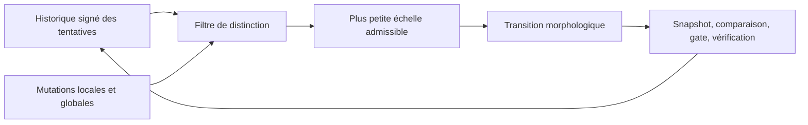

# Spirale de déblocage — changer de méthode et de périmètre avec preuve

- **Statut** : Partiel — historique vérifié, refus des doublons et progression bornée persistante implémentés ; pilotage d'une mission entière à faire.
- **Portée** : recherches et corrections qui stagnent après des tentatives observables.
- **Dernière revue** : 2026-10-04.

## 1. Domaine et objectif

Une nouvelle formulation de prompt ne constitue pas toujours une nouvelle
tentative. La spirale exige une différence opérationnelle : autre famille
d'intervention, autre échelle admissible ou nouvelle preuve. Elle garde les
petits changements prioritaires tant qu'ils restent plausibles et autorisés.

L'objectif est de sortir d'une impasse sans transformer systématiquement une
correction locale en refonte d'architecture.

## 2. Contrat et modèle logique

Une tentative déclarée contient `initialState`, `hypothesis`, `family`,
`scale`, `evidenceRefs`, et éventuellement `replicationOf` avec
`independentVerifierId`. La signature SHA-256 du tuple canonique permet de
repérer la répétition exacte, y compris si le texte environnant varie.

Les échelles reconnues, dans l'ordre, sont `parameter`, `function`, `module`,
`dependency`, `architecture`, `problem`. `maxScaleIndex` borne ce que le
contrôleur peut proposer. Ce paramètre **ne confère pas une autorisation** de
modifier le périmètre correspondant.

```text
distinct(x, historique) = réplication indépendante déclarée
  OU [signature(x) inédite ET
      (famille changée OU échelle changée OU preuve nouvelle)]
```

Parmi les candidats distincts et bornés, le service choisit la plus petite
échelle. L'ordre ne prétend pas résoudre l'optimisation globale du coût.

## 3. Inspiration et limite géométrique

La spirale logarithmique suggère un changement simultané d'orientation et de
rayon. Dans GenOS, l'orientation correspond à la famille d'intervention et
le rayon à l'échelle admise. L'espace des organisations est discret et n'est
pas un plan géométrique. Le moteur courant n'utilise aucun facteur φ : le
choix d'une progression géométrique sera comparé expérimentalement à des
progressions plus lentes ou plus rapides.

## 4. Architecture technique



- [Moteur](../../backend/src/services/morphogenesis/capabilities/unblockSpiral.js) : signature, déduplication et sélection bornée.
- [Historique persistant](../../backend/src/services/morphogenesis/capabilities/capabilityEvidenceStore.js) : table `morph_attempts`, indexée par `scopeId`.
- [Recherche morphologique](../../backend/src/services/morphogenesis/synthesis/morphologySearchPolicy.js) : `chooseSearchScopePersisted` lit l'historique du scope, impose le plafond d'échelle et conserve la règle d'évaluation locale.
- [Transition](../../backend/src/services/morphogenesis/transitions/morphologyTransitionService.js) : garde les étapes de snapshot, branche, comparaison, promotion et vérification.

Le filtre ne supprime pas la règle existante : la recherche globale ne s'ouvre
qu'après l'évaluation complète des mutations locales. Un candidat déjà tenté
peut être réévalué comme réplication indépendante avec justification.

## 5. Processus d'exécution

1. Enregistrer l'état initial, l'hypothèse, la famille, l'échelle et les
   références de preuve. Un résultat `VERIFIED_FAILURE` ou `VERIFIED_SUCCESS`
   exige un `outcomeRef` résolu ; un résultat absent reste `UNVERIFIED`.
2. `recordAttempt` refuse dans la transaction une tentative équivalente, sauf
   réplication avec un vérificateur indépendant distinct.
3. `chooseSearchScopePersisted` lit le même périmètre. Deux échecs vérifiés
   consécutifs autorisent au plus l'échelle suivante, dans la borne demandée.
   Une preuve nouvelle ou un succès recentre la recherche locale.
4. La proposition passe encore par les autorisations et le gate de transition
   existants ; élargir la recherche ne confère aucune permission supplémentaire.

## 6. Exemple

Une requête lente a déjà reçu deux réécritures SQL sans mesure nouvelle.
Répéter une troisième réécriture équivalente est refusé. Un essai d'indexation
mesuré reste dans une petite échelle ; une modification du modèle de données
ne devient candidate qu'une fois l'évaluation locale complète et son coût
justifié.

## 7. Validation

Le [test de contrat](../../backend/tests/test_morphogenesis_capabilities.js)
vérifie le refus d'une répétition et le passage à un candidat distinct. Il
teste aussi le branchement à la politique de recherche morphologique.
Le [test de seconde tranche](../../backend/tests/test_morphogenesis_capabilities_phase2.js)
exerce la persistance, le refus d'un doublon et l'ouverture après stagnation vérifiée.

Une campagne doit séparer problèmes à solution locale et problèmes exigeant
un changement de cadre. Mesurer le taux de déblocage, le coût jusqu'à la
première solution valide, la part d'élargissements inutiles et les violations
de périmètre. Comparer la politique à une recherche locale seule, à un
élargissement systématique et à différentes progressions d'échelle.

## 8. Comparaison avec l'existant

Biome possède déjà du foraging et des sauts de recherche. La morphogenèse
garde déjà les mutations locales et une mémoire d'échecs. La nouvelle partie
est le **contrat traçable de différence entre deux tentatives**, utilisable
avant une mutation et auditable après son résultat.

## 9. Limites et garde-fous

- La signature détecte l'équivalence du contrat déclaré, pas toutes les
  équivalences sémantiques possibles.
- Le service ne choisit pas seul une nouvelle topologie et ne modifie pas les
  permissions ; les gates d'autorité, de ressources et de preuve restent requis.
- L'historique vérifie l'`outcomeRef` lors de l'enregistrement d'un résultat
  déclaré vérifié ; la qualité de cette preuve dépend du résolveur fourni.
- Un échec n'est pas une preuve que toute une famille de méthodes est épuisée.
- L'activation reste opt-in via `attemptScopeId` et une base. Le contrôleur
  ne pilote pas encore une mission entière ni son retour arrière.

## 10. Références internes

Voir [Morphogenèse](topologies/morphogenese.md), [Biome](topologies/biome.md)
et [ADR 0299](../adr/0299-capacites-transversales-morphogenese.md).
